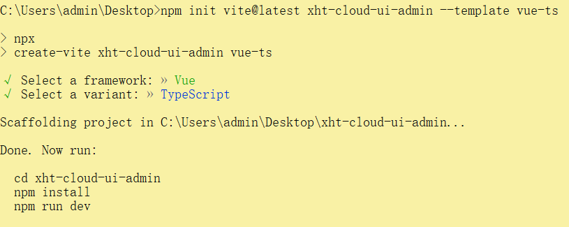
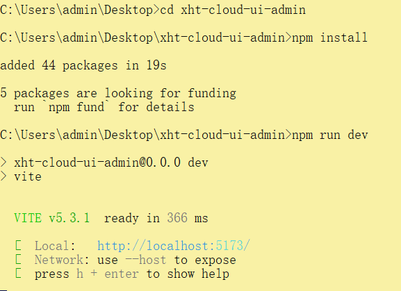
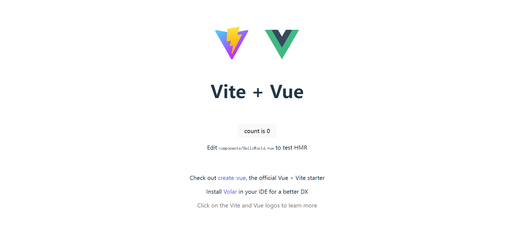

# 项目初始化

::: code-group

```shell [npm]
npm init vite@latest xht-cloud-ui-admin --template vue-ts
```

```shell [pnpm]
pnpm init vite@latest xht-cloud-ui-admin --template vue-ts
```

```shell [yarn]
yarn init vite@latest xht-cloud-ui-admin --template vue-ts
```

:::



# 运行项目

::: code-group

```shell [npm]
cd xht-cloud-ui-admin
npm install
npm run dev
```

```shell [pnpm]
cd xht-cloud-ui-admin
pnpm install
pnpm run dev
```

```shell [yarn]
cd xht-cloud-ui-admin
yarn install
yarn run dev
```

:::





# 路径别名配置

## 安装@types/node

> 相对路径别名配置，使用 `@` 代替 `src`

::: code-group

```shell [npm]
npm install @types/node --save-dev
```

```shell [pnpm]
pnpm install @types/node --save-dev
```

```shell [yarn]
yarn install @types/node --save-dev
```

:::

## vite.config.ts

```tsx
import {ConfigEnv, UserConfig, defineConfig, loadEnv} from 'vite'
import vue from '@vitejs/plugin-vue'
import path from 'path'

const pathSrc = path.resolve(__dirname, 'src')

export default defineConfig(({mode}: ConfigEnv): UserConfig => {
    const env = loadEnv(mode, process.cwd())
    return {
        /**其他配置*/
        resolve: {
            alias: { //路径别名
                "@": pathSrc
            }
        }
        /**其他配置*/
    }
})
```

## tsconfig.json

```json
{
  //其他配置
  "compilerOptions": {
    "baseUrl": ".",
    // 解析非相对模块的基地址，默认是当前目录
    "paths": {
      // 路径映射，相对于baseUrl
      "@/*": [
        "src/*"
      ]
    }
  }
  //其他配置
}
```

## 别名使用

```js
import HelloWorld from '@/components/HelloWorld.vue'
```

# 安装自动导入

## 简介

> Element Plus 官方文档中推荐 `按需自动导入` 的方式，而此需要使用额外的插件 `unplugin-auto-import`
> 和 `unplugin-vue-components` 来导入要使用的组件。所以在整合 `Element Plus` 之前先了解下`自动导入`的概念和作用


概念：为了避免在多个页面重复引入 API 或 组件，由此而产生的自动导入插件来节省重复代码和提高开发效率。

| 插件                      | 概念        | 自动导入对象                           |
|-------------------------|-----------|----------------------------------|
| unplugin-auto-import    | 按需自动导入API | ref，reactive,watch,computed 等API |
| unplugin-vue-components | 按需自动导入组件  | Element Plus 等三方库和指定目录下的自定义组件    |

## 安装

::: code-group

```shell [npm]
npm install -D unplugin-auto-import unplugin-vue-components 
```

```shell [pnpm]
pnpm install -D unplugin-auto-import unplugin-vue-components 
```

```shell [yarn]
yarn install -D unplugin-auto-import unplugin-vue-components 
```

:::

## vite.config.ts

```tsx
import AutoImport from "unplugin-auto-import/vite";
import Components from "unplugin-vue-components/vite";

plugins: [
    AutoImport({
        // 自动导入 Vue 相关函数，如：ref, reactive, toRef 等
        imports: ["vue"],
        eslintrc: {
            enabled: true, // 是否自动生成 eslint 规则，建议生成之后设置 false 
            filepath: "./.eslintrc-auto-import.json", // 指定自动导入函数 eslint 规则的文件
        },
        dts: path.resolve(pathSrc, "types", "auto-imports.d.ts"), // 指定自动导入函数TS类型声明文件路径
    }),
    Components({
        dts: path.resolve(pathSrc, "types", "components.d.ts"), // 指定自动导入组件TS类型声明文件路径
    }),
]
```

## .eslintrc.cjs

```json
"extends": [
"./.eslintrc-auto-import.json"
],
```

## tsconfig.json

```json
{
  "include": [
    "src/**/*.d.ts"
  ]
}
```

# 安装element-plus

## 依赖安装

::: code-group

```shell [npm]
npm install element-plus @element-plus/icons-vue
```

```shell [pnpm]
pnpm install element-plus @element-plus/icons-vue
```

```shell [yarn]
yarn install element-plus @element-plus/icons-vue
```

:::

## main.ts

```tsx
import ElementPlus from 'element-plus';
import 'element-plus/dist/index.css'
//@ts-ignore忽略当前文件ts类型的检测否则有红色提示(打包会失败)
import zhCn from 'element-plus/dist/locale/zh-cn.mjs'

app.use(ElementPlus, {
    locale: zhCn
})
```

## Element Plus全局组件类型声明

```js
// tsconfig.json
{
    "compilerOptions"
:
    {
        // ...
        "types"
    :
        ["element-plus/global"]
    }
}
```

配置完毕可以测试element-plus组件与图标的使用.

# 安装element-plus自动导入

## 依赖安装

+ 安装 Element Plus

::: code-group

```shell [npm]
npm install element-plus
```

```shell [pnpm] 
pnpm install element-plus
```

```shell [yarn]
yarn install element-plus
```

:::

+ 安装自动导入 Icon 依赖

::: code-group

```shell
npm i -D unplugin-icons
```

:::

## vite.config.ts 配置

```tsx
import {ConfigEnv, UserConfig, defineConfig, loadEnv} from 'vite'
import vue from '@vitejs/plugin-vue'
import path from 'path'
import AutoImport from "unplugin-auto-import/vite";
import Components from "unplugin-vue-components/vite";
import {ElementPlusResolver} from "unplugin-vue-components/resolvers";
import Icons from "unplugin-icons/vite";
import IconsResolver from "unplugin-icons/resolver";

const pathSrc = path.resolve(__dirname, 'src')

export default defineConfig(({mode}: ConfigEnv): UserConfig => {
    const env = loadEnv(mode, process.cwd())
    return {
        plugins: [
            vue(),
            AutoImport({
                // 自动导入 Vue 相关函数，如：ref, reactive, toRef 等
                imports: ["vue"],
                eslintrc: {
                    enabled: true, // 是否自动生成 eslint 规则，建议生成之后设置 false 
                    filepath: "./.eslintrc-auto-import.json", // 指定自动导入函数 eslint 规则的文件
                },
                resolvers: [
                    // 自动导入 Element Plus 相关函数，如：ElMessage, ElMessageBox... (带样式)
                    ElementPlusResolver(),
                    // 自动导入图标组件
                    IconsResolver({}),
                ],
                vueTemplate: true, // 是否在 vue 模板中自动导入
                dts: path.resolve(pathSrc, "types", "auto-imports.d.ts"), // 指定自动导入函数TS类型声明文件路径
            }),
            Components({
                resolvers: [
                    ElementPlusResolver(),// 自动导入 Element Plus 组件
                    IconsResolver({// 自动注册图标组件
                        enabledCollections: ["ep"] // element-plus图标库，其他图标库 https://icon-sets.iconify.design
                    }),
                ],
                dts: path.resolve(pathSrc, "types", "components.d.ts"), // 指定自动导入组件TS类型声明文件路径
            }),
            Icons({
                // 自动安装图标库
                autoInstall: true,
            })
        ]
    }
})
```

# 整合SVG图标

## 安装依赖

::: code-group

```shell [npm]
npm install -D fast-glob
npm install -D vite-plugin-svg-icons
```

```shell [pnpm]
pnpm install -D fast-glob
pnpm install -D vite-plugin-svg-icons
```

```shell [yarn] 
yarn install -D fast-glob
yarn install -D vite-plugin-svg-icons
```

:::

## main.ts

```js
// src/main.ts
import 'virtual:svg-icons-register';
```

## vite.config.ts

```tsx
// vite.config.ts
import {createSvgIconsPlugin} from 'vite-plugin-svg-icons';

export default ({command, mode}: ConfigEnv): UserConfig => {
    return (
        {
            plugins: [
                createSvgIconsPlugin({
                    iconDirs: [path.resolve(process.cwd(), 'src/assets/icons')],//  指定需要缓存的图标文件夹
                    symbolId: 'icon-[dir]-[name]', // 指定symbolId格式
                })
            ]
        }
    )
}
```

## 图标组件封装

```vue
<!-- src/components/SvgIcon/index.vue -->
<script setup lang="ts">
	const props = defineProps({
		prefix: {
			type: String,
			default: "icon",
		},
		iconClass: {
			type: String,
			required: false,
		},
		color: {
			type: String,
		},
		//svg宽度
		width: {
			type: String,
			default: '1.2em'
		},
		//svg高度
		height: {
			type: String,
			default: '1.2em'
		}
	});

	const symbolId = computed(() => `#${props.prefix}-${props.iconClass}`);
</script>

<template>
	<svg aria-hidden="true" class="svg-icon" :style="{ width: width, height: height }">
		<use :xlink:href="symbolId" :fill="color"/>
	</svg>
</template>

<style scoped>
	.svg-icon {
		user-select: none;
		display: inline-block;
		outline: none;
		width: 1.2em;
		height: 1.2em;
		vertical-align: -0.15em;
		/* 因icon大小被设置为和字体大小一致，而span等标签的下边缘会和字体的基线对齐，故需设置一个往下的偏移比例，来纠正视觉上的未对齐效果 */
		fill: currentColor;
		/* 定义元素的颜色，currentColor是一个变量，这个变量的值就表示当前元素的color值，如果当前元素未设置color值，则从父元素继承 */
		overflow: hidden;
	}
</style>
```

# 整合SCSS

> 一款CSS预处理语言，SCSS 是 Sass 3 引入新的语法，其语法完全兼容 CSS3，并且继承了 Sass 的强大功能。

## 安装依赖


::: code-group

```shell [npm]
npm i -D sass
```

```shell [nnpm]
nnpm i -D sass
```

```shell [yarn]
yarn i -D sass
```

:::

## variables.scss

```scss
// src/styles/variables.scss
$bg-color: #242424;
```

## vite.config.ts

```tsx
export default defineConfig(({mode}: ConfigEnv): UserConfig => {
    const env = loadEnv(mode, process.cwd())
    return {
        // vite.config.ts
        css: {
            preprocessorOptions: {   // CSS 预处理器
                scss: {
                    javascriptEnabled: true,  //定义全局SCSS变量
                    additionalData: `@use "@/styles/variables.scss" as *;`
                }
            }
        }
    }
})
```

## variables.module.scss

上面导入的 `SCSS` 全局变量在 `TypeScript` 不生效的，需要创建一个以 `.module.scss` 结尾的文件

```scss
// src/styles/variables.module.scss

// 导出 variables.scss 文件的变量
:export {
  bgColor: $bg-color
}
```

# 整合Pinia

## 安装依赖

::: code-group

```shell [npm]
npm install pinia
```

```shell [pnpm]
pnpm install pinia
```

```shell [yarn]
yarn install pinia
```

:::

## main.ts

```tsx
// src/main.ts
import {createPinia} from "pinia";
import App from "./App.vue";

createApp(App).use(createPinia()).mount("#app");
```

## 持久化Pinia 存储

```shell [npm]
npm i pinia-plugin-persistedstate
```

```shell [pnpm]
# pnpm : 
pnpm i pinia-plugin-persistedstate
```

```shell [yarn]
yarn add pinia-plugin-persistedstate
```

## main.ts

```tsx
import {createApp} from "vue";
import App from "./App.vue";
import router from "./router";
import {createPinia} from "pinia";
import piniaPluginPersistedstate from "pinia-plugin-persistedstate";
import {createHead} from "unhead";

import "./style.css";

const pinia = createPinia();
createHead();

// inject piniaPluginPersistedstate to pinia
pinia.use(piniaPluginPersistedstate);

const app = createApp(App);

app.use(router);
app.use(pinia);
app.mount("#app");
```

## store

```tsx
import {defineStore} from "pinia";

export const useCustomStore = defineStore(`customStore`, {
    state: () => {
        return {
            data: [],
        };
    },
    persist: true,
    actions: {},
    getters: {},
});
```

# 整合route

## 安装依赖

::: code-group

```shell [npm]
npm install vue-router@next
```

```shell [pnpm]
pnpm install vue-router@next
```

```shell [yarn]
yarn install vue-router@next
```

:::

## 路由实例

```tsx
// src/router/index.ts
import {createRouter, createWebHashHistory, RouteRecordRaw} from 'vue-router';

export const Layout = () => import('@/layout/index.vue');

// 静态路由
export const constantRoutes: RouteRecordRaw[] = [
    {
        path: '/redirect',
        component: Layout,
        meta: {hidden: true},
        children: [
            {
                path: '/redirect/:path(.*)',
                component: () => import('@/views/redirect/index.vue')
            }
        ]
    },

    {
        path: '/login',
        component: () => import('@/views/login/index.vue'),
        meta: {hidden: true}
    },

    {
        path: '/',
        component: Layout,
        redirect: '/dashboard',
        children: [
            {
                path: 'dashboard',
                component: () => import('@/views/dashboard/index.vue'),
                name: 'Dashboard',
                meta: {title: 'dashboard', icon: 'homepage', affix: true}
            }
        ]
    }
];

/**
 * 创建路由
 */
const router = createRouter({
    history: createWebHashHistory(),
    routes: constantRoutes as RouteRecordRaw[],
    // 刷新时，滚动条位置还原
    scrollBehavior: () => ({left: 0, top: 0})
});

/**
 * 重置路由
 */
export function resetRouter() {
    router.replace({path: '/login'});
    location.reload();
}

export default router;
```

## main.ts

```tsx
// main.ts
import router from "@/router";

app.use(router).mount('#app')
```

# 环境变量

## 简介

+ 开发环境（development）

顾名思义，开发使用的环境，每位开发人员在自己的dev分支上干活，开发到一定程度，同事会合并代码，进行联调。

+ 测试环境（testing）

测试同事干活的环境啦，一般会由测试同事自己来部署，然后在此环境进行测试

+ 生产环境（production）

生产环境是指正式提供对外服务的，一般会关掉错误报告，打开错误日志。(正式提供给客户使用的环境。)

注意:一般情况下，一个环境对应一台服务器,也有的公司开发与测试环境是一台服务器！！！项目根目录分别添加
开发、生产和测试环境的文件!

## 根目录新建

```txt
.env.development
.env.production
.env.test
```

## 文件内容

```properties
# 开发环境
VITE_USER_NODE_ENV = 'development'

# 变量必须以 VITE_ 为前缀才能暴露给外部读取
VITE_APP_TITLE = xht-cloud-admin-ui
VITE_APP_PORT = 3000
# 后端接口代理前缀
VITE_APP_BASE_API = '/api'
# 后端管理gateWay接口地址
VITE_APP_XHT_CLOUD_PREFIX = http://127.0.0.1:8080
VITE_APP_XHT_CLOUD_FLOWABLE_PREFIX = /stand-alone/flowable
VITE_APP_XHT_CLOUD_GENERATOR_PREFIX = /api/generate
VITE_APP_XHT_CLOUD_SYSTEM_PREFIX = /api/admin
VITE_APP_XHT_CLOUD_AUTH_PREFIX = /api/auth
```

## package.json

```json
 "scripts": {
"build:test": "vue-tsc && vite build --mode test",
"build:pro": "vue-tsc && vite build --mode production",
},
```

## 类型声明

```tsx
// src/types/env.d.ts
interface ImportMetaEnv {
    /**
     * 应用标题
     */
    VITE_APP_TITLE: string;
    /**
     * 应用端口
     */
    VITE_APP_PORT: number;
    /**
     * API基础路径(反向代理)
     */
    VITE_APP_BASE_API: string;
}

interface ImportMeta {
    readonly env: ImportMetaEnv;
}
```

# 跨域处理

> 浏览器同源策略: 协议、域名和端口都相同是同源，浏览器会限制非同源请求读取响应结果。
>
> 本地开发环境通过 `Vite` 配置反向代理解决浏览器跨域问题，生产环境则是通过 `nginx` 配置反向代理 。

```json
  /**
     * 本地反向代理解决浏览器跨域限制
     */
server: {
// 服务器主机名，如果允许外部访问，可设置为 "0.0.0.0"
host: '0.0.0.0',
port: Number(env.VITE_APP_PORT),
open: true,
cors: true,
// 跨域代理配置
proxy: {
[env.VITE_APP_BASE_API]: {
target: env.VITE_APP_XHT_CLOUD_PREFIX, // easymock
changeOrigin: true,
rewrite: (path: string) => path.replace(new RegExp('^' + env.VITE_APP_BASE_API), '')
}
}
},
```

# 整合Axios

## 安装依赖

::: code-group

```shell [npm]
npm install axios
```

```shell [pnpm]
pnpm install axios
```

```shell [yarn]
yarn install axios
```

:::

## 工具类封装

```tsx
import axios from "axios";
import {ElMessage} from "element-plus";
//创建axios实例
let request = axios.create({
    baseURL: import.meta.env.VITE_APP_BASE_API,
    timeout: 5000
})
//请求拦截器
request.interceptors.request.use(config => {
    return config;
});
//响应拦截器
request.interceptors.response.use((response) => {
    return response.data;
}, (error) => {
    //处理网络错误
    let msg = '';
    let status = error.response.status;
    switch (status) {
        case 401:
            msg = "token过期";
            break;
        case 403:
            msg = '无权访问';
            break;
        case 404:
            msg = "请求地址错误";
            break;
        case 500:
            msg = "服务器出现问题";
            break;
        default:
            msg = "无网络";

    }
    ElMessage({
        type: 'error',
        message: msg
    })
    return Promise.reject(error);
});
export default request;
```

# 国际化

## Element Plus 国际化

Element Plus 提供了一个 Vue 组件 [ConfigProvider](https://element-plus.gitee.io/en-US/component/config-provider.html)
用于全局配置国际化的设置。

```vue

<template>
	<el-config-provider :locale="locale">
		<app/>
	</el-config-provider>
</template>

<script>
	import {defineComponent} from 'vue'
	import {ElConfigProvider} from 'element-plus'

	import zhCn from 'element-plus/es/locale/lang/zh-cn'

	export default defineComponent({
		components: {
			ElConfigProvider,
		},
		setup() {
			return {
				locale: zhCn,
			}
		},
	})
</script>
```

## vue-i18n 自定义国际化

## 依赖安装

::: code-group

```shell [npm]
npm install vue-i18n
```

```shell [pnpm]
pnpm install vue-i18n
```

```shell [yarn]
yarn install vue-i18n
```

:::

### 自定义语言包

+ /lang/index.ts

```tsx
import {createI18n} from "vue-i18n";
// 本地语言包
import enLocale from "@/lang/package/en";
import zhCnLocale from "@/lang/package/zh-cn";

const messages = {
    "zh-cn": {
        ...zhCnLocale,
    },
    en: {
        ...enLocale,
    },
};

const i18n = createI18n({
    legacy: false,
    locale: "zh-cn",
    messages: messages,
    globalInjection: true,
});

export default i18n;
```

+ /lang/package/en

```tsx
export default {} as any
```

+ /lang/package/zh-cn

```tsx
export default {} as any
```

# 引入reset.scss

```scss
*,
*:after,
*:before {
  box-sizing: border-box;

  outline: none;
}

html,
body,
div,
span,
applet,
object,
iframe,
h1,
h2,
h3,
h4,
h5,
h6,
p,
blockquote,
pre,
a,
abbr,
acronym,
address,
big,
cite,
code,
del,
dfn,
em,
img,
ins,
kbd,
q,
s,
samp,
small,
strike,
strong,
sub,
sup,
tt,
var,
b,
u,
i,
center,
dl,
dt,
dd,
ol,
ul,
li,
fieldset,
form,
label,
legend,
table,
caption,
tbody,
tfoot,
thead,
tr,
th,
td,
article,
aside,
canvas,
details,
embed,
figure,
figcaption,
footer,
header,
hgroup,
menu,
nav,
output,
ruby,
section,
summary,
time,
mark,
audio,
video {
  font: inherit;
  font-size: 100%;

  margin: 0;
  padding: 0;

  vertical-align: baseline;

  border: 0;
}

article,
aside,
details,
figcaption,
figure,
footer,
header,
hgroup,
menu,
nav,
section {
  display: block;
}

body {
  line-height: 1;
}

ol,
ul {
  list-style: none;
}

blockquote,
q {
  quotes: none;

  &:before,
  &:after {
    content: none;
  }
}

sub,
sup {
  font-size: 75%;
  line-height: 0;

  position: relative;

  vertical-align: baseline;
}

sup {
  top: -.5em;
}

sub {
  bottom: -.25em;
}

table {
  border-spacing: 0;
  border-collapse: collapse;
}

input,
textarea,
button {
  font-family: inhert, serif;
  font-size: inherit;

  color: inherit;
}

select {
  text-indent: .01px;
  text-overflow: '';

  border: 0;
  border-radius: 0;

  -webkit-appearance: none;
  -moz-appearance: none;
}

select::-ms-expand {
  display: none;
}

code,
pre {
  font-family: monospace, monospace;
  font-size: 1em;
}

// 美化滚动条
::-webkit-scrollbar {
  width: 10px;
  height: 10px;
}

::-webkit-scrollbar-track {
  width: 6px;
  background: rgba(#101F1C, 0.1);
  -webkit-border-radius: 2em;
  -moz-border-radius: 2em;
  border-radius: 2em;
}

::-webkit-scrollbar-thumb {
  background-color: rgba(144, 147, 153, .5);
  background-clip: padding-box;
  min-height: 28px;
  -webkit-border-radius: 2em;
  -moz-border-radius: 2em;
  border-radius: 2em;
  transition: background-color .3s;
  cursor: pointer;
}

::-webkit-scrollbar-thumb:hover {
  background-color: rgba(144, 147, 153, .3);
}
```

# Vue3+Vite调试神器

## 简介

Vue Devtools 浏览器插件并不陌生，但是有些同学由于网络问题无法下载安装插件，所以给大家推荐一款更好用的插件
vite-plugin-vue-devtools，无需浏览器安装，直接使用npm安装即可使用，并且界面也很美观，功能更加强大

## 安装

::: code-group

```shell [npm]
npm install vite-plugin-vue-devtools -D
```

```shell [pnpm]
pnpm install vite-plugin-vue-devtools -D
```

```shell [yarn]
yarn install vite-plugin-vue-devtools -D
```

:::

## vite.config.ts

```tsx
import {defineConfig} from 'vite'
import VueDevTools from 'vite-plugin-vue-devtools'

export default defineConfig({
    plugins: [
        VueDevTools(),
        vue(),
    ],
})
```

# 其他常用依赖

## qs

> 主要用于解析和格式化URL查询字符串。qs是一个流行的Node.js模块，它提供了丰富的API来处理URL查询字符串，包括将对象序列化为查询字符串，以及将查询字符串解析为对象。

::: code-group

```shell [npm]
npm install --save qs
npm install --save-dev @types/qs
```

```shell [pnpm]
pnpm install --save qs
pnpm install --save-dev @types/qs
```

```shell [yarn]
yarn install --save qs
yarn install --save-dev @types/qs
```

:::

## js-cookie

> js-cookie是一个简单的，轻量级的处理cookies的js API。

::: code-group

```shell [npm]
npm install --save js-cookie
npm install --save-dev @types/js-cookie
```

```shell [pnpm]
pnpm install --save js-cookie
pnpm install --save-dev @types/js-cookie
```

```shell [yarn]
yarn install --save js-cookie
yarn install --save-dev @types/js-cookie
```

:::

## nprogress

> NProgress是一个轻量级的进度条组件，在Github上已经2.4万star数了，虽然这个组件已经好久没有更新了，最近一次更新是20年4月份，改了jQuery的版本，但是该组件的使用频率还是高的。

::: code-group

```shell [npm]
npm i nprogress -S
npm i @types/nprogress -D
```

```shell [pnpm]
pnpm i nprogress -S
pnpm i @types/nprogress -D
```

```shell [yarn]
yarn i nprogress -S
yarn i @types/nprogress -D
```

:::


