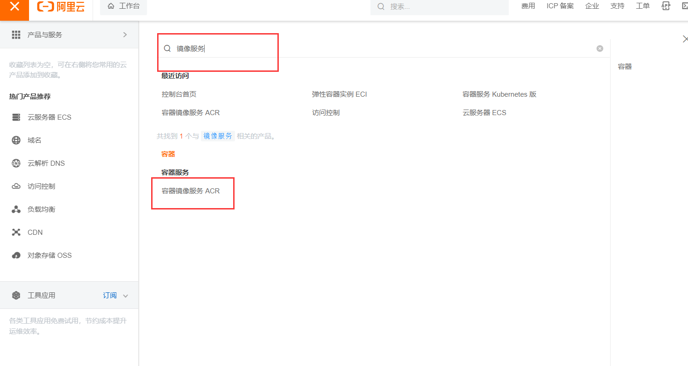
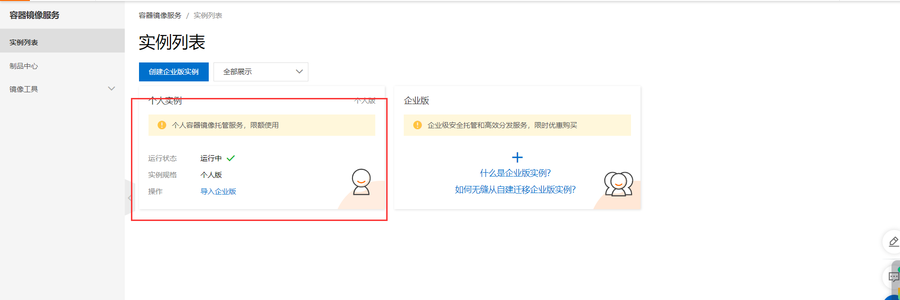
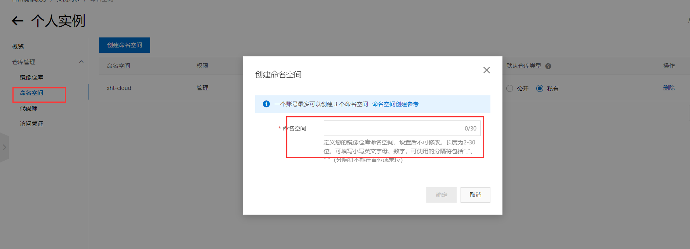
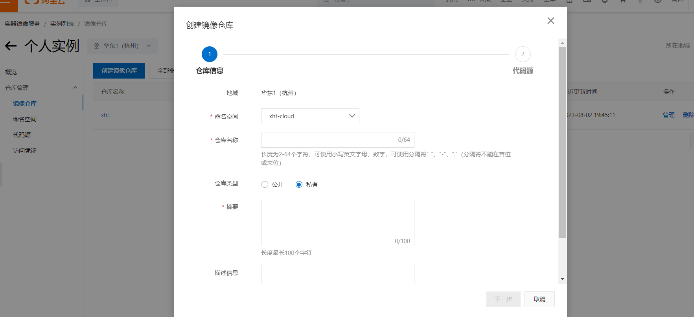
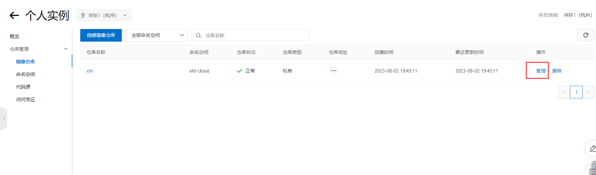
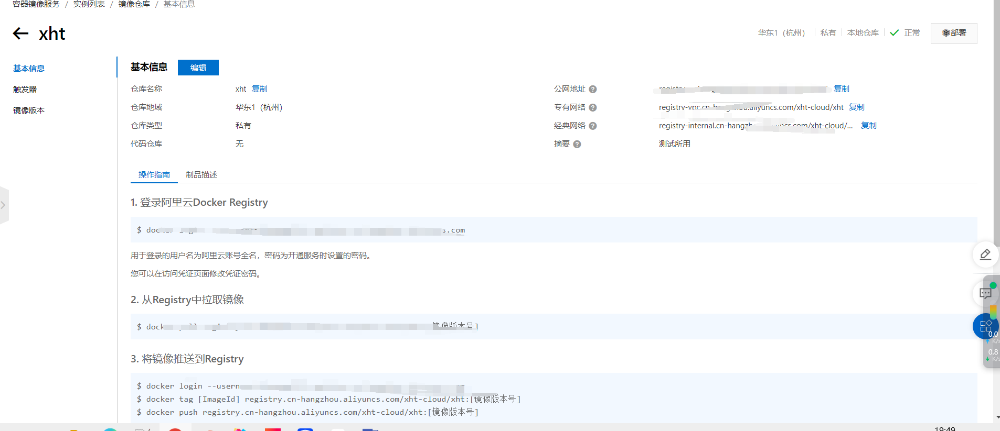
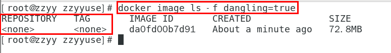

# Docker镜像

## 简介

是一种轻量级、可执行的独立软件包，它包含运行某个软件所需的所有内容，我们把应用程序和配置依赖打包好形成一个可交付的运行环境(
包括代码、运行时需要的库、环境变量和配置文件等)，这个打包好的运行环境就是image镜像文件。

只有通过这个镜像文件才能生成Docker容器实例(类似Java中new出来一个对象)。

## 本地镜像发布到阿里云

### 登录阿里云进入个人工作台



### 进入个人实例



### 创建命名空间



### 创建镜像仓库



### 管理仓库



### 根据仓库里面的文档提交镜像



## 虚悬镜像

### 简介

仓库名、标签都是`<none>`的镜像，俗称`dangling image`

### 查看

```java
docker image ls -f dangling=true
```



### 删除

```java
docker image prune
```

虚悬镜像已经失去存在价值，可以删除


