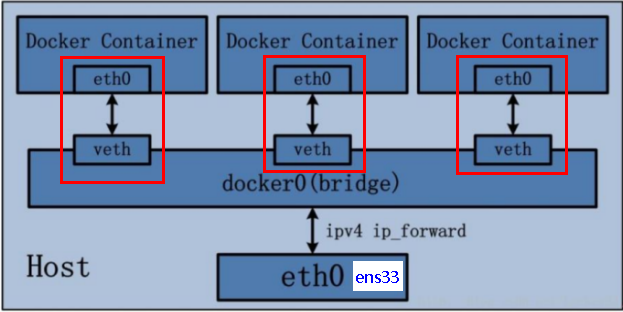
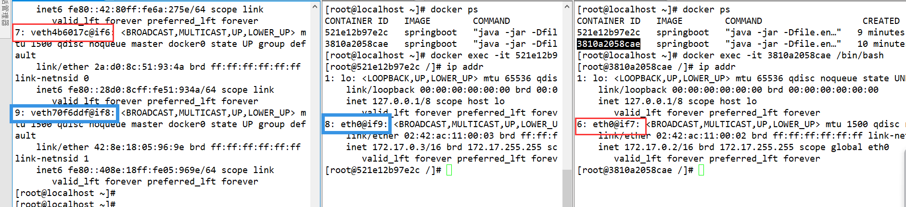
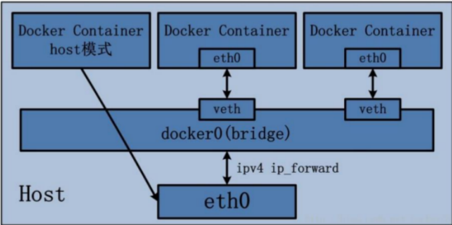
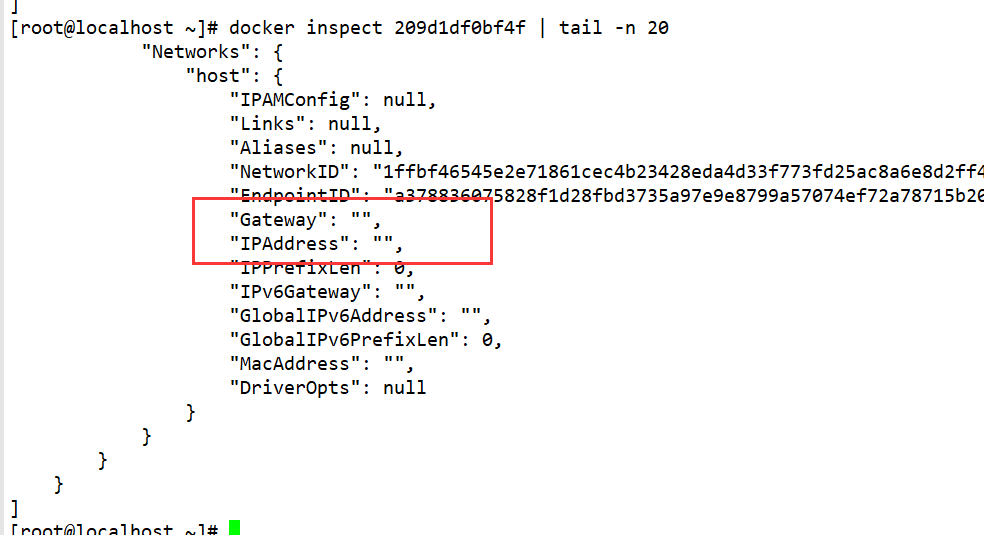
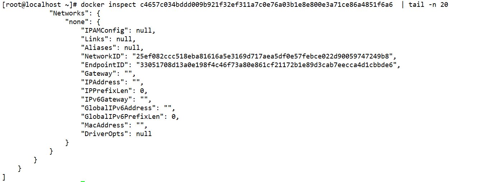
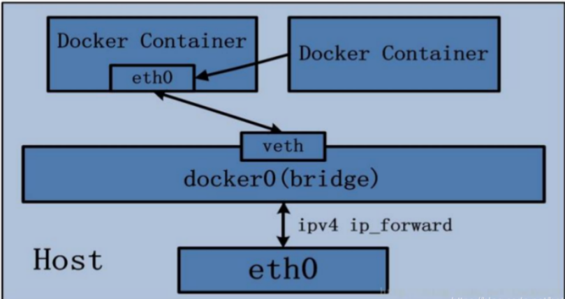
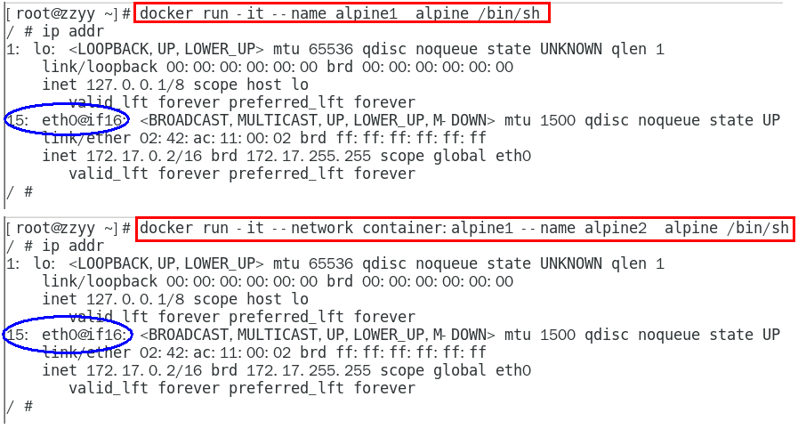
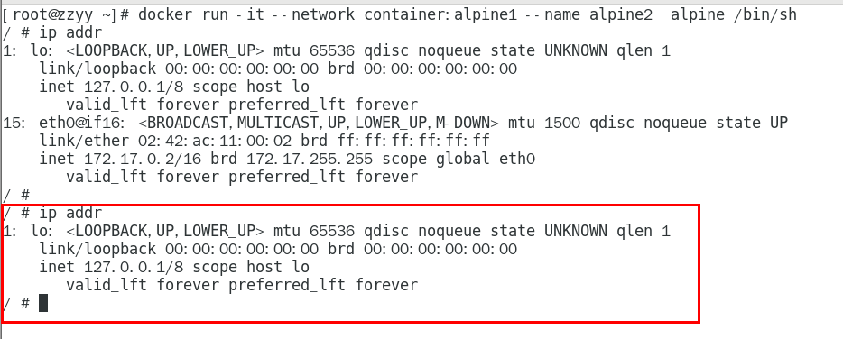
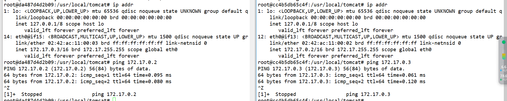
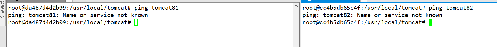

# Docker网络

## 简介

Docker作为目前最火的轻量级容器技术，牛逼的功能，如Docker的镜像管理，不足的地方网络方面。

Docker自身的4种网络工作方式，和一些自定义网络模式

安装Docker时，它会自动创建三个网络，`bridge（创建容器默认连接到此网络）`、 `none `、`host`

+ host：容器将不会虚拟出自己的网卡，配置自己的IP等，而是使用宿主机的IP和端口。

+ Container：创建的容器不会创建自己的网卡，配置自己的IP，而是和一个指定的容器共享IP、端口范围。

+ None：该模式关闭了容器的网络功能。

+ Bridge：此模式会为每一个容器分配、设置IP等，并将容器连接到一个docker0虚拟网桥，通过docker0网桥以及Iptables nat表配置与宿主机通信。

**以上都是不用动手的，真正需要配置的是自定义网络。**

## 能干什么

> + 容器间的互联和通信以及端口映射
> + 容器IP变动时候可以通过服务名直接网络通信而不受到影响

## 命令

```shell
# 列出运行在本地 docker 主机上的全部网络
docker network ls

# 提供 Docker 网络的详细配置信息
docker network inspect <NETWORK_NAME>

# 创建新的单机桥接网络，名为 localnet，其中 -d 不指定的话，默认是 bridge 驱动。并且主机内核中也会创建一个新的网桥。
docker network create -d bridge localnet

# 删除 Docker 主机上指定的网络
docker network rm

# 删除主机上全部未使用的网络
docker network prune

# 运行一个新的容器，并且让这个容器加入 Docker 的 localnet 这个网络中
docker container run -d --name demo1 --network localnet alpine sleep 3600

# 运行一个新的容器，并且让这个容器暴露 22、20 两个端口
docker container run -d --name web --expose 22 --expose 20 nginx

# 运行一个新的容器，并且将这个容器的 80 端口映射到主机的 5000 端口
docker container run -d --name web --network localnet -p 5000:80 nginx

# 查看系统中的网桥
brctl show
```

## 网络模式

### 有多少种

| 网络模式      | 简介                                                                          |
|-----------|-----------------------------------------------------------------------------|
| bridge    | 此模式会为每一个容器分配、设置IP等，并将容器连接到一个docker0虚拟网桥，通过docker0网桥以及Iptables nat表配置与宿主机通信。 |
| host      | 容器将不会虚拟出自己的网卡，配置自己的IP等，而是使用宿主机的IP和端口                                        |
| none      | 该模式关闭了容器的网络功能。                                                              |
| container | 创建的容器不会创建自己的网卡，配置自己的IP，而是和一个指定的容器共享IP、端口范围。                                 |

### 启动方式

| 网络模式      | 启动方式                                 |
|-----------|--------------------------------------|
| bridge    | 使用`--network  bridge`指定，默认使用docker0  |
| host      | 使用`--network host`指定                 |
| none      | 使用`--network none`指定                 |
| container | 使用`--network container:NAME或者容器ID`指定 |

## 容器实例内默认网络IP生产规则

> docker容器内部的ip是有可能会发生改变的

## bridge网络模式详解

### 简介

1. Docker使用Linux桥接，在宿主机虚拟一个Docker容器网桥(docker0)
   ，Docker启动一个容器时会根据Docker网桥的网段分配给容器一个IP地址，称为Container-IP，同时Docker网桥是每个容器的默认网关。因为在同一宿主机内的容器都接入同一个网桥，这样容器之间就能够通过容器的Container-IP直接通信。

2. docker run
   的时候，没有指定network的话默认使用的网桥模式就是bridge，使用的就是docker0。在宿主机ifconfig,就可以看到docker0和自己create的network(
   后面讲)eth0，eth1，eth2……代表网卡一，网卡二，网卡三……，lo代表127.0.0.1，即localhost，inet addr用来表示网卡的IP地址

3. 网桥docker0创建一对对等虚拟设备接口一个叫veth，另一个叫eth0，成对匹配

1. 整个宿主机的网桥模式都是docker0，类似一个交换机有一堆接口，每个接口叫veth，在本地主机和容器内分别创建一个虚拟接口，并让他们彼此联通（这样一对接口叫veth
   pair）；
2. 每个容器实例内部也有一块网卡，每个接口叫eth0；
3. docker0上面的每个veth匹配某个容器实例内部的eth0，两两配对，一一匹配。

通过上述，将宿主机上的所有容器都连接到这个内部网络上，两个容器在同一个网络下,会从这个网关下各自拿到分配的ip，此时两个容器的网络是互通的。



### 例子

+ 启动容器

```shell
docker run -d -p 8080:8888 --name boot1 springboot
```

```shell
docker run -d -p 8081:8888 --name boot2 springboot
```

+ 进入容器查看网络配置



## host网络模式详解

### 简介

> 直接使用宿主机的 IP 地址与外界进行通信，不再需要额外进行NAT 转换。


容器将不会获得一个独立的Network Namespace， 而是和宿主机共用一个Network Namespace。容器将不会虚拟出自己的网卡而是使用宿主机的IP和端口。



### 例子

+ 运行时 不加端口

```shell
[root@localhost ~]# docker run -d -p 8080:8888 --network host --name boothost1 springboot
WARNING: Published ports are discarded when using host network mode
209d1df0bf4f84fb5d5a9b0d7caf10621290f100572ed8dc67a5339a5db1b43f
[root@localhost ~]# docker run -d  --network host --name boothost2 springboot
f9bc10a3ef808c4eaa43808518f0c7d2389b0518e2f5a8c7ac866e8193435db2+
```

+ 进入容器

```shell
docker inspect 209d1df0bf4f | tail -n 20
```



## none网络模式详解

### 简介

在none模式下，并不为Docker容器进行任何网络配置。 也就是说，这个Docker容器没有网卡、IP、路由等信息，只有一个lo需要我们自己为Docker容器添加网卡、配置IP等。

禁用网络功能，只有lo标识(就是127.0.0.1表示本地回环)

### 例子

+ 启动容器

```java
 docker run -d -p 8080:8888 --network none --name bootnone1 springboot
```



## container网络模式详解

### 简介

新建的容器和已经存在的一个容器共享一个网络ip配置而不是和宿主机共享。新创建的容器不会创建自己的网卡，配置自己的IP，而是和一个指定的容器共享IP、端口范围等。同样，两个容器除了网络方面，其他的如文件系统、进程列表等还是隔离的。




### 案例

+ 启动容器

```
docker run -it                                                    --name alpine1  alpine /bin/sh
```

```
docker run -it --network container:alpine1 --name alpine2  alpine /bin/sh
```

+ 验证



+ 假如此时关闭alpine1，再看看alpine2



## 自定义网络模式详解

### 没有自定义网络

+ 启动容器

```shell
docker run -d -p 8081:8080   --name tomcat81 billygoo/tomcat8-jdk8
```

```shell
docker run -d -p 8082:8080   --name tomcat82 billygoo/tomcat8-jdk8
```

> 上述成功启动并用docker exec进入各自容器实例内部,并运行`ip addr`查看自己的ip

+ 测试按照IP地址ping是OK的



+ 测试按照服务名ping结果???



### 使用自定义网络

+ 创建自定义网络

```shell
[root@localhost ~]# docker network create xht
53e7add4e59ccdaaaec2bf2e64b5e48fb82601b737caf05f7e574aa2fbc2910e
[root@localhost ~]# docker network ls
NETWORK ID     NAME      DRIVER    SCOPE
0c8c2624e2e9   bridge    bridge    local
1ffbf46545e2   host      host      local
25ef082ccc51   none      null      local
53e7add4e59c   xht       bridge    local
```

+ 启动容器

```
docker run -d -p 8081:8080 --network xht  --name tomcat81 billygoo/tomcat8-jdk8
```

```
docker run -d -p 8082:8080 --network xht  --name tomcat82 billygoo/tomcat8-jdk8
```

+ 测试

还是互相ip互相ping 服务名互相ping

### 结论

<font color='red'>自定义网络本身就维护好了主机名和ip的对应关系（ip和域名都能通）</font>


