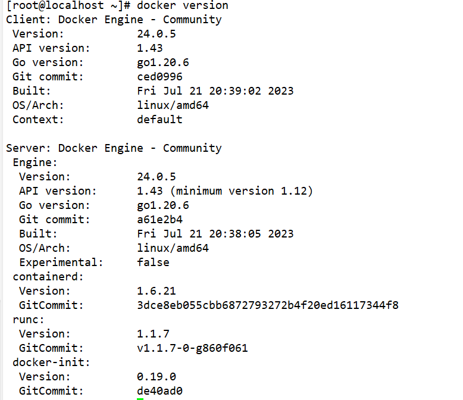
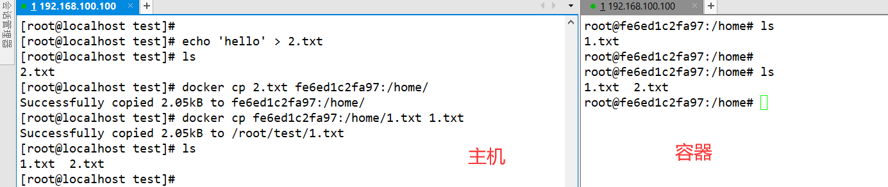

# 命令使用说明

## Docker服务相关

+ 启动服务

```shell
systemctl start docker 
```

+ 暂停服务

```shell
systemctl stop docker.socket 
```

+ 重启服务

```shell
systemctl restart docker 
```

+ 查看服务状态

```shell
systemctl status docker
```

## Docker概要信息

```
docker info
```

## Docker版本查看

```shell
docker version
```



## Docker命令提示符

```shell
查看docker总体帮助文档： docker --help
查看docker命令帮助文档： docker 具体命令 --help
```

## 本地镜像相关命令

### 查看本地所拥有镜像

> + 语法
>
> ```
> docker images [OPTIONS] [REPOSITORY[:TAG]]
> ```
>
> + OPTIONS说明：
    >   + `-a `: 列出本地所有的镜像（含中间映像层，默认情况下，过滤掉中间映像层）；
    >
+ `--digests `: 显示镜像的摘要信息；
>   + `-f `: 显示满足条件的镜像；
>   + `--format` : 指定返回值的模板文件；
>   + `--no-trunc` : 显示完整的镜像信息；
>   + `-q` : 只显示镜像ID。

+ 查看本地所有镜像

```shell
docker images 
```

+ 查看本地某个镜像

```shell
[root@localhost ~]# docker images hello-world
REPOSITORY    TAG       IMAGE ID       CREATED         SIZE
hello-world   latest    feb5d9fea6a5   22 months ago   13.3kB
```

### 查看镜像/容器/数据卷所占的空间

```shell
[root@localhost ~]# docker system df
TYPE            TOTAL     ACTIVE    SIZE      RECLAIMABLE
Images          2         1         72.79MB   72.78MB (99%)
Containers      1         0         0B        0B
Local Volumes   0         0         0B        0B
Build Cache     0         0         0B        0B
[root@localhost ~]# docker system df -v
```

### 查看镜像大小

```shell
[root@localhost ~]# docker image ls
REPOSITORY    TAG       IMAGE ID       CREATED         SIZE
```

### 镜像删除

```
docker rmi 某个XXX镜像名字ID
```

+ 删除单个

```shell
docker rmi  -f 镜像ID
```

+ 删除多个

```shell
docker rmi -f 镜像名1:TAG 镜像名2:TAG 
```

+ 删除全部

```shell
docker rmi -f $(docker images -qa)
```

### tag命令镜像标签

> **docker tag :** 标记本地镜像，将其归入某一仓库。
>
> + 语法
>
> ```java
> docker tag [OPTIONS] IMAGE[:TAG] [REGISTRYHOST/][USERNAME/]NAME[:TAG]
> ```
>
>

+ redis标签

```shell
[root@localhost ~]# docker images
REPOSITORY   TAG       IMAGE ID       CREATED         SIZE
redis        latest    7614ae9453d1   19 months ago   113MB
[root@localhost ~]# docker tag redis:latest xht-redis:v1
[root@localhost ~]# docker images
REPOSITORY   TAG       IMAGE ID       CREATED         SIZE
redis        latest    7614ae9453d1   19 months ago   113MB
xht-redis    v1        7614ae9453d1   19 months ago   113MB
```

+ 将镜像ubuntu:15.10标记为 runoob/ubuntu:v3 镜像

```shell
[root@localhost ~]# docker tag ubuntu:15.10 runoob/ubuntu:v3
[root@localhost ~]# docker images   runoob/ubuntu:v3
REPOSITORY          TAG                 IMAGE ID            CREATED             SIZE
runoob/ubuntu       v3                  4e3b13c8a266        3 months ago        136.3 MB
```

## 远程镜像镜像相关命令

### 登录/登出一个远程镜像仓库

> `docker login` : 登陆到一个Docker镜像仓库，如果未指定镜像仓库地址，默认为官方仓库 Docker Hub
>
> `docker logout` : 登出一个Docker镜像仓库，如果未指定镜像仓库地址，默认为官方仓库 Docker Hub
>
> + 语法
>
> ```
> docker login [OPTIONS] [SERVER]
> ```
>
> ```
> docker logout [OPTIONS] [SERVER]
> ```
>
> OPTIONS说明：
>
> - `-u` : 登陆的用户名
> - `-p` : 登陆的密码

+ 登录到私人仓库

```shell
# 登陆到Docker Hub
[root@wangzy ~]# docker login -u 用户名 -p 密码

# 登入私有仓库
[root@wangzy ~]# docker login --username=你的用户名 registry.cn-hangzhou.aliyuncs.com
Password: 
```

+ 退出仓库

```shell
# 退出默认官方仓库
[root@wangzy ~]# docker logout 
Removing login credentials for https://index.docker.io/v1/

# 退出私有仓库
[root@wangzy ~]# docker logout registry.cn-hangzhou.aliyuncs.com
Removing login credentials for registry.cn-hangzhou.aliyuncs.com
```

### 从镜像仓库查询镜像

> + 语法
>
> ```shell
> docker search [OPTIONS] TERM
> ```
>
> + OPTIONS说明：
    >   + `--automated` : 只列出 automated build类型的镜像；
    >
+ `--no-trunc` : 显示完整的镜像描述；
>   + `-f <过滤条件>`: 列出收藏数不小于指定值的镜像。
>   + `--limit` : 只列出N个镜像，默认25个

+ 查找redis镜像

```shell
[root@localhost ~]# docker search redis
NAME                       DESCRIPTION                                      STARS     OFFICIAL   AUTOMATED
redis                      Redis is an open source key-value store that…   12232     [OK]
redislabs/redisearch       Redis With the RedisSearch module pre-loaded…   57
redislabs/redisinsight     RedisInsight - The GUI for Redis                 88
redislabs/rebloom          A probablistic datatypes module for Redis        24                   [OK]
redislabs/redis            Clustered in-memory database engine compatib…   38
redis/redis-stack-server   redis-stack-server installs a Redis server w…   49
redislabs/rejson           RedisJSON - Enhanced JSON data type processi…   53
redis/redis-stack          redis-stack installs a Redis server with add…   61
redislabs/redisgraph       A graph database module for Redis                26                   [OK]
redislabs/redismod         An automated build of redismod - latest Redi…   41                   [OK]
```

| 参数          | 描述                             |
|-------------|--------------------------------|
| NAME        | 镜像名称                           |
| DESCRIPTION | 镜像的描述                          |
| STARS       | 类似 Github 里面的 star，表示点赞、喜欢的意思。 |
| OFFICIAL    | 是否 docker 官方发布                 |
| AUTOMATED   | 是否自动构建                         |

### 拉取镜像仓库镜像到本地

> + 语法
>
> ```
> docker pull [OPTIONS] NAME[:TAG|@DIGEST]
> ```
>
>
>
> 没有TAG就是最新版
>
>
>
> + OPTIONS说明：
    >   + `-a `: 拉取所有 tagged 镜像
    >
+ `**--disable-content-trust `: 忽略镜像的校验,默认开启

+ 下载ubuntu最新版镜像。

```java
docker pull ubuntu
```

### 本地的镜像上传到镜像仓库

> **docker push :** 将本地的镜像上传到镜像仓库,要先登陆到镜像仓库
>
> + 语法
>
> ```java
> docker push [OPTIONS] NAME[:TAG]
> ```
>
> + OPTIONS说明：
    >   + `--disable-content-trust` : 忽略镜像的校验,默认开启

+ 上传本地镜像myapache:v1到镜像仓库中

```java
docker push myapache:v1
```

## docker容器相关命令

### 新建并启动容器

> + 语法
>
> ```java
> docker run [OPTIONS] IMAGE [COMMAND] [ARG...]
> ```
>
> + OPTIONS说明：
    >   + `-a stdin`: 指定标准输入输出内容类型，可选 STDIN/STDOUT/STDERR 三项；
    >
+ `-d`: 后台运行容器，并返回容器ID；
>   + `-i`: 以交互模式运行容器，通常与 -t 同时使用；
>   + `-P`: 随机端口映射，容器内部端口**随机**映射到主机的端口
>   + `-p`: 指定端口映射，格式为：**主机(宿主)端口:容器端口**
>   + `-t`: 为容器重新分配一个伪输入终端，通常与 -i 同时使用；
>   + `--name="nginx-lb"`: 为容器指定一个名称；
>   + `--dns 8.8.8.8`:  指定容器使用的DNS服务器，默认和宿主一致；
>   + `--dns-search example.com`: 指定容器DNS搜索域名，默认和宿主一致；
>   + `-h "mars"`:  指定容器的hostname；
>   + `-e username="ritchie"`:  设置环境变量；
>   + `--env-file=[]`:  从指定文件读入环境变量；
>   + `--cpuset="0-2" or --cpuset="0,1,2"`:  绑定容器到指定CPU运行；
>   + `-m `: 设置容器使用内存最大值；
>   + `--net="bridge"`:  指定容器的网络连接类型，支持 bridge/host/none/container: 四种类型；
>   + `--link=[]`: 添加链接到另一个容器；
>   + `--expose=[]`: 开放一个端口或一组端口；
>   + `--volume , -v`: 绑定一个卷

+ 使用`docker`镜像`nginx:latest`以`后台模式启动一个容器`,并将容器`命名为mynginx`

```java
docker run --name mynginx -d nginx:latest
```

+ 使用镜像nginx:latest以后台模式启动一个容器,并将容器的`80端口映射到主机随机端口`

```java
docker run -P -d nginx:latest
```

+ 使用镜像 nginx:latest，以后台模式启动一个容器,将容器的 `80 端口`映射到`主机的 80 端口`,`主机的目录 /data 映射`
  到`容器的 /data`

```java
docker run -p 80:80 -v /data:/data -d nginx:latest
```

+ 绑定`容器的 8080 端口`，并将其映射到`本地主机 127.0.0.1 的 80 端口`上

```java
docker run -p 127.0.0.1:80:8080/tcp ubuntu bash
```

+ 使用`镜像nginx:latest以交互模式`启动一个容器,在`容器内执行/bin/bash命令`

```java
runoob@runoob:~$ docker run -it nginx:latest /bin/bash
root@b8573233d675:/# 
```

### 前台交互式启动和后台守护式启动

> 在大部分的场景下，我们希望 docker 的服务是在后台运行的，我们可以过 -d 指定容器的后台运行模式。

+ 前台交互式启动

```java
 docker run -it redis
```

+ 后台守护式启动

```java
docker run -d redis
```

### 查看正在运行的容器

> + 参数说明：
    >   + `a`: 列出当前所有正在运行的容器+历史上运行过的
    >
+ `l`: 显示最近创建的容器。
>   + `n`：显示最近n个创建的容器。
>   + `q`: 静默模式，只显示容器编号。
>   + `size`: 运行时的大小

```shell
[root@localhost ~]# docker ps 
CONTAINER ID   IMAGE     COMMAND   CREATED   STATUS    PORTS     NAMES     SIZE
```

### 查看容器日志

> + 语法
>
> ```java
> docker logs [OPTIONS] CONTAINER
> ```
>
> + OPTIONS说明：
    >   + `-f`: 跟踪日志输出
    >
+ `--since`: 显示某个开始时间的所有日志
>   + `-t`: 显示时间戳
>   + `--tail`: 仅列出最新N条容器日志

+ 跟踪查看容器redis的日志输出。

```shell
[root@localhost ~]# docker ps
CONTAINER ID   IMAGE     COMMAND                   CREATED          STATUS          PORTS      NAMES
c9079d05dd8c   redis     "docker-entrypoint.s…"   15 minutes ago   Up 15 minutes   6379/tcp   great_jepsen
[root@localhost ~]# docker logs -f c9079d05dd8c
1:C 01 Aug 2023 11:36:47.414 # oO0OoO0OoO0Oo Redis is starting oO0OoO0OoO0Oo
省略日志
```

### 查看容器内运行的进程

> + 语法
>
> ```java
> docker top 容器ID
> // docker top :查看容器中运行的进程信息，支持 ps 命令参数。
> docker top [OPTIONS] CONTAINER [ps OPTIONS]     
> ```

+ 查看容器mymysql的进程信息

```java
runoob@runoob:~/mysql$ docker top mymysql
UID    PID    PPID    C      STIME   TTY  TIME       CMD
999    40347  40331   18     00:58   ?    00:00:02   mysqld
```

+ 查看所有运行容器的进程信息

```java
for i in  `docker ps |grep Up|awk '{print $1}'`;do echo \ &&docker top $i; done
```

### 查看容器内部细节

> **docker inspect :** 获取容器/镜像的元数据。
>
> + 语法
>
> ```
> docker inspect [OPTIONS] NAME|ID [NAME|ID...]
> ```
>
> + OPTIONS说明：
    >   + `-f`: 指定返回值的模板文件。
    >
+ `-s`: 显示总的文件大小。
>   + `--type` :  为指定类型返回JSON。

+ 获取镜像mysql:5.6的元信息

```shell
runoob@runoob:~$ docker inspect mysql:5.6
[
    {
        "Id": "sha256:2c0964ec182ae9a045f866bbc2553087f6e42bfc16074a74fb820af235f070ec",
        "RepoTags": [
            "mysql:5.6"
        ],
        "RepoDigests": [],
        "Parent": "",
        "Comment": "",
        "Created": "2016-05-24T04:01:41.168371815Z",
        "Container": "e0924bc460ff97787f34610115e9363e6363b30b8efa406e28eb495ab199ca54",
        "ContainerConfig": {
            "Hostname": "b0cf605c7757",
            "Domainname": "",
            "User": "",
            "AttachStdin": false,
            "AttachStdout": false,
            "AttachStderr": false,
            "ExposedPorts": {
                "3306/tcp": {}
            },
...
```

+ 获取正在运行的容器mymysql的 IP

```shell
runoob@runoob:~$ docker inspect --format='{{range .NetworkSettings.Networks}}{{.IPAddress}}{{end}}' mymysql
172.17.0.3
```

### 退出容器

> + `exit`: run进去容器，exit退出，容器停止
> + `ctrl+p+q`:    run进去容器，ctrl+p+q退出，容器不停止

### 在运行的容器中执行命令

> + 语法
>
>
>
> ```java
> docker exec [OPTIONS] CONTAINER COMMAND [ARG...]
> ```
>
> + OPTIONS说明：
    >   + `-d`: 分离模式: 在后台运行
    >
+ `-i`: 即使没有附加也保持STDIN 打开
>   + `-t`: 分配一个伪终端

+ 进入redis-cli

```java
[root@localhost ~]# docker ps
CONTAINER ID   IMAGE     COMMAND                   CREATED          STATUS          PORTS      NAMES
c9079d05dd8c   redis     "docker-entrypoint.s…"   33 minutes ago   Up 33 minutes   6379/tcp   great_jepsen
[root@localhost ~]# docker exec -it c9079d05dd8c /bin/bash
root@c9079d05dd8c:/data# redis-cli
127.0.0.1:6379> keys *
(empty array)
127.0.0.1:6379>
```

```java
[root@localhost ~]# docker ps
CONTAINER ID   IMAGE     COMMAND                   CREATED          STATUS          PORTS      NAMES
c9079d05dd8c   redis     "docker-entrypoint.s…"   33 minutes ago   Up 33 minutes   6379/tcp   great_jepsen
[root@localhost ~]# docker exec -it c9079d05dd8c redis-cli
127.0.0.1:6379> keys *
(empty array)
127.0.0.1:6379>
```

### 连接到正在运行中的容器

> + 语法
>
> ```java
> docker attach [OPTIONS] CONTAINER
> ```
>
> 要attach上去的容器必须正在运行，可以同时连接上同一个container来共享屏幕（与screen命令的attach类似）。
>
> 可以带上`--sig-proxy=false`来确保``CTRL-D`或`CTRL-C`不会关闭容器。

+ 容器mynginx将访问日志指到标准输出，连接到容器查看访问信息

```shell
runoob@runoob:~$ docker attach --sig-proxy=false mynginx
192.168.239.1 - - [10/Jul/2016:16:54:26 +0000] "GET / HTTP/1.1" 304 0 "-" "Mozilla/5.0 (Windows NT 6.1; WOW64) AppleWebKit/537.36 (KHTML, like Gecko) Chrome/45.0.2454.93 Safari/537.36" "-"
```

### 启动已经被停止的容器

```java
docker start 容器ID或者容器名
```

容器ID或者容器名: 需要同通过`docker ps -a`查看

+ 启动已被停止的容器myrunoob

```java
docker start myrunoob
```

### 重启容器

```java
docker restart 容器ID或者容器名
```

容器ID或者容器名: 需要同通过`docker ps -a`查看

+ 重启容器myrunoob

```java
docker restart myrunoob
```

### 停止运行中的容器

```java
docker stop 容器ID或者容器名
```

容器ID或者容器名: 需要同通过`docker ps -a`查看

+ 停止运行中的容器myrunoob

```java
docker stop myrunoob
```

### 强制停止容器

```java
docker kill 容器ID或容器名
```

容器ID或者容器名: 需要同通过`docker ps -a`查看

### 删除已停止的容器

> **注**：正在运行的容器不可以删除
>
> + 语法
>
> ```java
> docker rm [OPTIONS] CONTAINER [CONTAINER...]
> ```
>
> + OPTIONS说明：
    >   + `-f` :通过 SIGKILL 信号强制删除一个运行中的容器。
    >
+ `-l` :移除容器间的网络连接，而非容器本身。
>   + `-v` :删除与容器关联的卷。

+ 强制删除容器 db01、db02：

```java
docker rm -f db01 db02
```

+ 移除容器 nginx01 对容器 db01 的连接，连接名 db：

```java
docker rm -l db 
```

+ 删除容器 nginx01, 并删除容器挂载的数据卷：

```java
docker rm -v nginx01
```

+ 删除所有已经停止的容器：

```java
docker rm $(docker ps -a -q)
```

### 容器资源的使用情况

> + 语法
>
> ```java
> docker stats [OPTIONS] [CONTAINER...]
> ```
>
> + OPTIONS 说明：
    >   + `--all , -a` : 显示所有的容器，包括未运行的。
    >
+ `--format` : 指定返回值的模板文件。
>   + `--no-stream` : 展示当前状态就直接退出了，不再实时更新。
>   + `--no-trunc` : 不截断输出。

+ 列出所有在运行的容器信息。

```java
[root@localhost ~]# docker stats

CONTAINER ID   NAME           CPU %     MEM USAGE / LIMIT    MEM %     NET I/O     BLOCK I/O     PIDS
c9079d05dd8c   great_jepsen   0.00%     6.723MiB / 7.62GiB   0.09%     656B / 0B   0B / 16.4kB   5

CONTAINER ID   NAME           CPU %     MEM USAGE / LIMIT    MEM %     NET I/O     BLOCK I/O     PIDS
c9079d05dd8c   great_jepsen   0.00%     6.723MiB / 7.62GiB   0.09%     656B / 0B   0B / 16.4kB   5

```

+ 输出详情介绍：

**CONTAINER ID 与 NAME:** 容器 ID 与名称。

**CPU % 与 MEM %:** 容器使用的 CPU 和内存的百分比。

**MEM USAGE / LIMIT:** 容器正在使用的总内存，以及允许使用的内存总量。

**NET I/O:** 容器通过其网络接口发送和接收的数据量。

**BLOCK I/O:** 容器从主机上的块设备读取和写入的数据量。

**PIDS:** 容器创建的进程或线程数。

### 容器与主机之间的数据拷贝

> + 语法
>
> ```java
> docker cp 容器id:容器文件路径 主机文件路径
> docker cp 主机文件路径 容器id:容器文件路径 
> ```
>
>




+ 将主机/www/runoob目录拷贝到容器96f7f14e99ab的/www目录下。

```java
docker cp /www/runoob 96f7f14e99ab:/www/
```

+ 将主机/www/runoob目录拷贝到容器96f7f14e99ab中，目录重命名为www。

```java
docker cp /www/runoob 96f7f14e99ab:/www
```

+ 将容器96f7f14e99ab的/www目录拷贝到主机的/tmp目录中。

```java
docker cp  96f7f14e99ab:/www /tmp/
```

## 导出(备份)容器到归档文件

> + 语法
>
> ```java
> docker export 容器ID > 文件名.tar.gz
> ```
>
>

+ 备份ubuntu容器到本地

```shell
[root@localhost test]# docker export fe6ed1c2fa97 > xht-ubuntu.tar
[root@localhost test]# ls
1.txt  2.txt  xht-ubuntu.tar
```

+ 将id为a404c6c174a2的容器按日期保存为tar文件。

```shell
[root@localhost test]# docker export -o mysql-`date +%Y%m%d`.tar a404c6c174a2
[root@localhost test]#  ls mysql-`date +%Y%m%d`.tar
mysql-20160711.tar
```

## 归档文件中恢复镜像

> + 语法
>
> ```java
> docker import - 镜像用户/镜像名:镜像版本号
> ```

+ 恢复文件`xht-ubuntu.tar`为镜像`xht-ubuntu`

```shell
[root@localhost test]# docker import xht-ubuntu.tar xht-ubuntu:v1
sha256:0eddb8a13b909f0b90acc6b30bd6edc5f75571f1fa6732781b155d8c96f7a047
[root@localhost test]# docker images
REPOSITORY    TAG       IMAGE ID       CREATED         SIZE
xht-ubuntu    v1        0eddb8a13b90   5 seconds ago   72.8MB
```

+ 从镜像归档文件my_ubuntu_v3.tar创建镜像，命名为runoob/ubuntu:v4

```shell
[root@localhost test]# docker import  my_ubuntu_v3.tar runoob/ubuntu:v4  
sha256:63ce4a6d6bc3fabb95dbd6c561404a309b7bdfc4e21c1d59fe9fe4299cbfea39
[root@localhost test]# docker images runoob/ubuntu:v4
REPOSITORY          TAG                 IMAGE ID            CREATED             SIZE
runoob/ubuntu       v4                  63ce4a6d6bc3        20 seconds ago      142.1 MB
```

## 从容器创建一个新的镜像

> + 语法
>
> ```
> docker commit [OPTIONS]  容器ID 要创建的目标镜像名:[标签名]
> ```
>
> + OPTIONS说明：
    >   + `-a` : 提交的镜像作者；
    >
+ `-c` : 使用Dockerfile指令来创建镜像；
>   + `-m` : 提交时的说明文字；
>   + `-p` : 在commit时，将容器暂停。

+ 提交一个自己的镜像

```shell
[root@localhost test]# docker commit -m '自己的镜像' -a 'xht' fe6ed1c2fa97 xht-ubuntu:v2
sha256:c972d171170d8e5bf8f0443aea27dd6cb1df0f9d86b60e924625f584f261e138
[root@localhost test]# docker images
REPOSITORY    TAG       IMAGE ID       CREATED          SIZE
xht-ubuntu    v2        c972d171170d   4 seconds ago    72.8MB
```

+ 将容器a404c6c174a2 保存为新的镜像,并添加提交人信息和说明信息

```shell
[root@localhost test]# docker commit -a "runoob.com" -m "my apache" a404c6c174a2  mymysql:v1 
sha256:37af1236adef1544e8886be23010b66577647a40bc02c0885a6600b33ee28057
[root@localhost test]# docker images mymysql:v1
REPOSITORY          TAG                 IMAGE ID            CREATED             SIZE
mymysql             v1                  37af1236adef        15 seconds ago      329 MB
```

## Dockerfile 创建镜像

> + 语法
>
> ```
> docker build [OPTIONS] PATH | URL | -
> ```
>
> + OPTIONS说明：
    >   + **--build-arg=[] :**设置镜像创建时的变量；
    >
+ **--cpu-shares :**设置 cpu 使用权重；
>   + **--cpu-period :**限制 CPU CFS周期；
>   + **--cpu-quota :**限制 CPU CFS配额；
>   + **--cpuset-cpus :**指定使用的CPU id；
>   + **--cpuset-mems :**指定使用的内存 id；
>   + **--disable-content-trust :**忽略校验，默认开启；
>   + **-f :**指定要使用的Dockerfile路径；
>   + **--force-rm :**设置镜像过程中删除中间容器；
>   + **--isolation :**使用容器隔离技术；
>   + **--label=[] :**设置镜像使用的元数据；
>   + **-m :**设置内存最大值；
>   + **--memory-swap :**设置Swap的最大值为内存+swap，"-1"表示不限swap；
>   + **--no-cache :**创建镜像的过程不使用缓存；
>   + **--pull :**尝试去更新镜像的新版本；
>   + **--quiet, -q :**安静模式，成功后只输出镜像 ID；
>   + **--rm :**设置镜像成功后删除中间容器；
>   + **--shm-size :**设置/dev/shm的大小，默认值是64M；
>   + **--ulimit :**Ulimit配置。
>   + **--squash :**将 Dockerfile 中所有的操作压缩为一层。
>   + **--tag, -t:** 镜像的名字及标签，通常 name:tag 或者 name 格式；可以在一次构建中为一个镜像设置多个标签。
>   + **--network:** 默认 default。在构建期间设置RUN指令的网络模式

+ 使用当前目录的 Dockerfile 创建镜像，标签为 runoob/ubuntu:v1

```java
docker build -t runoob/ubuntu:v1 . 
```

+ 使用URL **github.com/creack/docker-firefox** 的 Dockerfile 创建镜像

```java
docker build github.com/creack/docker-firefox
```

+ 也可以通过 -f Dockerfile 文件的位置

```shell
[root@localhost ~]# build -f /path/to/a/Dockerfile .
```

+ 在 Docker 守护进程执行 Dockerfile 中的指令前，首先会对 Dockerfile 进行语法检查，有语法错误时会返回

```sh
[root@localhost ~]# docker build -t test/myapp .
Sending build context to Docker daemon 2.048 kB
Error response from daemon: Unknown instruction: RUNCMD
```

