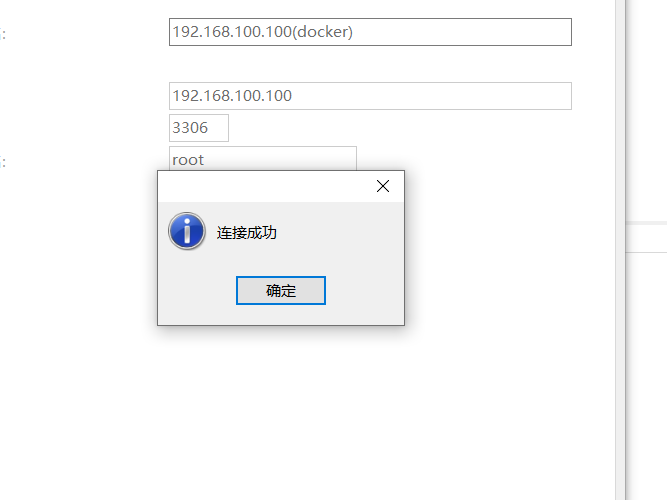

## mysql单机安装

### 文档地址

```http request
https://hub.docker.com/_/mysql
```

### 镜像拉取

```shell
docker pull mysql:8
```

### 启动镜像

```shell
docker run -d -p 3306:3306 --privileged=true -v /app/mysql/log:/var/log/mysql -v /app/mysql/data:/var/lib/mysql -v /app/mysql/conf:/etc/mysql/conf.d -e MYSQL_ROOT_PASSWORD=123456  --name mysql mysql:8
```

### 修改配置文件

+ 主机操作

```shell
cd /app/mysql/conf
vim my.cnf
```

+ 写入以下内容

```c
[client]
default_character_set=utf8
[mysqld]
collation_server = utf8_general_ci
character_set_server = utf8
```

+ 登录mysql查询字符集编码

```
mysql>  SHOW VARIABLES LIKE 'character%'
    -> ;
+--------------------------+--------------------------------+
| Variable_name            | Value                          |
+--------------------------+--------------------------------+
| character_set_client     | utf8mb3                        |
| character_set_connection | utf8mb3                        |
| character_set_database   | utf8mb3                        |
| character_set_filesystem | binary                         |
| character_set_results    | utf8mb3                        |
| character_set_server     | utf8mb3                        |
| character_set_system     | utf8mb3                        |
| character_sets_dir       | /usr/share/mysql-8.0/charsets/ |
+--------------------------+--------------------------------+
8 rows in set (0.00 sec)
```

### 测试


