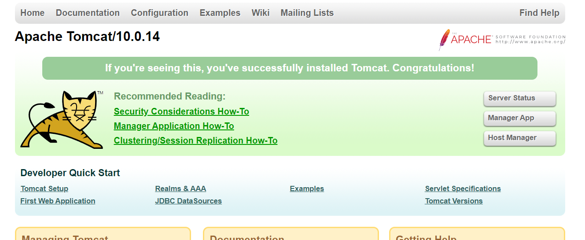

## tomcat安装


### 镜像拉取


```java
docker pull tomcat
```


### 启动镜像


```java
docker run -d -p 8080:8080 --name tomcat -v /app/html:/usr/local/tomcat/webapps tomcat
```


### 测试


http://192.168.100.100:8080/





