# Idea配置并使用

## 安装GitEE插件

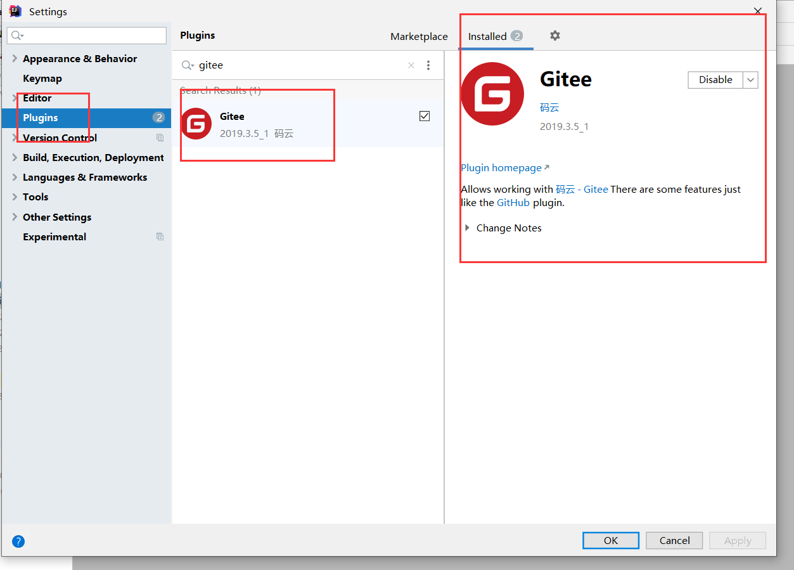

注意：安装完后重启idea

## 拉取代码

到GiteEE或者GitHub上粘贴代码地址：  **https://gitee.com/little_bingedream/lovely-old-sister.git**

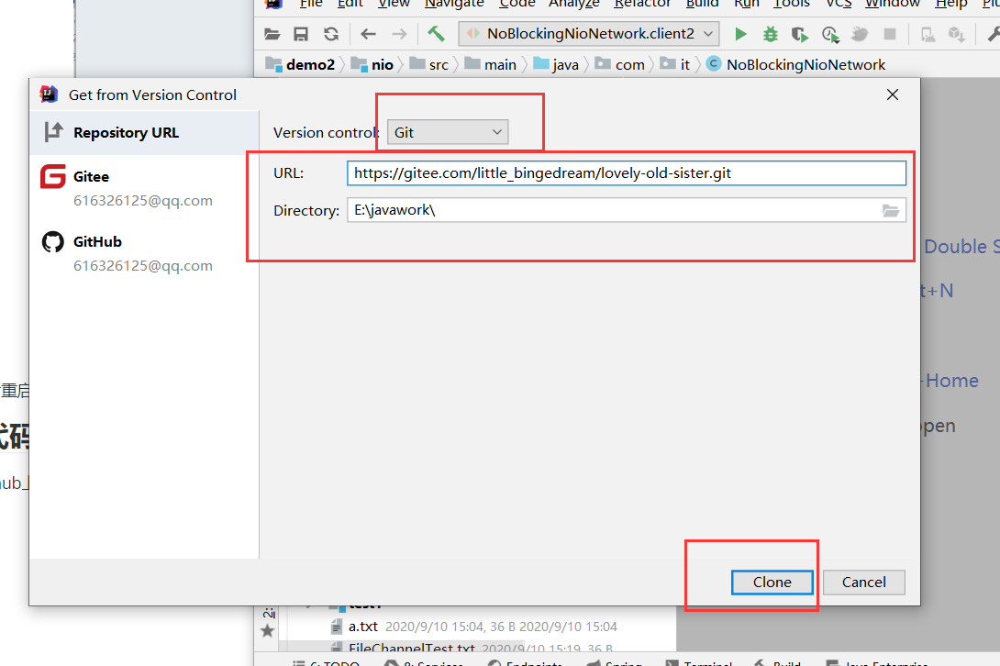

选取过后下一步下一步即可打开新窗口

## 添加代码

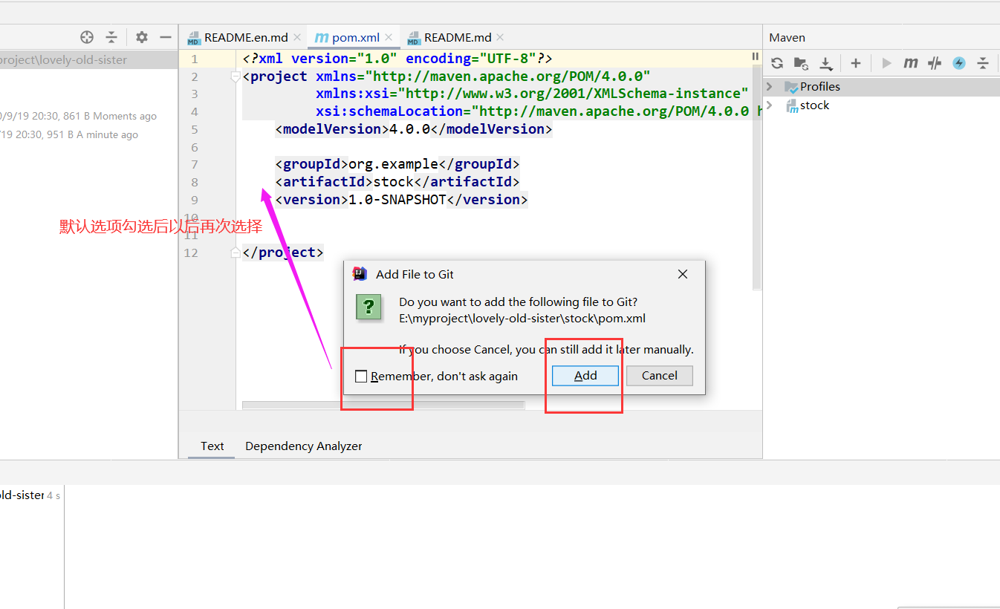

## 提交代码

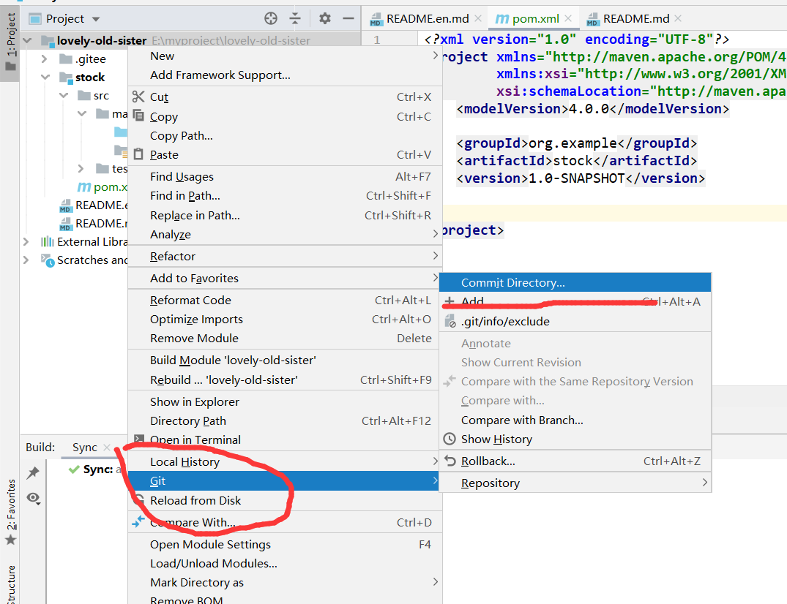

## 提交代码

**提交代码到GitEE上**

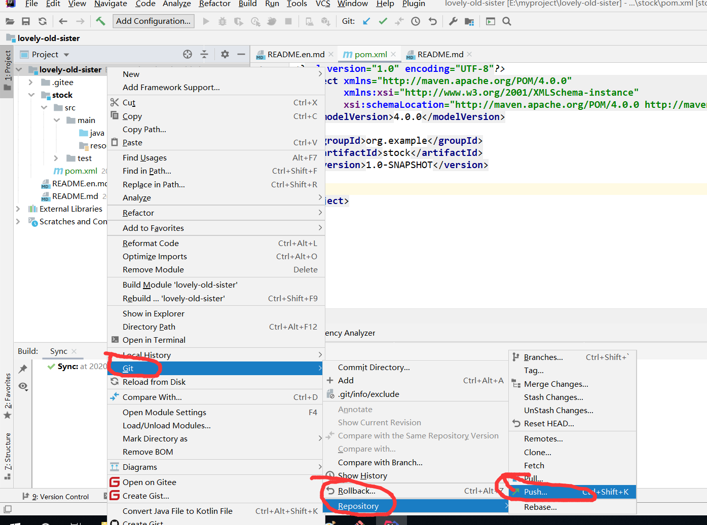

## 更新代码

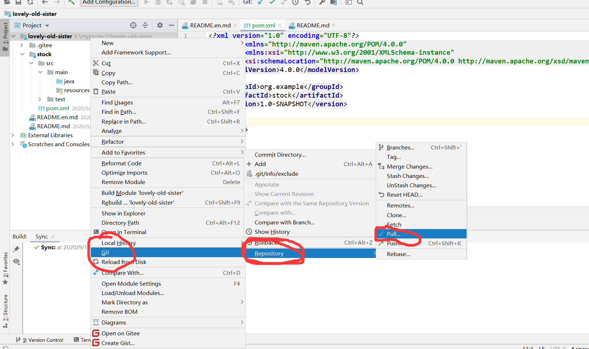

## 查提交历史

查看我们代码提交的历史，方便我们查看谁把分支里面的代码搞乱

###  第一步:

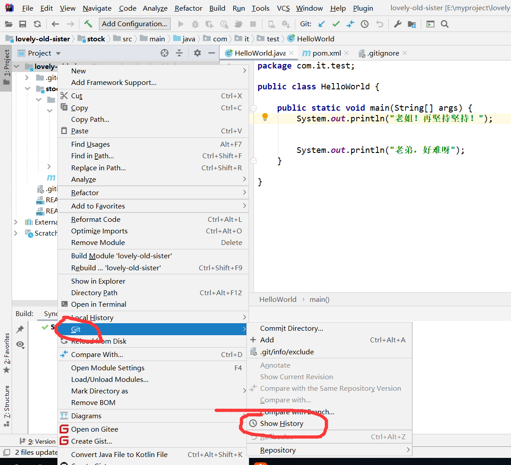

### 第二步：

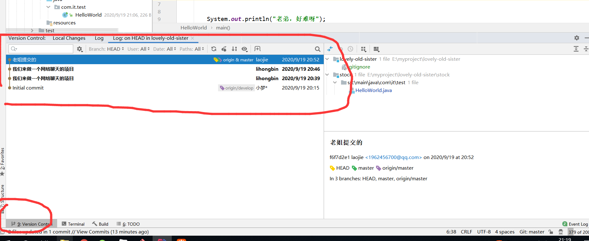

## 创建分支

### 第一步：

### 第二步：

**输入自己要创建的分支名字**

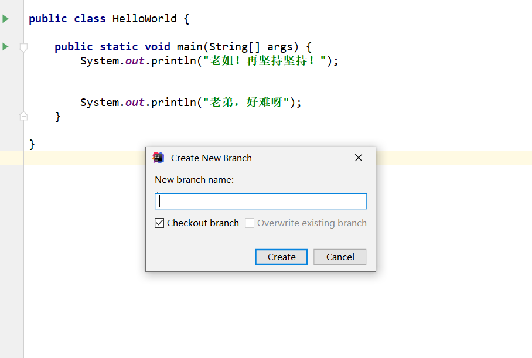

### 第三步：

**提交代码即可**

## 合并分支代码

### 第一步：

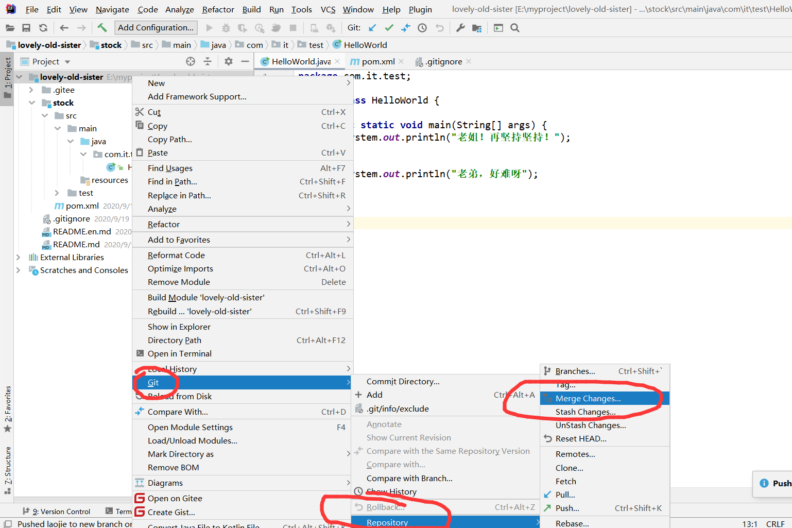

### 第二步：

选择要合并的分支

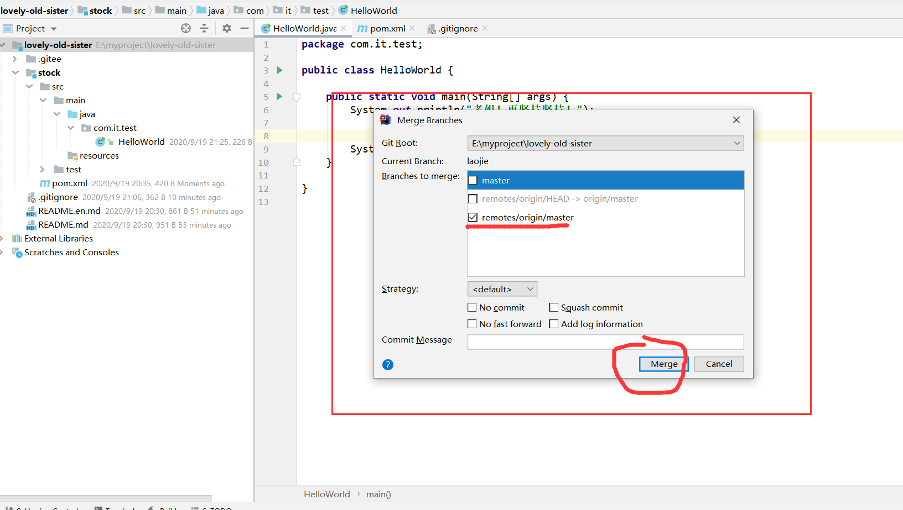

### 第三步:

**如果出现冲突的话**我们需要自己来解决，也可以选择idea的一键解决冲突

### 第三步：

> 提交代码

