# 第一章：简介

## 1. 简介

Git（读音为/gɪt/）是一个**开源的分布式版本控制系统**，可以有效、高速地处理从很小到非常大的项目版本管理。 Git 是 Linus Torvalds 为了帮助管理 **Linux 内核开发**而开发的一个开放源码的版本控制软件。


**更多简介：**

参考：https://www.cnblogs.com/randysun/p/11524711.html

和：https://www.liaoxuefeng.com/wiki/896043488029600/896067008724000


## 2. 官网

https://git-scm.com/


## 3. Git与SVN的主要区别

**SVN是集中式版本控制系统**，版本库是集中放在中央服务器的，而工作的时候，用的都是自己的电脑，所以首先要从中央服务器得到最新的版本，然后工作，完成工作后，需要把自己做完的活推送到中央服务器。集中式版本控制系统是必须联网才能工作，对网络带宽要求较高。

**Git是分布式版本控制系统**，没有中央服务器，每个人的电脑就是一个完整的版本库，工作的时候不需要联网了，因为版本都在自己电脑上。协同的方法是这样的：比如说自己在电脑上改了文件A，其他人也在电脑上改了文件A，这时，你们两之间只需把各自的修改推送给对方，就可以互相看到对方的修改了。Git可以直接看到更新了哪些代码和文件！

**Git是目前世界上最先进的分布式版本控制系统。**

## 4. Git的历史


1、同生活中的许多伟大事物一样，Git 诞生于一个极富纷争大举创新的年代。

2、Linux 内核开源项目有着为数众广的参与者。绝大多数的 Linux 内核维护工作都花在了提交补丁和保存归档的繁琐事务上(1991－2002年间)。到 2002 年，整个项目组开始启用一个专有的分布式版本控制系统 BitKeeper 来管理和维护代码。

3、Linux社区中存在很多的大佬！破解研究 BitKeeper ！

4、到了 2005 年，开发 BitKeeper 的商业公司同 Linux 内核开源社区的合作关系结束，他们收回了 Linux 内核社区免费使用 BitKeeper 的权力。这就迫使 Linux 开源社区(特别是 Linux 的缔造者 Linus Torvalds)基于使用 BitKeeper 时的经验教训，开发出自己的版本系统。（2周左右！） 也就是后来的 Git！

5、Git是目前世界上最先进的分布式版本控制系统。

6、Git是免费、开源的，最初Git是为辅助 Linux 内核开发的，来替代 BitKeeper！

7、Linux和Git之父李纳斯·托沃兹（Linus Benedic Torvalds）1969、芬兰


# 第二章：安装

## 1.  下载


打开 [git官网] https://git-scm.com/，下载git对应操作系统的版本。

所有东西下载慢的话就可以去找镜像！

官网下载太慢，我们可以使用淘宝镜像下载：http://npm.taobao.org/mirrors/git-for-windows/


## 2. Windows安装


傻瓜式安装

选择下一步下一步，可以选择安装位置。


## 3. Linux安装


1、如果你碰巧用Debian或Ubuntu Linux，通过一条sudo apt-get install git就可以直接完成Git的安装，非常简单。

2、老一点的Debian或Ubuntu Linux，要把命令改为sudo apt-get install git-core，因为以前有个软件也叫GIT（GNU Interactive Tools），结果Git就只能叫git-core了。由于Git名气实在太大，后来就把GNU Interactive Tools改成gnuit，git-core正式改为git。

3、如果是其他Linux版本，可以直接通过源码安装。先从Git官网下载源码，然后解压，依次输入：./config，make，sudo make install这几个命令安装就好了。


# 第三章：基础(重点)


## 1、学习一下Linux基本命令


| 命令    | 作用                                |
|-------|-----------------------------------|
| ls    | 查看当前目录下所有的文件                      |
| ll    | 同上也是查看当前目录下所有文件，但是会显示文件的权限信息      |
| cd    | 切换目录                              |
| touch | 创建文本文件                            |
| mkdir | 创建文件夹                             |
| rm -r | 删除文件夹                             |
| pwd   | 查看当前目录路径信息                        |
| clear | 清除屏幕的内容                           |
| vi    | 编辑文件内容，a 进入编辑模式    esc+：+wq！保存并退出 |


## 2、启动


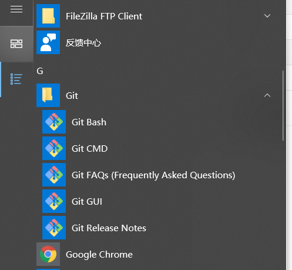


**<font color='red'>点击Git Base来启动这个git，或者鼠标右键选择Git Base来启动</font>**


## 3. Git配置


#### 1   查看配置


所有的配置文件，其实都保存在本地！查看配置

```shell
 git config  -l
```

#### 2     查看不同级别的配置文件：

+ 查看系统config

```shell
git config --system --list　
```

+ 查看当前用户global配置

```shell
git config --global --list
```

#### 3   Git相关的配置文件


+ (git`安装目录`)  \etc\gitconfig ：Git 安装目录下的 gitconfig   --system 系统级

+ C:\Users\Administrator\ .gitconfig 只适用于当前登录用户的配置 --global 全局

**这里可以直接编辑配置文件，通过命令设置后会响应到这里。下一章节就是**


## 4. 设置用户名与邮箱


```shell
git config --global user.name "laojie" # **名称**

git config --global user.email 616326125@qq.com  # **邮箱**
```

只需要做一次这个设置，如果你传递了--global 选项，因为Git将总是会使用该信息来处理你在系统中所做的一切操作。如果你希望在一个特定的项目中使用不同的名称或e-mail地址，你可以在该项目中运行该命令而不要--global选项。总之--global为全局配置，不加为某个项目的特定配置。


## 5. 代码托管中心


代码托管中心的任务：维护远程库

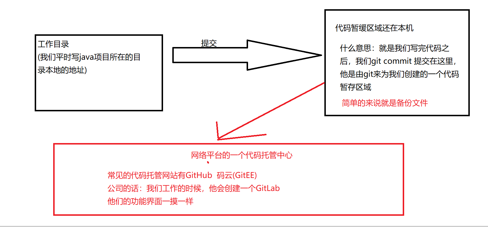


## 6. 三个工作区域


Git本地有三个工作区域：**工作目录（Working Directory）**、**暂存区(Stage/Index)**、**资源库(Repository或Git Directory)**。如果在加上远程的git仓库(Remote Directory)就可以分为四个工作区域。文件在这四个区域之间的转换关系如下：

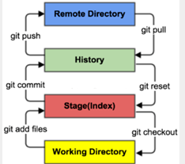


# 第四章：命令行操作

##  4.1 、仓库


```shell
# 在当前目录新建一个Git代码库
git init
# 新建一个目录，将其初始化为Git代码库
git init [project-name]
# 下载一个项目和它的整个代码历史
git clone [url]
```

## 4.2、配置

```shell
# 显示当前的Git配置
git config --list

# 编辑Git配置文件
git config -e [--global]

# 设置提交代码时的用户信息
git config [--global] user.name "[name]"
git config [--global] user.email "[email address]"
```

## 4.3、增加/删除文件

```shell
# 添加指定文件到暂存区
git add [file1] [file2] ...

# 添加指定目录到暂存区，包括子目录
git add [dir]

# 添加当前目录的所有文件到暂存区
git add .

# 添加每个变化前，都会要求确认
# 对于同一个文件的多处变化，可以实现分次提交
git add -p
shell
# 删除工作区文件，并且将这次删除放入暂存区
git rm [file1] [file2] ...

# 停止追踪指定文件，但该文件会保留在工作区
git rm --cached [file]

# 改名文件，并且将这个改名放入暂存区
git mv [file-original] [file-renamed]
```

## 4.4、代码提交

```shell
# 提交暂存区到仓库区
git commit -m [message]

# 提交暂存区的指定文件到仓库区
git commit [file1] [file2] ... -m [message]

# 提交工作区自上次commit之后的变化，直接到仓库区
git commit -a

# 提交时显示所有diff信息
git commit -v

# 使用一次新的commit，替代上一次提交
# 如果代码没有任何新变化，则用来改写上一次commit的提交信息
git commit --amend -m [message]

# 重做上一次commit，并包括指定文件的新变化
git commit --amend [file1] [file2] ...
```

## 4.5、分支

```shell
# 列出所有本地分支
git branch

# 列出所有远程分支
git branch -r

# 列出所有本地分支和远程分支
git branch -a

# 新建一个分支，但依然停留在当前分支
git branch [branch-name]

# 新建一个分支，并切换到该分支
git checkout -b [branch]

# 新建一个分支，指向指定commit
git branch [branch] [commit]

# 新建一个分支，与指定的远程分支建立追踪关系
git branch --track [branch] [remote-branch]

# 切换到指定分支，并更新工作区
git checkout [branch-name]

# 切换到上一个分支
git checkout -

# 建立追踪关系，在现有分支与指定的远程分支之间
git branch --set-upstream [branch] [remote-branch]

# 合并指定分支到当前分支
git merge [branch]

# 选择一个commit，合并进当前分支
git cherry-pick [commit]

# 删除分支
git branch -d [branch-name]

# 删除远程分支
git push origin --delete [branch-name]
git branch -dr [remote/branch]
```
## 4.6、标签

```shell
# 列出所有tag
git tag

# 新建一个tag在当前commit
git tag [tag]

# 新建一个tag在指定commit
git tag [tag] [commit]

# 删除本地tag
git tag -d [tag]

# 删除远程tag
git push origin :refs/tags/[tagName]

# 查看tag信息
git show [tag]

# 提交指定tag
git push [remote] [tag]

# 提交所有tag
git push [remote] --tags

# 新建一个分支，指向某个tag
git checkout -b [branch] [tag]
```


## 4.7、查看信息

```shell
# 显示有变更的文件
git status

# 显示当前分支的版本历史
git log

# 显示commit历史，以及每次commit发生变更的文件
git log --stat

# 搜索提交历史，根据关键词
git log -S [keyword]

# 显示某个commit之后的所有变动，每个commit占据一行
git log [tag] HEAD --pretty=format:%s

# 显示某个commit之后的所有变动，其"提交说明"必须符合搜索条件
git log [tag] HEAD --grep feature

# 显示某个文件的版本历史，包括文件改名
git log --follow [file]
git whatchanged [file]

# 显示指定文件相关的每一次diff
git log -p [file]

# 显示过去5次提交
git log -5 --pretty --oneline

# 显示所有提交过的用户，按提交次数排序
git shortlog -sn

# 显示指定文件是什么人在什么时间修改过
git blame [file]

# 显示暂存区和工作区的差异
git diff

# 显示暂存区和上一个commit的差异
git diff --cached [file]

# 显示工作区与当前分支最新commit之间的差异
git diff HEAD

# 显示两次提交之间的差异
git diff [first-branch]...[second-branch]

# 显示今天你写了多少行代码
git diff --shortstat "@{0 day ago}"

# 显示某次提交的元数据和内容变化
git show [commit]

# 显示某次提交发生变化的文件
git show --name-only [commit]

# 显示某次提交时，某个文件的内容
git show [commit]:[filename]

# 显示当前分支的最近几次提交
git reflog
```

## 4.8、远程同步

```shell
# 下载远程仓库的所有变动
git fetch [remote]

# 显示所有远程仓库
git remote -v

# 显示某个远程仓库的信息
git remote show [remote]

# 增加一个新的远程仓库，并命名
git remote add [shortname] [url]

# 取回远程仓库的变化，并与本地分支合并
git pull [remote] [branch]

# 上传本地指定分支到远程仓库
git push [remote] [branch]

# 强行推送当前分支到远程仓库，即使有冲突
git push [remote] --force

# 推送所有分支到远程仓库
git push [remote] --all
```

## 4.9、撤消

```shell
# 恢复暂存区的指定文件到工作区
git checkout [file]

# 恢复某个commit的指定文件到暂存区和工作区
git checkout [commit] [file]

# 恢复暂存区的所有文件到工作区
git checkout .

# 重置暂存区的指定文件，与上一次commit保持一致，但工作区不变
git reset [file]

# 重置暂存区与工作区，与上一次commit保持一致
git reset --hard

# 重置当前分支的指针为指定commit，同时重置暂存区，但工作区不变
git reset [commit]

# 重置当前分支的HEAD为指定commit，同时重置暂存区和工作区，与指定commit一致
git reset --hard [commit]

# 重置当前HEAD为指定commit，但保持暂存区和工作区不变
git reset --keep [commit]

# 新建一个commit，用来撤销指定commit
# 后者的所有变化都将被前者抵消，并且应用到当前分支
git revert [commit]

#暂时将未提交的变化移除，稍后再移入
git stash
git stash pop
```

## 4.10 、 其它

```shell
# 生成一个可供发布的压缩包
git archive
```
# 第五章：分支


## 5.1、理解暂缓区域


文件.git/index是一个包含文件索引的目录树，像是一个虚拟的工作区。在这个虚拟工作区的目录树中，记录了文件名和文件的状态信息。以便快速检测文件的变化。 索引中还包含所有Blob类型的SHA-1标识符。文件的内容没有存储在其中， 而是保存在Git对象库.git/objects目录中，文件索引建立了文件和对象库中对象实体之间的对应，

如图，展示了工作区、版本库中的暂存区和版本库之间的关系。

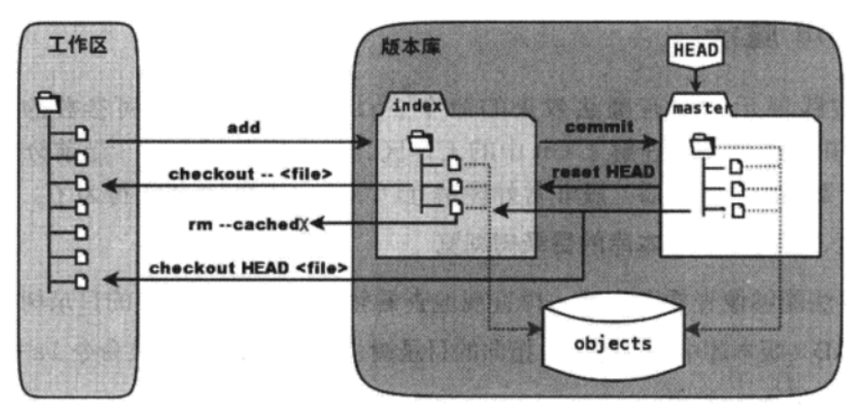

- 图中左侧为工作区，右侧为版本库。在版本库中标记为index的区域是暂存区，标记为master的是master分支代表的目录树。

- HEAD实际是指向master分支的一个“游标”，所以图示的命令中出现的HEAD的地方可以用master来替代。

- objects标志的区域为Git的对象库，实际位于.git/objects目录下。

- 工作区修改（或新增）文件执行`git add`命令时，暂存区的目录树将被更新，同时工作区修改（或新增）的文件内容会被写入到对象库中的一个新的对象中，而该对象的ID被记录在暂存区的索引文件中。

- 执行提交操作`git commit`时，暂存区的目录树会写到版本库（对象库）中，master分支会做相应的更新，即master最新指向的目录树就是提交时原暂存区的目录树。

- 执行`git reset HEAD`命令时，暂存区的目录树会被重写，会被master分支指向的目录树替换，但是工作区不受影响。

- 执行 `git rm --cached <file>`命令时，会直接从暂存区删除文件，工作区不做改变。

- 执行 `git checkout`. 或 `git checkout -- <file>`命令时，会用暂存区全部的文件或指定的文件替换工作区的文件。这个操作很危险，会清除工作区中未添加到暂存区的改动。

- 执行 `git checkout HEAD` ,或 `git checkout HEAD <file>` 命令时，会用HEAD指向的master分支中的全部或部分文件替换暂存区和工作区中的文件，这个命令也是极具危险性的，因为不但会清除工作       区中未提交的改动，也会清楚暂存区中为提交的改动。
## 5.2、分支


Git 在进行提交操作时，会创建**一个提交对象（commit object）**。该提交对象会包含一个指向提交内容**快照的指针、作者的姓名和邮箱、提交时输入的信息以及**
**指向它的父对象的指针**。首次**提交产生的提交对象没有父对象，普通提交操作产生的提交对象有一个父对象，而由多个分支合并产生的提交对象有多个父对象**。

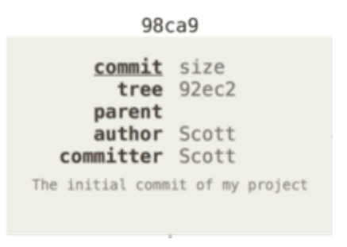


假设一个工作目录，包含了三个将要被暂存和提交的文件。 暂存操作会为每一个文件计算校验和（使用我们在 起步 中提到的 SHA-1 哈希算法），然后把当前版本的文件快照保存到Git 仓库中（objects，Git 使用 blob 对象来保存它们），将校验和加入到暂存区域等待提交：

当使用 git commit 进行提交操作时，Git 会先计算每一个子目录（本例中只有项目根目录）的校验和，然后在Git 仓库中这些校验和保存为树对象。Git 会创建一个提交对象，它除了包含上面提到的那些信息外，还包含指向这个树对象（项目根目录）的指针。如此一来，Git 就可以在需要的时候重现此次保存的快照。

现在，Git 仓库中有五个对象：三个 blob 对象（保存着文件快照）、一个树对象（记录着目录结构和 blob 对象索引）以及一个提交对象（包含着指向前述树对象的指针和所有提交信息）。

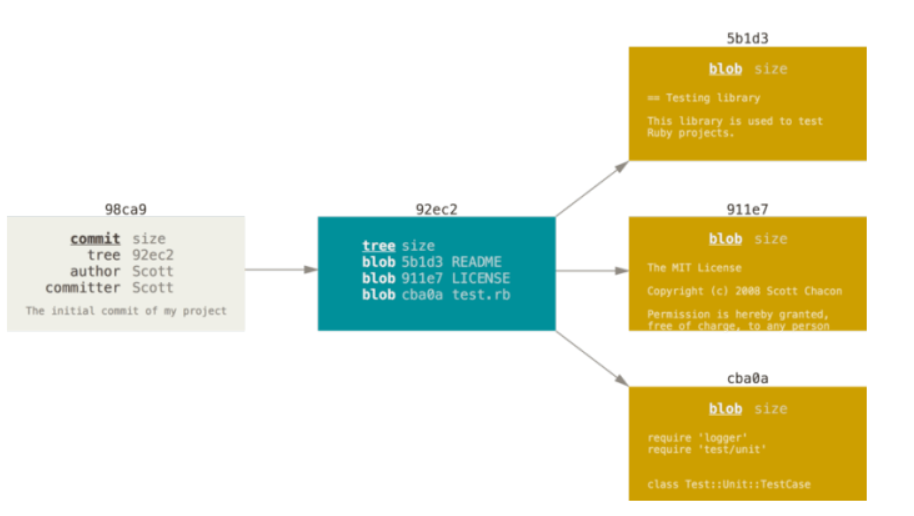

Git 的分支，其实本质上仅仅是指向提交对象的可变指针。 <font color='red'>**Git 的默认分支名字是 master**</font>。 在多次提交操作之后，你其实已经有一个指向最后
那个提交对象的 master 分支。 它会在每次的提交操作中自动向前移动。


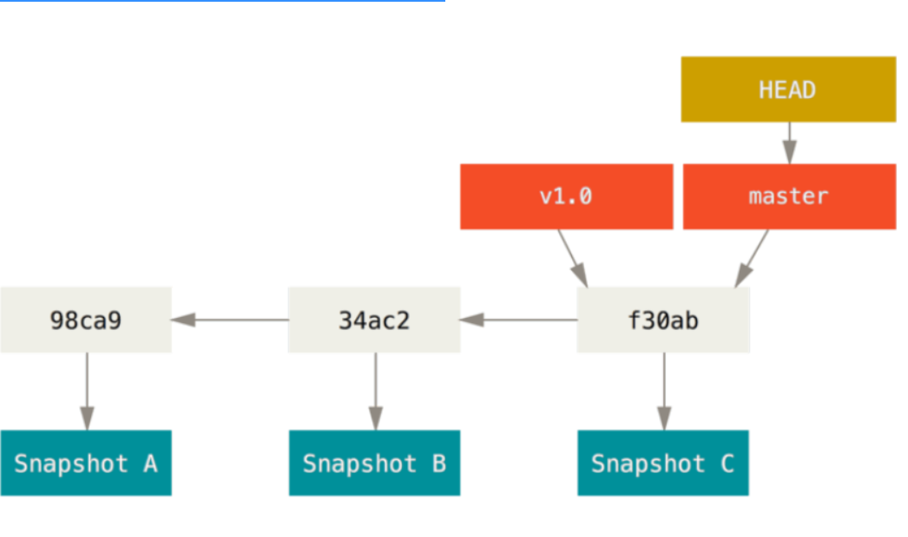
## 5.3、简单的来说


分支在GIT中相对较难，分支就是科幻电影里面的平行宇宙，如果两个平行宇宙互不干扰，那对现在的你也没啥影响。不过，在某个时间点，两个平行宇宙合并了，我们就需要处理一些问题了！如果一个平行宇宙有错误了，我们把他毁灭了就可以了。

如下图：


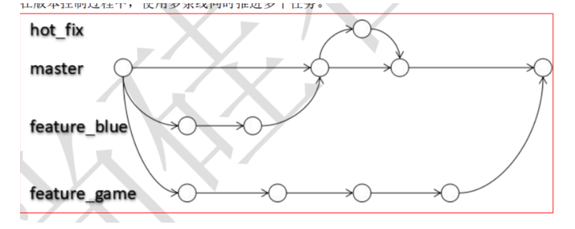


**三条分支：master是我们的主分支，其余两个是我们的自己创建的分支**


## 5.4、默认分支


**Git有一个默认的分支：他是master**

**我们在初始化本地库仓库后他就会出现，自己创建**


## 5.7、常用命令

````shell
# 列出所有本地分支
git branch

# 列出所有本地分支加版本信息
git branch -v

# 列出所有远程分支
git branch -r

# 切换分支 
git checkout 分支名

# 新建一个分支，但依然停留在当前分支
git branch [分支名]

# 新建一个分支，并切换到该分支
git checkout -b [分支名]

# 合并指定分支到当前分支 
git merge [分支名]

# 删除分支 
git branch -d [分支名]

# 删除远程分支 
git push origin --delete [branch-name]$ git branch -dr [remote/branch]

````


## 5.8、创建远程分支


```shell
## 1、在当前分支下（一般是master分支），创建muscleape的本地分支分
git checkout -b muscleape
Switched to a new branch 'muscleape'

## 2、将muscleape分支推送到远程
git push origin muscleape
Everything up-to-date

## 3、将本地分支muscleape关联到远程分支muscleape上  
git branch --set-upstream-to=origin/muscleape
......
......
......
Branch 'muscleape' set up to track remote branch 'muscleape' from 'origin'

## 4、查看本地分支和远程分支的映射关系
git branch -vv
muscleape         f938a3d8e9 [origin/muscleape: gone] 测试test

## 5、查看远程分支
git branch -r
origin/muscleape

## 6、查看本地各个分支目前最新的提交
git branch -v
muscleape         f938a3d8e9 测试test

## 7、查看远程各个分支目前最新的提交
git branch -r -v
origin/muscleape         f938a3d8e9 测试test

```

## 5.9 、冲突解决


### 1  、前言


和svn一样我们写代码的时候我们肯定会去修改同一个文件，那么肯定会出现冲突，git里面的分支冲突怎么解决呢？


### 2、  解决方式


* 第一步：编辑文件，删除特殊符号

* 第二步：把文件修改到满意的程度，保存退出

* 第三步：git ad [文件名]

* 第四步：git comit -m "日志信息"  注意：此时 comit 一定不能带具体文件名

**<font color='red' >我们在修改的过程中应与团队商量</font>**


# 第六章：配置远程仓库


## 6.1、远程仓库有哪些


* GitHub

* GitEE(码云)

* GitLab

## 6.2、为什么选择GitEE


他们每一个功能界面都差不多，我们就学习配置GitEE就可以了，因为他网速快方便。

网址：**https://gitee.com/**


## 6.3、创建远程仓库


### **1、登录**

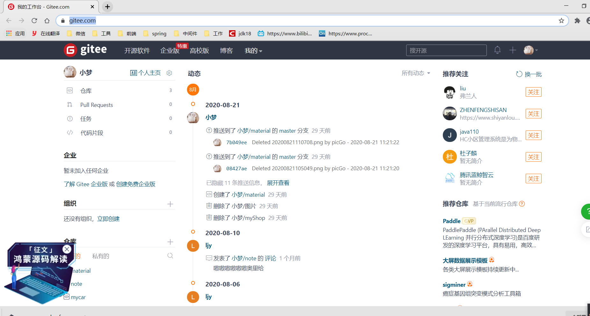

### 2、点击右上角


点击右上角+号选择新建立仓库

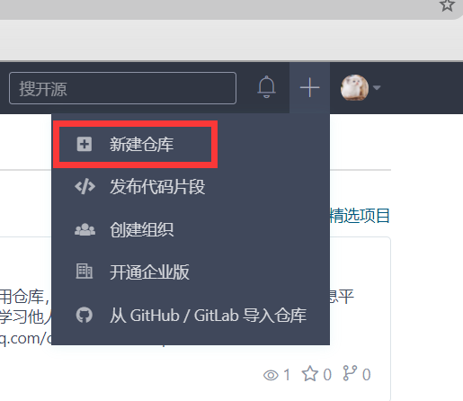


### 3、配置


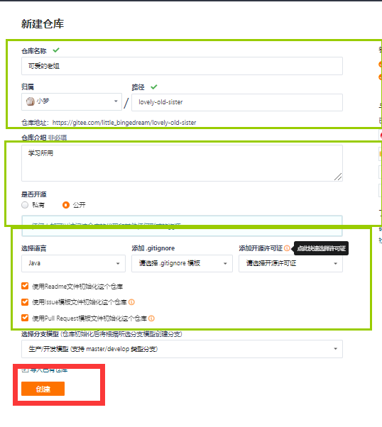


### **4、拉取代码**


点击复制

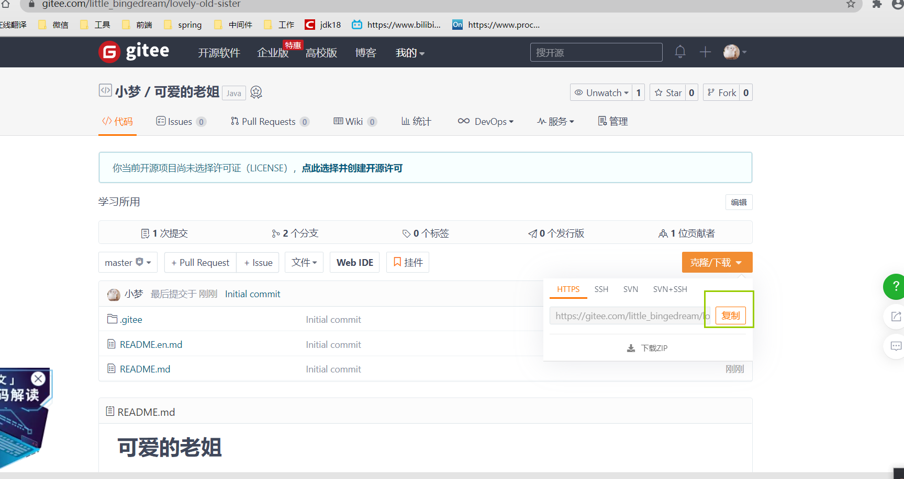


命令行输入  **`git clone  https://gitee.com/little_bingedream/lovely-old-sister.git`**


## 6.4、生成ssh密钥


* **查看是有已生成公钥任意目录下打开Git Bash**


```shell
cd ~/.ssh
```


* 若命令行提示bash: cd: ~./ssh: No such file or directory则说明还没有配置好 ssh 文件生成ssh 公钥：首先配置用户信息


```shell
git config --global user.name = "xxx"
git config --global user.email = "xxx@xxxx.xxx"
```


* 生成公钥


```shell
cd ~
ssh-keygen -t rsa -C "xxxx@xxx.xxx"
```


他会出现的一下信息：(注意：下面的不是命令)


```text
Generating public/private rsa key pair.
Enter file in which to save the key (c/User/%USERNAME%/.ssh/id_rsa): //不用修改(默认存储地点)
Enter passphrase (empty for no passphrase):  //可以为空
Enter same passphrase again:
```


* 查看公钥


```shell
cd ~/.ssh			#//进入. ssh 目录：
cat id_rsa.pub    #或者 vim id_rsa.pub
```


## 6.5、配置ssh公钥


**我们登录码云进入到个人设置中，然后点击ssh公钥，将我们自己的公钥信息设置进去：**


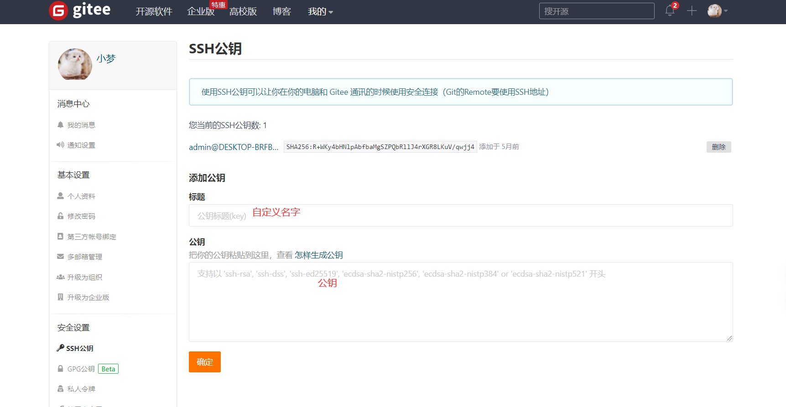


## 6.6、GitEE拉取新成员加入


* 1、**进入仓库的详情页面**


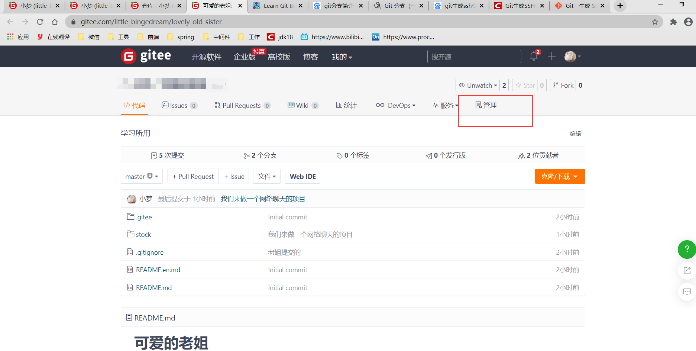


* 2、**选择成员**


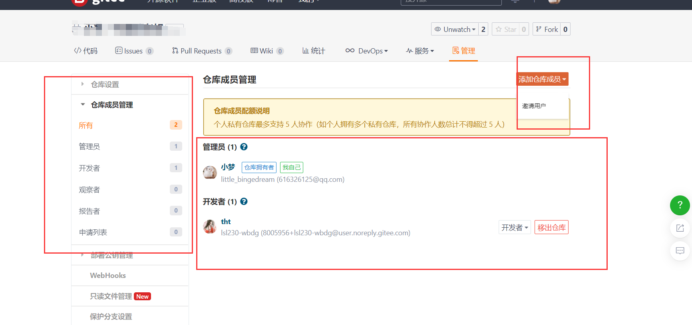


* 3、发送链接


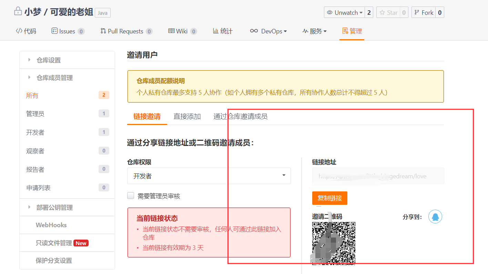


