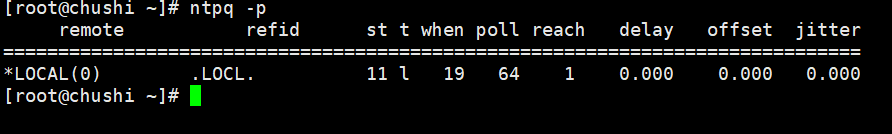

# ntpd简介

`ntpd`（Network Time Protocol Daemon）是NTP（Network Time
Protocol，网络时间协议）的守护进程，用于同步计算机的时钟到某个参考时间源，如远程的NTP服务器。NTP是一种用于同步计算机时钟到某个参考时间源（如原子钟或GPS接收器）的协议。

当`ntpd`运行时，它会定期与配置中指定的NTP服务器进行通信，以获取当前准确的时间，并据此调整计算机的本地时钟。这有助于确保在网络中的计算机都使用准确和一致的时间，这在许多应用中都是至关重要的，比如日志记录、分布式系统、金融交易等。

`ntpd`与`ntpdate`命令有些相似，但它们在用法和功能上有所不同：

- `ntpdate`：这是一个一次性同步时间的工具，它会立即设置系统时间为从NTP服务器获取的时间。但如果在同步过程中存在网络延迟或抖动，可能会导致时间跳变，这对于某些应用来说是不可接受的。
- `ntpd`：作为守护进程运行，它会逐渐调整系统时间，以减少时间跳变的可能性。它还会监控时间偏差并持续进行微调，以保持时间同步。

在使用`ntpd`
时，通常会配置它作为系统服务，在系统启动时自动运行，并持续监控和调整系统时间。同时，也需要正确配置NTP服务器和防火墙规则，以确保`ntpd`
可以顺利与远程的NTP服务器通信。

# ntpd服务搭建

## 一、配置server端

+ 安装ntp服务

```shell
yum install -y ntp
```

+ 备份NTP文件

```shell
mv /etc/ntp.conf /etc/ntp.conf.bak
```

+ 修改配置文件:

```shell
vim /etc/ntp.conf 添加以下两行（意将本机作为NTP服务端）
```

```shell
server 127.127.1.0
fudge 127.127.1.0 stratum 11
```

+ 启动NTP服务器

```shell
systemctl start ntpd
```

+ 设置开机自启动

```java
systemctl enable ntpd
```

+ 执行ntpq -p 查看是否配置成功。（显示LOCL即成功）



## 二、配置client端

+ 安装ntp服

```shell
yum install -y ntp
```

+ 备份NTP文件

```shell
mv /etc/ntp.conf /etc/ntp.conf.bak
```

+ 修改配置文件

```shell
vim /etc/ntp.conf
server 10.1.1.2      ## IP为NTP server端的IP
```

+ 启动前先ntpdate⼿动同步下时间，避免客户端与server端时间差过⼤，导致ntp不能同步。

```shell
ntpdate -u 10.1.1.2   
```

+ 启动NTP服务器

```shell
systemctl start ntpd
```

+ 设置开机自启动

```shell
systemctl enable ntpd
```

+ 查看是否时间同步(#如显示unsynchronised，**同步时间大概需要几分钟，几分钟后再次查看即可**)

```shell
ntpstat 
```

下图即为成功


## 三、案例

+ 互联网区（`10.10.45.*`）时间服务器：202.127.45.1
+ 政务外网区（`10.2.5.*`）时间服务器：10.1.1.2 

