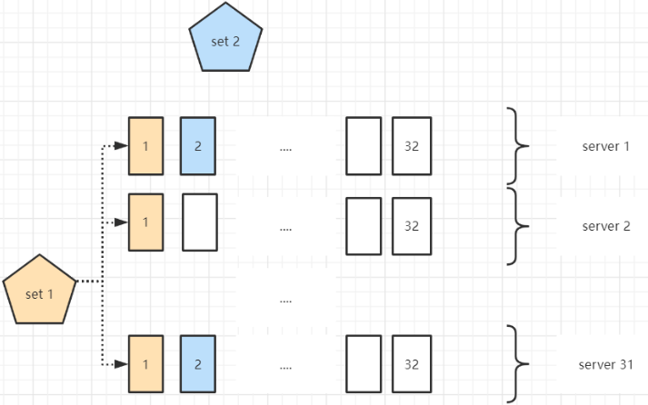

# 简介

## 是什么

+ MinIO 是一个基于Apache License v2.0开源协议的对象存储服务。它兼容亚马逊S3云存储服务接口，非常适合于存储大容量非结构化的数据，例如图片、视频、日志文件、备份数据和容器/虚拟机镜像等，而一个对象文件可以是任意大小，从几kb到最大5T不等。

+ MinIO是一个非常轻量的服务,可以很简单的和其他应用的结合，类似 NodeJS, Redis 或者 MySQL。

+ MinIO 是在 GNU Affero 通用公共许可证 v3.0 下发布的高性能对象存储。它与 Amazon S3 云存储服务 API 兼容。使用 MinIO 为机器学习、分析和应用程序数据工作负载构建高性能基础架构。

## 文档地址

- 官方文档：https://docs.min.io/
- 中文文档：http://docs.minio.org.cn/docs/
- GitHub地址：https://github.com/minio/minio

## 名词解析

| 名词                                 | 解析                                                         |
| ------------------------------------ | ------------------------------------------------------------ |
| Bucket（存储桶）                     | Bucket 是 Minio 的最顶层命名空间，类似于文件系统中的文件夹。在 Minio 中，你可以创建多个 Bucket 来组织和管理对象。 |
| Object（对象）                       | Object 是 Minio 存储的实际数据单元。每个 Object 可以是任意大小的文件，通常由文件内容、元数据和一个唯一标识符（Object Key）组成。 |
| Object Key（对象键）                 | Object Key 是每个 Object 的唯一标识符，用于区分不同的 Object。它类似于文件系统中的文件路径，由目录结构和文件名称组成，例如 `"photos/2021/image.jpg"`。 |
| Presigned URL（预签名URL）           | Presigned URL 是一种带有临时访问权限的 URL，通过该 URL 可以让用户在一定时间内对特定的 Object 进行读取、写入、删除等操作。这对于授权临时访问非常有用，比如与其他用户共享文件或资源。 |
| Access Key 和 Secret Key（访问密钥） | Access Key 和 Secret Key 是用于身份验证的凭据。Access Key 用于标识用户或应用程序，而 Secret Key 则用于进行身份验证。这些凭据需要在使用 Minio 客户端或访问 Minio API 时进行配置。 |
| Region（区域）                       | Region 是用来表示存储桶（Bucket）在物理位置上的分布。Minio 支持将数据存储在不同的区域，以实现高可用性和数据冗余。 |
| Encryption（加密）                   | Minio 提供了对 Bucket 和 Object 的服务器端加密功能。可以使用客户端提供的加密选项，将数据在上传到 Minio 之前进行加密，以保证数据的机密性。 |
| Endpoint                             | 对象存储服务的URL                                            |
| Drive                                | **部署 Minio 时设置的磁盘**，Minio 中所有的对象数据都会存储在 Drive 里。 |
| Set                                  | 一组 Drive 的集合                                            |

### set详细

- 分布式部署根据集群规模自动划分一个或多个 Set ，每个 Set 中的 Drive 分布在不同位置。

- - 一个对象存储在一个Set上
  - 一个集群划分为多个Set
  - 一个Set包含的Drive数量是固定的，默认由系统根据集群规模自动计算得出
  - 一个SET中的Drive尽可能分布在不同的节点上

- 

### Set /Drive 的关系

- Set /Drive 这两个概念是 MINIO 里面最重要的两个概念，一个对象最终是存储在 Set 上面的。
- Set 是另外一个概念，Set 是一组 Drive 的集合，图中，所有蓝色、橙色背景的Drive（硬盘）的就组成了一个 Set。

## MinIO 对象存储有何特点

描述：MinIO 对象存储特点如下所示：

1. 高可用性：MinIO 支持分布式部署，可以在多个节点上实现数据冗余和负载均衡，从而提供高可用性和容错能力。
2. 高性能：MinIO 的设计目标是提供快速的数据访问速度。它采用了高度优化的底层存储引擎，并且支持并行读写操作，以满足大规模数据访问的需求。
3. 可扩展性：MinIO 可以根据实际需求进行水平扩展，用户可以根据数据量的增长来增加节点数量，从而实现存储容量和性能的扩展。
4. 数据保护：MinIO 提供了多种数据保护机制，包括数据加密、数据完整性校验和故障恢复等。用户可以根据需要选择适当的保护机制来保障数据的安全性和可靠性。
5. 兼容性：MinIO 兼容 Amazon S3 云存储服务（AWS Signature v2 和 v4） API，这意味着用户可以直接使用现有的 S3 工具和应用程序与 MinIO 进行集成，而无需进行修改。

总之，MinIO 是一个功能强大且易于使用的对象存储系统，适用于各种规模的数据存储和访问需求, 它的开源性质使得用户可以自由地定制和扩展系统，满足特定的业务需求。

## 优点

- **部署简单**，一个二进制文件（minio）即是一切，还可以支持各种平台
- **支持海量存储**，可以按zone扩展，支持单个对象最大5TB
- **低冗余且磁盘损坏高容忍**，标准且最高的数据冗余系数为2(即存储一个1M的数据对象，实际占用磁盘空间为2M)。但在任意n/2块disk损坏的情况下依然可以读出数据(n为一个纠删码集合中的disk数量)。并且这种损坏恢复是基于单个对象的，而不是基于整个存储卷的
- **读写性能优异**

