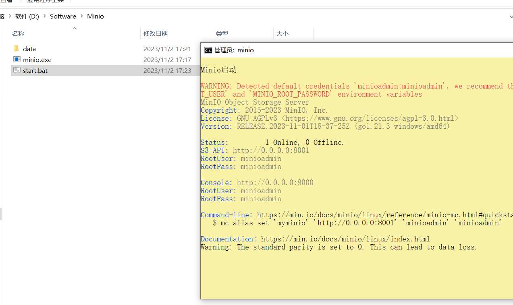

# windows安装


## 下载


```
https://dl.min.io/server/minio/release/windows-amd64/minio.exe
```


## 启动脚本


+ 建立一个文件data

+ ```shell
  @echo off
  echo.
  echo [信息] 运行MinIO文服务器。
  echo.
   
  title minio
  
   
  minio.exe server D:\Software\Minio\data    --console-address "0.0.0.0:8000" --address "0.0.0.0:8001"
  pause
  ```

+ 


## 启动





