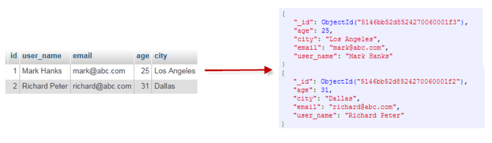
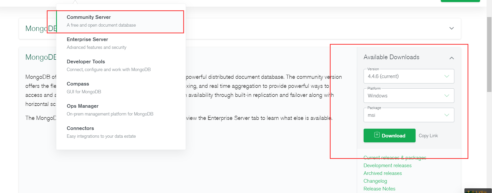

# 一、简介

## 1.1：什么是MongoDB


MongoDB是一个开源、高性能、无模式的文档型数据库，当初的设计就是用于简化开发和方便扩展，是NoSQL数据库产品中的一种。是最像关系型数据库（MySQL）的非关系型数据库。

它支持的数据结构非常松散，是一种类似于 JSON 的 格式叫BSON，所以它既可以存储比较复杂的数据类型，又相当的灵活MongoDB中的记录是一个文档，它是一个由字段和值对（fifield:value）组成的数据结构。MongoDB文档类似于JSON对象，即一个文档认为就是一个对象。字段的数据类型是字符型，它的值除了使用基本的一些类型外，还可以包括其他文档、普通数组和文档数组。


## 1.2：数据类型


MongoDB的最小存储单位就是文档(document)对象。文档(document)对象对应于关系型数据库的行。数据在MongoDB中以BSON（Binary-JSON）文档的格式存储在磁盘上。
BSON（Binary Serialized Document Format）是一种类json的一种二进制形式的存储格式，简称Binary JSON。BSON和JSON一样，支持内嵌的文档对象和数组对象，但是BSON有JSON没有的一些数据类型，如Date和BinData类型。
BSON采用了类似于 C 语言结构体的名称、对表示方法，支持内嵌的文档对象和数组对象，具有轻量性、可遍历性、高效性的三个特点，可以有效描述非结构化数据和结构化数据。这种格式的优点是灵活性高，但它的缺点是空间利用率不是很理想。
Bson中，除了基本的JSON类型：string,integer,boolean,double,null,array和object，mongo还使用了特殊的数据类型。这些类型包括date,object id,binary data,regular expression 和code。每一个驱动都以特定语言的方式实现了这些类型，查看你的驱动的文档来获取详细信息。
BSON数据类型参考列表：


| SQL术语/概念 | MongoDB术语/概念 | 解释/说明                           |
| :----------- | :--------------- | :---------------------------------- |
| database     | database         | 数据库                              |
| table        | collection       | 数据库表/集合                       |
| row          | document         | 数据记录行/文档                     |
| column       | field            | 数据字段/域                         |
| index        | index            | 索引                                |
| table joins  |                  | 表连接,MongoDB不支持                |
| primary key  | primary key      | 主键,MongoDB自动将_id字段设置为主键 |


> + 通过下图实例，我们也可以更直观的了解Mongo中的一些概念：





## 1.3：windows安装单机


### 1.下载


第一步：下载安装包

MongoDB 提供了可用于 32 位和 64 位系统的预编译二进制包，你可以从MongoDB官网下载安装，MongoDB 预编译二进制包下载地址：

https://www.mongodb.com/download-center#community

+ MongoDB的版本命名规范如：x.y.z； 
	+ y为奇数时表示当前版本为开发版，如：1.5.2、4.1.13； 
	+ y为偶数时表示当前版本为稳定版，如：1.6.3、4.0.10； 
	+ z是修正版本号，数字越大越好。

详情：http://docs.mongodb.org/manual/release-notes/#release-version-numbers





### 2.安装


傻瓜式安装注意选择路径

注意配置环境变量


### 3.cmd链接


cmd命令行输入：

```shell
mongo
#或者
mongo --host=127.0.0.1 --port=27017
```


查看已经有的数据库:

```shell
show databases
```


退出mogodb:

```shell
exit
```


提示：

MongoDB javascript shell是一个基于javascript的解释器，故是支持js程序的。


## 1.4：Liunx安装单机


### 上传安装包，环境准备


准备mongodb安装包解压，放在`/usr/local/mongodb/`目录下：新建立`data` `logs` `pid`三个文件


### 新建配置文件mongodb.cfg


```yaml
# 数据保存到哪
storage:
  dbPath: /data/mongodb/data
  journal:
    enabled: true
#  engine:
#  mmapv1:
#  wiredTiger:
# 日志保存到哪
systemLog:
  destination: file
  logAppend: true
  path:  /usr/local/mongodb/logs/mongod.log
# 绑定的IP和端口号
net:
  port: 27018
  bindIp: 0.0.0.0
processManagement:
    #启用在后台运行mongos或mongod进程的守护进程模式。
    fork: true
    #指定用于保存mongos或mongod进程的进程ID的文件位置，其中mongos或mongod将写入其PID
    pidFilePath: "/usr/local/mongodb/pid/mongod.pid"  
```


### 启动


```java
/usr/local/mongodb/bin/mongod --config /usr/local/mongodb/config/mongodb.conf
```


