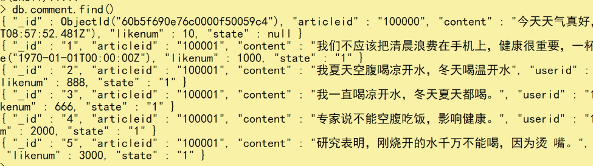
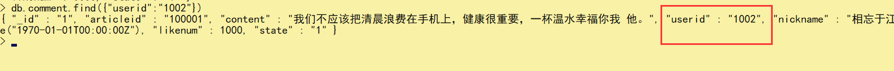
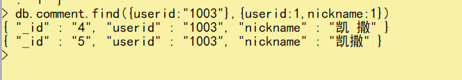

# 三、基础命令


## 3.1：数据库操作


### 1.选择/创建数据库


```java
use databaseName
```


如果数据库不存在则自动创建,有则使用


### 2.查看所有的数据库


```java
show databases
    或者
show dbs    
```


### 3.查看当前使用的数据库


```java
db
```


### 4.删除数据库


```java
db.dropDatabase()
```


提示：主要用来删除已经持久化的数据库


### 3.数据库命名规范


数据库名可以是满足以下条件的任意UTF-8字符串。

+ 不能是空字符串（"")。

+ 不得含有' '（空格)、.、$、/、\和\0 (空字符)。

+ 应全部小写。

+ 最多64字节。

有一些数据库名是保留的，可以直接访问这些有特殊作用的数据库。

+ **admin**： 从权限的角度来看，这是"root"数据库。要是将一个用户添加到这个数据库，这个用户自动继承所有数据库的权限。一些特定的服务器端命令也只能从这个数据库运行，比如列出所有的数据库或者关闭服务器。

+ **local:** 这个数据永远不会被复制，可以用来存储限于本地单台服务器的任意集合

+ **confifig**: 当Mongo用于分片设置时，confifig数据库在内部使用，用于保存分片的相关信息


## 3.2：集合操作


> 集合，类似关系型数据库中的表。
>
> 可以显式的创建，也可以隐式的创建。


### 1.显式创建


基本语法格式：


```java
db.createCollection(name)
```


参数说明：

+ name: 要创建的集合名称


例如：创建一个名为 mycollection 的普通集合。


```java
db.createCollection("mycollection")
```


### 2.查看集合


```java
show collections 
或
show tables 
```


### 3.隐式创建


当向一个集合中插入一个文档的时候，如果集合不存在，则会自动创建集合。

详见 文档的插入 章节。

提示：通常我们使用隐式创建文档即可。


### 4.集合删除


```java
db.collection.drop()
```


例如：要删除mycollection集合


```java
db.mycollection.drop()
```


## 3.3：文档操作


> 文档（document）的数据结构和 JSON 基本一样。
>
> 所有存储在集合中的数据都是 BSON 格式。


### 1.单个插入


使用`insert()` 或 `save()` 方法向集合中插入文档，语法如下：

<font color='red'>save方法是更新和插入，和jpa里面的save（）一样</font>

```java
db.文档名字.insert()
db.文档名字.save()
```

例如：

```javascript
db.comment.insert({"articleid":"100000","content":"今天天气真好，阳光明 媚","userid":"1001","nickname":"Rose","createdatetime":new Date(),"likenum":NumberInt(10),"state":null})
```


### 2.插入提示


1）comment集合如果不存在，则会隐式创建

2）mongo中的数字，默认情况下是double类型，如果要存整型，必须使用函数NumberInt(整型数字)，否则取出来就有问题了。

3）插入当前日期使用 new Date() 

4）插入的数据没有指定 _id ，会自动生成主键值

5）如果某字段没值，可以赋值为null，或不写该字段。

执行后，如下，说明插入一个数据成功了。


WriteResult({ "nInserted" : 1 }) 


### 3.插入注意


注意：

1. 文档中的键/值对是有序的。

2. 文档中的值不仅可以是在双引号里面的字符串，还可以是其他几种数据类型（甚至可以是整个嵌入的文档)。 

3. MongoDB区分类型和大小写。

4. MongoDB的文档不能有重复的键。

5. 文档的键是字符串。除了少数例外情况，键可以使用任意UTF-8字符。

文档键命名规范：

+ 键不能含有\0 (空字符)。这个字符用来表示键的结尾。

+ .和$有特别的意义，只有在特定环境下才能使用。

+ 以下划线"_"开头的键是保留的(不是严格要求的)。 


### 4.批量插入


```javascript
db.文档名字.insertMany()
```


例如：

```js
db.comment.insertMany([ {"_id":"1","articleid":"100001","content":"我们不应该把清晨浪费在手机上，健康很重要，一杯温水幸福你我 他。","userid":"1002","nickname":"相忘于江湖","createdatetime":new Date("2019-08- 05T22:08:15.522Z"),"likenum":NumberInt(1000),"state":"1"}, {"_id":"2","articleid":"100001","content":"我夏天空腹喝凉开水，冬天喝温开水","userid":"1005","nickname":"伊人憔 悴","createdatetime":new Date("2019-08-05T23:58:51.485Z"),"likenum":NumberInt(888),"state":"1"}, {"_id":"3","articleid":"100001","content":"我一直喝凉开水，冬天夏天都喝。","userid":"1004","nickname":"杰克船 长","createdatetime":new Date("2019-08-06T01:05:06.321Z"),"likenum":NumberInt(666),"state":"1"}, {"_id":"4","articleid":"100001","content":"专家说不能空腹吃饭，影响健康。","userid":"1003","nickname":"凯 撒","createdatetime":new Date("2019-08-06T08:18:35.288Z"),"likenum":NumberInt(2000),"state":"1"}, {"_id":"5","articleid":"100001","content":"研究表明，刚烧开的水千万不能喝，因为烫 嘴。","userid":"1003","nickname":"凯撒","createdatetime":new Date("2019-08- 06T11:01:02.521Z"),"likenum":NumberInt(3000),"state":"1"} ]);
```


### 5.批量插入提示


+ 插入时指定了 _id ，则主键就是该值。

+ 如果某条数据插入失败，将会终止插入，但已经插入成功的数据不会回滚掉。

+ 因为批量插入由于数据较多容易出现失败，因此，可以使用try catch进行异常捕捉处理，测试的时候可以不处理。如（了解）：


```js
db.comment.insertMany([ {"_id":"1","articleid":"100001","content":"我们不应该把清晨浪费在手机上，健康很重要，一杯温水幸福你我 他。","userid":"1002","nickname":"相忘于江湖","createdatetime":new Date("2019-08- 05T22:08:15.522Z"),"likenum":NumberInt(1000),"state":"1"}, {"_id":"2","articleid":"100001","content":"我夏天空腹喝凉开水，冬天喝温开水","userid":"1005","nickname":"伊人憔 悴","createdatetime":new Date("2019-08-05T23:58:51.485Z"),"likenum":NumberInt(888),"state":"1"}, {"_id":"3","articleid":"100001","content":"我一直喝凉开水，冬天夏天都喝。","userid":"1004","nickname":"杰克船 长","createdatetime":new Date("2019-08-06T01:05:06.321Z"),"likenum":NumberInt(666),"state":"1"}, {"_id":"4","articleid":"100001","content":"专家说不能空腹吃饭，影响健康。","userid":"1003","nickname":"凯 撒","createdatetime":new Date("2019-08-06T08:18:35.288Z"),"likenum":NumberInt(2000),"state":"1"}, {"_id":"5","articleid":"100001","content":"研究表明，刚烧开的水千万不能喝，因为烫 嘴。","userid":"1003","nickname":"凯撒","createdatetime":new Date("2019-08- 06T11:01:02.521Z"),"likenum":NumberInt(3000),"state":"1"} ]); } catch (e) { print (e); }
```


### 6.查询语法格式


```js
db.collection.find(<query>, [projection])
```


| **Parameter** | **Type** | **Description**                                              |
| ------------- | -------- | ------------------------------------------------------------ |
| query         | document | 可选。使用查询运算符指定选择筛选器。若要返回集合中的所有文档，请省略此参数或传递空文档 |
| projection    | document | 可选。指定要在与查询筛选器匹配的文档中返回的字段（投影）。若要返回匹配文档中的所有字段， |


### 7.查询所有


```js
db.文档名.find() 
//或
db.文档名.find({})
```


例如：




### 8.条件查询

 

```js
db.文档名.find({条件})
```


例如：

```js
db.comment.find({"userid":"1002"})
```





| 操作       | 格式                     | 范例                                        | RDBMS中的类似语句   |
| :--------- | :----------------------- | :------------------------------------------ | :------------------ |
| 等于       | `{<key>:<value>}`        | `db.col.find({"by":"123"}).pretty()`        | `where by = '123'`  |
| 小于       | `{<key>:{$lt:<value>}}`  | `db.col.find({"likes":{$lt:50}}).pretty()`  | `where likes < 50`  |
| 小于或等于 | `{<key>:{$lte:<value>}}` | `db.col.find({"likes":{$lte:50}}).pretty()` | `where likes <= 50` |
| 大于       | `{<key>:{$gt:<value>}}`  | `db.col.find({"likes":{$gt:50}}).pretty()`  | `where likes > 50`  |
| 大于或等于 | `{<key>:{$gte:<value>}}` | `db.col.find({"likes":{$gte:50}}).pretty()` | `where likes >= 50` |
| 不等于     | `{<key>:{$ne:<value>}}`  | `db.col.find({"likes":{$ne:50}}).pretty()`  | `where likes != 50` |


### 9.投影查询


如果要查询结果返回部分字段，则需要使用投影查询（不显示所有字段，只显示指定的字段）。

如：查询结果只显示 _id、userid、nickname :

```js
db.comment.find({userid:"1003"},{userid:1,nickname:1})
```




默认 _id 会显示。

如：查询结果只显示 、userid、nickname ，不显示 _id ：


```js
db.comment.find({userid:"1003"},{userid:1,nickname:1,_id:0})
{ "userid" : "1003", "nickname" : "凯撒" } 
{ "userid" : "1003", "nickname" : "凯撒" }
```


再例如：查询所有数据，但只显示 _id、userid、nickname :

```js
db.comment.find({},{userid:1,nickname:1}) 
```


### 10.覆盖修改


如果我们想修改_id为1的记录，点赞量为1001，输入以下语句：

```js
db.comment.update({_id:"1"},{likenum:NumberInt(1001)})
```

执行后，我们会发现，这条文档除了likenum字段其它字段都不见了


### 11.局部修改


为了解决这个问题，我们需要使用修改器$set来实现，命令如下：

我们想修改_id为2的记录，浏览量为889，输入以下语句：

```js
db.comment.update({_id:"2"},{$set:{likenum:NumberInt(889)}})
```

这样就OK啦。

### 12.批量的修改


更新所有用户为 1003 的用户的昵称为 凯撒大帝 。

```js
//默认只修改第一条数据 
db.comment.update({userid:"1003"},{$set:{nickname:"凯撒2"}}) 
//修改所有符合条件的数据 
db.comment.update({userid:"1003"},{$set:{nickname:"凯撒大帝"}},{multi:true})
```


提示：如果不加后面的参数，则只更新符合条件的第一条记录


### 13.修改更多实例


```js
更多实例
//只更新第一条记录：
db.col.update( { "count" : { $gt : 1 } } , { $set : { "test2" : "OK"} } );
//全部更新：
db.col.update( { "count" : { $gt : 3 } } , { $set : { "test2" : "OK"} },false,true );
//只添加第一条：
db.col.update( { "count" : { $gt : 4 } } , { $set : { "test5" : "OK"} },true,false );
//全部添加进去:
db.col.update( { "count" : { $gt : 5 } } , { $set : { "test5" : "OK"} },true,true );
//全部更新：
db.col.update( { "count" : { $gt : 15 } } , { $inc : { "count" : 1} },false,true );
//只更新第一条记录：
db.col.update( { "count" : { $gt : 10 } } , { $inc : { "count" : 1} },false,false );
```


### 14.删除文档


删除文档的语法结构：

```js
db.集合名称.remove(条件)
```

以下语句可以将数据全部删除，请慎用

```js
db.comment.remove({})
```

如果删除_id=1的记录，输入以下语句

```js
db.comment.remove({_id:"1"})
```


### 15.统计查询


（1）统计所有记录数：

统计comment集合的所有的记录数：

```js
db.comment.count()
```

（2）按条件统计记录数：

例如：统计userid为1003的记录条数

```js
db.comment.count({userid:"1003"})
```


提示：

默认情况下 count() 方法返回符合条件的全部记录条数。


### 16.排序查询


在 MongoDB 中使用 sort() 方法对数据进行排序，sort() 方法可以通过参数指定排序的字段，并使用 1 和 -1 来指定排序的方式，其中 1 为升序排列，而 -1 是用于降序排列。

```js
db.COLLECTION_NAME.find().sort({KEY:1}) 
//或
db.集合名称.find().sort(排序方式)
```

例如：

对userid降序排列，并对访问量进行升序排列

```js
db.comment.find().sort({userid:-1,likenum:1})
```


### 17.分页查询


可以使用limit()方法来读取指定数量的数据，使用skip()方法来跳过指定数量的数据。


```js
db.COLLECTION_NAME.find().limit(NUMBER).skip(NUMBER)
```


如果你想返回指定条数的记录，可以在fifind方法后调用limit来返回结果(TopN)，默认值20，例如：


```js
db.comment.find().limit(3) 
```


skip方法同样接受一个数字参数作为跳过的记录条数。（前N个不要）,默认值是0


```js
db.comment.find().skip(3)
```


分页查询：需求：每页2个，第二页开始：跳过前两条数据，接着值显示3和4条数据


```js
//第一页 
db.comment.find().skip(0).limit(2)
//第二页 
db.comment.find().skip(2).limit(2) 
//第三页 
db.comment.find().skip(4).limit(2)
```


