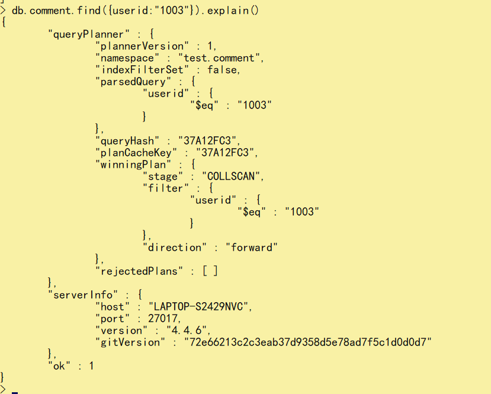

# 四、索引


## 4.1：简介


索引支持在MongoDB中高效地执行查询。如果没有索引，MongoDB必须执行全集合扫描，即扫描集合中的每个文档，以选择与查询语句匹配的文档。这种扫描全集合的查询效率是非常低的，特别在处理大量的数据时，查询可以要花费几十秒甚至几分钟，这对网站的性能是非常致命的。

如果查询存在适当的索引，MongoDB可以使用该索引限制必须检查的文档数。

索引是特殊的数据结构，它以易于遍历的形式存储集合数据集的一小部分。索引存储特定字段或一组字段的值，按字段值排序。索引项的排支持有效的相等匹配和基于范围的查询操作。此外，MongoDB还可以使用索引中的排序返回排序结果。


官网文档：https://docs.mongodb.com/manual/indexes/


了解：

MongoDB索引使用B树数据结构（确切的说是B-Tree，MySQL是B+Tree）


## 4.2：测试数据


```js
db.userinfos.insertMany([
   {_id:1, name: "张三", age: 23,level:10, ename: { firstname: "san", lastname: "zhang"}, roles: ["vip","gen" ]},
   {_id:2, name: "李四", age: 24,level:20, ename: { firstname: "si", lastname: "li"}, roles:[ "vip" ]},
   {_id:3, name: "王五", age: 25,level:30, ename: { firstname: "wu", lastname: "wang"}, roles: ["gen","vip" ]},
   {_id:4, name: "赵六", age: 26,level:40, ename: { firstname: "liu", lastname: "zhao"}, roles: ["gen"] },
   {_id:5, name: "田七", age: 27, ename: { firstname: "qi", lastname: "tian"}, address:'北京' },
   {_id:6, name: "周八", age: 28,roles:["gen"], address:'上海' }
]);  
```


## 4.3：索引语法


```js
//创建索引,值1表示正序排序，-1表示倒序排序
　　db.userinfos.createIndex({age:-1})

//查看userinfos中的所有索引
　　db.userinfos.getIndexes()

//删除特定一个索引
　　db.userinfos.dropIndex({name:1,age:-1})
//删除所有的索引(主键索引_id不会被删除)
　　db.userinfos.dropIndexes()

//如果我们要修改一个索引的话，可以先删除索引然后在重新添加。
```


## 4.4：索引类型


### 1.单键索引


单键索引(Single Field Indexes)顾名思义就是单个字段作为索引列，mongoDB的所有collection默认都有一个单键索引_id，我们也可以对一些经常作为过滤条件的字段设置索引，如给age字段添加一个索引，语法十分简单：


```js
//给age字段添加升序索引
　　db.userinfos.createIndex({age:1})
```


其中{age:1}中的1表示升序，如果想设置倒序索引的话使用 db.userinfos.createIndex({age:-1}) 即可。


　因为document的存储是bson格式的，我们也可以给内置对象的字段添加索引，或者将整个内置对象作为一个索引，语法如下：

```js
//1.内嵌对象的某一字段作为索引
//在ename.firstname字段上添加索引
　　db.userinfos.createIndex({"ename.firstname":1})
//使用ename.firstname字段的索引查询
　　db.userinfos.find({"ename.firstname":"san"})
//2.整个内嵌对象作为索引
//给整个ename字段添加索引
　　db.userinfos.dropIndexes()
//使用ename字段的索引查询
　　db.userinfos.createIndex({"ename":1})
```


### 2.复合索引


复合索引(Compound Indexes)指一个索引包含多个字段，用法和单键索引基本一致。使用复合索引时要注意字段的顺序，如下添加一个name和age的复合索引，name正序，age倒序，document首先按照name正序排序，然后name相同的document按age进行倒序排序。mongoDB中一个复合索引最多可以包含32个字段。


```js
//添加复合索引，name正序，age倒序
  　　db.userinfos.createIndex({"name":1,"age":-1}) 
//过滤条件为name，或包含name的查询会使用索引(索引的第一个字段)
  　　db.userinfos.find({name:'张三'}).explain()
　　  db.userinfos.find({name:"张三",level:10}).explain()
　　  db.userinfos.find({name:"张三",age:23}).explain()

//查询条件为age时，不会使用上边创建的索引,而是使用的全表扫描
db.userinfos.find({age:23}).explain()
```


### 3.多建索引


　多键索引(mutiKey Indexes)是建在数组上的索引，在mongoDB的document中，有些字段的值为数组，多键索引就是为了提高查询这些数组的效率。看一个栗子：准备测试数据，classes集合中添加两个班级，每个班级都有一个students数组，如下：


```js
db.classes.insertMany([
     {
         "classname":"class1",
         "students":[{name:'jack',age:20},
                    {name:'tom',age:22},
                    {name:'lilei',age:25}]
      },
      {
         "classname":"class2",
         "students":[{name:'lucy',age:20},
                    {name:'jim',age:23},
                    {name:'jarry',age:26}]
      }]
  )
```


　为了提高查询students的效率，我们使用 `db.classes.createIndex({'students.age':1}) `给students的age字段添加索引，然后使用索引


### 4.其他索引


地理空间索引（Geospatial Index）、文本索引（Text Indexes）、哈希索引（Hashed Indexes）。

地理空间索引（Geospatial Index）

为了支持对地理空间坐标数据的有效查询，MongoDB提供了两种特殊的索引：返回结果时使用平面几何的二维索引和返回结果时使用球面几何的二维球面索引。

文本索引（Text Indexes）MongoDB提供了一种文本索引类型，支持在集合中搜索字符串内容。这些文本索引不存储特定于语言的停止词（例如“the”、“a”、“or”），而将集合中的词作为词干，只存储根词。

哈希索引（Hashed Indexes）

为了支持基于散列的分片，MongoDB提供了散列索引类型，它对字段值的散列进行索引。这些索引在其范围内的值分布更加随机，但只支持相等匹配，不支持基于范围的查询。


### 5.执行计划


分析查询性能（Analyze Query Performance）通常使用执行计划（解释计划、Explain Plan）来查看查询的情况，如查询耗费的时间、是否基于索引查询等。那么，通常，我们想知道，建立的索引是否有效，效果如何，都需要通过执行计划查看。

语法：

```js
db.collection.find(query,options).explain(options)
```

查看根据userid查询数据的情况：





