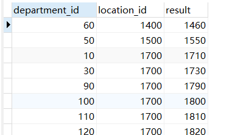

# 三、查询（一）


## 3.1：SELECT语法


```sql
SELECT *|{[DISTINCT] column|expression [alias],...} FROM table;
```


+ SELECT  
  + 标识选择哪些列。

+ FROM   
  + 标识从哪个表中选择。


## 3.2：查看表结构


```sql
DESC employees;
SHOW COLUMNS FROM employees;
```


## 3.3：查询全部列


```sql
SELECT * FROM departments
```


## 3.4：映射查询


数据表字段多的时候，我们还去查询很多列会很麻烦，比如我们只要一条列的数据，可是呢我们还是去全部的查询出来这样就很不友好。


```sql
SELECT department_id, location_id FROM departments;
```


## 3.5：别名查询


+ 列的别名: 

+ 表起别名

**通过使用 SQL，可以为列名称和表名称指定别名（Alias）。 关键字`AS` 当然也可以省略不写**


```sql
SELECT t.department_id as id  FROM  departments as t;
SELECT t.department_id  id  FROM  departments  t;
```


## 3.6：查询数据信息


```sql
/*正在使用的数据库*/
SELECT DATABASE();
/*当前使用的用户*/
SELECT USER();
/*当前数据库版本*/
SELECT VERSION();
```


## 3.7：拼接字段


### 1.使用+号


```sql
SELECT department_id,location_id, (department_id +location_id) as result  FROM  departments ;
```





注意：如果列的类型有字符类型那么的话就不可以相加,必须是**数字类型**才可以


```sql
SELECT department_id,department_name, (department_id +department_name) as result  FROM  departments ;
```


### 2.concat函数使用


```sql
SELECT department_id,department_name, CONCAT(department_id,department_name) as result  FROM  departments ;
```


## 3.8：去重


去除重复的数据，我们使用`DISTINCT`关键字，当然我们可以使用分组查询，下一节讲解


```sql
SELECT DISTINCT salary FROM employees;
```


## 3.9：WHERE 子句


### 1.简介


如需有条件地从表中选取数据，可将 WHERE 子句添加到 SELECT 语句。


### 2.语法


```sql
SELECT 列名称 FROM 表名称 WHERE 列 运算符 值
```


### 3.可以使用的运算符


| 操作符  | 描述         |
| :------ | :----------- |
| =       | 等于         |
| <>      | 不等于       |
| >       | 大于         |
| <       | 小于         |
| >=      | 大于等于     |
| <=      | 小于等于     |
| BETWEEN | 在某个范围内 |
| LIKE    | 搜索某种模式 |

> ##### **注释：**在某些版本的 SQL 中，操作符 <> 可以写为 !=。


### 4.使用where子句


```
SELECT * FROM Persons WHERE City='Beijing'
```


> ### "Persons" 表


| LastName | FirstName | Address        | City     | Year |
| :------- | :-------- | :------------- | :------- | :--- |
| Adams    | John      | Oxford Street  | London   | 1970 |
| Bush     | George    | Fifth Avenue   | New York | 1975 |
| Carter   | Thomas    | Changan Street | Beijing  | 1980 |
| Gates    | Bill      | Xuanwumen 10   | Beijing  | 1985 |


> ### 结果：


| LastName | FirstName | Address        | City    | Year |
| :------- | :-------- | :------------- | :------ | :--- |
| Carter   | Thomas    | Changan Street | Beijing | 1980 |
| Gates    | Bill      | Xuanwumen 10   | Beijing | 1985 |


### 5.引号的使用


请注意，我们在例子中的条件值周围使用的是单引号。

SQL 使用单引号来环绕文本值（大部分数据库系统也接受双引号）。如果是数值，请不要使用引号。


> ### 文本值：


```sql
/*这是正确的：*/
SELECT * FROM Persons WHERE FirstName='Bush'

/*这是错误的：*/
SELECT * FROM Persons WHERE FirstName=Bush
```


> ### 数值：


```sql
/*这是正确的：*/
SELECT * FROM Persons WHERE Year>1965

/*这是错误的：*/
SELECT * FROM Persons WHERE Year>'1965'
```


## 3.10：AND & OR 运算符


```sql
-- and使用
SELECT * FROM employees WHERE   job_id ='AD_VP' AND salary >24000;
-- OR使用
SELECT * FROM employees WHERE   job_id ='AD_VP' OR salary >24000;
-- and 和 OR使用
SELECT * FROM employees WHERE   job_id ='AD_VP' AND salary >24000 OR manager_id = 100;
```


