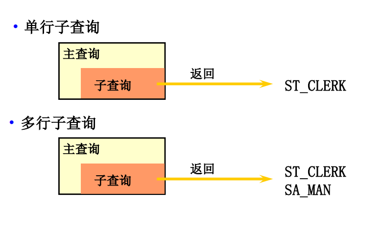
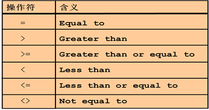
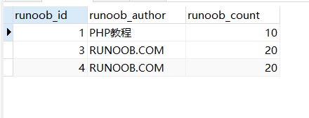
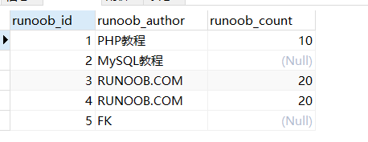
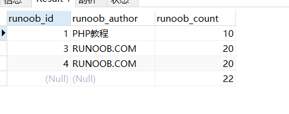
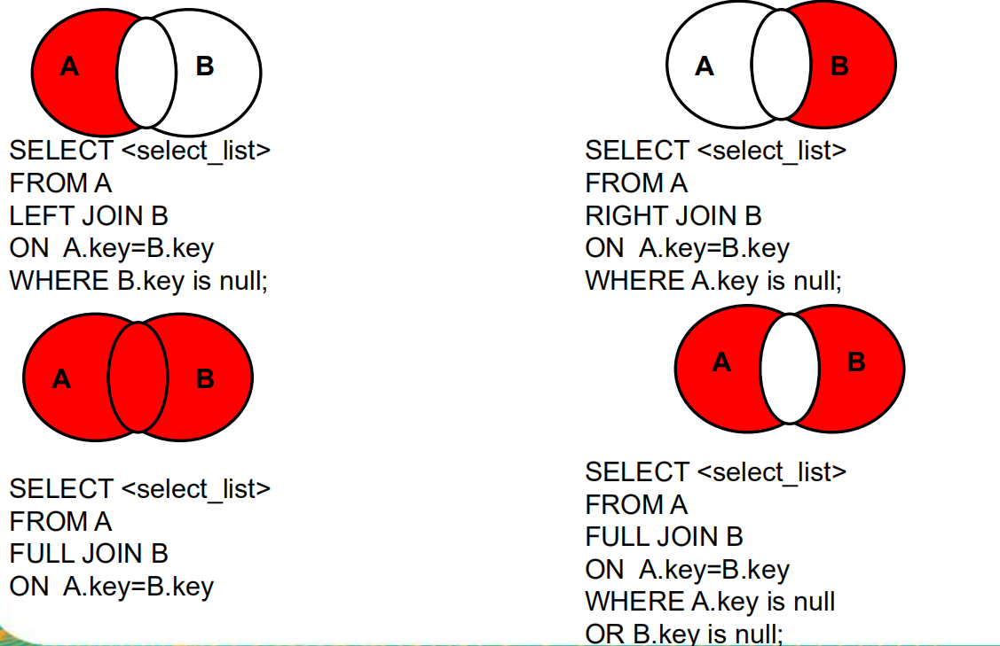

# 五、查询(三)

## 5.1：字符转换函数

| NAME            | MESSAGE                                                                                                                |
|-----------------|------------------------------------------------------------------------------------------------------------------------|
| ASCII()         | 返回字符表达式最左端字符的ASCII 码值。在ASCII（）函数中，纯数字的字符串可不用‘’括起来，但含其它字符的字符串必须用‘’括起来使用，否则会出错。                                          |
| CHAR()          | 将ASCII 码转换为字符。如果没有输入0 ~ 255 之间的ASCII 码值，CHAR（） 返回NULL 。                                                                |
| LOWER()和UPPER() | LOWER()将字符串全部转为小写；UPPER()将字符串全部转为大写。                                                                                   |
| STR()           | 把数值型数据转换为字符型数据。<br/>如select STR(12345.633,7,1) 结果为12345.6<br/>第一个参数是要转换的数值，<br/>第二个参数是转换後的总长度（含小数点，正负号），<br/>第三个参数为小数位 |

```sql
--  ASCII()返回字符表达式最左端字符的ASCII 码值
SELECT ASCII("a"); --  97
SELECT ASCII("s"); --  157
SELECT ASCII("asss");  /*这里输出的是a97*/
-- CHAR()将ASCII 码转换为字符。如果没有输入0 ~ 255 之间的ASCII 码值，CHAR()返回NULL 
SELECT CHAR(133); --  
-- LOWER()将字符串全部转为小写；
SELECT LOWER("abcDed");--  abcded
-- UPPER()将字符串全部转为大写。
SELECT UPPER("abcDed");--  
-- STR()把数值型数据转换为字符型数据如

select STR(12345.633,7,1);
/*
第一个参数是要转换的数值，
第二个参数是转换後的总长度（含小数点，正负号）
第三个参数为小数位
*/
```

## 5.2：空格函数

| name    | message      |
|---------|--------------|
| LTRIM() | 把字符串头部的空格去掉。 |
| RTRIM() | 把字符串尾部的空格去掉。 |

```sql
-- 1、LTRIM() 把字符串头部的空格去掉。
SELECT LTRIM(" abdc ");
-- 2、RTRIM() 把字符串尾部的空格去掉。
SELECT RTRIM(" abdc ");
```

## 5.3：取子串函数

| name        | message                                                                                           |
|-------------|---------------------------------------------------------------------------------------------------|
| left()      | LEFT (character_expression,integer_expression)返回character_expression 左起 integer_expression 个字符。   |
| RIGHT()     | RIGHT (character_expression, integer_expression)返回character_expression 右起 integer_expression 个字符。 |
| SUBSTRING() | SUBSTRING (expression,starting_position,length) 返回从字符串左边第starting_ position 个字符起length个字符的部分      |

```sql
SELECT LEFT("abcde",2); -- ab

SELECT RIGHT("abcde",2); --  de

SELECT SUBSTRING("abcdef",2,4); -- bcde
```

## 5.4：字符串操作函数

| name             | message                  |
|------------------|--------------------------|
| REPLACE(s,s1,s2) | 将字符串 s2 替代字符串 s 中的字符串 s1 |
| REVERSE(s)       | 将字符串s的顺序反过来              |
| SPACE(n)         | 返回 n 个空格                 |

```sql
-- REPLACE(s,s1,s2)将字符串 s2 替代字符串 s 中的字符串 s1
SELECT REPLACE("abcdef","def","abc"); -- abcabc
-- REVERSE(s)将字符串s的顺序反过来
SELECT REVERSE("abcdef"); -- fedcba
-- SPACE(n)返回 n 个空格
SELECT SPACE(10);-- 10个空格
```

## 5.5：数据类型转换函数

| name                | message                                                              |
|---------------------|----------------------------------------------------------------------|
| CAST(x AS type)     | 转换数据类型,支持类型有BINARY、CHAR(n)、DATE、TIME、DATETIME、DECIMAL、SIGNED和UNSIGNE |
| CONVERT(s USING cs) | 函数将字符串 s 的字符集变成 cs                                                   |

```sql
SELECT CAST("123" AS TIME);
SELECT CAST("2017-08-29" AS DATE);
SELECT CONVERT("你好" USING gbk)
```

## 5.6：日期函数

| name            | message             |
|-----------------|---------------------|
| DAY(d)          | 返回日期值 d 的日期部分       |
| MONTH(d)        | 返回日期d中的月份值，1 到 12   |
| YEAR(d)         | 返回年份                |
| DATEDIFF(d1,d2) | 计算日期 d1->d2 之间相隔的天数 |
| now()           | 获取当前日期              |
| str_to_date     | 将日期格式的字符转换成指定格式的日期  |
| date_format     | 将日期转换成字符            |

```sql
SELECT DAY("2017-08-29" );-- 29
SELECT MONTH('2018-8-11 11:11:11'); -- 8
SELECT YEAR("2017-06-15");-- 2017
SELECT DATEDIFF('2001-01-01','2001-02-02');-- -32
SELECT NOW(); -- 2020-10-19 16:11:23
SELECT STR_TO_DATE('9-13-1999','%m-%d-%Y'); -- 1999-09-13
SELECT DATE_FORMAT('2018/6/6','%Y年%m月%d日');-- 2018年06月06日
```

| **序号** | **格式符** |     **功能**      |
|:------:|:-------:|:---------------:|
|   1    |   %Y    |      四位的年份      |
|   2    |   %y    |      2位的年份      |
|   3    |   %m    | 月份（01,02…11,12） |
|   4    |   %c    | 月份（1,2,…11,12）  |
|   5    |   %d    |   日（01,02,…）    |
|   6    |   %H    |    小时（24小时制）    |
|   7    |   %h    |    小时（12小时制）    |
|   8    |   %i    |  分钟（00,01…59）   |
|   9    |   %s    |  秒（00,01,…59）   |

## 5.7：数字函数

| name            | message                                      |
|-----------------|----------------------------------------------|
| RAND()          | 生成随机数                                        |
| ROUND(number,n) | 取数字小数点后的n位                                   |
| TRUNCATE(x,y)   | 返回数值 x 保留到小数点后 y 位的值（与 ROUND 最大的区别是不会进行四舍五入） |
| MOD(x,y)        | 返回 x 除以 y 以后的余数                              |

```sql
SELECT RAND(); -- 0.8565491501768577
SELECT  ROUND(45.926232, 3); --  45.926
SELECT TRUNCATE(1.23456,3) -- 1.234
SELECT MOD(5,2)  -- 1
```

## 5.8：分页查询

### 1.分页公式

1）limit分页公式：curPage是当前第几页；pageSize是一页多少条记录

```sql
limit  (curPage-1)*pageSize,pageSize
```

（2）用的地方：sql语句中

```sql
select * from student limit(curPage-1)*pageSize,pageSize;
```

### 2.总页数公式

（1）总页数公式：totalRecord是总记录数；pageSize是一页分多少条记录

```cpp
int totalPageNum = (totalRecord +pageSize - 1) / pageSize;
```

（2）用的地方：前台UI分页插件显示分页码

（3）查询总条数：totalRecord是总记录数，SELECT COUNT(*) FROM tablename

### 3.limit m,n分页语句

```sql
select * from employees order by employee_id desc limit 3,3;
select * from employees order by employee_id desc limit m,n;
```

limit 3,3的意思扫描满足条件的3+3行，撇去前面的3行，返回最后的3行，那么问题来了，如果是limit
200000,200，需要扫描200200行，如果在一个高并发的应用里，每次查询需要扫描超过20W行，效率十分低下。


> ###### 例如：

```sql
select * from orders_history where type=8 limit 100,100;
select * from orders_history where type=8 limit 1000,100;
select * from orders_history where type=8 limit 10000,100;
select * from orders_history where type=8 limit 100000,100;
select * from orders_history where type=8 limit 1000000,100;
```

### 4.limit m语句

```sql
select * from dept where deptno >10 order by deptno asc limit n;//下一页
select * from dept where deptno <60 order by deptno desc limit n//上一页
```

这种方式不管翻多少页只需要扫描n条数据。

但是，虽然扫描的数据量少了，但是在某些需要跳转到多少也得时候就无法实现，这时还是需要用到方法1，既然不能避免，那么我们可以考虑尽量减小m的值，因此我们可以给这条语句加上一个条件限制。是的每次扫描不用从第一条开始。这样就能尽量减少扫描的数据量。

例如：每页10条数据，当前是第10页，当前条目ID的最大值是109，最小值是100.(当前100-109)
那么跳到第9页：

```sql
select * from dept where deptno<100 order by deptno desc limit 0,10;   //倒序
```

那么跳到第8页：

```sql
select * from dept where deptno<100 order by deptno desc limit 10,10;
```

那么跳到第11页：

```sql
select * from dept where deptno>109 order by deptno asc limit 0,10;
```

### 5.使用子查询优化

**这种方式先定位偏移位置的 id，然后往后查询，这种方式适用于 id 递增的情况。**

```sql
select * from orders_history where type=8 limit 100000,1;
select id from orders_history where type=8 limit 100000,1;
select * from orders_history where type=8 and id>=(select id from orders_history where type=8 limit 100000,1) limit 100;
select * from orders_history where type=8 limit 100000,100;
```

**4条语句的查询时间如下：**

- 第1条语句：3674ms
- 第2条语句：1315ms
- 第3条语句：1327ms
- 第4条语句：3710ms

**针对上面的查询需要注意：**

- 比较第1条语句和第2条语句：使用 select id 代替 select * 速度增加了3倍
- 比较第2条语句和第3条语句：速度相差几十毫秒
- 比较第3条语句和第4条语句：得益于 select id 速度增加，第3条语句查询速度增加了3倍

**这种方式相较于原始一般的查询方法，将会增快数倍。**

### 6.使用id限定优化（前提：id是**连续递增，删除过记录不符合）**

这种方式假设数据表的id是**连续递增**的，则我们根据查询的页数和查询的记录数可以算出查询的id的范围，可以使用 id between and
来查询：

```sql
select * from orders_history where type=2 and id between 1000000 and 1000100 limit 100;
```

查询时间：15ms 12ms 9ms

这种查询方式能够极大地优化查询速度，基本能够在几十毫秒之内完成。限制是只能使用于明确知道id的情况，不过一般建立表的时候，都会添加基本的id字段，这为分页查询带来很多便利。

还可以有另外一种写法：

```sql
select * from orders_history where id >= 1000001 limit 100;
```

当然还可以使用 in 的方式来进行查询，这种方式经常用在多表关联的时候进行查询，使用其他表查询的id集合，来进行查询：

```sql
select * from orders_history where id in
(select order_id from trade_2 where goods = 'pen')
limit 100;
```

<font color='red'>这种 in 查询的方式要注意：某些 mysql 版本不支持在 in 子句中使用 limit。</font>

### 7.使用临时表优化

这种方式已经不属于查询优化，这儿附带提一下。

对于使用 id 限定优化中的问题，需要 id 是连续递增的，但是在一些场景下，比如使用历史表的时候，或者**出现过数据缺失问题**
时，可以考虑使用临时存储的表来记录分页的id，使用分页的id来进行 in 查询。这样能够极大的提高传统的分页查询速度，尤其是数据量上千万的时候。

## 5.9：子查询

### 1.简介

出现在其他语句内部的select语句，称为子查询或内查询内部嵌套其他select语句的查询，称为外查询或主查询


> ###### 注意：
>
> + ###### 子查询要包含在括号内。
>
> + ###### 将子查询放在比较条件的右侧。
>
> + ###### 单行操作符对应单行子查询，多行操作符对应多行子查询。
>
> + ###### l而且我们还要把我们第一个需要执行的查询语句用小括号括起来
>
> + ###### 我们要注意我们在使用条条件的时候，如果第一次查询出来是一个数据，那么我们不用管，如果我们查询查询出来是多个数据，那么我们需要使用ALL、IN、ANY
>
> + ###### 子查询 (内查询) 在主查询之前一次执行完成。
>
> + ###### 子查询的结果被主查询(外查询)使用
>
> + ###### 将子查询放在比较条件的右侧

### 2.类型

> ##### 单行子查询：子查询语句返回一行数据
>
> ##### 多行子查询：子查询语句返回多行数据



> ##### 这里面有几个特殊的函数，他们主要是用来解决多行子查询的。

| 操作符 | 含义             |
|-----|----------------|
| in  | 等于列表中的任意一个     |
| any | 和子查询返回的某一个值比较  |
| all | 和子查询返回的所有值进行比较 |

### 3.例

```sql
-- 1.	查询一个比员工‘Fripp’工资高的所有员工
SELECT * FROM EMPLOYEES WHERE SALARY > (SELECT SALARY FROM EMPLOYEES WHERE LAST_NAME = 'Fripp');
```

### 4.运算符号

如果我们比较的数据是一个单行的数据(也就是单个数据)，我们可以任意的使用运算符号，但是如果是多行数据时我们需要使用IN（）、ALL（）、ANY（）这三个函数，这三个函数我们会在下面讲解

运算符号：



### 5.IN使用

查询20部门或者30部门或者40号部门的员工信息

代码：

  ```sql
-- 查询20部门或者30部门或者40号部门的员工信息
SELECT * FROM EMPLOYEES WHERE DEPARTMENT_ID in (20,30,40);  
  ```

### 6.all使用

返回其它部门中比job_id为‘IT_PROG’部门所有工资都低的员工的员工号、姓名、job_id 以及salary

代码：

```sql
-- 返回其它部门中比job_id为‘IT_PROG’部门所有工资都低的员工的员工号、姓名、job_id 以及salary  

SELECT employee_id, last_name, job_id, salary  FROM   employees WHERE salary < ALL   (SELECT salary       FROM   employees     WHERE   job_id = 'IT_PROG')    AND JOB_ID != 'IT_PROG';  
```

### 7.any使用

返回其它部门中比job_id为‘IT_PROG’部门任一工资低的员工的员工号、姓名、job_id 以及salary

代码：

```sql
  -- 返回其它部门中比job_id为‘IT_PROG’部门任一工资低的员工的员工号、姓名、job_id 以及salary    
  SELECT employee_id, last_name, job_id, salary  FROM  employees WHERE salary < ANY   
  (SELECT salary    FROM  employees            
   WHERE job_id = 'IT_PROG')                      
  AND JOB_ID != 'IT_PROG';  
```

### 8. EXISTS关键字

EXISTS 操作符检查在子查询中是否存在满足条件的行

+ 如果在子查询中存在满足条件的行:
  + 不在子查询中继续查找
  + 条件返回 TRUE

+ 如果在子查询中不存在满足条件的行:
+ 条件返回 FALSE
+ 继续在子查询中查找

代码：

```sql
SELECT * FROM DEPT  WHERE NOT EXISTS (    SELECT 1 FROM EMP     WHERE     EMP.DEPTNO = DEPT.DEPTNO  );
```

## 5.10：连接查询

### 1.简介

本章节我们将向大家介绍如何使用 MySQL 的 JOIN 在两个或多个表中查询数据。

你可以在 SELECT, UPDATE 和 DELETE 语句中使用 Mysql 的 JOIN 来联合多表查询。

JOIN 按照功能大致分为如下三类：

- **INNER JOIN（内连接,或等值连接）**：获取两个表中字段匹配关系的记录。
- **LEFT JOIN（左连接）：**获取左表所有记录，即使右表没有对应匹配的记录。
- **RIGHT JOIN（右连接）：** 与 LEFT JOIN 相反，用于获取右表所有记录，即使左表没有对应匹配的记录

### 2.测试sql

```sql

SET NAMES utf8;
SET FOREIGN_KEY_CHECKS = 0;

-- ----------------------------
--  Table structure for `runoob_tbl`
-- ----------------------------
DROP TABLE IF EXISTS `runoob_tbl`;
CREATE TABLE `runoob_tbl` (
  `runoob_id` int(11) NOT NULL AUTO_INCREMENT,
  `runoob_title` varchar(100) NOT NULL,
  `runoob_author` varchar(40) NOT NULL,
  `submission_date` date DEFAULT NULL,
  PRIMARY KEY (`runoob_id`)
) ENGINE=InnoDB AUTO_INCREMENT=6 DEFAULT CHARSET=utf8;

-- ----------------------------
--  Records of `runoob_tbl`
-- ----------------------------
BEGIN;
INSERT INTO `runoob_tbl` VALUES ('1', '学习 PHP', 'PHP教程', '2017-04-12'), ('2', '学习 MySQL', 'MySQL教程', '2017-04-12'), ('3', '学习 Java', 'RUNOOB.COM', '2015-05-01'), ('4', '学习 Python', 'RUNOOB.COM', '2016-03-06'), ('5', '学习 C', 'FK', '2017-04-05');
COMMIT;

-- ----------------------------
--  Table structure for `tcount_tbl`
-- ----------------------------
DROP TABLE IF EXISTS `tcount_tbl`;
CREATE TABLE `tcount_tbl` (
  `runoob_author` varchar(255) NOT NULL DEFAULT '',
  `runoob_count` int(11) NOT NULL DEFAULT '0'
) ENGINE=InnoDB DEFAULT CHARSET=utf8;

-- ----------------------------
--  Records of `tcount_tbl`
-- ----------------------------
BEGIN;
INSERT INTO `tcount_tbl` VALUES ('PHP教程', '10'), ('RUNOOB.COM ', '20'), ('Google', '22');
COMMIT;

SET FOREIGN_KEY_CHECKS = 1;
```

### 3.inner join

使用MySQL的**INNER JOIN(也可以省略 INNER 使用 JOIN，效果一样)**
来连接以上两张表来读取runoob_tbl表中所有runoob_author字段在tcount_tbl表对应的runoob_count字段值

```sql
SELECT a.runoob_id, a.runoob_author, b.runoob_count FROM runoob_tbl a INNER JOIN tcount_tbl b ON a.runoob_author = b.runoob_author;
```

以上 SQL 语句等价于：

```sql
--  WHERE 子句
SELECT a.runoob_id, a.runoob_author, b.runoob_count FROM runoob_tbl a, tcount_tbl b WHERE a.runoob_author = b.runoob_author;
```



### 4.left join

left join 与 join 有所不同。 MySQL LEFT JOIN 会读取左边数据表的全部数据，即便右边表无对应数据。

**runoob_tbl** 为左表，**tcount_tbl** 为右表，理解 MySQL LEFT JOIN 的应用：

```sql
SELECT a.runoob_id, a.runoob_author, b.runoob_count FROM runoob_tbl a LEFT JOIN tcount_tbl b ON a.runoob_author = b.runoob_author;
```



### 5.right join

MySQL RIGHT JOIN 会读取右边数据表的全部数据，即便左边边表无对应数据。

以 **runoob_tbl** 为左表，**tcount_tbl** 为右表，理解MySQL RIGHT JOIN的应用：

```sql
SELECT a.runoob_id, a.runoob_author, b.runoob_count FROM runoob_tbl a RIGHT JOIN tcount_tbl b ON a.runoob_author = b.runoob_author;
```



### 6.区别



