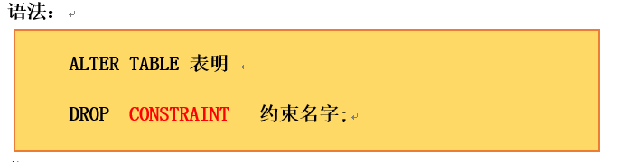

# 八、表和列


## 8.1：常用数据类型


| INT  | 使用4个字节保存整数数据 |
| ---- | ----------------------- |
|CHAR(*size*) |定长字符数据。若未指定，默认为1个字符，最大长度255|
|VARCHAR(*size*) |可变长字符数据，根据字符串实际长度保存，必须指定长度 |
|FLOAT(M,D)  |单精度，M=整数位+小数位，D=小数位。 D<=M<=255,0<=D<=30，默认M+D<=6 |
|DOUBLE(M,D)  |双精度。D<=M<=255,0<=D<=30，默认M+D<=15 |
|DATE | 日期型数据，格式’YYYY-MM-DD |
|BLOB  |二进制形式的长文本数据，最大可达4G |
|TEXT| 长文本数据，最大可达4G|


## 8.2：查询/使用tableANDdatabase


| name                         | message                                             |
| ---------------------------- | --------------------------------------------------- |
| 创建数据库                   | `create database db_name;`                          |
| 使用数据库                   | `use databases db_name;`                            |
| 查看数据库的创建语句         | `show create database db_name;`                     |
| 创建表                       | `create table db_name.tb_name (列的属性) [表选项];` |
| 查看表的结构                 | `describe tb_name;（可简写为 desc tb_name;）`       |
| 查询部分表：例如前缀为ex的表 | `show tables like 'ex_%';`                          |
| 查询所有数据库/表            | `show databases;`                                   |


## 8.3：命名规则


• 数据库名不得超过30个字符，变量名限制为29个 

• 必须只能包含 A–Z, a–z, 0–9, _共63个字符

• 不能在对象名的字符间留空格

• 必须不能和用户定义的其他对象重名

• 必须保证你的字段没有和保留字、数据库系统或常用方法冲突

• 保持字段名和类型的一致性,在命名字段并为其指定数据类型的时候一定要保证一致性。假如数据类型在一个表里是整数,那在另一个表里可就别变成字符型了


## 8.4：表操作

 

### 1.查看表:

 

```sql
  SELECT * FROM user_tables  --查看用户定义的表  
  SELECT TABLE_NAME FROM   user_tables  --查看用户定义的各种数据库对象  
  SELECT DISTINCT object_type FROM   user_objects ;  --查看用户定义的表, 视图, 同义词和序列  
  SELECT  * FROM   user_catalog ;  
```


 

### 2.创建表：

 

 ```sql
 -- 创建表的第一种方式 
 CREATE TABLE EMP1( 
     ID NUMBER(10), 
     NAME  VARCHAR2(20), 
     SALARY  NUMBER(10,2), ---表示数字一共10位两位小数 
     HIRE_DATE date  ) ;    
     SELECT * FROM EMP1;     
     -- 创建表的第二种方式  
     /*  依托已经创建的表来创建表,  而且创建出来的这个表中有依托表的数据  */ 
     CREATE TABLE EMP2 AS   SELECT EMPLOYEE_ID ID,          LAST_NAME NAME,          HIRE_DATE  FROM EMPLOYEES 
     -- 不要依托表的任何数据  
     /*  不让这个select这条语句查询出来数据  也就是使用where子句加一个不满足的条件  */  
     CREATE TABLE EMP3 AS  
     SELECT EMPLOYEE_ID ID,       
     LAST_NAME NAME,   
     HIRE_DATE 
     FROM EMPLOYEES WHERE 3=2;    
     SELECT * FROM EMP3;  
 ```


### 3.修改表名：


```sql
  -- 重命名表  
  RENAME EMP2 to  emp;  
```


 

### 4.删除表：


 ```sql
  -- 删除表 
  DROP TABLE emp3;  DROP TABLE emp2;  DROP TABLE emp1;  
 ```


### 5.清空表数据：


```sql
-- 清空表     
TRUNCATE TABLE EMP2;-- 第一种  
DELETE FROM emp2;-- 第二种  
```


### 6.引擎选择和字符集


ENGINE 设置存储引擎，CHARSET 设置编码。


## 8.5：列操作


### 1.增加列：


  ```sql
-- 增加一列  
ALTER TABLE EMP3  ADD (EMAIL VARCHAR2(20));  SELECT * FROM EMP3;  
  ```


 

### 2.修改列：


```sql
  -- 改变数据长度 
  ALTER TABLE EMP3  MODIFY (EMAIL  VARCHAR2(250));    
  -- 改变数据类型 
  ALTER TABLE EMP3  MODIFY (EMAIL  NUMBER(20));        
  -- 如果表中已经有数据的时候是改变不成表的结构,如果改变会报错ORA-01439  
```


 

### 3.删除列：


```sql
  -- 删除一行列     
  ALTER TABLE emp3 DROP COLUMN email;       
  SELECT * FROM EMP3;  
```


### 4.重命名列：


```sql
 -- 删除一行列 
ALTER TABLE emp3 RENAME COLUMN HIRE TO HIRE2 ;   
SELECT * FROM EMP3;  
```


## 8.5：约束


### 1.什么是约束


一种限制，用于限制表中的数据，为了保证表中的数据的准确和可靠性。MySQL数据库通过约束(`constraints`)防止无效的数据进入到表中，以保护数据的实体完整性。


+ 为了保证数据的一致性和完整性，SQL规范以约束的方式对表数据进行额外的条件限制。
+ 约束是表级的强制规定
+  可以在创建表时规定约束（通过 CREATE TABLE 语句），或者在表创建之后也可以（通过 ALTER TABLE 语句）


> 关键字(CONSTRAINT)：


Constraint这个关键子主要为我们的约束起一个名字，如果我们没有使用这个名字他会默认的使用sys格式来为我们的约束起名字。这个名字很关键我们在删除约束时必须用到这个约束。

SYS格式：

​                 

这个表中的name字段就是我们没有设置约束条件的结果，他会以开头为sys的格式来命名我们的约束条件。


### 2.有哪些约束


|      name       | message                                                      |
| :-------------: | ------------------------------------------------------------ |
|  **NOT NULL**   | `非空`，用于保证该字段的值不能为空。比如姓名、学号等。       |
|   **DEFAULT**   | `默认`，用于保证该字段有默认值。比如性别。                   |
| **PRIMARY KEY** | `主键`，用于保证该字段的值具有唯一性，并且非空。比如学号、员工编号等。 |
|   **UNIQUE**    | `唯一`，用于保证该字段的值具有唯一性，可以为空。比如座位号。 |
|    **CHECK**    | `检查约束`【`mysql中不支持`】。比如年龄、性别。              |
| **FOREIGN KEY** | `外键`，用于限制两个表的关系，用于保证该字段的值必须来自于主<br/>表的关联列的值。在从表添加外键约束，用于引用主表中某列的值。<br/>比如学生表的专业编号，员工表的部门编号，员工表的工种编号。 |


> 注意： MySQL不支持`check`约束，但可以使用check约束，而没有任何效果；具体细节可以参阅W3Cschool手册


### 3.约束的分类


> + **根据约束数据列的限制，约束可分为：**
>   +  **单列约束：每个约束只约束一**
>   + **多列约束：每个约束可约束多列数据**
>
> + **根据约束的作用范围，约束可分为：**
>   + **列级约束只能作用在一个列上，跟在列的定义后面**
>   + **表级约束可以作用在多个列上，不与列一起，而是单独定义**


### 4.NOT NULL约束


> ##### 是什么


+ 非空约束用于确保当前列的值不为空值，非空约束只能出现在表对象的列上。

+ Null类型特征：

  + 所有的类型的值都可以是null，包括int、float等数据类型
  + 空字符串””不等于null，0也不等于null

  


> ##### 添加唯一约束


```sql
create table test3(
	id INT(11) NOT NULL,
	name INT(1) NOT NULL,
	age VARCHAR(100) NOT NULL
);
```


### 5.UNIQUE  约束


> ##### 是什么


+ 同一个表可以有多个唯一约束，多个列组合的约束。

+ 在创建唯一约束的时候，如果不给唯一约束名称，就默认和列名相同。

+ MySQL会给唯一约束的列上默认**创建一个唯一索引**

+ 唯一约束，允许出现多个空值：NULL。


> ##### 使用唯一约束


```sql
CREATE TABLE TEST4(
	id INT(11) UNIQUE,
	name INT(1) UNIQUE,
	age VARCHAR(100) UNIQUE
);
```


### 6.PRIMARY KEY 约束


> ### 是什么


+ 主键约束相当于唯一约束+非空约束的组合，主键约束列不允许重复，也不允许出现空值
+ 如果是多列组合的主键约束，那么这些列都不允许为空值，并且组合的值不允许重复。
+  每个表最多只允许一个主键，建立主键约束可以在列级别创建，也可以在表级别上创建。
+  MySQL的主键名总是PRIMARY，当创建主键约束时，系统默认会在所在的列和列组合上建立对应的唯一索引


> ### 使用主键约束


```sql
CREATE TABLE TEST5(
	id INT(11) UNIQUE PRIMARY KEY,
	name INT(1) UNIQUE,
	age VARCHAR(100) UNIQUE
);
```


### 7.FOREIGN KEY 约束


> ### 是什么


+ 外键约束是保证一个或两个表之间的参照完整性，外键是构建于一个表的两个字段或是两个表的两个字段之间的参照关系。

+  从表的外键值必须在主表中能找到或者为空。当主表的记录被从表参照时，主表的记录将不允许删除，如果要删除数据，需要先删除从表中依赖该记录的数据，然后才可以删除主表的数据。

+ 还有一种就是级联删除子表数据。

+  注意：外键约束的参照列，在主表中引用的只能是主键或唯一键约束的列

+ 同一个表可以有多个外键约束


> ### 使用外键约束


```sql
CREATE TABLE TEST6p(
	id INT(11) UNIQUE PRIMARY KEY,
	name INT(1) UNIQUE,
	age VARCHAR(100) UNIQUE
);
CREATE TABLE TEST6f(
	id INT(11) UNIQUE PRIMARY KEY,
	name INT(1) UNIQUE ,
	age VARCHAR(100) UNIQUE,
	FOREIGN KEY (name) REFERENCES TEST6p(name)
);
```


### 8.CHECK 约束


• MySQL可以使用check约束，但check约束对数据验证没有任何作用,添加数据时，没有任何错误或警告

```sql
CREATE TABLE temp(
id INT AUTO_INCREMENT,
NAME VARCHAR(20),
age INT CHECK(age > 20),
PRIMARY KEY(id)
);
```


### 9.DEFAULT约束


用于保证该字段有默认值。比如性别。


```sql
CREATE TABLE temp(
id INT DEFAULT 0,
NAME VARCHAR(20) DEFAULT 'ADMIN',
age INT DEFAULT 20
);
```


### 10.主键自增


又称为标识符，可以不用手动的插入值，系统提供默认的序列值。


```sql
CREATE TABLE temp4 ( 
		id INT AUTO_INCREMENT PRIMARY KEY, 
		NAME VARCHAR ( 20 ), 
		age INT CHECK ( age > 20 )
);
INSERT INTO temp4(NAME,age) VALUES('1',1);
INSERT INTO temp4(NAME,age) VALUES('1',1);
INSERT INTO temp4(NAME,age) VALUES('1',1);
SELECT * FROM temp4;
```


## 8.6：添加约束的时机


### 1. 添加或删除约束


上面的几种方式都是我们在创建表的时候创建的约束，可是如果我们没有在创建表的时候为某一个字段添加约束时，那么我们就需要对这个字段添加约束，或者我们创建的约束不符合条件的时候，我们就要对这个约束进行删除，特别注意约束是不可以修改的只能删除和添加


### 2.用到的表：

 

```sql
  CREATE TABLE test6(    id number(20) CONSTRAINT test6_id_pk PRIMARY key,    name VARCHAR2(30),    age number(2) ,    salay number(10,2)  )  
```


### 3.添加约束：


添加约束使用的关键是ALTER

​             


```sql
-- 添加约束
ALTER TABLE test6 MODIFY(name VARCHAR2(30) NOT NULL);
-- 或者
ALTER TABLE test6 add(CONSTRAINT TEST6_salay_uinque UNIQUE(salay));
 -- 测试
 INSERT INTO test6 VALUES(1,null,20,2000);
```

 

### 4.删除约束


​        删除约束使用的关键是ALTER ..DROP CONSTRAINT 



```sql
-- 删除约束
ALTER TABLE test6 DROP CONSTRAINT test6_age_notnull;
 INSERT INTO test6 VALUES(2,'小明',NULL,2000);
 -- 测试
 SELECT * FROM test6;
```


 

### 5. 查询约束(了解)


代码：

```sql
  --查询定义的约束 
  SELECT 
  constraint_name,  constraint_type, 
  search_condition  
  FROM 
  user_constraints  WHERE  table_name  = 'EMPLOYEES';     
  --查询定义约束的列  
  SELECT 
  constraint_name,  column_name 
  FROM  
  user_cons_columns  WHERE  table_name  = 'EMPLOYEES';  
```


