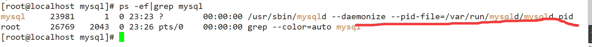

# 一、高级篇简介


## 1.1：简介


 

+ MySQL是一个关系型数据库管理系统，由瑞典MySQL AB公司开发，目前属于Oracle公司。 
+ MySQL是一种关联数据库管理系统，将数据保存在不同的表中，而不是将所有数据放在一个大仓库内，这样就增加了速度并提高了灵活性。
+ Mysql是开源的，所以你不需要支付额外的费用。
+ Mysql是可以定制的，采用了GPL协议，你可以修改源码来开发自己的Mysql系统。 
+ Mysql支持大型的数据库。可以处理拥有上千万条记录的大型数据库。
+ MySQL使用标准的SQL数据语言形式。
+ Mysql可以允许于多个系统上，并且支持多种语言。这些编程语言包括C、C++、Python、Java、Perl、PHP、Eiffel、Ruby和Tcl等。
+ MySQL支持大型数据库，支持5000万条记录的数据仓库，32位系统表文件最大可支持4GB，64位系统支持最大的表文件为8TB。

 

## 1.2：mysql5.7安装


### 1.下载


http://dev.mysql.com/downloads/mysql/


### 2.拷贝&解压缩


### 3.检查是否安装过mysql


CentOS6


```sh
rpm -qa|grep mysql
```


如果存在mysql-libs的旧版本包如下：


请先执行卸载命令：


```shell
rpm -e --nodeps  mysql-libs
```


CentOS7

```shell
rpm -qa|grep mariadb
```

 

如果存在如下：

请先执行卸载命令：

```shell
rpm -e --nodeps  mariadb-libs
```


### 4.检查当前mysql依赖环境


执行安装命令前，先执行查询命令


```shell
 rpm -qa|grep libaio
```


如果存在libaio包如下：·


```shell
 rpm -qa|grep net-tools
```


如果不存在需要到centos安装盘里进行rpm安装


### 5.检查/tmp文件夹权限


由于mysql安装过程中，会通过mysql用户在/tmp目录下新建tmp_db文件，所以请给/tmp较大的权限
执行 ：

```shell
chmod -R 777 /tmp
```


### 6.安装


```shell
# 在mysql的安装文件目录下执行：（必须按照顺序执行）
rpm -ivh mysql-community-common-5.7.16-1.el7.x86_64.rpm 
rpm -ivh mysql-community-libs-5.7.16-1.el7.x86_64.rpm
rpm -ivh mysql-community-client-5.7.16-1.el7.x86_64.rpm 
rpm -ivh mysql-community-server-5.7.16-1.el7.x86_64.rpm
```


如在检查工作时，没有检查mysql依赖环境在安装mysql-community-server会报错


### 7.查看安装版本


```shell
  mysql --version
 mysqladmin --version
```


 执行 mysqladmin --version命令，类似java -version如果打出消息，即为成功。


### 8.mysql服务初始化


为了保证数据库目录为与文件的所有者为 mysql 登陆用户，如果你是以 root 身份运行 mysql 服务，需要执行下面的命令初始化

```shell
mysqld --initialize --user=mysql
```


另外` --initialize `选项默认以“安全”模式来初始化，则会为 root 用户生成一个密码并将该密码标记为过期，登陆后你需要设置一个新的密码.


### 9.查看密码


```shell
cat /var/log/mysqld.log
```


### 10.服务启动/关闭


 启动：


```shell
systemctl start mysqld.service
```


关闭：


```shell
systemctl stop mysqld.service
```


### 11.首次登录


首次登陆通过 mysql -uroot -p进行登录，在Enter password：录入初始化密码


### 12.修改密码


```sql
ALTER USER 'root'@'localhost' IDENTIFIED BY 'root'; 
```


置完密码就可以用新密码登陆，正常使用数据库了


### 13.查看安装位置


在linux下查看安装目录 

```shell
ps -ef|grep mysql
```





### 14.自启动mysql服务


查看mysql是否自启动（默认自启动）


```shell
systemctl list-unit-files|grep mysqld.service 
```


如不是enabled可以运行如下命令设置自启动


```shell
systemctl enable mysqld.sercice
```


### 15.修改字符集


mysql5.7

直接插入中文数据报错。 

 1、修改配置文件：  

```shell
vim  /etc/my.cnf
```

在最后加上中文字符集配置

```ini
character_set_server=utf8
```

+  2、重新启动mysql

+  3、已生成的库表字符集如何变更
   修改数据库的字符集

  ```mysql
  mysql> alter database mydb character set 'utf8';
  ```

  修改数据表的字符集

  ```mysql
  mysql> alter table mytbl convert to  character set 'utf8';
  ```

  


