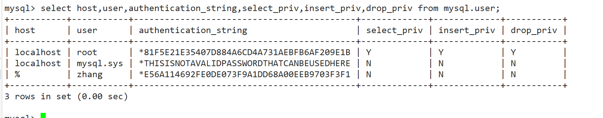

# 二、用户与权限管理


## 2.1：创建用户


创建用户


```mysql
create user zhang identified by '123123';
```


表示创建名称为`zhang`的用户，密码设为`123123`；


## 2.2：user表了解


```mysql
-- 查看用户
select host,user,authentication_string,select_priv,insert_priv,drop_priv from mysql.user;
```





| name                        | message                                                      |
| --------------------------- | ------------------------------------------------------------ |
| host                        | % 表示所有远程通过 TCP方式的连接<br/>IP 地址 如 (192.168.1.2,127.0.0.1) 通过制定ip地址进行的TCP方式的连接<br/> 机器名   通过制定i网络中的机器名进行的TCP方式的连接<br/>::1   IPv6的本地ip地址  等同于IPv4的 127.0.0.1<br/> localhost 本地方式通过命令行方式的连接 ，比如mysql -u xxx -p 123xxx 方式的连接。 |
| User                        | 表示用户名<br/>       同一用户通过不同方式链接的权限是不一样的。 |
| password                    | 密码所有密码串通过 password(明文字符串) 生成的密文字符串。加密算法为MYSQLSHA1 ，不可逆 。<br/>     mysql 5.7 的密码保存到 authentication_string 字段中不再使用password 字段。 |
| select_priv , insert_priv等 | 为该用户所拥有的权限                                         |


## 2.3：修改密码


```mysql
#修改当前用户的密码:
set password =password('123456')
#修改某个用户的密码:
update mysql.user set password=password('123456') where user='li4';
flush privileges;   #所有通过user表的修改，必须用该命令才能生效。
```


## 2.4：修改用户


```mysql
# 修改用户名：
update mysql.user set user='li4' where user='wang5';
flush privileges;   #所有通过user表的修改，必须用该命令才能生效。
```


## 2.5：删除用户


```mysql
drop user li4 ;
```


不要通过delete from  user u where user='li4' 进行删除，系统会有残留信息保留。


## 2.6：查看权限


```mysql
-- 查看当前用户权限
show grants;
 
-- 查看某用户的全局权限
select  * from user ;
 
-- 查看某用户的某个表的权限
select * from tables_priv;
```


## 2.7：增加删除权限


```mysql
# 授权命令： 
grant 权限1,权限2,…权限n on 数据库名称.表名称 to 用户名@用户地址 identified by ‘连接口令’;
该权限如果发现没有该用户，则会直接新建一个用户。
# 比如  
grant select,insert,delete,drop on atguigudb.* to li4@localhost  ;
 #给li4用户用本地命令行方式下，授予atguigudb这个库下的所有表的插删改查的权限。
 
grant all privileges on *.* to joe@'%'  identified by '123'; 
#授予通过网络方式登录的的joe用户 ，对所有库所有表的全部权限，密码设为123.


#查看当前用户权限
show grants;
 
#收回权限命令： 
revoke  权限1,权限2,…权限n on 数据库名称.表名称  from  用户名@用户地址 ;
 
REVOKE ALL PRIVILEGES ON mysql.* FROM joe@localhost;
#收回全库全表的所有权限
 
REVOKE select,insert,update,delete ON mysql.* FROM joe@localhost;
#收回mysql库下的所有表的插删改查权限
 

```


 必须用户重新登录后才能生效


## 2.8：远程链接


1、先 ping 一下数据库服务器的ip 地址确认网络畅通。

2、关闭数据库服务的防火墙

```shell
    service iptables stop
```

3、 确认Mysql中已经有可以通过远程登录的账户

```mysql
    select  * from mysql.user where user='li4' and host='%';
```

如果没有用户,先执行如下命令：

```shell
grant all privileges on *.*  to li4@'%'  identified by '123123';
```


