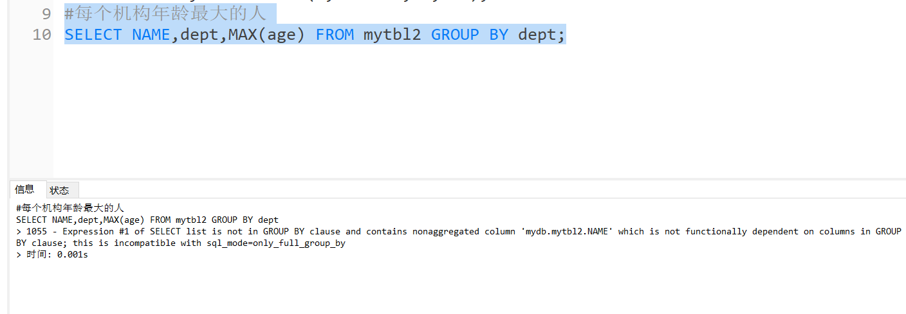

# 三、sql_mode


## 3.1：是什么


> #### sql_mode是个很容易被忽视的变量，默认值是空值，在这种设置下是可以允许一些非法操作的，比如允许一些非法数据的插入。在生产环境必须将这个值设置为严格模式，所以开发、测试环境的数据库也必须要设置，这样在开发测试阶段就可以发现问题。


## 3.2：测试


### 1.导入数据


```mysql
CREATE database mydb;
USE mydb;
CREATE TABLE mytbl2 (id INT,NAME VARCHAR(200),age INT,dept INT);
INSERT INTO mytbl2 VALUES(1,'zhang3',33,101);
INSERT INTO mytbl2 VALUES(2,'li4',34,101);
INSERT INTO mytbl2 VALUES(3,'wang5',34,102);
INSERT INTO mytbl2 VALUES(4,'zhao6',34,102);
INSERT INTO mytbl2 VALUES(5,'tian7',36,102);
```


### 2.测试数据


```mysql
#每个机构年龄最大的人
SELECT NAME,dept,MAX(age) FROM mytbl2 GROUP BY dept;
```

会报错，这里。但是mysql5.5会出现数据，这个地方就是sqlmodel




## 3.3：sql_model常用属性


```mysql
set sql_mode='ORACLE,ONLY_FULL_GROUP_BY,NO_AUTO_VALUE_ON_ZERO,STRICT_TRANS_TABLES,NO_ZERO_IN_DATE,NO_ZERO_DATE,ERROR_FOR_DIVISION_BY_ZERO,NO_AUTO_CREATE_USER,NO_ENGINE_SUBSTITUTION,PIPES_AS_CONCAT,ANSI_QUOTES';
```


| NAME                       | MESSAGE                                                      |
| -------------------------- | ------------------------------------------------------------ |
| ONLY_FULL_GROUP_BY         | 对于GROUP BY聚合操作，如果在SELECT中的列，没有在GROUP BY中出现，那么这个SQL是不合法的，因为列不在GROUP BY从句中 |
| NO_AUTO_VALUE_ON_ZERO      | 该值影响自增长列的插入。默认设置下，插入0或NULL代表生成下一个自增长值。如果用户 希望插入的值为0，而该列又是自增长的，那么这个选项就有用了。 |
| STRICT_TRANS_TABLES        | 在该模式下，如果一个值不能插入到一个事务表中，则中断当前的操作，对非事务表不做限制 |
| NO_ZERO_IN_DATE            | 在严格模式下，不允许日期和月份为零                           |
| NO_ZERO_DATE               | 设置该值，mysql数据库不允许插入零日期，插入零日期会抛出错误而不是警告。 |
| ERROR_FOR_DIVISION_BY_ZERO | 在INSERT或UPDATE过程中，如果数据被零除，则产生错误而非警告。如 果未给出该模式，那么数据被零除时MySQL返回NULL |
| NO_AUTO_CREATE_USER        | 禁止GRANT创建密码为空的用户                                  |
| NO_ENGINE_SUBSTITUTION     | 如果需要的存储引擎被禁用或未编译，那么抛出错误。不设置此值时，用默认的存储引擎替代，并抛出一个异常 |
| PIPES_AS_CONCAT            | 将"\|\|"视为字符串的连接操作符而非或运算符，这和Oracle数据库是一样的，也和字符串的拼接函数Concat相类似 |
| ANSI_QUOTES                | 启用ANSI_QUOTES后，不能用双引号来引用字符串，因为它被解释为识别符 |
| ORACLE                     | 设置等同：PIPES_AS_CONCAT, ANSI_QUOTES, IGNORE_SPACE, NO_KEY_OPTIONS, NO_TABLE_OPTIONS, NO_FIELD_OPTIONS, NO_AUTO_CREATE_USER. |


## 3.4：测试的正确答案


上面语句是错的
 group by使用原则：select 后面只能放 函数 和group by后的字段

```mysql
1、每个机构最大年龄 2、的人
SELECT * FROM mytbl2 m INNER JOIN(
SELECT dept,MAX(age)maxage FROM mytbl2 GROUP BY dept
)ab ON ab.dept=m.dept AND m.age=ab.maxage
```


