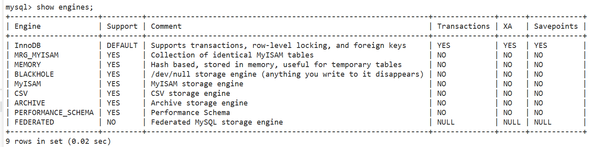
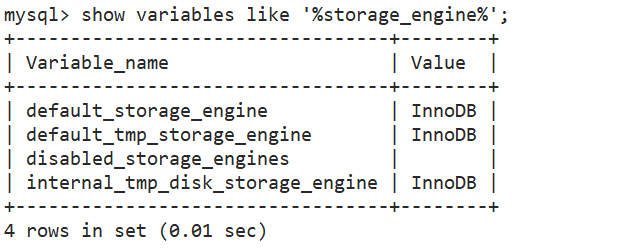

# 五、Mysql存储引擎


## 5.1：存储引擎相关命令


查看存储引擎：


```sql
show engines;
```





看你的mysql当前默认的存储引擎:


```sql
show variables like '%storage_engine%';
```





## 5.2：各种数据引擎简介


| name           | message                                                      |
| -------------- | ------------------------------------------------------------ |
| InnoDB存储引擎 | InnoDB是MySQL的默认事务型引擎，它被设计用来处理大量的短期(short-lived)事务。除非有非常特别的原因需要使用其他的存储引擎，否则应该优先考虑InnoDB引擎。 |
| MyISAM存储引擎 | MyISAM提供了大量的特性，包括全文索引、压缩、空间函数(GIS)等，但MyISAM不支持事务和行级锁，有一个毫无疑问的缺陷就是崩溃后无法安全恢复。 |
| Archive引擎    | Archive档案存储引擎只支持INSERT和SELECT操作，在MySQL5.1之前不支持索引。<br/>Archive表适合日志和数据采集类应用。<br/>根据英文的测试结论来看，Archive表比MyISAM表要小大约75%，比支持事务处理的InnoDB表小大约83%。 |
| Blackhole引擎  | Blackhole引擎没有实现任何存储机制，它会丢弃所有插入的数据，不做任何保存。但服务器会记录Blackhole表的日志，所以可以用于复制数据到备库，或者简单地记录到日志。但这种应用方式会碰到很多问题，因此并不推荐。 |
| CSV引擎        | CSV引擎可以将普通的CSV文件作为MySQL的表来处理，但不支持索引。<br/>CSV引擎可以作为一种数据交换的机制，非常有用。<br/>CSV存储的数据直接可以在操作系统里，用文本编辑器，或者excel读取。 |
| Memory引擎     | 如果需要快速地访问数据，并且这些数据不会被修改，重启以后丢失也没有关系，那么使用Memory表是非常有用。Memory表至少比MyISAM表要快一个数量级。 |
| Federated引擎  | Federated引擎是访问其他MySQL服务器的一个代理，尽管该引擎看起来提供了一种很好的跨服务器的灵活性，但也经常带来问题，因此默认是禁用的。 |


## 5.3：MyISAM和InnoDB

 

| 对比项 | MyISAM | InnoDB |
| ------ | ------ | ------ |
|外键	|不支持|	支持|
|事务	|不支持|支持|
|行表锁	|表锁，即使操作一条记录也会锁住整个表，不适合高并发的操作|	行锁,操作时只锁某一行，不对其它行有影响，适合高并发的操作|
|缓存	|只缓存索引，不缓存真实数据| 不仅缓存索引还要缓存真实数据，对内存要求较高，而且内存大小对性能有决定性的影响 |
|关注点	|节省资源、消耗少、简单业务| 并发写、事务、更大资源 |
|默认安装	|Y| Y |
|默认使用	|N| Y |
|自带系统表使用	|Y| N |


> ### 表锁会出现死锁，行锁不会出现死锁


我们选择场景来使用他们：例如我们写数据的时候要用innodb因为他有事务，但是myISAM没有

**看业务场景**如果并发高的使用我们使用innodb，但是并发低的时候我们使用mysam


