# 六、索引

## 6.1：是什么

### 1.看一个例子

在数据之外，数据库系统还维护着满足特定查找算法的数据结构，这些数据结构以某种方式引用（指向）数据，
这样就可以在这些数据结构上实现高级查找算法。这种数据结构，就是索引。下图就是一种可能的索引方式示例：


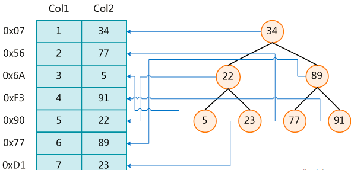


左边是数据表，一共有两列七条记录，最左边的是数据记录的物理地址
为了加快Col2的查找，可以维护一个右边所示的二叉查找树，每个节点分别包含索引键值和一个指向对应数据记录物理地址的指针，这样就可以运用二叉查找在一定的复杂度内获取到相应数据，从而快速的检索出符合条件的记录。

### 2.简介

索引的目的在于提高查询效率，可以类比字典，如果要查“mysql”这个单词，我们肯定需要定位到m字母，然后从下往下找到y字母，再找到剩下的sql。如果没有索引，那么你可能需要a----z，如果我想找到Java开头的单词呢？或者Oracle开头的单词呢？是不是觉得如果没有索引，这个事情根本无法完成？


> ##### 索引是一种数据结构,可以帮助我们快速的进行数据的查找.
>
> 一般来说索引本身也很大，不可能**全部存储在内存**中，因此索引往往以**索引文件的形式存储的磁盘上**

## 6.2：优缺点

### 1.优点

**1.通过创建唯一性索引，可以保证数据库表中每一行`数据的唯一性`。**

**2.可以大大`加快数据的检索速度`，这也是创建索引的最主要的原因。**

**3.可以`加速表和表之间的连接`，特别是在实现数据的参考完整性方面特别有意义。**

**4.在使用分组和排序子句进行数据检索时，同样可以显著`减少查询中分组和排序的时间。`**

**5.通过使用索引，可以在查询的过程中，使用优化隐藏器，`提高系统的性能`。**

### 2.缺点：

**1.创建索引和维护索引要`耗费时间`，这种时间随着数据量的增加而增加。**

**2.索引需要占物理空间，除了数据表占数据空间之外，每一个索引还要`占一定的物理空间`，如果要建立聚集索引那么需要的空间就会更大。
**

**3.当对表中的数据进行增加、删除和修改的时候，索引也要动态的维护，这样就降低了`数据的维护速度`。**

### 3.注意

> **因为索引非常占内存，所以索引也需要谨慎添加，那些字段需要索引。**

## 6.3：索引是什么数据结构

### 1.前言

> ##### 索引的数据结构和具体存储引擎的实现有关, 在MySQL中使用较多的索引有`Hash`索引,`B+树`索引等,而我们经常使用的`InnoDB`存储引擎的默认索引实现为:`B+树索引`.

### 2.二叉树为什么不行

对数据的加速检索，首先想到的就是二叉树，二叉树的查找时间复杂度可以达到O(log2(n))。下面看一下二叉树的存储结构：


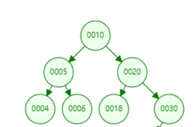


二叉树搜索相当于一个二分查找。二叉查找能大大提升查询的效率，但是它有一个问题：二叉树以第一个插入的数据作为根节点，如上图中，如果只看右侧，就会发现，就是一个线性链表结构。如果我们现在的数据只包含1,
2, 3, 4，就会出现


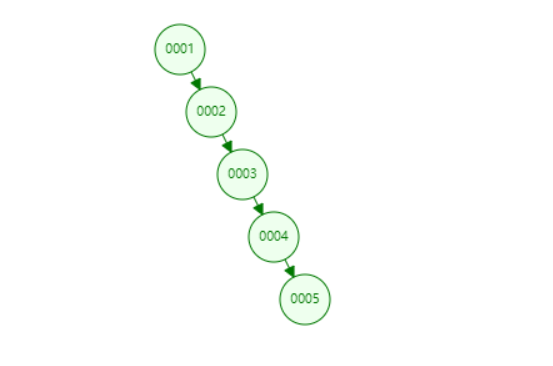

如果我们要查询的数据为4，则需要遍历所有的节点才能找到4，即，相当于全表扫描，就是由于存在这种问题，所以二叉查找树不适合用于作为索引的数据结构。

### 3.平衡二叉树为什么不可行

为了解决二叉树存在线性链表的问题，会想到用平衡二叉查找树来解决。下面看看平衡二叉树是怎样的：


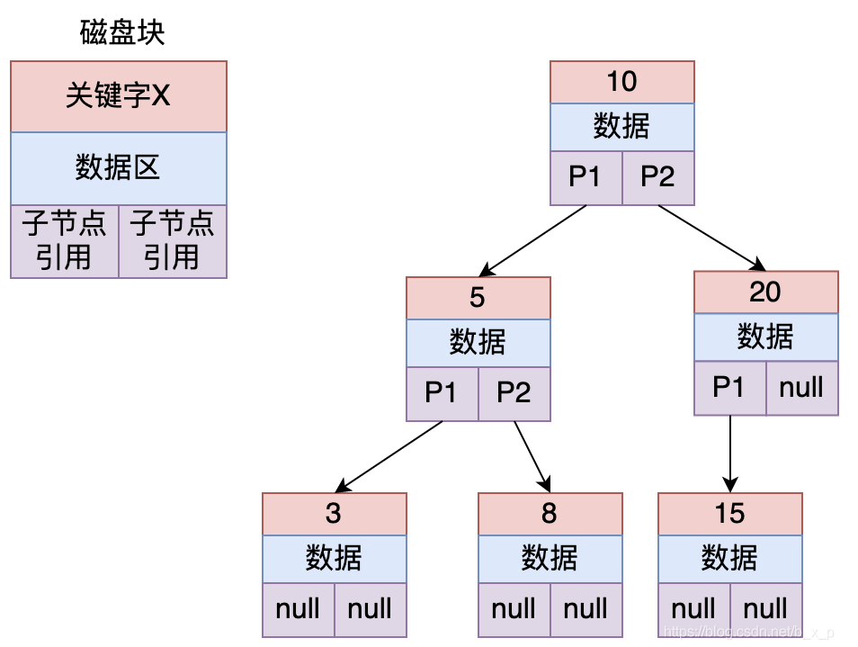


平衡二叉查找树定义为：节点的子节点高度差不能超过1,如上图中的节点20，左节点高度为1，右节点高度0，差为1，所以上图没有违反定义，它就是一个平衡二叉树。保证二叉树平衡的方式为左旋，右旋等操作，至于如何左旋右旋，可以自行去搜索相关的知识。

如果上图中平衡二叉树保存的是id索引，现在要查找id = 8的数据，过程如下：

1. 把根节点加载进内存，用8和10进行比较，发现8比10小，继续加载10的左子树。
2. 把5加载进内存，用8和5比较，同理，加载5节点的右子树。
3. 此时发现命中，则读取id为8的索引对应的数据。

索引保存数据的方式一般有两种：

- 数据区保存id 对应行数据的所有数据具体内容。
- 数据区保存的是真正保存数据的磁盘地址。

到这里，平衡二叉树解决了存在线性链表的问题，数据查询的效率好像也还可以，基本能达到O(log2(n))，
那为什么mysql不选择平衡二叉树作为索引存储结构，他又存在什么样的问题呢？

1.
搜索效率不足。一般来说，在树结构中，数据所处的深度，决定了搜索时的IO次数（MySql中将每个节点大小设置为一页大小，一次IO读取一页 /
一个节点）。如上图中搜索id = 8的数据，需要进行3次IO。当数据量到达几百万的时候，树的高度就会很恐怖。
2. 查询不不稳定。如果查询的数据落在根节点，只需要一次IO，如果是叶子节点或者是支节点，会需要多次IO才可以。
3. 存储的数据内容太少。没有很好利用操作系统和磁盘数据交换特性，也没有利用好磁盘IO的预读能力。因为操作系统和磁盘之间一次数据交换是以页为单位的，一页大小为
   4K，即每次IO操作系统会将4K数据加载进内存。但是，在二叉树每个节点的结构只保存一个关键字，一个数据区，两个子节点的引用，并不能够填满4K的内容。幸幸苦苦做了一次的IO操作，却只加载了一个关键字。在树的高度很高，恰好又搜索的关键字位于叶子节点或者支节点的时候，取一个关键字要做很多次的IO。

那有没有一种结构能够解决二叉树的这种问题呢？有，那就是多路平衡查找树。

### 4.B Tree

B Tree 是一个绝对平衡树，所有的叶子节点在同一高度，如下图所示：

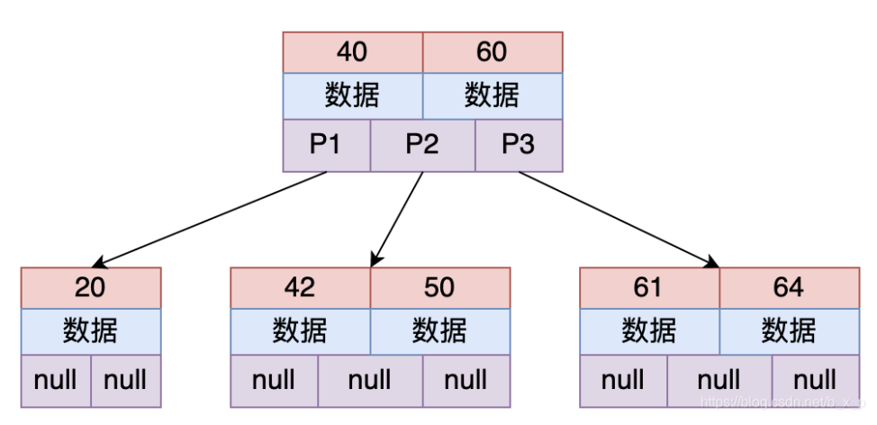


上图为一个2-3树（每个节点存储2个关键字，有3路），多路平衡查找树也就是多叉的意思，从上图中可以看出，每个节点保存的关键字的个数和路数关系为：关键字个数 =
路数 – 1。

假设要从上图中查找id = X的数据，B TREE 搜索过程如下：

1. **取出根磁盘块，加载40和60两个关键字。**
2. **如果X等于40，则命中；如果X小于40走P1；如果40 < X < 60走P2；如果X = 60，则命中；如果X > 60走P3。**
3. **根据以上规则命中后，接下来加载对应的数据， 数据区中存储的是具体的数据或者是指向数据的指针。**

为什么说这种结构能够解决平衡二叉树存在的问题呢？

B Tree 能够很好的利用操作系统和磁盘的交互特性，
MySQL为了很好的利用磁盘的预读能力，将页大小设置为16K，即将一个节点（磁盘块）的大小设置为16K，一次IO将一个节点（16K）内容加载进内存。这里，假设关键字类型为
int，即4字节，若每个关键字对应的数据区也为4字节，不考虑子节点引用的情况下，则上图中的每个节点大约能够存储（16 * 1000）/ 8 =
2000个关键字，共2001个路数。对于二叉树，三层高度，最多可以保存7个关键字，而对于这种有2001路的B树，三层高度能够搜索的关键字个数远远的大于二叉树。

这里顺便说一下：在B
Tree保证树的平衡的过程中，每次关键字的变化，都会导致结构发生很大的变化，这个过程是特别浪费时间的，所以创建索引一定要创建合适的索引，而不是把所有的字段都创建索引，创建冗余索引只会在对数据进行新增，删除，修改时增加性能消耗。

### 5.B+Tree

B+Tree是B Tree的一个变种，在B+Tree中，B树的路数和关键字的个数的关系不再成立了，数据检索规则采用的是左闭合区间，路数和关键个数关系为1比1，具体如下图所示：


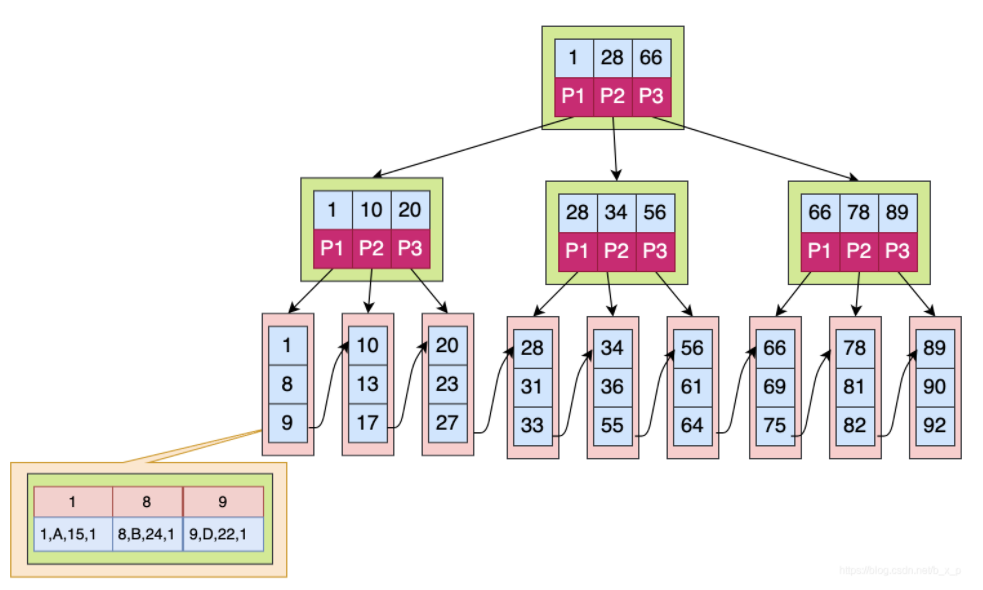

如果上图中是用ID做的索引，如果是搜索X = 1的数据，搜索规则如下：

1. 取出根磁盘块，加载1，28，66三个关键字。
2. X <= 1 走P1，取出磁盘块，加载1，10，20三个关键字。
3. X <= 1 走P1，取出磁盘块，加载1，8，9三个关键字。
4. 已经到达叶子节点，命中1，接下来加载对应的数据，图中数据区中存储的是具体的数据。

### 6.B TREE和B+TREE区别是什么？

1. B+Tree
   关键字的搜索采用的是左闭合区间，之所以采用左闭合区间是因为他要最好的去支持自增id，这也是mysql的设计初衷。即，如果id =
   1命中，会继续往下查找，直到找到叶子节点中的1。
2. B+Tree 根节点和支节点没有数据区，关键字对应的数据只保存在叶子节点中。即只有叶子节点中的关键字数据区才会保存真正的数据内容或者是内容的地址。而在B树种，如果根节点命中，则会直接返回数据。
3. 在B+Tree中，叶子节点不会去保存子节点的引用。
4. B+Tree叶子节点是顺序排列的，并且相邻的节点具有顺序引用的关系，如上图中叶子节点之间有指针相连接。

### 7.MySQL为什么最终要去选择B+Tree？

1. B+Tree是B TREE的变种，B TREE能解决的问题，B+TREE也能够解决（降低树的高度，增大节点存储数据量）
2. B+Tree扫库和扫表能力更强。如果我们要根据索引去进行数据表的扫描，对B
   TREE进行扫描，需要把整棵树遍历一遍，而B+TREE只需要遍历他的所有叶子节点即可（叶子节点之间有引用）。
3. B+TREE磁盘读写能力更强。他的根节点和支节点不保存数据区，所以根节点和支节点同样大小的情况下，保存的关键字要比B
   TREE要多。而叶子节点不保存子节点引用，能用于保存更多的关键字和数据。所以，B+TREE读写一次磁盘加载的关键字比B TREE更多。
4. B+Tree排序能力更强。上面的图中可以看出，B+Tree天然具有排序功能。
5. B+Tree查询性能稳定。B+Tree数据只保存在叶子节点，每次查询数据，查询IO次数一定是稳定的。当然这个每个人的理解都不同，因为在B
   TREE如果根节点命中直接返回，确实效率更高。

## 6.4：索引怎么储存

### 1.简介

```sql
SHOW VARIABLES LIKE '%datadir%';
```

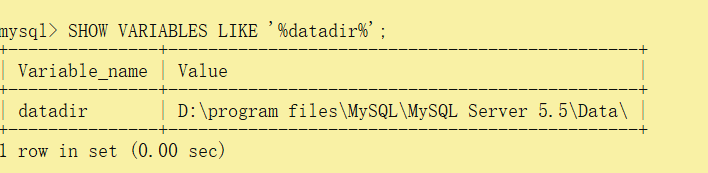


入到这个目录下，这个目录下保存的是所有数据库，再进入到具体的一个数据库目录下。就能够看到MySQL存储数据和索引的文件了。

这里我创建了两张表，test1和test2，分别指定索引为innodb和myisam。对于每张表，MySQL会创建相应的文件保存数据和索引，具体如下：

```sql
DROP TABLE IF EXISTS `test1`;
CREATE TABLE `test1`  (
  `id` int(11) NOT NULL AUTO_INCREMENT,
  `name` tinytext CHARACTER SET utf8 COLLATE utf8_general_ci NULL,
  PRIMARY KEY (`id`) USING BTREE
) ENGINE = INNODB AUTO_INCREMENT = 1 CHARACTER SET = utf8 COLLATE = utf8_general_ci ROW_FORMAT = Dynamic;
DROP TABLE IF EXISTS `test2`;
CREATE TABLE `test2`  (
  `id` int(11) NOT NULL AUTO_INCREMENT,
  `name` tinytext CHARACTER SET utf8 COLLATE utf8_general_ci NULL,
  PRIMARY KEY (`id`) USING BTREE
) ENGINE = MyISAM AUTO_INCREMENT = 1 CHARACTER SET = utf8 COLLATE = utf8_general_ci ROW_FORMAT = Dynamic;
```

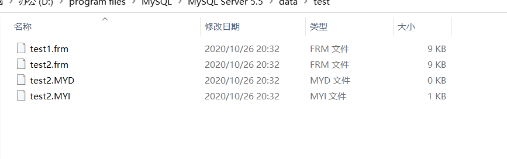

从图中可以看出：

- MYISAM存储引擎存储数据库数据，一共有三个文件：
  Frm：表的定义文件。
  MYD：数据文件，所有的数据保存在这个文件中。
  MYI：索引文件。
- Innodb存储引擎存储数据库数据，一共有两个文件(没有专门保存数据的文件)：
  Frm文件： 表的定义文件。
  Ibd文件：数据和索引存储文件。数据以主键进行聚集存储，把真正的数据保存在叶子节点中。

### 2.MyISAM存储引擎

说明：为了画图简便，下面部分图使用[在线数据结构工具](https://www.cs.usfca.edu/~galles/visualization/Algorithms.html)
进行组织数据，组织的B+Tree为右闭合区间，但不影响理解存储引擎数据存储结构。

在MYISAM存储引擎中，数据和索引的关系如下：


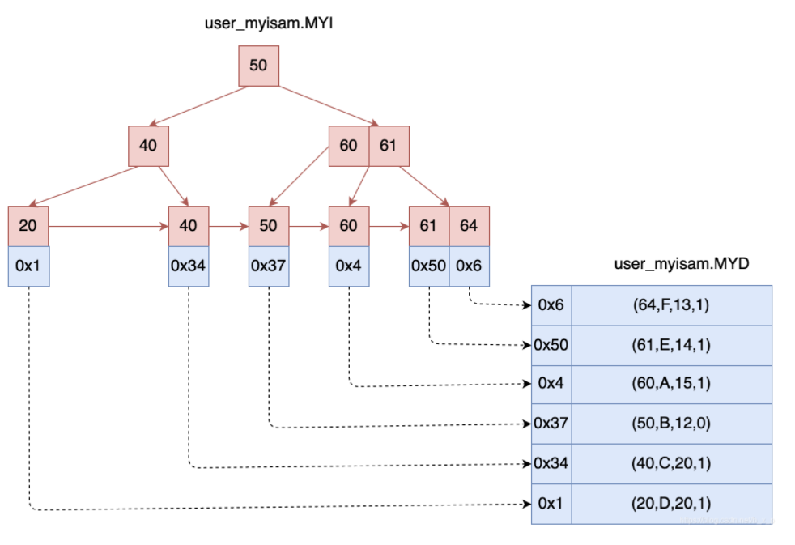

如何查找数据的呢？
如果要查询id = 40的数据：先根据MyISAM索引文件（如上图左）去找id =
40的节点，通过这个节点的数据区拿到真正保存数据的磁盘地址，再通过这个地址从MYD数据文件（如上图右）中加载对应的记录。

如果有多个索引，表现形式如下：

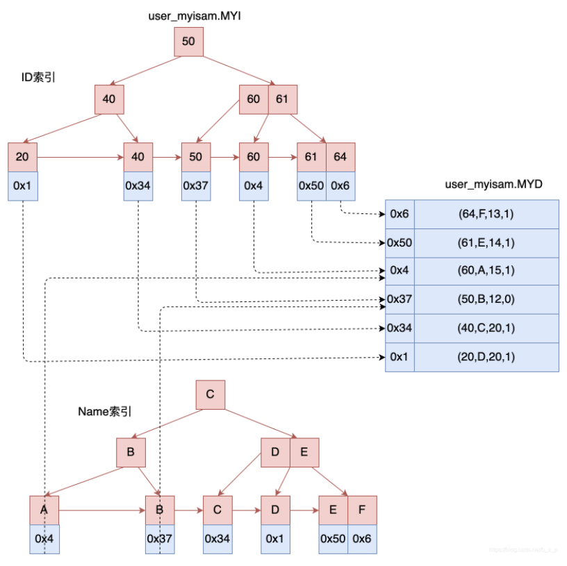


所以在MYISAM存储引擎中，主键索引和辅助索引是同级别的，没有主次之分。

### 3.Innodb存储引擎

Innodb主键索引为聚集索引，首先简单理解一下聚集索引的概念：数据库表行中数据的物理顺序和键值的逻辑顺序相同。Innodb以主键索引来聚集组织数据的存储，下面看看Innodb是如何组织数据的。

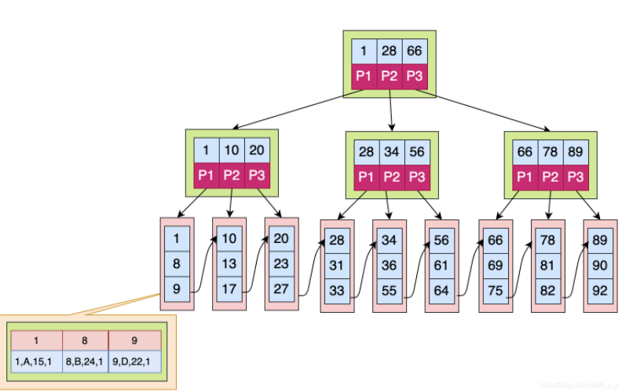


**如上图中，叶子节点的数据区保存的就是真实的数据，在通过索引进行检索的时候，命中叶子节点，就可以直接从叶子节点中取出行数据。
**

mysql5.5版本之前默认采用的是MyISAM引擎，5.5之后默认采用的是innodb引擎。

在innodb中，辅助索引的格式如下图所示？

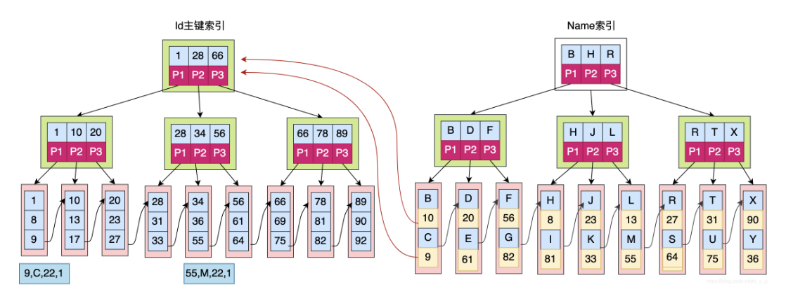


上图，主键索引的叶子节点保存的是真正的数据。而辅助索引叶子节点的数据区保存的是主键索引关键字的值。

假如要查询name = C 的数据，其搜索过程如下：

1. 先在辅助索引中通过C查询最后找到主键id = 9.
2. 在主键索引中搜索id为9的数据，最终在主键索引的叶子节点中获取到真正的数据。

所以通过辅助索引进行检索，需要检索两次索引。

之所以这样设计，一个原因就是：如果和MyISAM一样在主键索引和辅助索引的叶子节点中都存放数据行指针，一旦数据发生迁移，则需要去重新组织维护所有的索引。

### 4.把Innodb 和 MYISAM区别

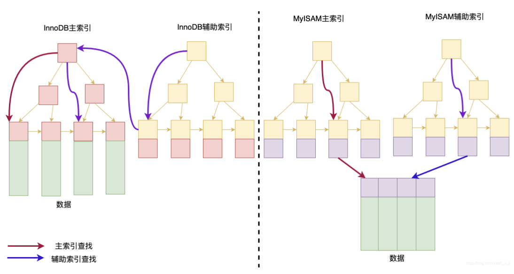


InnoDB的数据文件本身就是主索引文件，而MyISAM的主索引和数据是分开的。

InnoDB的辅助索引data域存储相应记录主键的值而不是地址。而MyISAM的辅助索引和主索引没有多大区别。

innoDB是聚簇索引，数据存储在对应索引之下。

### 5.扩展innodb引擎

上面的innodb可能理解难：


> **1、聚集索引**

InnoDB存储引擎表是索引组织表，即按照主键的顺序存储数据。

与 MyISAM相同的一点是，InnoDB 也采用 B+Tree这种数据结构来实现 B-Tree索引。而很大的区别在于，InnoDB
存储引擎采用“聚集索引”的数据存储方式实现B-Tree索引， 聚集索引（clustered
index）就是按照每张表的主键构造一棵B+树，树中的叶子节点存放着表中的行记录数据也就是数据行和相邻的键值紧凑地存储在一起。

下图为 InnoDB聚集索引原理图：

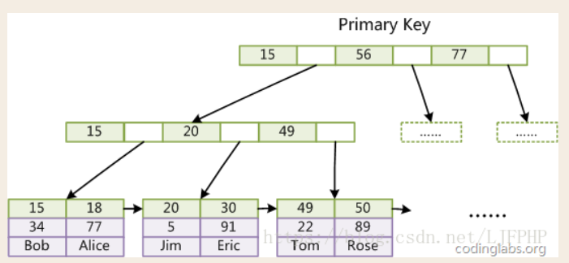


由此可看出InnoDB的数据文件本身要按主键聚集，因此在InnoDB中要求一张表必须有主键(而MyISAM引擎中可以没有)
，如果没有显式指定主键，MySQL会自动选择一个可以唯一标识数据记录的列作为主键。如果还不存在这种列，则MySQL自动为InnoDB表生成一个长整型、长度为6个字节的隐含字段作为主键。


> **2、辅助索引**

　　

InnoDB对辅助索引采取的方式是在叶子页中保存主键值，通过这个主键值来回表查询到一条完整记录，所以按辅助索引检索实际上进行了二次查询，效率肯定是没有按照主键检索高的。下图是辅助索引的实现方式：


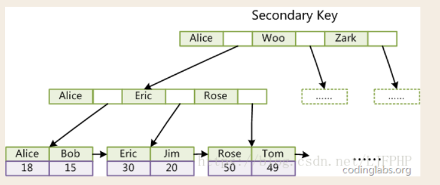


由于辅助索引包含主键索引，为了减小辅助索引所占空间，我们应该将 InnoDB
表中的主键索引尽量定义得小一些（MySIAM会使用前缀压缩技术使得索引变小，而InnoDB不会压缩索引）。

同时由于InnoDB数据文件本身是一棵B+Tree，非单调的主键会造成在插入新记录时数据文件为了维持B+Tree的特性而频繁的分裂调整，造成效率低下，而使用自增字段作为主键则是一个很好的选择。

## 6.5：索引基础语法

### 1.查看索引

**语法：**

```sql
SHOW INDEX FROM table_name
```

**案例：**

```sql
show index from test1;
```

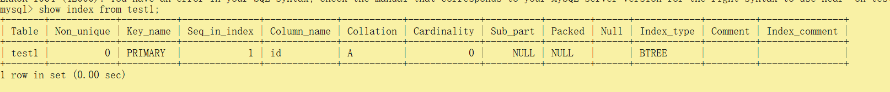

### 2.创建索引

**语法：**

```sql
CREATE  [UNIQUE ]  INDEX [indexName] ON table_name(column)) 
```

**案例：**

```sql
create index myindex1 on test1(id);
show index from test1;
```

### 3.删除索引

**语法：**

```sql
DROP INDEX [indexName] ON mytable; 
```

**案例：**

```sql
drop index myindex1 on test1;
show index from test1;
```

### 4.alert语法

```sql
 -- 有四种方式来添加数据表的索引：
-- 该语句添加一个主键，这意味着索引值必须是唯一的，且不能为NULL。
ALTER TABLE tbl_name ADD PRIMARY KEY (column_list): 

 
-- 这条语句创建索引的值必须是唯一的（除了NULL外，NULL可能会出现多次）。
ALTER TABLE tbl_name ADD UNIQUE index_name (column_list): 

 
-- 添加普通索引，索引值可出现多次。
ALTER TABLE tbl_name ADD INDEX index_name (column_list): 


-- 该语句指定了索引为 FULLTEXT ，用于全文索引。
ALTER TABLE tbl_name ADD FULLTEXT index_name (column_list):
```

## 6.6：索引分类

### 1.单值索引

即一个索引只包含单个列，一个表可以有多个单列索引

```sql
-- 随表一起建索引：
CREATE TABLE customer (
    id INT(10) UNSIGNED  AUTO_INCREMENT ,
    customer_no VARCHAR(200),
    customer_name VARCHAR(200),
  PRIMARY KEY(id),
  KEY (customer_name)
);
  
-- 单独建单值索引：
CREATE  INDEX idx_customer_name ON customer(customer_name); 
 
-- 删除索引：
DROP INDEX idx_customer_name  on customer;
```

### 2.唯一索引

索引列的值必须唯一，但允许有空值

```sql
-- 随表一起建索引：
CREATE TABLE customer (id INT(10) UNSIGNED  AUTO_INCREMENT ,customer_no VARCHAR(200),customer_name VARCHAR(200),
  PRIMARY KEY(id),
  KEY (customer_name),
  UNIQUE (customer_no)
);
  
-- 单独建唯一索引：
CREATE UNIQUE INDEX idx_customer_no ON customer(customer_no); 
 
-- 删除索引：
DROP INDEX idx_customer_no on customer ;
```

### 3.主键索引

设定为主键后数据库会自动建立索引，innodb为聚簇索引

```sql
-- 随表一起建索引：
CREATE TABLE customer (id INT(10) UNSIGNED  AUTO_INCREMENT ,customer_no VARCHAR(200),customer_name VARCHAR(200),
  PRIMARY KEY(id) 
);
   
CREATE TABLE customer2 (id INT(10) UNSIGNED   ,customer_no VARCHAR(200),customer_name VARCHAR(200),
  PRIMARY KEY(id) 
);
 
-- 单独建主键索引：
ALTER TABLE customer add PRIMARY KEY customer(customer_no);  
 
-- 删除建主键索引：
ALTER TABLE customer drop PRIMARY KEY ;  
 
-- 修改建主键索引：
-- 必须先删除掉(drop)原索引，再新建(add)索引
```

### 4.复合索引

即一个索引包含多个列

```sql
-- 随表一起建索引：
CREATE TABLE customer (id INT(10) UNSIGNED  AUTO_INCREMENT ,customer_no VARCHAR(200),customer_name VARCHAR(200),
  PRIMARY KEY(id),
  KEY (customer_name),
  UNIQUE (customer_name),
  KEY (customer_no,customer_name)
);
 
-- 单独建索引：
CREATE  INDEX idx_no_name ON customer(customer_no,customer_name); 
 
-- 删除索引：
DROP INDEX idx_no_name  on customer ;
```

## 6.7：什么情况简历索引

> + 主键自动建立唯一索引
> + 频繁作为查询条件的字段应该创建索引
> + 查询中与其它表关联的字段，外键关系建立索引
> + 单键/组合索引的选择问题， 组合索引性价比更高
> + 查询中排序的字段，排序字段若通过索引去访问将大大提高排序速度
> + 查询中统计或者分组字段
>

## 6.8：什情况不用建立索引

> + 表记录太少
>
> + 经常增删改的表或者字段
    >
    >
+ Why:提高了查询速度，同时却会降低更新表的速度，如对表进行INSERT、UPDATE和DELETE。 因为更新表时，MySQL不仅要保存数据，还要保存一下索引文件
>
> + Where条件里用不到的字段不创建索引
> + 过滤性不好的不适合建索引

​

## 6.9：性能分析Explain

### 1.是什么

官网简介：http://dev.mysql.com/doc/refman/5.5/en/explain-output.html

使用EXPLAIN关键字可以模拟优化器执行SQL查询语句，从而知道MySQL是如何处理你的SQL语句的。分析你的查询语句或是表结构的性能瓶颈

### 2.能干吗

+ 表的读取顺序
+ 哪些索引可以使用
+ 数据读取操作的操作类型
+ 哪些索引被实际使用
+ 表之间的引用
+ 每张表有多少行被物理查询

### 3.怎么玩

> ##### EXPLAIN+ SQL语句

**建表sql**

```sql
 CREATE TABLE t1(id INT(10) AUTO_INCREMENT,content  VARCHAR(100) NULL ,  PRIMARY KEY (id));
 CREATE TABLE t2(id INT(10) AUTO_INCREMENT,content  VARCHAR(100) NULL ,  PRIMARY KEY (id));
 CREATE TABLE t3(id INT(10) AUTO_INCREMENT,content  VARCHAR(100) NULL ,  PRIMARY KEY (id));
 CREATE TABLE t4(id INT(10) AUTO_INCREMENT,content  VARCHAR(100) NULL ,  PRIMARY KEY (id));
 
 
 INSERT INTO t1(content) VALUES(CONCAT('t1_',FLOOR(1+RAND()*1000)));
 
  INSERT INTO t2(content) VALUES(CONCAT('t2_',FLOOR(1+RAND()*1000)));
  
  INSERT INTO t3(content) VALUES(CONCAT('t3_',FLOOR(1+RAND()*1000)));
    
  INSERT INTO t4(content) VALUES(CONCAT('t4_',FLOOR(1+RAND()*1000)));
```

**测试**

```sql
EXPLAIN select * from t1;
```

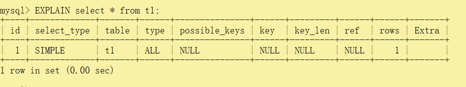

## 6.10：Explain字段介绍

### 1.id

select查询的序列号,包含一组数字，表示查询中执行select子句或操作表的顺序

他有三种情况：

| name        | message                              |
|-------------|--------------------------------------|
| id相同        | 执行顺序由上至下                             |
| id不同        | 如果是子查询，id的序号会递增，id值越大优先级越高，越先被执行     |
| id相同不同，同时存在 | id相同的可以认为是一组，同一组中从上往下执行，所有组中id大的优先执行 |

### 2.select_type

查询的类型，主要是用于区别普通查询、联合查询、子查询等的复杂查询

| name                 | message                                                                     |
|----------------------|-----------------------------------------------------------------------------|
| SIMPLE               | 简单的 select 查询,查询中不包含子查询或者UNION                                              |
| PRIMARY              | 查询中若包含任何复杂的子部分，最外层查询则被标记为Primary                                            |
| DERIVED              | 在FROM列表中包含的子查询被标记为DERIVED(衍生) MySQL会递归执行这些子查询, 把结果放在临时表里。                   |
| SUBQUERY             | 在SELECT或WHERE列表中包含了子查询                                                      |
| DEPENDENT SUBQUERY   | 在SELECT或WHERE列表中包含了子查询,子查询基于外层                                              |
| UNCACHEABLE SUBQUREY |                                                                             |
| UNION                | 若第二个SELECT出现在UNION之后，则被标记为UNION； 若UNION包含在FROM子句的子查询中,外层SELECT将被标记为：DERIVED |
| UNION RESUL          | T从UNION表获取结果的SELECT                                                         |

### 3.table

显示这一行的数据是关于哪张表的

### 4.partitions

代表分区表中的命中情况，非分区表，该项为null

### 5.type

type所显示的是查询使用了哪种类型，type包含的类型包括如下图所示的几种，从好到差依次是

system > const > eq_ref > ref > range > index > all

- `system` 表只有一行记录（等于系统表），这是const类型的特列，平时不会出现，这个也可以忽略不计
- `const` 表示通过索引一次就找到了，const用于比较primary key 或者unique索引。因为只匹配一行数据，所以很快。如将主键置于where列表中，MySQL就能将该查询转换为一个常量。
- `eq_ref` 唯一性索引扫描，对于每个索引键，表中只有一条记录与之匹配。常见于主键或唯一索引扫描
- `ref` 非唯一性索引扫描，返回匹配某个单独值的所有行，本质上也是一种索引访问，它返回所有匹配某个单独值的行，然而，它可能会找到多个符合条件的行，所以他应该属于查找和扫描的混合体。
- `range` 只检索给定范围的行，使用一个索引来选择行，key列显示使用了哪个索引，一般就是在你的where语句中出现between、< 、>
  、in等的查询，这种范围扫描索引比全表扫描要好，因为它只需要开始于索引的某一点，而结束于另一点，不用扫描全部索引。
- `index`  Full Index
  Scan，Index与All区别为index类型只遍历索引树。这通常比ALL快，因为索引文件通常比数据文件小。（也就是说虽然all和Index都是读全表，但index是从索引中读取的，而all是从硬盘读取的）
- `all`  Full Table Scan 将遍历全表以找到匹配的行

### 6.possible_keys

显示可能应用在这张表中的索引，一个或多个。查询涉及到的字段上若存在索引，则该索引将被列出，但不一定被查询实际使用

### 7.key

+ 实际使用的索引。如果为NULL，则没有使用索引
+ 查询中若使用了覆盖索引，则该索引和查询的select字段重叠

### 8.key_len

+ 表示索引中使用的字节数，可通过该列计算查询中使用的索引的长度。
+ key_len字段能够帮你检查是否充分的利用上了索引

### 9.ref

+ 显示索引的哪一列被使用了，如果可能的话，是一个常数。哪些列或常量被用于查找索引列上的值

### 10.rows

rows列显示MySQL认为它执行查询时必须检查的行数。越少越好

### 11.filtered

这个字段表示存储引擎返回的数据在server层过滤后，剩下多少满足查询的记录数量的比例，注意是百分比，不是具体记录数

### 12.Extra

包含不适合在其他列中显示但十分重要的额外信息


