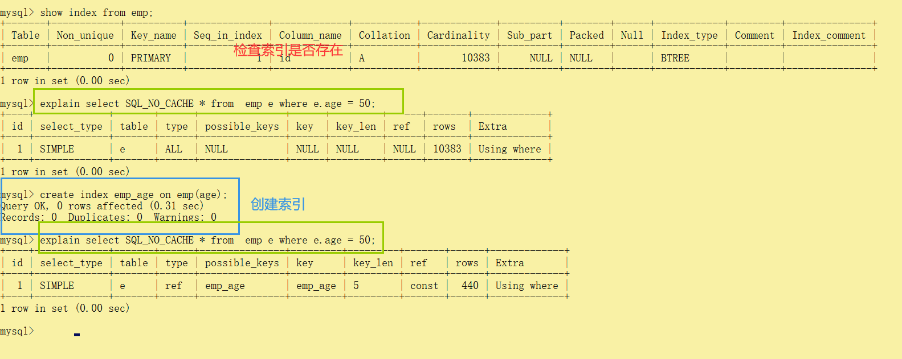
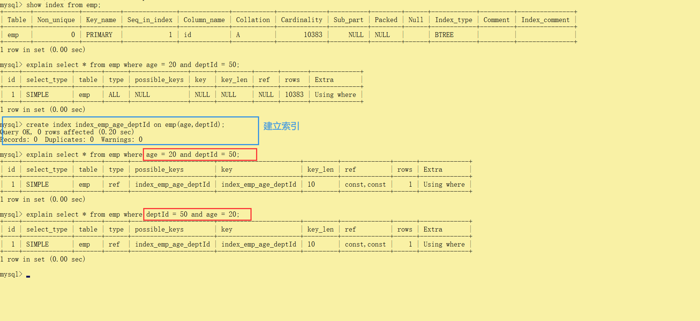

# 七、索引二


## 7.1：批量数据脚本


### 1.建表


```sql
 CREATE TABLE `dept` (
 `id` INT(11) NOT NULL AUTO_INCREMENT,
 `deptName` VARCHAR(30) DEFAULT NULL,
 `address` VARCHAR(40) DEFAULT NULL,
 ceo INT NULL ,
 PRIMARY KEY (`id`)
) ENGINE=INNODB AUTO_INCREMENT=1 DEFAULT CHARSET=utf8;
 
 
CREATE TABLE `emp` (
 `id` INT(11) NOT NULL AUTO_INCREMENT,
 `empno` INT NOT NULL ,
 `name` VARCHAR(20) DEFAULT NULL,
 `age` INT(3) DEFAULT NULL,
 `deptId` INT(11) DEFAULT NULL,
 PRIMARY KEY (`id`)
 #CONSTRAINT `fk_dept_id` FOREIGN KEY (`deptId`) REFERENCES `t_dept` (`id`)
) ENGINE=INNODB AUTO_INCREMENT=1 DEFAULT CHARSET=utf8;

```


### 2.设置log_bin_trust_function_creators


> 创建函数，假如报错：This function has none of DETERMINISTIC......
>
> > 由于开启过慢查询日志，因为我们开启了 bin-log, 我们就必须为我们的function指定一个参数。


```sql
show variables like 'log_bin_trust_function_creators';

set global log_bin_trust_function_creators=1;
```


> 这样添加了参数以后，如果mysqld重启，上述参数又会消失，永久方法：


windows下my.ini[mysqld]加上log_bin_trust_function_creators=1 

linux下    /etc/my.cnf下my.cnf[mysqld]加上log_bin_trust_function_creators=1


### 3.随机生成字符串函数


```sql
DELIMITER $$
CREATE FUNCTION rand_string(n INT) RETURNS VARCHAR(255)
BEGIN    
DECLARE chars_str VARCHAR(100) DEFAULT 'abcdefghijklmnopqrstuvwxyzABCDEFJHIJKLMNOPQRSTUVWXYZ';
 DECLARE return_str VARCHAR(255) DEFAULT '';
 DECLARE i INT DEFAULT 0;
 WHILE i < n DO  
 SET return_str =CONCAT(return_str,SUBSTRING(chars_str,FLOOR(1+RAND()*52),1));  
 SET i = i + 1;
 END WHILE;
 RETURN return_str;
END $$
 


#假如要删除
drop function rand_string;

#调用
SELECT rand_string(123); -- 生成123位的随机字符
```


### 4.随机生成编号


```sql
#用于随机产生多少到多少的编号
DELIMITER $$
CREATE FUNCTION  rand_num (from_num INT ,to_num INT) RETURNS INT(11)
BEGIN   
 DECLARE i INT DEFAULT 0;  
 SET i = FLOOR(from_num +RAND()*(to_num -from_num+1))   ;
RETURN i;  
 END$$ 

#假如要删除
drop function rand_num;

#查看
SELECT rand_num(1 , 200000);
```


### 5.创建存储过程


```sql
# 创建往emp表中插入数据的存储过程
 
DELIMITER $$
CREATE PROCEDURE  insert_emp(start_num INT ,  max_num INT )
BEGIN  
DECLARE i INT DEFAULT 0;   
#set autocommit =0 把autocommit设置成0  
 SET autocommit = 0;    
 REPEAT  
 SET i = i + 1;  
 INSERT INTO emp (empno, NAME ,age ,deptid ) VALUES ((start_num+i) ,rand_string(6)   , rand_num(30,50),rand_num(1,10000));  
 UNTIL i = max_num  
 END REPEAT;  
 COMMIT;  
 END$$ 
 
#删除
#DELIMITER ;
#drop PROCEDURE insert_emp;
#使用
#CALL insert_emp(0,100000)

#------------------------
#创建往dept表中插入数据的存储过程
#执行存储过程，往dept表添加随机数据
DELIMITER $$
CREATE PROCEDURE `insert_dept`(  max_num INT )
BEGIN  
DECLARE i INT DEFAULT 0;   
 SET autocommit = 0;    
 REPEAT  
 SET i = i + 1;  
 INSERT INTO dept ( deptname,address,ceo ) VALUES (rand_string(8),rand_string(10),rand_num(1,500000));  
 UNTIL i = max_num  
 END REPEAT;  
 COMMIT;  
 END$$
 
#删除
#DELIMITER ;
#drop PROCEDURE insert_dept;

#使用
#CALL insert_dept(100000)

```


### 6.调用存储过程


```sql
# ZEN
CALL insert_dept(10000);
CALL insert_emp(0,10000);
```


### 7.批量索引操作


```sql
DELIMITER $$
CREATE  PROCEDURE `proc_drop_index`(dbname VARCHAR(200),tablename VARCHAR(200))
BEGIN
       DECLARE done INT DEFAULT 0;
       DECLARE ct INT DEFAULT 0;
       DECLARE _index VARCHAR(200) DEFAULT '';
       DECLARE _cur CURSOR FOR  SELECT   index_name   FROM information_schema.STATISTICS   WHERE table_schema=dbname AND table_name=tablename AND seq_in_index=1 AND    index_name <>'PRIMARY'  ;
       DECLARE  CONTINUE HANDLER FOR NOT FOUND set done=2 ;      
        OPEN _cur;
        FETCH   _cur INTO _index;
        WHILE  _index<>'' DO 
               SET @str = CONCAT("drop index ",_index," on ",tablename ); 
               PREPARE sql_str FROM @str ;
               EXECUTE  sql_str;
               DEALLOCATE PREPARE sql_str;
               SET _index=''; 
               FETCH   _cur INTO _index; 
        END WHILE;
   CLOSE _cur;
   END$$
   
   CALL proc_drop_index("dbname","tablename");
```


## 7.2：单表优化-全值匹配


### 1.案例1


> ###### 执行下列sql


```sql
# 检查是否还有索引 一定保证一个都没有
show index from emp;
#查看执行计划
explain select SQL_NO_CACHE * from  emp e where e.age = 50;
# 建立索引
create index emp_age on emp(age);
#查看执行计划
explain select SQL_NO_CACHE * from  emp e where e.age = 50;
```





> ###### 	总结
>
> 我们发现使用索引后查询的行数变得更低了，而且查询类型`all全表从硬盘中查询`变成了`ref非唯一性索引查找`，效率变得更高了


### 2.案例2


> ###### 执行下列sql


```sql
# 检查是否还有索引 一定保证一个都没有
show index from emp;
# 查看执行计划
explain select SQL_NO_CACHE * from emp where age = 20 and deptId = 50;
#创建索引
create index index_emp_age_deptId on emp(age,deptId);
#查看执行计划
explain select SQL_NO_CACHE * from emp where age = 20 and deptId = 50;
#调整sql语序查看执行计划
explain select SQL_NO_CACHE * from emp where deptId = 50 and age = 20;
```





### 3.案例3


