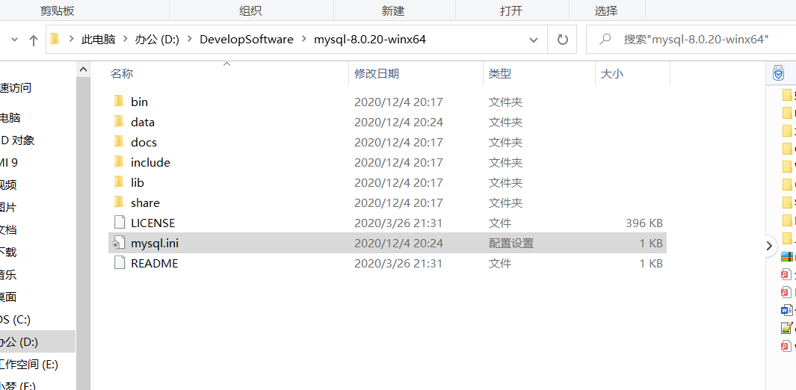
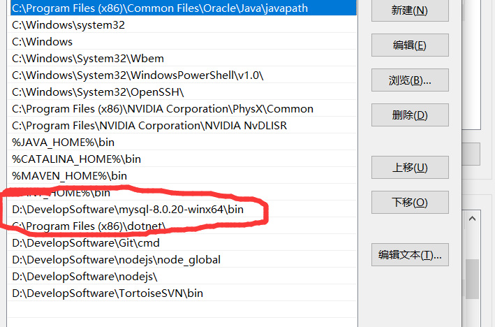
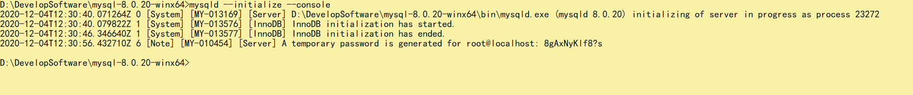

```ini
[mysqld]
# 设置3306端口
port=3306
# 设置mysql的安装目录
basedir=D:\\DevelopSoftware\\mysql-8.0.20-winx64
# 设置mysql数据库的数据的存放目录
datadir=D:\\DevelopSoftware\\mysql-8.0.20-winx64\\data 
# 允许最大连接数
max_connections=200
# 允许连接失败的次数。
max_connect_errors=10
# 服务端使用的字符集默认为utf8mb4
character``-``set``-server=utf8mb4
# 创建新表时将使用的默认存储引擎
default``-storage-engine=INNODB
# 默认使用“mysql_native_password”插件认证
#mysql_native_password
default_authentication_plugin=mysql_native_password
[mysql]
# 设置mysql客户端默认字符集
default``-``character``-``set``=utf8mb4
[client]
# 设置mysql客户端连接服务端时默认使用的端口
port=3306
default``-``character``-``set``=utf8mb4
```

**1.创建MySQL的安装位置：**

在D盘创建Program
Files文件夹，在其文件夹下创建MySQL文件夹，然后把刚刚解压的MySQL文件连同刚刚添加的mysql.ini文件复制到此文件夹下，效果如下（安装在其他磁盘处也是可以的，但是要注意mysql.ini文件中配置文件的路径）：



**2.配置系统的环境变量Path**

path变量中新增bin文件夹的路径，然后全部保存并退出，




**3.管理员运行cmd**

```shell
D:
cd D:\DevelopSoftware\mysql-8.0.20-winx64\bin
mysqld --initialize --console
```

这里执行完有一个初始化密码：切记保存



我这里是：`8gAxNyKlf8?s`

**4.安装mysql服务**

```shell
cd bin

mysqld --install
```

**5.修改密码**

```
 UPDATE user SET password=PASSWORD("new password") WHERE user='root';
```


