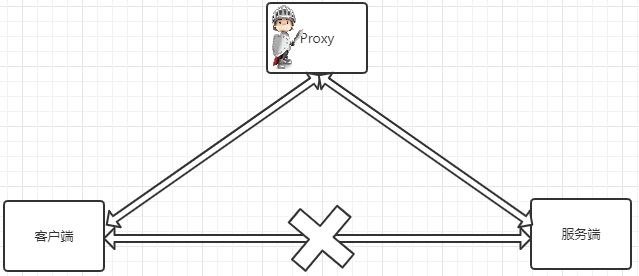
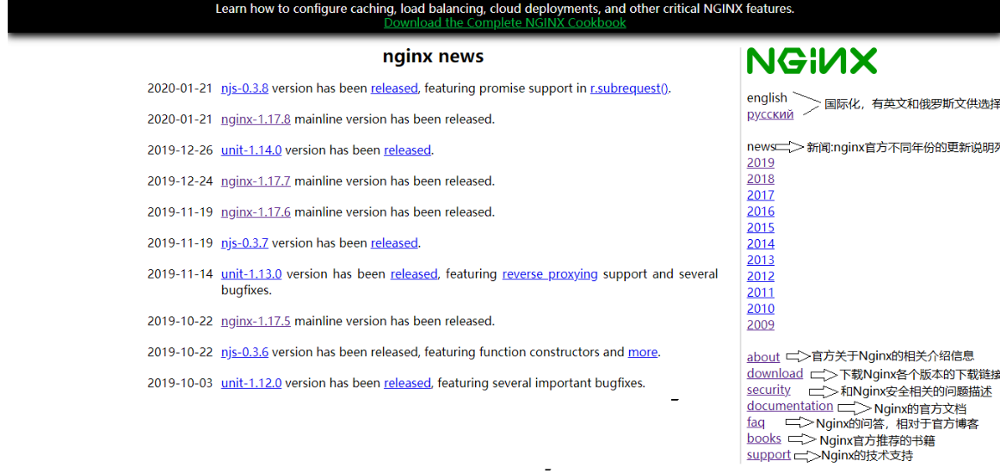
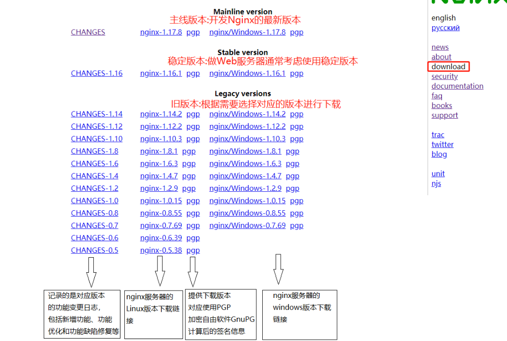
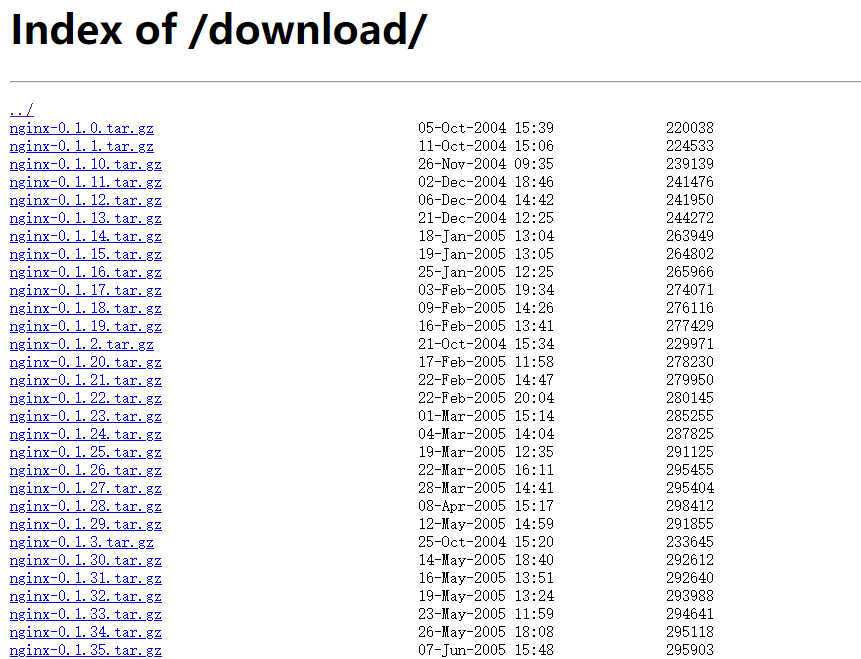

# 一、简介

## 1.1：背景简介

Nginx`（engine x）`一个具有高性能的**【HTTP】**和**【反向代理】**的**【WEB服务器】**，同时也是一个**【POP3/SMTP/IMAP代理服务器】**
，是由伊戈尔·赛索耶夫(俄罗斯人)
使用C语言编写的，Nginx的第一个版本是2004年10月4号发布的0.1.0版本。另外值得一提的是伊戈尔·赛索耶夫将Nginx的源码进行了开源，这也为Nginx的发展提供了良好的保障。

+ WEB服务器
    + WEB服务器也叫网页服务器，英文名叫Web Server，主要功能是为用户提供网上信息浏览服务。

+ HTTP
    +
    HTTP是超文本传输协议的缩写，是用于从WEB服务器传输超文本到本地浏览器的传输协议，也是互联网上应用最为广泛的一种网络协议。HTTP是一个客户端和服务器端请求和应答的标准，客户端是终端用户，服务端是网站，通过使用Web浏览器、网络爬虫或者其他工具，客户端发起一个到服务器上指定端口的HTTP请求。

+ POP3/SMTP/IMAP：
    + POP3(Post Offic Protocol 3)邮局协议的第三个版本，
    + SMTP(Simple Mail Transfer Protocol)简单邮件传输协议，
    + IMAP(Internet Mail Access Protocol)交互式邮件存取协议，

**通过上述名词的解释，我们可以了解到Nginx也可以作为电子邮件代理服务器。**

+ 反向代理



+ 反向代理


## 1.2：常见服务器对比

| 名称       | 简介                                                                                                                                                                                                                                                                                                            |
|----------|---------------------------------------------------------------------------------------------------------------------------------------------------------------------------------------------------------------------------------------------------------------------------------------------------------------|
| IIS      | 全称(Internet Information Services)即互联网信息服务，是由微软公司提供的基于windows系统的互联网基本服务。windows作为服务器在稳定性与其他一些性能上都不如类UNIX操作系统，因此在需要高性能Web服务器的场合下，IIS可能就会被"冷落".                                                                                                                                                                  |
| Tomcat   | Tomcat是一个运行Servlet和JSP的Web应用软件，Tomcat技术先进、性能稳定而且开放源代码，因此深受Java爱好者的喜爱并得到了部分软件开发商的认可，成为目前比较流行的Web应用服务器。但是Tomcat天生是一个重量级的Web服务器，对静态文件和高并发的处理比较弱。                                                                                                                                                                 |
| Apache   | Apache的发展时期很长，同时也有过一段辉煌的业绩。从上图可以看出大概在2014年以前都是市场份额第一的服务器。Apache有很多优点，如稳定、开源、跨平台等。但是它出现的时间太久了，在它兴起的年代，互联网的产业规模远远不如今天，所以它被设计成一个重量级的、不支持高并发的Web服务器。在Apache服务器上，如果有数以万计的并发HTTP请求同时访问，就会导致服务器上消耗大量能存，操作系统内核对成百上千的Apache进程做进程间切换也会消耗大量的CUP资源，并导致HTTP请求的平均响应速度降低，这些都决定了Apache不可能成为高性能的Web服务器。这也促使了Lighttpd和Nginx的出现。 |
| Lighttpd | Lighttpd是德国的一个开源的Web服务器软件，它和Nginx一样，都是轻量级、高性能的Web服务器，欧美的业界开发者比较钟爱Lighttpd,而国内的公司更多的青睐Nginx，同时网上Nginx的资源要更丰富些。                                                                                                                                                                                                 |
| 其他的服务器   | Google Servers，Weblogic, Webshpere(IBM)...经过各个服务器的对比，种种迹象都表明，Nginx将以性能为王。这也是我们为什么选择Nginx的理由。                                                                                                                                                                                                                  |

## 1.3：Nginx优点

### 1.速度更快、并发更高

单次请求或者高并发请求的环境下，Nginx都会比其他Web服务器响应的速度更快。一方面在正常情况下，单次请求会得到更快的响应，另一方面，在高峰期(
如有数以万计的并发请求)，Nginx比其他Web服务器更快的响应请求。Nginx之所以有这么高的并发处理能力和这么好的性能原因在于Nginx*
*采用了多进程和I/O多路复用(epoll)的底层实现**。

### 2.配置简单，扩展性强

Nginx的设计极具扩展性，它本身就是由**很多模块组成**，这些模块的使用可以通过配置文件的配置来添加。这些模块有官方提供的也有第三方提供的模块，如果需要完全可以开发服务自己业务特性的定制模块。

### 3.高可靠性

**Nginx采用的是多进程模式运行，其中有一个master主进程和N多个worker进程**
，worker进程的数量我们可以手动设置，每个worker进程之间都是相互独立提供服务，并且master主进程可以在某一个worker进程出错时，快速去"
拉起"新的worker进程提供服务。

### 4.热部署

现在互联网项目都要求以7*24小时进行服务的提供，针对于这一要求，Nginx也提供了热部署功能，即可以在Nginx不停止的情况下，对Nginx进行文件升级、更新配置和更换日志文件等功能。

### 5.成本低、BSD许可证

BSD是一个开源的许可证，世界上的开源许可证有很多，现在比较流行的有六种分别是GPL、BSD、MIT、Mozilla、Apache、LGPL。这六种的区别是什么，我们可以通过下面一张图来解释下：


> **<font color='black'>
Nginx本身是开源的，我们不仅可以免费的将Nginx应用在商业领域，而且还可以在项目中直接修改Nginx的源码来定制自己的特殊要求。这些点也都是Nginx为什么能吸引无数开发者继续为Nginx来贡献自己的智慧和青春。OpenRestry [Nginx+Lua]
Tengine[淘宝]</font>**

## 1.4：Nginx的功能特性及常用功能

### 1.简介

Nginx提供的基本功能服务从大体上归纳为"基本HTTP服务"、“高级HTTP服务”和"邮件服务"等三大类。

### 2.基本HTTP服务

Nginx可以提供基本HTTP服务，可以作为HTTP代理服务器和反向代理服务器，支持通过缓存加速访问，可以完成简单的负载均衡和容错，支持包过滤功能，支持SSL等。

- 处理静态文件、处理索引文件以及支持自动索引；
- 提供反向代理服务器，并可以使用缓存加上反向代理，同时完成负载均衡和容错；
- 提供对FastCGI、memcached等服务的缓存机制，，同时完成负载均衡和容错；
- 使用Nginx的模块化特性提供过滤器功能。Nginx基本过滤器包括gzip压缩、ranges支持、chunked响应、XSLT、SSI以及图像缩放等。其中针对包含多个SSI的页面，经由FastCGI或反向代理，SSI过滤器可以并行处理。
- 支持HTTP下的安全套接层安全协议SSL.
- 支持基于加权和依赖的优先权的HTTP/2

### 3.高级HTTP服务

- 支持基于名字和IP的虚拟主机设置
- 支持HTTP/1.0中的KEEP-Alive模式和管线(PipeLined)模型连接
- 自定义访问日志格式、带缓存的日志写操作以及快速日志轮转。
- 提供3xx~5xx错误代码重定向功能
- 支持重写（Rewrite)模块扩展
- 支持重新加载配置以及在线升级时无需中断正在处理的请求
- 支持网络监控
- 支持FLV和MP4流媒体传输

### 4.邮件服务

Nginx提供邮件代理服务也是其基本开发需求之一，主要包含以下特性：

- 支持IMPA/POP3代理服务功能
- 支持内部SMTP代理服务功能

### 5.常用功能模块

```java
静态资源部署
Rewrite地址重写
	正则表达式
反向代理
负载均衡
	轮询、加权轮询、ip_hash、url_hash、fair
Web缓存
环境部署
	高可用的环境
用户认证模块...
```

### 6.核心组成

+ nginx二进制可执行文件
+ nginx.conf配置文件
+ error.log错误的日志记录
+ access.log访问日志记录

## 1.5：官网

### 1.官网首页

+ Nginx的官方网站为: http://nginx.org



### 2.下载地址

Nginx的官方下载网站为<http://nginx.org/en/download.html>，当然你也可以之间在首页选中右边的download进入版本下载网页。在下载页面我们会看到如下内容：




### 获取Nginx源码

<http://nginx.org/download/>

打开上述网站，就可以查看到Nginx的所有版本，选中自己需要的版本进行下载。下载我们可以直接在windows上下载然后上传到服务器，也可以直接从服务器上下载，这个时候就需要准备一台服务器。



## 1.6：安装

### 1.安装依赖

+ GCC

```java
yum install -y gcc
```

安装成功后，可以通过`gcc --version`来查看gcc是否安装成功

+ PCRE

Nginx在编译过程中需要使用到PCRE库（perl Compatible Regular Expressoin 兼容正则表达式库)
，因为在Nginx的Rewrite模块和http核心模块都会使用到PCRE正则表达式语法。

```java
yum install -y pcre pcre-devel
```

安装成功后，可以通过`rpm -qa pcre pcre-devel`来查看是否安装成功

+ zlib

zlib库提供了开发人员的压缩算法，在Nginx的各个模块中需要使用gzip压缩，所以我们也需要提前安装其库及源代码zlib和zlib-devel

```java
yum install -y zlib zlib-devel
```

安装成功后，可以通过`rpm -qa zlib zlib-devel`来查看是否安装成功

+ OpenSSL

OpenSSL是一个开放源代码的软件库包，应用程序可以使用这个包进行安全通信，并且避免被窃听。

SSL:Secure Sockets
Layer安全套接协议的缩写，可以在Internet上提供秘密性传输，其目标是保证两个应用间通信的保密性和可靠性。在Nginx中，如果服务器需要提供安全网页时就需要用到OpenSSL库，所以我们需要对OpenSSL的库文件及它的开发安装包进行一个安装。

```java
yum install -y openssl openssl-devel
```

安装成功后，可以通过`rpm -qa openssl openssl-devel`来查看是否安装成功

### 2.一键安装依赖

上述命令，一个个来的话比较麻烦，我们也可以通过一条命令来进行安装

```java
yum install -y gcc pcre pcre-devel zlib zlib-devel openssl openssl-devel
```

### 3.源码安装

+ 地址

```java
wget  http://nginx.org/download/nginx-1.18.0.tar.gz
```

+ 复制到我们安装位置

```java
cp /app/package/nginx-1.18.0.tar.gz /app/nginx/core/
```

+ 解压

```java
tar -zxvf nginx-1.18.0.tar.gz
```

+ 进入目录配置

```java
./configure 
```

+ 编译

```java
make
```

+ 安装

```java
make install
```

+ 安装路径

```java
默认安装在：/usr/local/nginx
```

### 4.yum安装

使用源码进行简单安装，我们会发现安装的过程比较繁琐，需要提前准备GCC编译器、PCRE兼容正则表达式库、zlib压缩库、OpenSSL安全通信的软件库包，然后才能进行Nginx的安装。

+ 安装yum-utils

```java
sudo yum  install -y yum-utils
```

+ 安装yum源文件

```java
vim /etc/yum.repos.d/nginx.repo
```

```shell
[nginx-stable]
name=nginx stable repo
baseurl=http://nginx.org/packages/centos/$releasever/$basearch/
gpgcheck=1
enabled=1
gpgkey=https://nginx.org/keys/nginx_signing.key
module_hotfixes=true

[nginx-mainline]
name=nginx mainline repo
baseurl=http://nginx.org/packages/mainline/centos/$releasever/$basearch/
gpgcheck=1
enabled=0
gpgkey=https://nginx.org/keys/nginx_signing.key
module_hotfixes=true
```

+ 查看是否安装成功

```java
yum list | grep nginx
```

+ 安装

```java
yun install -y nginx
```

+ 查看安装位置

```java
whereis nginx
```


