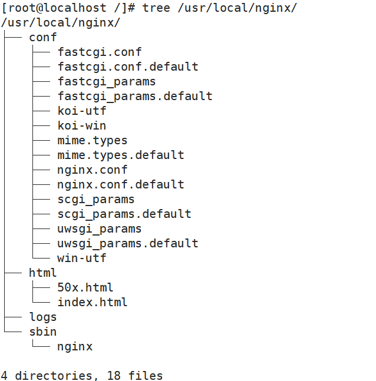
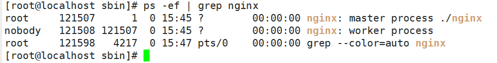
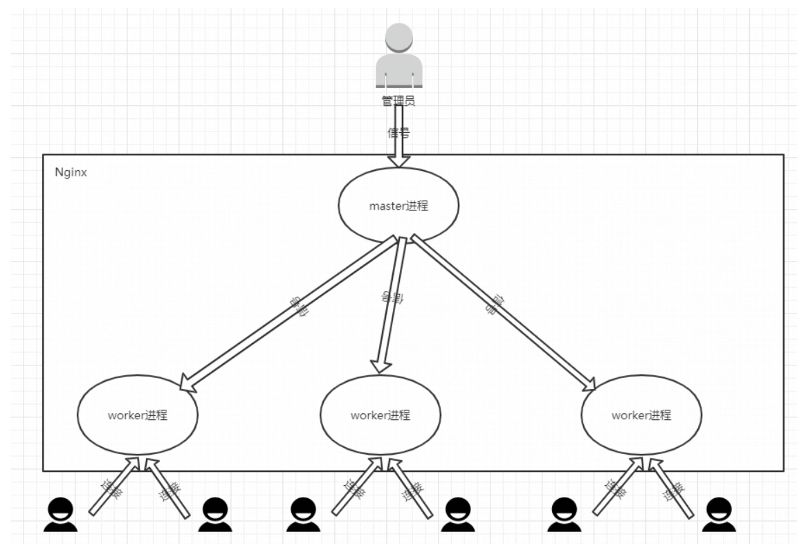
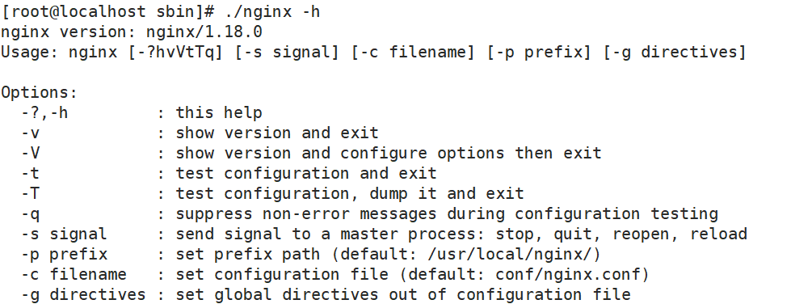
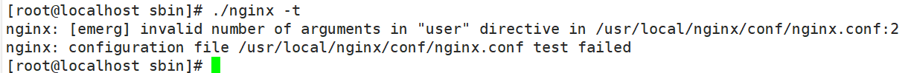
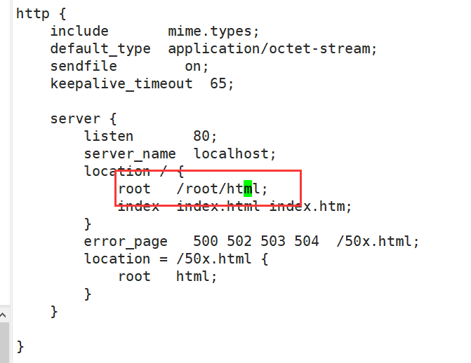
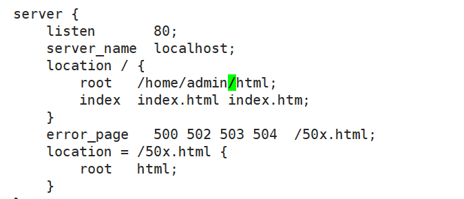
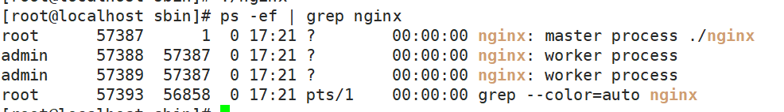
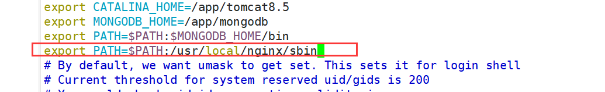

# 二、基础内容

## 2.1：目录结构分析

### 1.图

>
在使用Nginx之前，我们先对安装好的Nginx目录文件进行一个分析，在这块给大家介绍一个工具tree，通过tree我们可以很方面的去查看centos系统上的文件目录结构，当然，如果想使用tree工具，就得先通过`yum install -y tree`
来进行安装，安装成功后，可以通过执行`tree /usr/local/nginx`(tree后面跟的是Nginx的安装目录)，获取的结果如下：



### 2.主要目录

| 名称   | 简介                                                                |
|------|-------------------------------------------------------------------|
| conf | nginx所有配置文件目录                                                     |
| html | 存放nginx自带的两个静态的html页面                                             |
| logs | 记录日志的文件，当nginx服务器启动后，这里面会有 access.log error.log 和nginx.pid三个文件出现。 |
| sbin | 是存放执行程序文件nginx                                                    |

### 3.CGI

公共网关接口（Common Gateway Interface，CGI）是Web 服务器运行时外部程序的规范，按CGI 编写的程序可以扩展服务器功能。CGI
应用程序能与浏览器进行交互，还可通过数据API与数据库服务器等外部数据源进行通信，从数据库服务器中获取数据。格式化为HTML文档后，发送给浏览器，也可以将从浏览器获得的数据放到数据库中。几乎所有服务器都支持CGI，可用任何语言编写CGI，包括流行的C、C
++、Java、VB 和Delphi
等。CGI分为标准CGI和间接CGI两种。标准CGI使用命令行参数或环境变量表示服务器的详细请求，服务器与浏览器通信采用标准输入输出方式。间接CGI又称缓冲CGI，在CGI程序和CGI接口之间插入一个缓冲程序，缓冲程序与CGI接口间用标准输入输出进行通信 。

### 4.conf目录文件

| 文件名                     | 简称                                    |
|-------------------------|---------------------------------------|
| fastcgi.conf            | fastcgi相关配置文件                         |
| fastcgi.conf.default    | fastcgi.conf的备份文件                     |
| fastcgi_params          | fastcgi的参数文件                          |
| fastcgi_params.default  | fastcgi的参数备份文件                        |
| scgi_params             | scgi的参数文件                             |
| scgi_params.default     | scgi的参数备份文件                           |
| uwsgi_params            | uwsgi的参数文件                            |
| uwsgi_params.default    | uwsgi的参数备份文件                          |
| mime.types              | 记录的是HTTP协议中的Content-Type的值和文件后缀名的对应关系 |
| mime.types.default      | mime.types的备份文件                       |
| nginx.conf              | 这个是Nginx的核心配置文件，这个文件非常重要，也是我们即将要学习的重点 |
| nginx.conf.default      | nginx.conf的备份文件                       |
| oi-utf、koi-win、win-utfk | 这三个文件都是与编码转换映射相关的配置文件，用来将一种编码转换成另一种编码 |

### 5.html目录

| 文件名称       | 描述         |
|------------|------------|
| 50x.html   | 访问失败后的失败页面 |
| index.html | 成功访问的默认首页  |

### 6.sbin目录

| 文件名称  | 描述                     |
|-------|------------------------|
| nginx | 是用来控制Nginx的启动和停止等相关的命令 |

## 2.2：启动/停止/重启

### 1.简介

对于Nginx的启停在linux系统中也有很多种方式：

1. Nginx服务的信号控制

2. Nginx的命令行控制

### 2.Nginx服务的信号控制

#### 简介

前面在提到Nginx的高性能，其实也和它的架构模式有关。Nginx默认采用的是多进程的方式来工作的，当将Nginx启动后，我们通过`ps -ef | grep nginx`
命令可以查看到如下内容：



从上图中可以看到：

+ **Nginx后台进程中包含一个master进程和多个worker进程，**
+ **master进程主要用来管理worker进程，包含接收外界的信息，并将接收到的信号发送给各个worker进程，监控worker进程的状态，**
+ **当worker进程出现异常退出后，会自动重新启动新的worker进程。**
+ **而worker进程则是专门用来处理用户请求的，各个worker进程之间是平等的并且相互独立，处理请求的机会也是一样的。**

nginx的进程模型，我们可以通过下图来说明下：




我们现在作为管理员，只需要通过给master进程发送信号就可以来控制Nginx,这个时候我们需要有两个前提条件，一个是要操作的master进程，一个是信号。

#### 获取master进程id

+ 方式一：通过`ps -ef | grep nginx`；
+ 方式二：在讲解nginx的`./configure`的配置参数的时候，有一个参数是`--pid-path=PATH`默认是`/usr/local/nginx/logs/nginx.pid`
  ,所以可以通过查看该文件来获取nginx的master进程ID.

#### 信号种类

| 信号       | 作用                                |
|----------|-----------------------------------|
| TERM/INT | 立即关闭整个服务                          |
| QUIT     | "优雅"地关闭整个服务                       |
| HUP      | 重读配置文件并使用服务对新配置项生效                |
| USR1     | 重新打开日志文件，可以用来进行日志切割               |
| USR2     | 平滑升级到最新版的nginx                    |
| WINCH    | 所有子进程不在接收处理新连接，相当于给work进程发送QUIT指令 |

#### 使用信号语法

```java
kill -signal PID
```

+ signal:即为信号；

+ PID即为获取到的master线程ID

#### 信号具体使用

1. 发送TERM/INT信号给master进程，会将Nginx服务立即关闭。

```shell
kill -TERM PID / kill -TERM `cat /usr/local/nginx/logs/nginx.pid`
kill -INT PID / kill -INT `cat /usr/local/nginx/logs/nginx.pid`
```

2. 发送QUIT信号给master进程，master进程会控制所有的work进程不再接收新的请求，等所有请求处理完后，在把进程都关闭掉。

```shell
kill -QUIT PID / kill -TERM `cat /usr/local/nginx/logs/nginx.pid`
```

3. 发送HUP信号给master进程，master进程会把控制旧的work进程不再接收新的请求，等处理完请求后将旧的work进程关闭掉，然后根据nginx的配置文件重新启动新的work进程

```shell
kill -HUP PID / kill -TERM `cat /usr/local/nginx/logs/nginx.pid`
```

4. 发送USR1信号给master进程，告诉Nginx重新开启日志文件

```shell
kill -USR1 PID / kill -TERM `cat /usr/local/nginx/logs/nginx.pid`
```

5.
发送USR2信号给master进程，告诉master进程要平滑升级，这个时候，会重新开启对应的master进程和work进程，整个系统中将会有两个master进程，并且新的master进程的PID会被记录在`/usr/local/nginx/logs/nginx.pid`
而之前的旧的master进程PID会被记录在`/usr/local/nginx/logs/nginx.pid.oldbin`文件中，接着再次发送QUIT信号给旧的master进程，让其处理完请求后再进行关闭

```shell
kill -USR2 PID / kill -USR2 `cat /usr/local/nginx/logs/nginx.pid`
```

```shell
kill -QUIT PID / kill -QUIT `cat /usr/local/nginx/logs/nginx.pid.oldbin`
```


6. 发送WINCH信号给master进程,让master进程控制不让所有的work进程在接收新的请求了，请求处理完后关闭work进程。注意master进程不会被关闭掉

```shell
kill -WINCH PID /kill -WINCH`cat /usr/local/nginx/logs/nginx.pid`
```

### 3.命令行控制

#### 简介

此方式是通过Nginx安装目录下的sbin下的可执行文件nginx来进行Nginx状态的控制，我们可以通过`nginx -h`来查看都有哪些参数可以用：



| 参数    | 说明                                                                                                                                                                             |
|-------|--------------------------------------------------------------------------------------------------------------------------------------------------------------------------------|
| -?和-h | 显示帮助信息                                                                                                                                                                         |
| -v    | 打印版本号信息并退出                                                                                                                                                                     |
| -V    | 打印版本号信息和配置信息并退出                                                                                                                                                                |
| -t    | 测试nginx的配置文件语法是否正确并退出                                                                                                                                                          |
| -T    | 测试nginx的配置文件语法是否正确并列出用到的配置文件信息然后退出                                                                                                                                             |
| -q    | 在配置测试期间禁止显示非错误消息                                                                                                                                                               |
| -s    | signal信号，后面可以跟 ：<br>          stop[快速关闭，类似于TERM/INT信号的作用]<br>          quit[优雅的关闭，类似于QUIT信号的作用] 	<br>          reopen[重新打开日志文件类似于USR1信号的作用] 	<br>          reload[类似于HUP信号的作用] |
| -p    | prefix指定Nginx的prefix路径，(默认为: /usr/local/nginx/)                                                                                                                                |
| -c    | filename指定Nginx的配置文件路径,(默认为: conf/nginx.conf)                                                                                                                                  |
| -g    | directives用来补充Nginx配置文件，向Nginx服务指定启动时应用全局的配置                                                                                                                                   |

### 4.常用命令

+ 查看 nginx 版本号

```java
./nginx -v
```

+ 启动 nginx

```java
./nginx
```

+ 停止 nginx

```java
./nginx -s stop
```

+ 重新加载 nginx

```java
./nginx -s reload
```

## 2.2：nginx.conf

从前面的内容学习中，我们知道Nginx的核心配置文件默认是放在`/usr/local/nginx/conf/nginx.conf`
，这一节，我们就来学习下nginx.conf的内容和基本配置方法。

读取Nginx自带的Nginx配置文件，我们将其中的注释部分【学习一个技术点就是在Nginx的配置文件中可以使用`#`
来注释】删除掉后，就剩下下面内容:

> **简单小结下:**
>
> **nginx.conf配置文件中默认有三大块：全局块、events块、http块**
>
> **http块中可以配置多个server块，每个server块又可以配置多个location块。**

```java
worker_processes  1;

events {
    worker_connections  1024;
}

http {
    include       mime.types;
    default_type  application/octet-stream;
    sendfile        on;
    keepalive_timeout  65;

    server {
        listen       80;
        server_name  localhost;
        location / {
            root   html;
            index  index.html index.htm;
        }
        error_page   500 502 503 504  /50x.html;
        location = /50x.html {
            root   html;
        }
    }

}
```

```java
指令名	指令值;  #全局块，主要设置Nginx服务器整体运行的配置指令

 #events块,主要设置,Nginx服务器与用户的网络连接,这一部分对Nginx服务器的性能影响较大
events {	 
    指令名	指令值;
}
#http块，是Nginx服务器配置中的重要部分，代理、缓存、日志记录、第三方模块配置...             
http {		
    指令名	指令值;
    server { #server块，是Nginx配置和虚拟主机相关的内容
        指令名	指令值;
        location / { 
        #location块，基于Nginx服务器接收请求字符串与location后面的值进行匹配，对特定请求进行处理
            指令名	指令值;
        }
    }
	...
}
```

## 2.3：全局块

### 1.简介

主要设置Nginx服务器整体运行的配置指令


### 2.user指令简介

nginx 运行后可以指定用户，比如说一个静态网页服务器的文件目录的不同的用户有不同的访问权限，使用 nginx 指定用户就可以有权限对此目录读写。

user指令:用于配置运行Nginx服务器的worker进程的用户和用户组。

| 语法  | user user [group] |
|-----|-------------------|
| 默认值 | nobody            |
| 位置  | 全局块               |

该属性也可以在编译的时候指定，语法如下

```java
./configure --user=user --group=group
```

如果两个地方都进行了设置，最终生效的是配置文件中的配置。

### 3.user指令使用

+ centos新建用户admin

```java
useradd admin
```

+ 配置nginx.conf

```java
user admin;
```


+ 测试配置文件语法格式

```java
cd /usr/local/nginx/sbin
./nginx -t    
```



+ 创建/root/html/index.html文件

```java
<h1>MY name is admin`</h1>
```

+ 再次修改nginx.conf文件

```java
location / {
	root   /root/html;
	index  index.html index.htm;
}
```



+ 重启nginx

```java
./nginx -s reload
```

+ 403解决

页面会报403拒绝访问的错误

因为当前用户没有访问/root/html目录的权限

将文件创建到 `/home/admin/html/index.html`,修改配置

```java
location / {
	root   /home/admin/html;
	index  index.html index.htm;
}
```



+ 重启测试


### 4.user指令总结

综上所述，使用user指令可以指定**启动运行工作进程的用户及用户组**，这样对于系统的权限访问控制的更加精细，也更加安全。

这里的用户和用户组指的是：`liunx的用户`

### 5.master_process指令

master_process:用来指定**是否开启工作进程**，如果开启只会主进程

| 语法  | master_process on\|off; |
|-----|-------------------------|
| 默认值 | master_process on;      |
| 位置  | 全局块                     |

**注意：如果修改了mater_process的值我们是需要来重启nginx的**

### 6.worker_processes指令

worker_processes:用于配置Nginx生成工作进程的数量，这个是Nginx服务器实现并发处理服务的关键所在。理论上来说workder
process的值越大，可以支持的并发处理量也越多，但事实上这个值的设定是需要受到来自服务器自身的限制，建议将该值和服务器CPU的内核数保存一致。

| 语法  | worker_processes     num/auto; |
|-----|--------------------------------|
| 默认值 | 1                              |
| 位置  | 全局块                            |

+ 如果将worker_processes设置成2，则会看到如下内容:



+ 注意：**开启worker的时候，不能设置master_pocesses进程**

### 7.daemon指令

设定Nginx是否以守护进程的方式启动。

守护式进程是linux后台执行的一种服务进程，特点是独立于控制终端，不会随着终端关闭而停止。

简单的说是否以后台方式启动，**默认on打开**

| 简介  | 描述              |
|-----|-----------------|
| 语法  | daemon on\|off; |
| 默认值 | daemon on;      |
| 位置  | 全局块             |

**<font color='red'>重启生效</font>**

### 8.pid指令

pid:用来配置Nginx当前master进程的进程号ID存储的文件路径。

|     | 描述                                    |
|-----|---------------------------------------|
| 语法  | pid file;                             |
| 默认值 | 默认为:`/usr/local/nginx/logs/nginx.pid` |
| 位置  | 全局块                                   |

该属性可以通过`./configure --pid-path=PATH`来指定

### 9.error_log指令

error_log:用来配置Nginx的错误日志存放路径

|     | 描述                              |
|-----|---------------------------------|
| 语法  | error_log  file [日志级别];         |
| 默认值 | error_log logs/error.log error; |
| 位置  | 全局块、http、server、location        |

该属性可以通过`./configure --error-log-path=PATH`来指定

其中日志级别的值有：`debug|info|notice|warn|error|crit|alert|emerg`，翻译过来为试`信息|通知|警告|错误|临界|警报|紧急`
，这块建议大家设置的时候不要设置成info以下的等级，因为会带来大量的磁盘I/O消耗，影响Nginx的性能。

### 10.include

include:用来引入其他配置文件，使Nginx的配置更加灵活

|     | 描述            |
|-----|---------------|
| 语法  | include file; |
| 默认值 | 无             |
| 位置  | any           |

## 2.4：events块

### 1.简介

主要设置,Nginx服务器与用户的网络连接,这一部分对Nginx服务器的性能影响较大

所在位置


### 2.accept_mutex-设置Nginx网络连接序列化

用来设置Nginx网络连接序列化

|     | 描述                    |
|-----|-----------------------|
| 语法  | accept_mutex on\|off; |
| 默认值 | accept_mutex on;      |
| 位置  | events                |

这个配置主要可以用来解决常说的"惊群"
问题。大致意思是在某一个时刻，客户端发来一个请求连接，Nginx后台是以多进程的工作模式，也就是说有多个worker进程会被同时唤醒，但是最终只会有一个进程可以获取到连接，如果每次唤醒的进程数目太多，就会影响Nginx的整体性能。如果将上述值设置为on(
开启状态)，将会对多个Nginx进程接收连接进行序列号，一个个来唤醒接收，就防止了多个进程对连接的争抢。


> 简单的就说如果不设置的话，那么我们进来的请求，nginx不知道安排那个work proeccs来处理

### 3.multi_accept-接收多个网络连接

用来设置是否允许同时接收多个网络连接

如果multi_accept被禁止了，nginx一个工作进程只能同时接受一个新的连接。否则，一个工作进程可以同时接受所有的新连接

|     | 描述                    |
|-----|-----------------------|
| 语法  | multi_accept on\|off; |
| 默认值 | multi_accept off;     |
| 位置  | events                |

### 4.worker_connections-单个worker进程最大的连接数

用来配置单个worker进程最大的连接数

这里的连接数不仅仅包括和前端用户建立的连接数，而是包括所有可能的连接数。另外，number值不能大于操作系统支持打开的最大文件句柄数量。

|     | 描述                         |
|-----|----------------------------|
| 语法  | worker_connections number; |
| 默认值 | worker_commections 512;    |
| 位置  | events                     |

### 5.use-事件驱动来处理网络消息

用来设置Nginx服务器选择哪种事件驱动来处理网络消息。

注意：此处所选择事件处理模型是Nginx优化部分的一个重要内容，**method的可选值有`select/poll/epoll/kqueue`等**
，之前在准备centos环境的时候，我们强调过要使用linux内核在2.6以上，就是为了能使用epoll函数来优化Nginx。

|     | 描述           |
|-----|--------------|
| 语法  | use  method; |
| 默认值 | 根据操作系统定      |
| 位置  | events       |

另外这些值的选择，我们也可以在编译的时候使用

`--with-select_module`、`--without-select_module`、

` --with-poll_module`、` --without-poll_module`来设置是否需要将对应的事件驱动模块编译到Nginx的内核。

### 6.events指令配置实例

+ 打开Nginx的配置文件 nginx.conf,添加如下配置

```java
events{
	accept_mutex on;
	multi_accept on;
	worker_connections 1024;
	use epoll;
}
```

+ 启动测试

```java
./nginx -t
./nginx -s reload
```

## 2.5：http块

### 1.简介

是Nginx服务器配置中的重要部分，代理、缓存、日志记录、第三方模块配置...

### 2.定义MIME-Type

我们都知道浏览器中可以显示的内容有HTML、XML、GIF等种类繁多的文件、媒体等资源，浏览器为了区分这些资源，就需要使用MIME
Type。所以说MIME Type是网络资源的媒体类型。Nginx作为web服务器，也需要能够识别前端请求的资源类型。

在Nginx的配置文件中，默认有两行配置

```java
include mime.types;
default_type application/octet-stream;
```

> default_type:用来配置Nginx响应前端请求默认的MIME类型。
>
> |        | 描述                      |
> | ------ | ------------------------- |
> | 语法   | default_type mime-type;   |
> | 默认值 | default_type text/plain； |
> | 位置   | http、server、location    |
>
> 在default_type之前还有一句`include mime.types`,include之前我们已经介绍过，相当于把mime.types文件中MIMT类型与相关类型文件的文件后缀名的对应关系加入到当前的配置文件中。
>
> 举例来说明：
>
> 有些时候请求某些接口的时候需要返回指定的文本字符串或者json字符串，如果逻辑非常简单或者干脆是固定的字符串，那么可以使用nginx快速实现，这样就不用编写程序响应请求了，可以减少服务器资源占用并且响应性能非常快。

如何实现:

```java
location /get_text {
	#这里也可以设置成text/plain
    default_type text/html;
    return 200 "This is nginx's text";
}
location /get_json{
    default_type application/json;
    return 200 '{"name":"TOM","age":18}';
}
```

### 3.自定义服务日志

Nginx中日志的类型分access.log、error.log。

| 分类         | 描述                             |
|------------|--------------------------------|
| access.log | 用来记录用户所有的访问请求。                 |
| error.log  | 记录nginx本身运行时的错误信息，不会记录用户的访问请求。 |

Nginx服务器支持对服务日志的格式、大小、输出等进行设置，需要使用到两个指令，分别是access_log和log_format指令。

+ access_log:用来设置用户访问日志的相关属性。

|     | 描述                                   |
|-----|--------------------------------------|
| 语法  | access_log path[format[buffer=size]] |
| 默认值 | access_log logs/access.log combined; |
| 位置  | `http`, `server`, `location`         |

+ log_format:用来指定日志的输出格式。

|     | 描述                                                       |
|-----|----------------------------------------------------------|
| 语法  | log_format name [escape=default\|json\|none] string....; |
| 默认值 | log_format combined "...";                               |
| 位置  | http                                                     |

### 4.sendfile-处理静态资源的性能

用来设置Nginx服务器是否使用sendfile()传输文件，该属性可以大大提高Nginx处理静态资源的性能

|     | 描述                   |
|-----|----------------------|
| 语法  | sendfile on\|off；    |
| 默认值 | sendfile off;        |
| 位置  | http、server、location |

### 5.keepalive_timeout-长连接的超时时间。

用来设置长连接的超时时间。

> 为什么要使用keepalive？
>
> 我们都知道HTTP是一种无状态协议，客户端向服务端发送一个TCP请求，服务端响应完毕后断开连接。
>
如何客户端向服务端发送多个请求，每个请求都需要重新创建一次连接，效率相对来说比较多，使用keepalive模式，可以告诉服务器端在处理完一个请求后保持这个TCP连接的打开状态，若接收到来自这个客户端的其他请求，服务端就会利用这个未被关闭的连接，而不需要重新创建一个新连接，提升效率，但是这个连接也不能一直保持，这样的话，连接如果过多，也会是服务端的性能下降，这个时候就需要我们进行设置其的超时时间。

|     | 描述                      |
|-----|-------------------------|
| 语法  | keepalive_timeout time; |
| 默认值 | keepalive_timeout 75s;  |
| 位置  | http、server、location    |

### 6.keepalive_requests

keepalive_requests:用来设置一个keep-alive连接使用的次数。

|     | 描述                         |
|-----|----------------------------|
| 语法  | keepalive_requests number; |
| 默认值 | keepalive_requests 100;    |
| 位置  | http、server、location       |

### 7.server块和location块

server块和location块都是我们要重点讲解和学习的内容，因为我们后面会对Nginx的功能进行详细讲解，所以这块内容就放到静态资源部署的地方给大家详细说明。

本节我们主要来认识下Nginx默认给的nginx.conf中的相关内容，以及server块与location块在使用的时候需要注意的一些内容。

```java
	server {
        listen       80;
        server_name  localhost;
        location / {
            root   html;
            index  index.html index.htm;
        }
       
        error_page   500 502 503 504 404  /50x.html;
        location = /50x.html {
            root   html;
        }
    }
```

## 2.6：nginx配置成系统服务

### 1.前言

经过前面的操作，我们会发现，如果想要启动、关闭或重新加载nginx配置文件，都需要先进入到nginx的安装目录的sbin目录，然后使用nginx的二级制可执行文件来操作，相对来说操作比较繁琐，这块该如何优化？另外如果我们想把Nginx设置成随着服务器启动就自动完成启动操作，又该如何来实现?

### 2.配置

把Nginx应用服务设置成为系统服务，方便对Nginx服务的启动和停止等相关操作，具体实现步骤:

```shell
vim /usr/lib/systemd/system/nginx.service
```

```c#
[Unit]
Description=nginx web service
Documentation=http://nginx.org/en/docs/
After=network.target

[Service]
Type=forking
PIDFile=/usr/local/nginx/logs/nginx.pid
ExecStartPre=/usr/local/nginx/sbin/nginx -t -c /usr/local/nginx/conf/nginx.conf
ExecStart=/usr/local/nginx/sbin/nginx
ExecReload=/usr/local/nginx/sbin/nginx -s reload
ExecStop=/usr/local/nginx/sbin/nginx -s stop
PrivateTmp=true

[Install]
WantedBy=default.target
```

### 3.修改权限

```shell
chmod 755 /usr/lib/systemd/system/nginx.service
```

### 4.使用命令来操作nginx

| 描述        | 命令                      |
|-----------|-------------------------|
| 启动        | systemctl start nginx   |
| 停止        | systemctl stop nginx    |
| 重启        | systemctl restart nginx |
| 重新加载配置文件  | systemctl reload nginx  |
| 查看nginx状态 | systemctl status nginx  |
| 开机启动      | systemctl enable nginx  |

## 2.7：Nginx命令配置到系统环境

### 1.简介

前面我们介绍过Nginx安装目录下的二级制可执行文件`nginx`
的很多命令，要想使用这些命令前提是需要进入sbin目录下才能使用，很不方便，如何去优化，我们可以将该二进制可执行文件加入到系统的环境变量，这样的话在任何目录都可以使用nginx对应的相关命令。具体实现步骤如下:

### 2.配置

(1)修改`/etc/profile`文件

```java
vim /etc/profile
在最后一行添加
export PATH=$PATH:/usr/local/nginx/sbin
```



(2)使之立即生效

```shell
source /etc/profile
```

(3)执行nginx命令

```shell
nginx -V
```


