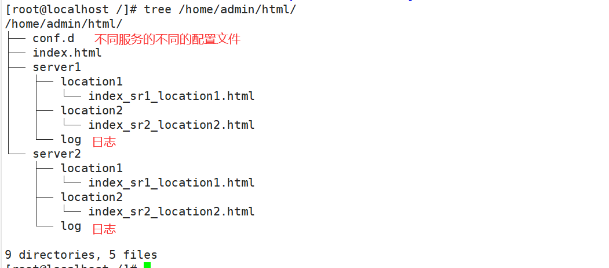

# 三、基础配置实战

## 3.1：需求分析

前面我们已经对Nginx服务器默认配置文件的结构和涉及的基本指令做了详细的阐述。通过这些指令的合理配置，我们就可以让一台Nginx服务器正常工作，并且提供基本的web服务器功能。

接下来我们将通过一个比较完整和最简单的基础配置实例，来巩固下前面所学习的指令及其配置。

+ 需求如下

```c
（1）有如下访问：
	http://192.168.244.100:8081/server1/location1
		访问的是：index_sr1_location1.html
	http://192.168.244.100:8081/server1/location2
		访问的是：index_sr1_location2.html
	http://192.168.244.100:8082/server2/location1
		访问的是：index_sr2_location1.html
	http://192.168.244.100:8082/server2/location2
		访问的是：index_sr2_location2.html
（2）如果访问的资源不存在，
	返回自定义的404页面
（3）将/server1和/server2的配置使用不同的配置文件分割
	将文件放到/home/www/conf.d目录下，然后使用include进行合并
（4）为/server1和/server2各自创建一个访问日志文件
```

## 3.2：静态资源准备



## 3.3：配置文件

### 1.操作1

```shell
cd /usr/local/nginx/conf/
cp nginx.conf nginx-1.conf
vim nginx.conf
```

### 2.写入以下内容

```java
##全局块 begin##
#配置允许运行Nginx工作进程的用户和用户组
user admin;
#配置运行Nginx进程生成的worker进程数
worker_processes 2;
#配置Nginx服务器运行对错误日志存放的路径
error_log logs/error.log;
#配置Nginx服务器允许时记录Nginx的master进程的PID文件路径和名称
pid logs/nginx.pid;
#配置Nginx服务是否以守护进程方法启动
#daemon on;
##全局块 end##

##events块 begin##
events{
	#设置Nginx网络连接序列化
	accept_mutex on;
	#设置Nginx的worker进程是否可以同时接收多个请求
	multi_accept on;
	#设置Nginx的worker进程最大的连接数
	worker_connections 1024;
	#设置Nginx使用的事件驱动模型
	use epoll;
}
##events块 end##
##http块 start##
http{
	#定义MIME-Type
	include mime.types;
	default_type application/octet-stream;
	#配置允许使用sendfile方式运输
	sendfile on;
	#配置连接超时时间
	keepalive_timeout 65;
	#配置请求处理日志格式
	log_format server1 '===>server1 access log';
	log_format server2 '===>server2 access log';
	##server块 开始##
	include /home/admin/html/conf.d/*.conf;
	##server块 结束##
}
##http块 end##
```

### 3.操作2

```shell
vim /home/admin/html/conf.d/server1.conf
```

### 4.写入以下内容

```java
server{
		#配置监听端口和主机名称
		listen 8081;
		server_name localhost;
		#配置请求处理日志存放路径
		access_log /home/admin/html/server1/log/access.log server1;
		#配置错误页面
		error_page 404 /404.html;
		#配置处理/server1/location1请求的location
		location /server1/location1{
			root /home/admin/html;
			index index_sr1_location1.html;
		}
		#配置处理/server1/location2请求的location
		location /server1/location2{
			root /home/admin/html;
			index index_sr2_location2.html;
		}
		#配置错误页面转向
		location = /404.html {
			root /home/admin/html;
			index 404.html;
		}
}
```

### 5.操作2

```shell
vim /home/admin/html/conf.d/server2.conf
```

### 6.写入以下内容

```java
server{
		#配置监听端口和主机名称
		listen 8082;
		server_name localhost;
		#配置请求处理日志存放路径
		access_log /home/admin/html/server2/log/access.log server1;
		#配置错误页面
		error_page 404 /404.html;
		#配置处理/server2/location1请求的location
		location /server2/location1{
			root /home/admin/html;
			index index_sr1_location1.html;
		}
		#配置处理/server2/location2请求的location
		location /server2/location2{
			root /home/admin/html;
			index index_sr2_location2.html;
		}
		#配置错误页面转向
		location = /404.html {
			root /home/admin/html;
			index 404.html;
		}
}
```

### 7.操作

```java
vim /home/admin/html/404.html
```

```html
<h1>404</h1>
```

## 3.4：测试

```shell
#运行
./nginx -t
#重启
./nginx -s reload
```

游览器访问：

http://192.168.244.100:8081/server1/location1/

http://192.168.244.100:8081/server1/location2/

http://192.168.244.100:8082/server2/location1/

http://192.168.244.100:8082/server2/location2/


