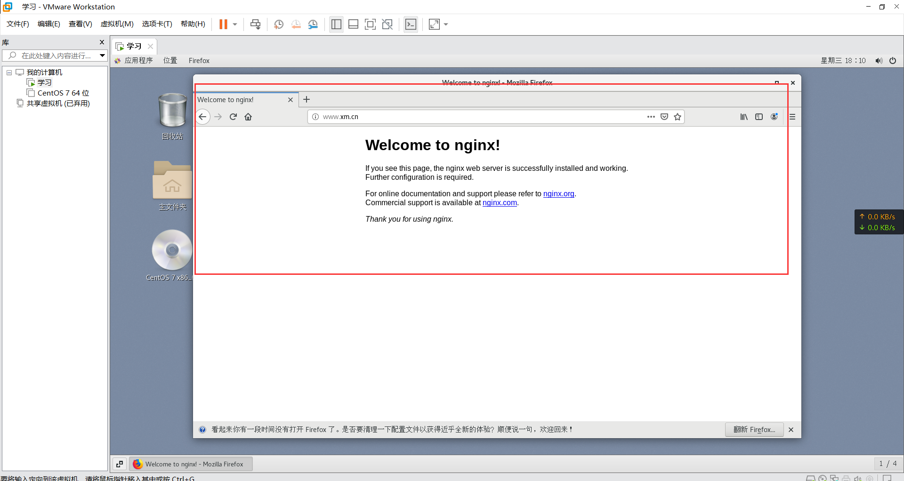
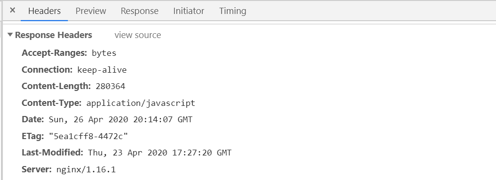
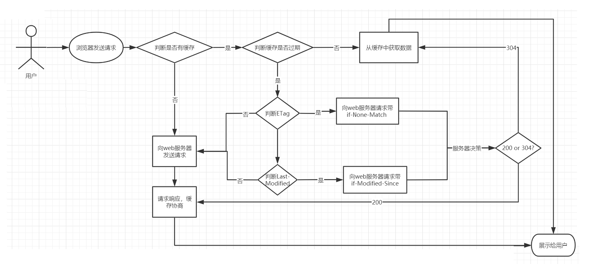

# 四、静态资源配置

## 4.1：静态资源概述

上网去搜索访问资源对于我们来说并不陌生，通过浏览器发送一个HTTP请求实现从客户端发送请求到服务器端获取所需要内容后并把内容回显展示在页面的一个过程。这个时候，我们所请
求的内容就分为两种类型，一类是静态资源、一类是动态资源。静态资源即指在服务器端真实存在并且能直接拿来展示的一些文件，比如常见的html页面、css文件、js文件、图
片、视频等资源；动态资源即指在服务器端真实存在但是要想获取需要经过一定的业务逻辑处理，根据不同的条件展示在页面不同这
一部分内容，比如说报表数据展示、根据当前登录用户展示相关具体数据等资源；

Nginx处理静态资源的内容，我们需要考虑下面这几个问题：

```java
（1）静态资源的配置指令
（2）静态资源的配置优化
（3）静态资源的压缩配置指令
（4）静态资源的缓存处理
（5）静态资源的访问控制，包括跨域问题和防盗链问题
```

## 4.2：listen监听端口

### 1.简介

listen:用来配置监听端口。

|     | 描述                                                                           |
|-----|------------------------------------------------------------------------------|
| 语法  | listen `address[:port] [default_server]...;listen port [default_server]...;` |
| 默认值 | listen *:80 \| *:8000                                                        |
| 位置  | server                                                                       |

listen的设置比较灵活，我们通过几个例子来把常用的设置方式熟悉下：

```java
listen 127.0.0.1:8000; 监听指定的IP和端口
listen localhost:8000; 监听指定的IP和端口 
listen 127.0.0.1;	监听指定IP的所有端口
listen 8000;	监听指定端口上的连接
listen *:8000;	监听指定端口上的连接

```

### 2.default_server

default_server属性是标识符，用来将此虚拟主机设置成默认主机。所谓的默认主机指的是如果没有匹配到对应的address:
port，则会默认执行的。如果不指定默认使用的是第一个server。

```java
server{
	listen 8080;
	server_name 127.0.0.1;
	location /{
		root html;
		index index.html;
	}
}
server{
	listen 8080 default_server;
	server_name localhost;
	default_type text/plain;
	return 444 'This is a error request';
}
```


## 4.3：host文件配置

为了方便学习配置一下host

hosts是一个没有扩展名的系统文件，可以用记事本等工具打开，其作用就是将一些常用的网址域名与其对应的IP地址建立一个关联“数据库”，当用户在浏览器中输入一个需要登录的网址时，系统会首先自动从hosts文件中寻找对应的IP地址，一旦找到，系统会立即打开对应网页，如果没有找到，则系统会再将网址提交DNS域名解析服务器进行IP地址的解析。

windows:C:\Windows\System32\drivers\etc

centos：/etc/hosts

因为域名是要收取一定的费用，所以我们可以使用修改hosts文件来制作一些虚拟域名来使用。需要修改 `/etc/hosts`文件来添加

```java
vim /etc/hosts
127.0.0.1 www.xm.cn
127.0.0.1 www.itxm.cn
127.0.0.1 www.itwhite.cn
```

## 4.4：server_name

### 1.简介

server_name：用来设置虚拟主机服务名称。

127.0.0.1 、 localhost 、域名[www.baidu.com | www.jd.com]

127.0.0.1 、 localhost 、域名[www.baidu.com | www.jd.com]

|     |                                              |
|-----|----------------------------------------------|
| 语法  | server_name  name ...;<br/>name可以提供多个中间用空格分隔 |
| 默认值 | server_name  "";                             |
| 位置  | server                                       |

关于server_name的配置方式有三种，分别是：

```
精确匹配
通配符匹配
正则表达式匹配
```

### 2.配置方式一：精确匹配

```java
server{
		listen 80;
		server_name www.xm.cn www.itxm.cn;
		location /{
			root html;
			index index.html;
		}
}	
```

我们在centos的游览器访问：http://192.168.244.100:80/



### 3.配置方式二：通配符

server_name中支持通配符"*",但需要注意的是通配符不能出现在域名的中间，只能出现在首段或尾段，如：

```java
server {
	listen 80;
	server_name  *.xm.cn	www.xm.*;
	# www.itcast.cn abc.itcast.cn www.itheima.cn www.itheima.com
	...
}
```

下面的配置就会报错

```java
server {
	listen 80;
	server_name  www.*.cn www.itheima.c*
	...
}
```

### 4.配置方式三:使用正则表达式配置

server_name中可以使用正则表达式，并且使用`~`作为正则表达式字符串的开始标记。

常见的正则表达式

| 代码      | 说明                                             |
|---------|------------------------------------------------|
| `^`     | 匹配搜索字符串开始位置                                    |
| `$`     | 匹配搜索字符串结束位置                                    |
| `.`     | 匹配除换行符`\n`之外的任何单个字符                            |
| `\`     | 转义字符，将下一个字符标记为特殊字符                             |
| `[xyz]` | 字符集，与任意一个指定字符匹配                                |
| `[a-z]` | 字符范围，匹配指定范围内的任何字符                              |
| `\w`    | 与以下任意字符匹配 `A-Z a-z 0-9` 和下划线,等效于`[A-Za-z0-9_]` |
| `\d`    | 数字字符匹配，等效于`[0-9] `                             |
| `{n}`   | 正好匹配`n`次                                       |
| `{n,} ` | 至少匹配`n`次                                       |
| `{n,m}` | 匹配至少`n`次至多`m`次                                 |
| `*`     | 零次或多次，等效于`{0,}`                                |
| `+`     | 一次或多次，等效于`{1,}`                                |
| `?`     | 零次或一次，等效于`{0,1}`                               |

配置如下：

```java
server{
        listen 80;
        server_name ~^www\.(\w+)\.com$;
        default_type text/plain;
        return 200 $1  $2 ..;
}
注意 ~后面不能加空格，括号可以取值
```

### 5.匹配顺序

由于server_name指令支持通配符和正则表达式，因此在包含多个虚拟主机的配置文件中，可能会出现一个名称被多个虚拟主机的server_name匹配成功，当遇到这种情况，当前的请求交给谁来处理呢？

配置如下：

```java
server{
	listen 80;
	server_name ~^www\.\w+\.com$;
	default_type text/plain;
	return 200 'regex_success';
}

server{
	listen 80;
	server_name www.itxm.*;
	default_type text/plain;
	return 200 'wildcard_after_success';
}

server{
	listen 80;
	server_name *.itxm.com;
	default_type text/plain;
	return 200 'wildcard_before_success';
}

server{
	listen 80;
	server_name www.itxm.com;
	default_type text/plain;
	return 200 'exact_success';
}

server{
	listen 80 default_server;
	server_name _;
	default_type text/plain;
	return 444 'default_server not found server';
}
```

结果

No1:准确匹配server_name

No2:通配符在开始时匹配server_name成功

No3:通配符在结束时匹配server_name成功

No4:正则表达式匹配server_name成功

No5:被默认的default_server处理，如果没有指定默认找第一个server

## 4.5：location

### 1.简介

用来设置请求的URI

|     | 描述                                                       |
|-----|----------------------------------------------------------|
| 语法  | location [  =  \|   ~  \|  ~*   \|   ^~   \|@ ] uri{...} |
| 默认值 | —                                                        |
| 位置  | server,location                                          |

uri变量是待匹配的请求字符串，可以不包含正则表达式，也可以包含正则表达式，那么nginx服务器在搜索匹配location的时候，是先使用不包含正则表达式进行匹配，找到一个匹配度最高的一个，然后在通过包含正则表达式的进行匹配，如果能匹配到直接访问，匹配不到，就使用刚才匹配度最高的那个location来处理请求。

| 模式                  | 含义                                                    |
|---------------------|-------------------------------------------------------|
| location = /uri     | = 表示精确匹配                                              |
| location ^~ /uri    | ^ 进行前缀匹配，~ 表示区分大小写                                    |
| location ~ pattern  | ~ 区分大小写的匹配                                            |
| location ~* pattern | ~* 不区分大小写的匹配                                          |
| location /uri       | 不带任何修饰符，也表示前缀匹配，但是在正则匹配之后                             |
| location /          | 通用匹配，任何未匹配到其它 location 的请求都会匹配到，相当于 switch 中的 default |
| location !~         | 区分大小写不匹配                                              |
| location !~*        | 不区分大小写不匹配                                             |

### 2.属性介绍

+ 不带符号，要求必须以指定模式开始

```java
server {
	listen 80;
	server_name 127.0.0.1;
	location /abc{
		default_type text/plain;
		return 200 "access success";
	}
}
以下访问都是正确的
http://192.168.200.133/abc
http://192.168.200.133/abc?p1=TOM
http://192.168.200.133/abc/
http://192.168.200.133/abcdef
```

+ `=` :  用于不包含正则表达式的uri前，必须与指定的模式精确匹配

```java
server {
	listen 80;
	server_name 127.0.0.1;
	location =/abc{
		default_type text/plain;
		return 200 "access success";
	}
}
可以匹配到
http://192.168.200.133/abc
http://192.168.200.133/abc?p1=TOM
匹配不到
http://192.168.200.133/abc/
http://192.168.200.133/abcdef
```

+ `~ `： 用于表示当前uri中包含了正则表达式，并且区分大小写
+ `~*`:  用于表示当前uri中包含了正则表达式，并且不区分大小写

换句话说，如果uri包含了正则表达式，需要用上述两个符合来标识

```java
server {
	listen 80;
	server_name 127.0.0.1;
	location ~^/abc\w${
		default_type text/plain;
		return 200 "access success";
	}
}
server {
	listen 80;
	server_name 127.0.0.1;
	location ~*^/abc\w${
		default_type text/plain;
		return 200 "access success";
	}
}
```

+ `^~`: 用于不包含正则表达式的uri前，功能和不加符号的一致，唯一不同的是，如果模式匹配，那么就停止搜索其他模式了。

```java
server {
	listen 80;
	server_name 127.0.0.1;
	location ^~/abc{
		default_type text/plain;
		return 200 "access success";
	}
}
```

### 3.使用示例


```java
# t.c => /index
location = / {
	proxy_pass http://127.0.0.1:8888/index;
}

# http://t.c/static/react.development.js => /test-nginx/react.development.js
location ^~ /static/ {
 	root /home/uftp/test-nginx/;
}

# http://t.c/bizhi1.jpg => /test-nginx/static/assets/bizhi1.jpg
location ~* \.(gif|jpg|jpeg|css|js|ico)$ {
	root /home/uftp/test-nginx/static/assets/;
}

# http://t.c/bizhi_sensitive.png 命中 casesensitive/bizhi_sensitive.png
location ~ \.png$ {
	root /home/uftp/test-nginx/static/casesensitive/;
}

# http://t.c/api/plmnji => http://127.0.0.1:8888/apitt/plmnji
location ^~ /api {
	proxy_pass http://127.0.0.1:8888/apitt;
}

# http://t.c/test/react/react.dev.js => http://127.0.0.1:8888/testreact/react.dev.js 不会匹配下面的规则，被上面的规则优先匹配了
# http://t.c/test/react/akkk => http://127.0.0.1:8888/testreact/akkk
location ^~ /test/react {
	proxy_pass http://127.0.0.1:8888/testreact;
}

# http://t.c/test/qwerty => http://127.0.0.1:8888/test/qwerty
location ^~ /test {
	proxy_pass http://127.0.0.1:8888/test;
}

# http://t.c/vue/dasdas => http://127.0.0.1:8888/thisisvue/dasdas
location  /vue {
	proxy_pass http://127.0.0.1:8888/thisisvue;
}
```

## 4.6：root/alias设置请求资源的目录

### 1.root设置请求的根目录

|     | 描述                   |
|-----|----------------------|
| 语法  | root path;           |
| 默认值 | root html;           |
| 位置  | http、server、location |

path为Nginx服务器接收到请求以后查找资源的根目录路径。

### 2.alias用来更改location的URI

|     | 描述          |
|-----|-------------|
| 语法  | alias path; |
| 默认值 | —           |
| 位置  | location    |

path为修改后的根路径。

以上两个指令都可以来指定访问资源的路径，那么这两者之间的区别是什么?

### 3.举例说明：

（1）在`/usr/local/nginx/html`目录下创建一个 images目录,并在目录下放入一张图片`mv.png`图片

```java
location /images {
	root /usr/local/nginx/html;
}
```

访问图片的路径为:

```java
http://192.168.200.133/images/mv.png
```

（2）如果把root改为alias

```java
location /images {
	alias /usr/local/nginx/html;
}
```

再次访问上述地址，页面会出现404的错误，查看错误日志会发现是因为地址不对，所以验证了：

```java
root的处理结果是: root路径+location路径
/usr/local/nginx/html/images/mv.png
alias的处理结果是:使用alias路径替换location路径
/usr/local/nginx/html/images
```

需要在alias后面路径改为

```java
location /images {
	alias /usr/local/nginx/html/images;
}
```

（3）如果location路径是以/结尾,则alias也必须是以/结尾，root没有要求

将上述配置修改为

```java
location /images/ {
	alias /usr/local/nginx/html/images;
}
```

访问就会出问题，查看错误日志还是路径不对，所以需要把alias后面加上 /

### 4.小结

+ root的处理结果是: root路径+location路径
+ alias的处理结果是:使用alias路径替换location路径
+ alias是一个目录别名的定义，root则是最上层目录的含义。
+ 如果location路径是以/结尾,则alias也必须是以/结尾，root没有要求

## 4.7：index指令

### 1.简介

index:设置网站的默认首页

|     | 描述                   |
|-----|----------------------|
| 语法  | index file ...;      |
| 默认值 | index index.html;    |
| 位置  | http、server、location |

index后面可以跟多个设置，如果访问的时候没有指定具体访问的资源，则会依次进行查找，找到第一个为止。

### 2.举例说明

```java
location / {
	root /usr/local/nginx/html;
	index index.html index.htm;
}
访问该location的时候，可以通过 http://ip:port/，地址后面如果不添加任何内容，则默认依次访问index.html和index.htm，找到第一个来进行返回
```

## 4.8：error_page指令

### 1.简介

error_page:设置网站的错误页面

|     | 描述                                       |
|-----|------------------------------------------|
| 语法  | `error_page code ... [=[response]] uri;` |
| 默认值 | —                                        |
| 位置  | http、server、location......               |

当出现对应的响应code后，如何来处理。

### 2.举例说明

（1）可以指定具体跳转的地址

```java
server {
	error_page 404 http://www.itcast.cn;
}
```

（2）可以指定重定向地址

```java
server{
	error_page 404 /50x.html;
	error_page 500 502 503 504 /50x.html;
	location =/50x.html{
		root html;
	}
}
```

（3）使用location的@符合完成错误信息展示

```java
server{
	error_page 404 @jump_to_error;
	location @jump_to_error {
		default_type text/plain;
		return 404 'Not Found Page...';
	}
}
```

可选项`=[response]`的作用是用来将相应代码更改为另外一个

```java
server{
	error_page 404 =200 /50x.html;
	location =/50x.html{
		root html;
	}
}
这样的话，当返回404找不到对应的资源的时候，在浏览器上可以看到，最终返回的状态码是200，这块需要注意下，编写error_page后面的内容，404后面需要加空格，200前面不能加空格
```

## 4.9：静态资源优化配置语法

### 1.简介

Nginx对静态资源如何进行优化配置。这里从三个属性配置进行优化：

```java
sendfile on;
tcp_nopush on;
tcp_nodeplay on;
```

### 2.sendfile用来开启高效的文件传输模式

|     | 描述                      |
|-----|-------------------------|
| 语法  | sendfile on \|off;        |
| 默认值 | sendfile off;             |
| 位置  | http、server、location... |

请求静态资源的过程：客户端通过网络接口向服务端发送请求，操作系统将这些客户端的请求传递给服务器端应用程序，服务器端应用程序会处理这些请求，请求处理完成以后，操作系统还需要将处理得到的结果通过网络适配器传递回去。

如：

```java
server {
	listen 80;
	server_name localhost；
	location / {
		root html;
		index index.html;
	}
}
在html目录下有一个welcome.html页面，访问地址
http://192.168.200.133/welcome.html
```


### 3.tcp_nopush主要是用来提升网络包的传输'效率'

该指令必须**在sendfile打开的状态下才会生效**，主要是用来提升网络包的传输'效率'

|     | 描述                   |
|-----|----------------------|
| 语法  | tcp_nopush on\|off;  |
| 默认值 | tcp_nopush off;       |
| 位置  | http、server、location |

### 4.tcp_nodelay提高网络包传输的'实时性'

该指令必须在**keep-alive连接开启的情况下才生效**，来提高网络包传输的'实时性'

|     | 描述                   |
|-----|----------------------|
| 语法  | tcp_nodelay on\|off; |
| 默认值 | tcp_nodelay on;      |
| 位置  | http、server、location |


### 5.总结

经过刚才的分析，"tcp_nopush"和”tcp_nodelay“看起来是"互斥的"
，那么为什么要将这两个值都打开，这个大家需要知道的是在linux2.5.9以后的版本中两者是可以兼容的，三个指令都开启的好处是，sendfile可以开启高效的文件传输模式，tcp_nopush开启可以确保在发送到客户端之前数据包已经充分“填满”，
这大大减少了网络开销，并加快了文件发送的速度。 然后，当它到达最后一个可能因为没有“填满”而暂停的数据包时，Nginx会忽略tcp_nopush参数，
然后，tcp_nodelay强制套接字发送数据。由此可知，TCP_NOPUSH可以与TCP_NODELAY一起设置，它比单独配置TCP_NODELAY具有更强的性能。所以我们可以使用如下配置来优化Nginx静态资源的处理

```java
sendfile on;
tcp_nopush on;
tcp_nodelay on;
```

## 4.10：Nginx静态资源压缩实战

### 1.简介

经过上述内容的优化，我们再次思考一个问题，假如在满足上述优化的前提下，我们传送一个1M的数据和一个10M的数据那个效率高?，答案显而易见，传输内容小，速度就会快。那么问题又来了，同样的内容，如果把大小降下来，我们脑袋里面要蹦出一个词就是"
压缩"，接下来，我们来学习Nginx的静态资源压缩模块。

在Nginx的配置文件中可以通过配置gzip来对静态资源进行压缩，相关的指令可以配置在http块、server块和location块中，Nginx可以通过

```java
ngx_http_gzip_module模块
ngx_http_gzip_static_module模块
ngx_http_gunzip_module模块
```

对这些指令进行解析和处理。

### 2.什么是GZIP

**GZIP是网站压缩加速的一种技术，对于开启后可以加快我们网站的打开速度，原理是经过服务器压缩，客户端浏览器快速解压的原理，可以大大减少了网站的流量。
**

1.什么是GZIP答：GZIP最早由Jean-loup Gailly和Mark Adler创建，用于UNIX系统的文件压缩。我们在Linux中经常会用到后缀为.gz的文件，它们就是GZIP格式的。现今已经成为Internet
上使用非常普遍的一种数据压缩格式，或者说一种文件格式。HTTP协议上的GZIP编码是一种用来改进WEB应用程序性能的技术。大流量的WEB站点常常使用GZIP压缩技术来让用户感受更快的速度。这一般是指WWW服务器中安装的一个功能,当有人来访问这个服务器中的网站时,服务器中的这个功能就将网页内容压缩后传输到来访的电脑浏览器中显示出来.一般对纯文本内容可压缩到原大小的40％.这样传输就快了,效果就是你点击网址后会很快的显示出来.当然这也会增加服务器的负载.
一般服务器中都安装有这个功能模块的.

2.开GZIP有什么好处？答：Gzip开启以后会将输出到用户浏览器的数据进行压缩的处理，这样就会减小通过网络传输的数据量，提高浏览的速度。

### 3.gzip指令

该指令用于开启或者关闭gzip功能

|     | 描述                      |
|-----|-------------------------|
| 语法  | gzip on\|off;           |
| 默认值 | gzip off;               |
| 位置  | http、server、location... |

注意只有该指令为打开状态，下面的指令才有效果

```java
http{
   gzip on;
}
```

### 4.gzip_types指令

该指令可以根据响应页的MIME类型选择性地开启Gzip压缩功能

|     | 描述                        |
|-----|---------------------------|
| 语法  | gzip_types mime-type ...; |
| 默认值 | gzip_types text/html;     |
| 位置  | http、server、location      |

**所选择的值可以从mime.types文件中进行查找，也可以使用"*"代表所有。如果配置多个可以使用空格**

### 5.gzip_comp_level指令

该指令用于设置Gzip压缩程度，级别从1-9,

+ `1`表示要是程度最低，要是效率最高，
+ `9`刚好相反，压缩程度最高，但是效率最低最费时间。

|     | 描述                     |
|-----|------------------------|
| 语法  | gzip_comp_level level; |
| 默认值 | gzip_comp_level 1;     |
| 位置  | http、server、location   |

```java
http{
	gzip_comp_level 6;
}
```

### 6.gzip_vary指令

该指令用于设置使用Gzip进行压缩发送是否携带“Vary:Accept-Encoding”头域的响应头部。主要是告诉接收方，所发送的数据经过了Gzip压缩处理

|     | 描述                   |
|-----|----------------------|
| 语法  | gzip_vary on\|off;   |
| 默认值 | gzip_vary off;       |
| 位置  | http、server、location |


### 7.gzip_buffers指令

该指令用于处理请求压缩的缓冲区数量和大小。

|     | 描述                         |
|-----|----------------------------|
| 语法  | gzip_buffers number size;  |
| 默认值 | gzip_buffers 32 4k\|16 8k; |
| 位置  | http、server、location       |

其中number:指定Nginx服务器向系统申请缓存空间个数，size指的是每个缓存空间的大小。主要实现的是申请number个每个大小为size的内存空间。这个值的设定一般会和服务器的操作系统有关，
**所以建议此项不设置，使用默认值即可。**

```java
gzip_buffers 4 16K;	  #缓存空间大小
```

### 7.ip_disable指令

针对不同种类客户端发起的请求，可以选择性地开启和关闭Gzip功能。

|     | 描述                      |
|-----|-------------------------|
| 语法  | gzip_disable regex ...; |
| 默认值 | —                       |
| 位置  | http、server、location    |

regex:根据客户端的浏览器标志(user-agent)来设置，支持使用正则表达式。指定的浏览器标志不使用Gzip.该指令一般是用来排除一些明显不支持Gzip的浏览器。

```java
gzip_disable "MSIE [1-6]\.";
```

### 8.gzip_http_version指令

针对不同的HTTP协议版本，可以选择性地开启和关闭Gzip功能。

|     | 描述                          |
|-----|-----------------------------|
| 语法  | gzip_http_version 1.0\|1.1; |
| 默认值 | gzip_http_version 1.1;      |
| 位置  | http、server、location        |

该指令是指定使用Gzip的HTTP最低版本，**该指令一般采用默认值即可。**

### 9.gzip_min_length指令

该指令针对传输数据的大小，可以选择性地开启和关闭Gzip功能

|     | 描述                      |
|-----|-------------------------|
| 语法  | gzip_min_length length; |
| 默认值 | gzip_min_length 20;     |
| 位置  | http、server、location    |

```java
nignx计量大小的单位：bytes[字节] / kb[千字节] / M[兆]
例如: 1024 / 10k|K / 10m|M
```

Gzip压缩功能对大数据的压缩效果明显，但是如果要压缩的数据比较小的化，可能出现越压缩数据量越大的情况，因此我们需要根据响应内容的大小来决定是否使用Gzip功能，响应页面的大小可以通过头信息中的`Content-Length`
来获取。但是如何使用了Chunk编码动态压缩，该指令将被忽略。建议设置为1K或以上。

### 10.gzip_proxied指令

该指令设置是否对服务端返回的结果进行Gzip压缩。

|     | 描述                                                                                                  |
|-----|-----------------------------------------------------------------------------------------------------|
| 语法  | gzip_proxied  off\|expired\|no-cache\|<br/>no-store\|private\|no_last_modified\|no_etag\|auth\|any; |
| 默认值 | gzip_proxied off;                                                                                   |
| 位置  | http、server、location                                                                                |

+ off - 关闭Nginx服务器对后台服务器返回结果的Gzip压缩
+ expired - 启用压缩，如果header头中包含 "Expires" 头信息
+ no-cache - 启用压缩，如果header头中包含 "Cache-Control:no-cache" 头信息
+ no-store - 启用压缩，如果header头中包含 "Cache-Control:no-store" 头信息
+ private - 启用压缩，如果header头中包含 "Cache-Control:private" 头信息
+ no_last_modified - 启用压缩,如果header头中不包含 "Last-Modified" 头信息
+ no_etag - 启用压缩 ,如果header头中不包含 "ETag" 头信息
+ auth - 启用压缩 , 如果header头中包含 "Authorization" 头信息
+ any - 无条件启用压缩

### 11.Gzip压缩功能的实例配置

这些配置在很多地方可能都会用到，所以我们可以将这些内容抽取到一个配置文件中，然后通过include指令把配置文件再次加载到nginx.conf配置文件中，方法使用。

+ nginx_gzip.conf

```shell
#开启gzip功能
gzip on; 
#压缩源文件类型,根据具体的访问资源类型设定
gzip_types *;
#gzip压缩级别
gzip_comp_level 6;	 	
#进行压缩响应页面的最小长度,content-length
gzip_min_length 1024;
#缓存空间大小
gzip_buffers 4 16K;	 
#指定压缩响应所需要的最低HTTP请求版本
gzip_http_version 1.1; 	
#往头信息中添加压缩标识
gzip_vary  on;		  
#对IE6以下的版本都不进行压缩
gzip_disable "MSIE [1-6]\."; 		
#nginx作为反向代理压缩服务端返回数据的条件
gzip_proxied  off; 			
```

+ nginx.conf

```java
include nginx_gzip.conf;
```


## 4.11：Gzip和sendfile共存问题

### 1.简介

前面在讲解sendfile的时候，提到过，开启sendfile以后，在读取磁盘上的静态资源文件的时候，可以减少拷贝的次数，可以不经过用户进程将静态文件通过网络设备发送出去，但是Gzip要想对资源压缩，是需要经过用户进程进行操作的。所以如何解决两个设置的共存问题。

可以使用ngx_http_gzip_static_module模块的`gzip_static`指令来解决。

### 2.gzip_static指令

gzip_static: 检查与访问资源同名的.gz文件时，response中以gzip相关的header返回.gz文件的内容。

| 语法  | **gzip_static** on \| off \| always; |
|-----|--------------------------------------|
| 默认值 | gzip_static off;                     |
| 位置  | http、server、location                 |

添加上述命令后，会报一个错误，`unknown directive "gzip_static"`主要的原因是Nginx默认是没有添加ngx_http_gzip_static_module模块。如何来添加?

### 3.添加模块到Nginx的实现步骤

(1)查询当前Nginx的配置参数

```java
nginx -V
```

(2)将nginx安装目录下sbin目录中的nginx二进制文件进行更名

```java
cd /usr/local/nginx/sbin
mv nginx nginxold
```

(3) 进入Nginx的安装目录

```java
cd /root/nginx/core/nginx-1.16.1
```

(4)执行make clean清空之前编译的内容

```java
make clean
```

(5)使用configure来配置参数

```java
./configure --with-http_gzip_static_module
```

(6)使用make命令进行编译

```java
make
```

(7) 将objs目录下的nginx二进制执行文件移动到nginx安装目录下的sbin目录中

```java
mv objs/nginx /usr/local/nginx/sbin
```

(8)执行更新命令

```java
make upgrade
```

### 4.gzip_static测试使用

(1)直接访问`http://192.168.200.133/jquery.js`



(2)使用gzip命令进行压缩

```java
cd /usr/local/nginx/html
gzip jquery.js
```

(3)再次访问`http://192.168.200.133/jquery.js`


## 4.12：静态资源的缓存处理

### 1.什么是缓存

缓存（cache），原始意义是指访问速度比一般随机存取存储器（RAM）快的一种高速存储器，通常它不像系统主存那样使用DRAM技术，而使用昂贵但较快速的SRAM技术。缓存的设置是所有现代计算机系统发挥高性能的重要因素之一。

### 2.什么是web缓存

Web缓存是指一个Web资源（如html页面，图片，js，数据等）存在于Web服务器和客户端（浏览器）之间的副本。缓存会根据进来的请求保存输出内容的副本；当下一个请求来到的时候，如果是相同的URL，缓存会根据缓存机制决定是直接使用副本响应访问请求，还是向源服务器再次发送请求。比较常见的就是浏览器会缓存访问过网站的网页，当再次访问这个URL地址的时候，如果网页没有更新，就不会再次下载网页，而是直接使用本地缓存的网页。只有当网站明确标识资源已经更新，浏览器才会再次下载网页

### 3.web缓存的种类

+ 客户端缓存
    + 浏览器缓存
+ 服务端缓存
    + Nginx / Redis / Memcached等

### 4.浏览器缓存

是为了节约网络的资源加速浏览，浏览器在用户磁盘上对最近请求过的文档进行存储，当访问者再次请求这个页面时，浏览器就可以从本地磁盘显示文档，这样就可以加速页面的阅览.

### 5.为什么要用浏览器缓存

+ 成本最低的一种缓存实现
+ 减少网络带宽消耗
+ 降低服务器压力
+ 减少网络延迟，加快页面打开速度

### 6.浏览器缓存的执行流程

HTTP协议中和页面缓存相关的字段，我们先来认识下：

| header        | 说明                      |
|---------------|-------------------------|
| Expires       | 缓存过期的日期和时间              |
| Cache-Control | 设置和缓存相关的配置信息            |
| Last-Modified | 请求资源最后修改时间              |
| ETag          | 请求变量的实体标签的当前值，比如文件的MD5值 |



+ 用户首次通过浏览器发送请求到服务端获取数据，客户端是没有对应的缓存，所以需要发送request请求来获取数据；

+ 服务端接收到请求后，获取服务端的数据及服务端缓存的允许后，返回200的成功状态码并且在响应头上附上对应资源以及缓存信息；

+ 当用户再次访问相同资源的时候，客户端会在浏览器的缓存目录中查找是否存在响应的缓存文件

+ 如果没有找到对应的缓存文件，则走(2)步

+ 如果有缓存文件，接下来对缓存文件是否过期进行判断，过期的判断标准是(Expires),

+ 如果没有过期，则直接从本地缓存中返回数据进行展示

+ 如果Expires过期，接下来需要判断缓存文件是否发生过变化

+ 判断的标准有两个，一个是ETag(Entity Tag),一个是Last-Modified

+ 判断结果是未发生变化，则服务端返回304，直接从缓存文件中获取数据

+ 如果判断是发生了变化，重新从服务端获取数据，并根据缓存协商(服务端所设置的是否需要进行缓存数据的设置)来进行数据缓存。

### 7.expires指令

expires:该指令用来控制页面缓存的作用。可以通过该指令控制HTTP应答中的“Expires"和”Cache-Control"

|     | 语法                                                   |
|-----|------------------------------------------------------|
| 语法  | expires   `[modified] time expires epoch\|max\|off;` |
| 默认值 | expires off;                                         |
| 位置  | http、server、location                                 |

+ time:可以整数也可以是负数，指定过期时间，如果是负数，Cache-Control则为no-cache,如果为整数或0，则Cache-Control的值为max-age=time;

+ epoch: 指定Expires的值为'1 January,1970,00:00:01 GMT'(1970-01-01 00:00:00)，Cache-Control的值no-cache

+ max:指定Expires的值为'31 December2037 23:59:59GMT' (2037-12-31 23:59:59) ，Cache-Control的值为10年

+ off:默认不缓存。

### 8.add_header指令

add_header指令是用来添加指定的响应头和响应值。

| 语法  | add_header name value [always]; |
|-----|---------------------------------|
| 默认值 | —                               |
| 位置  | http、server、location...         |

Cache-Control作为响应头信息，可以设置如下值：

缓存响应指令：

```properties
Cache-control: must-revalidate
Cache-control: no-cache
Cache-control: no-store
Cache-control: no-transform
Cache-control: public
Cache-control: private
Cache-control: proxy-revalidate
Cache-Control: max-age=<seconds>
Cache-control: s-maxage=<seconds>
```

| 指令               | 说明                      |
|------------------|-------------------------|
| must-revalidate  | 可缓存但必须再向源服务器进行确认        |
| no-cache         | 缓存前必须确认其有效性             |
| no-store         | 不缓存请求或响应的任何内容           |
| no-transform     | 代理不可更改媒体类型              |
| public           | 可向任意方提供响应的缓存            |
| private          | 仅向特定用户返回响应              |
| proxy-revalidate | 要求中间缓存服务器对缓存的响应有效性再进行确认 |
| max-age=<秒>      | 响应最大Age值                |
| s-maxage=<秒>     | 公共缓存服务器响应的最大Age值        |

max-age=[秒]：

## 4.13：跨域处理

### 1.同源策略

浏览器的同源策略：是一种约定，是浏览器最核心也是最基本的安全功能，如果浏览器少了同源策略，则浏览器的正常功能可能都会受到影响。

同源:  协议、域名(IP)、端口相同即为同源

```java
http://192.168.200.131/user/1
https://192.168.200.131/user/1
不

http://192.168.200.131/user/1
http://192.168.200.132/user/1
不

http://192.168.200.131/user/1
http://192.168.200.131:8080/user/1
不

http://www.nginx.com/user/1
http://www.nginx.org/user/1
不

http://192.168.200.131/user/1
http://192.168.200.131:8080/user/1
不

http://www.nginx.org:80/user/1
http://www.nginx.org/user/1
满足
```

### 2.跨域问题

简单描述下:

**有两台服务器分别为A,B,如果从服务器A的页面发送异步请求到服务器B获取数据，如果服务器A和服务器B不满足同源策略，则就会出现跨域问题。
**

### 3.跨域问题的案例演示

#### 简介

出现跨域问题会有什么效果?,接下来通过一个需求来给大家演示下：


#### nginx的html目录下新建一个a.html

```html

<html>
<head>
    <meta charset="utf-8">
    <title>跨域问题演示</title>
    <script src="jquery.js"></script>
    <script>
        $(function () {
            $("#btn").click(function () {
                $.get('http://192.168.244.100:8080/getUser', function (data) {
                    alert(JSON.stringify(data));
                });
            });
        });
    </script>
</head>
<body>
<input type="button" value="获取数据" id="btn"/>
</body>
</html>

```

#### 在nginx.conf配置如下内容

```java
server{
        listen  8080;
        server_name localhost;
        location /getUser{
                default_type application/json;
                return 200 '{"id":1,"name":"TOM","age":18}';
        }
}
server{
	listen 	80;
	server_name localhost;
	location /{
		root html;
		index index.html;
	}
}
```

#### 通过浏览器访问测试


#### 解决方案

使用add_header指令，该指令可以用来添加一些头信息

|     | 语法                        |
|-----|---------------------------|
| 语法  | add_header name  value... |
| 默认值 | —                         |
| 位置  | http、server、location      |

此处用来解决跨域问题，需要添加两个头信息，一个是`Access-Control-Allow-Origin`,`Access-Control-Allow-Methods`

+ Access-Control-Allow-Origin: 直译过来是允许跨域访问的源地址信息，可以配置多个(多个用逗号分隔)，也可以使用`*`代表所有源

+ Access-Control-Allow-Methods:直译过来是允许跨域访问的请求方式，值可以为 GET POST PUT DELETE...,可以全部设置，也可以根据需要设置，多个用逗号分隔

具体配置方式

```java
location /getUser{
    add_header Access-Control-Allow-Origin *;
    add_header Access-Control-Allow-Methods GET,POST,PUT,DELETE;
    default_type application/json;
    return 200 '{"id":1,"name":"TOM","age":18}';
}
```

## 4.15：静态资源防盗链

### 1.什么是资源盗链

资源盗链指的是此内容不在自己服务器上，而是通过技术手段，绕过别人的限制将别人的内容放到自己页面上最终展示给用户。以此来盗取大网站的空间和流量。简而言之就是用别人的东西成就自己的网站。

效果演示

京东:https://img14.360buyimg.com/n7/jfs/t1/101062/37/2153/254169/5dcbd410E6d10ba22/4ddbd212be225fcd.jpg

百度:https://pics7.baidu.com/feed/cf1b9d16fdfaaf516f7e2011a7cda1e8f11f7a1a.jpeg?token=551979a23a0995e5e5279b8fa1a48b34&s=BD385394D2E963072FD48543030030BB

我们自己准备一个页面，在页面上引入这两个图片查看效果


从上面的效果，可以看出来，下面的图片地址添加了防止盗链的功能，京东这边我们可以直接使用其图片。

### 2.Nginx防盗链的实现原理

了解防盗链的原理之前，我们得先学习一个HTTP的头信息Referer,当浏览器向web服务器发送请求的时候，一般都会带上Referer,来告诉浏览器该网页是从哪个页面链接过来的。


后台服务器可以根据获取到的这个Referer信息来判断是否为自己信任的网站地址，如果是则放行继续访问，如果不是则可以返回403(
服务端拒绝访问)的状态信息。

在本地模拟上述的服务器效果：


Nginx防盗链的具体实现:

valid_referers:
nginx会通就过查看referer自动和valid_referers后面的内容进行匹配，如果匹配到了就将$invalid_referer变量置0，如果没有匹配到，则将\$invalid_referer变量置为1，匹配的过程中不区分大小写。

|     | 描述                                                    |
|-----|-------------------------------------------------------|
| 语法  | valid_referers none\|blocked\|server_names\|string... |
| 默认值 | —                                                     |
| 位置  | server、location                                       |

+ none: 如果Header中的Referer为空，允许访问

+ blocked:在Header中的Referer不为空，但是该值被防火墙或代理进行伪装过，如不带"http://" 、"https://"等协议头的资源允许访问。

+ server_names:指定具体的域名或者IP

+ string: 可以支持正则表达式和*的字符串。如果是正则表达式，需要以`~`开头表示，例如

```java
location ~*\.(png|jpg|gif){
           valid_referers none blocked www.baidu.com 192.168.200.222 *.example.com example.*  www.example.org  ~\.google\.;
           if ($invalid_referer){
                return 403;
           }
           root /usr/local/nginx/html;

}
```

遇到的问题:图片有很多，该如何批量进行防盗链？

### 3.针对目录进行防盗链

配置如下：

```java
location /images {
           valid_referers none blocked www.baidu.com 192.168.200.222 *.example.com example.*  www.example.org  ~\.google\.;
           if ($invalid_referer){
                return 403;
           }
           root /usr/local/nginx/html;

}
```

这样我们可以对一个目录下的所有资源进行翻到了操作。

遇到的问题：Referer的限制比较粗，比如随意加一个Referer，上面的方式是无法进行限制的。那么这个问题改如何解决？

此处我们需要用到Nginx的第三方模块`ngx_http_accesskey_module`，第三方模块如何实现盗链，如果在Nginx中使用第三方模块的功能，这些我们在后面的Nginx的模块篇再进行详细的讲解。


