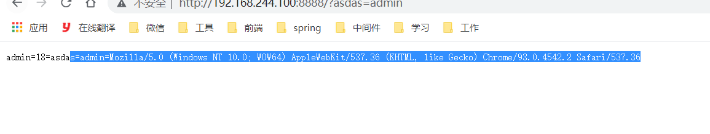
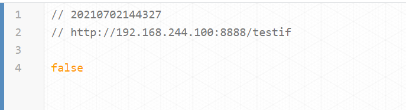
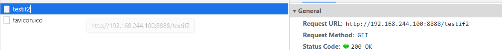
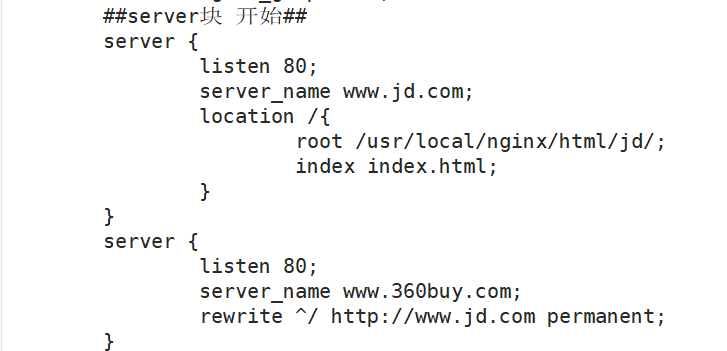
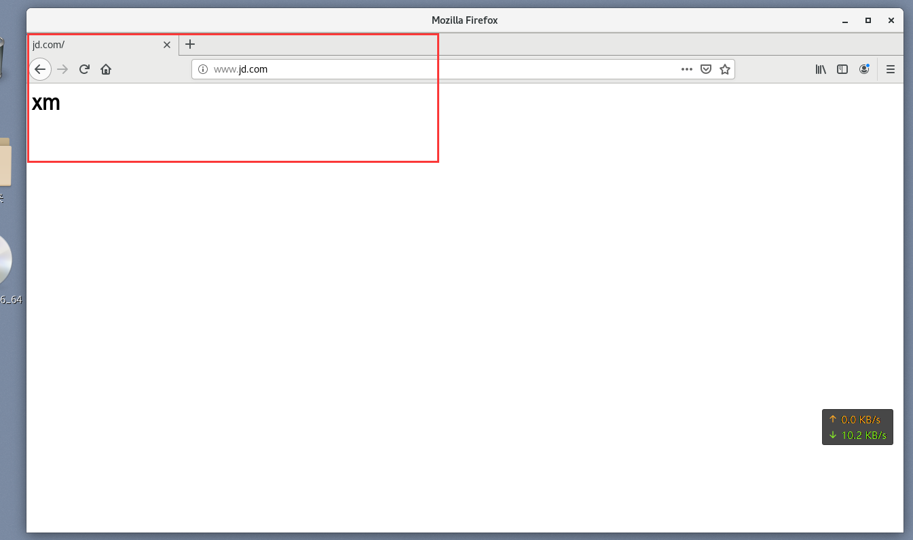
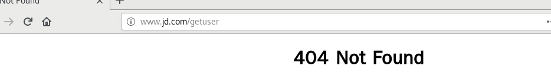

# 五、Rewrite功能配置

## 5.1：简介

Rewrite是Nginx服务器提供的一个重要基本功能，是Web服务器产品中几乎必备的功能。主要的作用是用来实现URL的重写。

注意:
Nginx服务器的Rewrite功能的实现依赖于PCRE的支持，因此在编译安装Nginx服务器之前，需要安装PCRE库。Nginx使用的是`ngx_http_rewrite_module`
模块来解析和处理Rewrite功能的相关配置。

## 5.2："地址重写"与"地址转发"

重写和转发的区别:

+ 地址重写浏览器地址会发生变化而地址转发则不变
+ 一次地址重写会产生两次请求而一次地址转发只会产生一次请求
+ 地址重写到的页面必须是一个完整的路径而地址转发则不需要
+ 地址重写因为是两次请求所以request范围内属性不能传递给新页面而地址转发因为是一次请求所以可以传递值
+ 地址转发速度快于地址重写

## 5.3：Rewrite指令

### 1.set指令

#### 描述

该指令用来设置一个新的变量。

#### 语法

+ variable:变量的名称，该变量名称**要用`$`作为变量的第一个字符**，且不能与Nginx服务器预设的**全局变量同名。**

+ value:变量的值，可以是字符串、其他变量或者变量的组合等。
+ 直接书写变量名获取变量值

|     | 描述                   |
|-----|----------------------|
| 语法  | set $variable value; |
| 默认值 | —                    |
| 位置  | server、location、if   |

#### 示例

+ 示例代码

```java
server{
		listen 8888; 
	    server_name location;
		location / {  
				set $name admin;
				set $age 18;
				default_type text/plain;
				return 200 $name=$age;
		}
}
```

+ 游览器访问：http://192.168.244.100:8888/


### 2.Rewrite常用全局变量

#### 有哪些

| 变量                 | 说明                                                                                                                     |
|--------------------|------------------------------------------------------------------------------------------------------------------------|
| $args              | 变量中存放了请求URL中的请求指令。比如http://192.168.200.133:8080?arg1=value1&args2=value2中的"arg1=value1&arg2=value2"，功能和$query_string一样 |
| $http_user_agent   | 变量存储的是用户访问服务的代理信息(如果通过浏览器访问，记录的是浏览器的相关版本信息)                                                                            |
| $host              | 变量存储的是访问服务器的server_name值                                                                                               |
| $document_uri      | 变量存储的是当前访问地址的URI。比如http://192.168.200.133/server?id=10&name=zhangsan中的"/server"，功能和$uri一样                              |
| $document_root     | 变量存储的是当前请求对应location的root值，如果未设置，默认指向Nginx自带html目录所在位置                                                                 |
| $content_length    | 变量存储的是请求头中的Content-Length的值                                                                                            |
| $content_type      | 变量存储的是请求头中的Content-Type的值                                                                                              |
| $http_cookie       | 变量存储的是客户端的cookie信息，可以通过add_header Set-Cookie 'cookieName=cookieValue'来添加cookie数据                                       |
| $limit_rate        | 变量中存储的是Nginx服务器对网络连接速率的限制，也就是Nginx配置中对limit_rate指令设置的值，默认是0，不限制。                                                       |
| $remote_addr       | 变量中存储的是客户端的IP地址                                                                                                        |
| $remote_port       | 变量中存储了客户端与服务端建立连接的端口号                                                                                                  |
| $remote_user       | 变量中存储了客户端的用户名，需要有认证模块才能获取                                                                                              |
| $scheme            | 变量中存储了访问协议                                                                                                             |
| $server_addr       | 变量中存储了服务端的地址                                                                                                           |
| $server_name       | 变量中存储了客户端请求到达的服务器的名称                                                                                                   |
| $server_port       | 变量中存储了客户端请求到达服务器的端口号                                                                                                   |
| $server_protocol   | 变量中存储了客户端请求协议的版本，比如"HTTP/1.1"                                                                                          |
| $request_body_file | 变量中存储了发给后端服务器的本地文件资源的名称                                                                                                |
| $request_method    | 变量中存储了客户端的请求方式，比如"GET","POST"等                                                                                         |
| $request_filename  | 变量中存储了当前请求的资源文件的路径名                                                                                                    |
| $request_uri       | 变量中存储了当前请求的URI，并且携带请求参数，比如http://192.168.200.133/server?id=10&name=zhangsan中的"/server?id=10&name=zhangsan"             |

#### 使用案例

+ 代码

```java
	server{
		listen 8888; 
	    server_name location;
		location / {  
				set $name admin;
				set $age 18;
				default_type text/plain;
				return 200 $name=$age=$args=$http_user_agent;
		}
    }
```

+ 游览器访问



### 3.if指令

#### 描述

该指令用来支持条件判断，并根据条件判断结果选择不同的Nginx配置。

#### 语法

|     | 描述              |
|-----|-----------------|
| 语法  | if  (条件) {...}  |
| 默认值 | —               |
| 位置  | server、location |

#### if条件书写规则

> <font color='red'>1.变量名：如果变量名对应的值为空或者是0，if都判断为false,其他条件为true。</font>

```java
location /testif {  
			default_type text/plain;	
			set $userName '';
			if ($userName) {
				return 200 true;
		    }
			return 200 false;
}
```




> <font color='red'>2. 使用"="和"!="比较变量和字符串是否相等，满足条件为true，不满足为false</font>


注意：此处和Java不太一样的地方是字符串不需要添加引号。

```java
location /testif2 {  
	default_type text/plain;	
	if ($request_method = POST){
			return 405;
	}
	return 200 ;
}
```




> <font color='red'>3.
> 使用正则表达式对变量进行匹配，匹配成功返回true，否则返回false。变量与正则表达式之间使用`~` ,`~*` ,`!~` ,`!~\*`
> 来连接。</font>

+ `~`代表匹配正则表达式过程中区分大小写，

+ `~\`代表匹配正则表达式过程中不区分大小写

+ `!~` 和 `!~\*`刚好和上面取相反值，如果匹配上返回false,匹配不上返回true

注意：正则表达式字符串一般不需要加引号，但是如果字符串中包含"`}`"或者是"`;`"等字符时，就需要把引号加上。

```java
if ($http_user_agent ~ Mozilla){
				return 200 '$http_user_agent的值中是否包含MSIE字符串，如果包含返回true';
}
```

> <font color='red'>4.判断请求的文件是否存在使用"-f"和"!-f",</font>


当使用"-f"时，如果请求的文件存在返回true，不存在返回false。

当使用"!f"时，如果请求文件不存在，但该文件所在目录存在返回true,文件和目录都不存在返回false,如果文件存在返回false

```
if (-f $request_filename){
	#判断请求的文件是否存在
}
if (!-f $request_filename){
	#判断请求的文件是否不存在
}
```

> <font color='red'>5.判断请求的目录是否存在使用"-d"和"!-d",</font>


当使用"-d"时，如果请求的目录存在，if返回true，如果目录不存在则返回false

当使用"!-d"时，如果请求的目录不存在但该目录的上级目录存在则返回true，该目录和它上级目录都不存在则返回false,如果请求目录存在也返回false.


> <font color='red'>6.判断请求的目录或者文件是否存在使用"-e"和"!-e"</font>


当使用"-e",如果请求的目录或者文件存在时，if返回true,否则返回false.

当使用"!-e",如果请求的文件和文件所在路径上的目录都不存在返回true,否则返回false


> <font color='red'>7.判断请求的文件是否可执行使用"-x"和"!-x"</font>


当使用"-x",如果请求的文件可执行，if返回true,否则返回false

当使用"!-x",如果请求文件不可执行，返回true,否则返回false

### 4.break指令

#### 简介

该指令用于中断当前相同作用域中的其他Nginx配置。与该指令处于同一作用域的Nginx配置中**
，位于它前面的指令配置生效，位于后面的指令配置无效。**

|     | 描述                 |
|-----|--------------------|
| 语法  | break;             |
| 默认值 | —                  |
| 位置  | server、location、if |

#### 例子

```java
location /{
	if ($param){
		set $id $1;
		break;
		limit_rate 10k;
	}
}
```

### 5.return指令

该指令用于完成对请求的处理，**直接向客户端返回响应状态代码**。**在return后的所有Nginx配置都是无效的。**

|     | 描述                                                       |
|-----|----------------------------------------------------------|
| 语法  | return code [text];<br/>return code URL;<br/>return URL; |
| 默认值 | —                                                        |
| 位置  | server、location、if                                       |

+ code:为返回给客户端的HTTP状态代理。可以返回的状态代码为0~999的任意HTTP状态代理
+ text:为返回给客户端的响应体内容，支持变量的使用
+ URL:为返回给客户端的URL地址

### 6.rewrite指令

#### 简介

**该指令通过正则表达式的使用来改变`URI`。可以同时存在一个或者多个指令，按照顺序依次对`URL`进行匹配和处理。**

+ URI:统一资源标识符
+ URL:统一资源定位符

#### 语法

```java
rewrite  <regex>(正则) <replacement>(跳转后的内容)  [flag] （rewrite支持的flag标记）
```

|     | 描述                                |
|-----|-----------------------------------|
| 语法  | rewrite regex replacement [flag]; |
| 默认值 | —                                 |
| 位置  | server、location、if                |

+ regex：用来匹配URI的正则表达式
+ replacement：匹配成功后，用于替换URI中被截取内容的字符串。如果该字符串是以"http://"或者"https://"
  开头的，则不会继续向下对URI进行其他处理，而是直接返回重写后的URI给客户端。
+ flag：用来设置rewrite对URI的处理行为，可选值有如下：
    + last:   本条规则匹配完成后继续向下匹配新的location URI规
    + break 本条规则匹配完成后终止，不在匹配任何规则
    + redirect 返回302临时重定向
    + permanent 返回301永久重定向

#### 使用详情

> <font color='red'>1.regex:用来匹配URI的正则表达式</font>
>
> <font color='red'>2.replacement:匹配成功后，用于替换URI中被截取内容的字符串。如果该字符串是以"http://"或者"https://"
> 开头的，则不会继续向下对URI进行其他处理，而是直接返回重写后的URI给客户端。</font>

```java
location rewrite {
	rewrite ^/rewrite/url\w*$ https://www.baidu.com;
	rewrite ^/rewrite/(test)\w*$ /$1;
	rewrite ^/rewrite/(demo)\w*$ /$1;
}
location /test{
	default_type text/plain;
	return 200 test_success;
}
location /demo{
	default_type text/plain;
	return 200 demo_success;
}
```

> <font color='red'>3.flag:用来设置rewrite对URI的处理行为，可选值有如下：</font>

- **last:
  终止继续在本location块中处理接收到的URI，并将此处重写的URI作为一个新的URI，使用各location块进行处理。该标志将重写后的URI重写在server块中执行，为重写后的URI提供了转入到其他location块的机会。
  **

```java
location rewrite {
	rewrite ^/rewrite/(test)\w*$ /$1 last;
	rewrite ^/rewrite/(demo)\w*$ /$1 last;
}
location /test{
	default_type text/plain;
	return 200 test_success;
}
location /demo{
	default_type text/plain;
	return 200 demo_success;
}
```

访问 `http://192.168.200.133:8081/rewrite/testabc`,能正确访问


- **break：将此处重写的URI作为一个新的URI,在本块中继续进行处理。该标志将重写后的地址在当前的location块中执行，不会将新的URI转向其他的location块。
  **

```java
location rewrite {
    #/test   /usr/local/nginx/html/test/index.html
	rewrite ^/rewrite/(test)\w*$ /$1 break;
	rewrite ^/rewrite/(demo)\w*$ /$1 break;
}
location /test{
	default_type text/plain;
	return 200 test_success;
}
location /demo{
	default_type text/plain;
	return 200 demo_success;
}
```

访问 `http://192.168.200.133:8081/rewrite/demoabc`,页面报404错误


- **redirect：将重写后的URI返回给客户端，状态码为302，指明是临时重定向URI,主要用在replacement变量不是以"http://"或者"
  https://"开头的情况。**

```java
location rewrite {
	rewrite ^/rewrite/(test)\w*$ /$1 redirect;
	rewrite ^/rewrite/(demo)\w*$ /$1 redirect;
}
location /test{
	default_type text/plain;
	return 200 test_success;
}
location /demo{
	default_type text/plain;
	return 200 demo_success;
}
```

访问`http://192.168.200.133:8081/rewrite/testabc`请求会被临时重定向，浏览器地址也会发生改变

- **permanent：将重写后的URI返回给客户端，状态码为301，指明是永久重定向URI,主要用在replacement变量不是以"http://"或者"
  https://"开头的情况。**

```java
location rewrite {
	rewrite ^/rewrite/(test)\w*$ /$1 permanent;
	rewrite ^/rewrite/(demo)\w*$ /$1 permanent;
}
location /test{
	default_type text/plain;
	return 200 test_success;
}
location /demo{
	default_type text/plain;
	return 200 demo_success;
}
```

访问`http://192.168.200.133:8081/rewrite/testabc`请求会被永久重定向，浏览器地址也会发生改变

### 7.rewrite_log指令

该指令配置是否开启URL重写日志的输出功能。

|     | 描述                      |
|-----|-------------------------|
| 语法  | rewrite_log on\|off;    |
| 默认值 | rewrite_log off;        |
| 位置  | http、server、location、if |

开启后，URL重写的相关日志将以notice级别输出到error_log指令配置的日志文件汇总。

### 8.Rewrite实用案例

#### 问题分析

先来看一个效果，如果我们想访问京东网站，大家都知道我们可以输入`www.jd.com`,但是同样的我们也可以输入`www.360buy.com`
同样也都能访问到京东网站。这个其实是因为京东刚开始的时候域名就是www.360buy.com，后面由于各种原因把自己的域名换成了www.jd.com,
虽然说域名变量，但是对于以前只记住了www.360buy.com的用户来说，我们如何把这部分用户也迁移到我们新域名的访问上来，针对于这个问题，我们就可以使用Nginx中Rewrite的域名跳转来解决。

#### 环境准备

- 准备两个域名  www.360buy.com | www.jd.com

```java
vim /etc/hosts
```

```java
192.168.244.100 www.360buy.com
192.168.244.100 www.jd.com
```

- 在/usr/local/nginx/html/jd目录下创建一个访问页面

```html
<html>
	<title></title>
	<body>
		<h1>欢迎来到我们的网站</h1>
	</body>
</html>
```

- 通过Nginx实现当访问www.访问到系统的首页

```java
server {
	listen 80;
	server_name www.jd.com;
	location /{
		root /usr/local/nginx/html/jd;
		index index.html;
	}
}
```

#### 配置跳转

+ 通过Rewrite完成将www.360buy.com的请求跳转到www.jd.com

```java
server {
	listen 80;
	server_name www.360buy.com;
	rewrite ^/ http://www.jd.com permanent;
}
```

+ 配置



#### 测试

虚拟机内部游览器访问：



#### 问题描述:如何在域名跳转的过程中携带请求的URI？

修改配置信息

```java
server {
	listen 80;
	server_name www.xm.cn;
	rewrite ^(.*) http://www.jd.com$1 permanent;
}
```

虚拟机内部游览：www.xm.cn



#### 多域名跳转

问题描述:我们除了上述说的www.jd.com 、www.360buy.com其实还有我们也可以通过www.jingdong.com来访问，那么如何通过Rewrite来实现多个域名的跳转?

+ 添加域名

```java
vim /etc/hosts
192.168.200.133 www.jingdong.com
```

+ 修改配置信息

```java
server{
	listen 80;
	server_name www.360buy.com www.jingdong.com;
	rewrite ^(.*) http://www.jd.com$1 permanent;
}
```

#### 域名镜像

上述案例中，将www.360buy.com 和 www.jingdong.com都
能跳转到www.jd.com，那么www.jd.com我们就可以把它起名叫主域名，其他两个就是我们所说的镜像域名，当然如果我们不想把整个网站做镜像，只想为其中某一个子目录下的资源做镜像，我们可以在location块中配置rewrite功能，比如:

```java
server {
	listen 80;
	server_name rewrite.myweb.com;
	location ^~ /source1{
		rewrite ^/resource1(.*) http://rewrite.myweb.com/web$1 last;
	}
	location ^~ /source2{
		rewrite ^/resource2(.*) http://rewrite.myweb.com/web$1 last;
	}
}
```

#### 独立域名

一个完整的项目包含多个模块，比如购物网站有商品商品搜索模块、商品详情模块已经购物车模块等，那么我们如何为每一个模块设置独立的域名。

需求：

```java
http://search.xm.com  访问商品搜索模块
http://item.xm.com	  访问商品详情模块
http://cart.xm.com	  访问商品购物车模块
```

```java
server{
	listen 80;
	server_name search.xm.com;
	rewrite ^(.*) http://www.hm.com/bbs$1 last;
}
server{
	listen 81;
	server_name item.xm.com;
	rewrite ^(.*) http://www.hm.com/item$1 last;
}
server{
	listen 82;
	server_name cart.xm.com;
	rewrite ^(.*) http://www.hm.com/cart$1 last;
}
```

#### 目录自动添加"/"

问题描述

通过一个例子来演示下问题:

```java
server {
	listen	80;
	server_name localhost;
	location / {
		root html;
		index index.html;
	}
}

```

要想访问上述资源，很简单，只需要通过http:
//192.168.200.133直接就能访问，地址后面不需要加/,但是如果将上述的配置修改为如下内容:

```java
server {
	listen	80;
	server_name localhost;
	location /hm {
		root html;
		index index.html;
	}
}
```

这个时候，要想访问上述资源，按照上述的访问方式，我们可以通过http:
//192.168.200.133/hm/来访问,但是如果地址后面不加斜杠，页面就会出问题。如果不加斜杠，Nginx服务器内部会自动做一个301的重定向，重定向的地址会有一个指令叫server_name_in_redirect
on|off;来决定重定向的地址：

```java
如果该指令为on
	重定向的地址为:  http://server_name/目录名/;
如果该指令为off
	重定向的地址为:  http://原URL中的域名/目录名/;
```

所以就拿刚才的地址来说，http://192.168.200.133/hm如果不加斜杠，那么按照上述规则，如果指令server_name_in_redirect为on，则301重定向地址变为 http://localhost/hm/,如果为off，则301重定向地址变为http://192.168.200.133/ht/。后面这个是正常的，前面地址就有问题。

注意server_name_in_redirect指令在Nginx的0.8.48版本之前默认都是on，之后改成了off,所以现在我们这个版本不需要考虑这个问题，但是如果是0.8.48以前的版本并且server_name_in_redirect设置为on，我们如何通过rewrite来解决这个问题？

解决方案

我们可以使用rewrite功能为末尾没有斜杠的URL自动添加一个斜杠

```java
server {
	listen	80;
	server_name localhost;
	server_name_in_redirect on;
	location /hm {
		if (-d $request_filename){
			rewrite ^/(.*)([^/])$ http://$host/$1$2/ permanent;
		}
	}
}
```

#### 合并目录

搜索引擎优化(SEO)
是一种利用搜索引擎的搜索规则来提供目的网站的有关搜索引擎内排名的方式。我们在创建自己的站点时，可以通过很多中方式来有效的提供搜索引擎优化的程度。其中有一项就包含URL的目录层级一般不要超过三层，否则的话不利于搜索引擎的搜索也给客户端的输入带来了负担，但是将所有的文件放在一个目录下又会导致文件资源管理混乱并且访问文件的速度也会随着文件增多而慢下来，这两个问题是相互矛盾的，那么使用rewrite如何解决上述问题?

举例，网站中有一个资源文件的访问路径时
/server/11/22/33/44/20.html,也就是说20.html存在于第5级目录下，如果想要访问该资源文件，客户端的URL地址就要写成 `http://www.web.name/server/11/22/33/44/20.html`,

```java
server {
	listen 80;
	server_name www.web.name;
	location /server{
		root html;
	}
}
```

但是这个是非常不利于SEO搜索引擎优化的，同时客户端也不好记.使用rewrite我们可以进行如下配置:

```java
server {
	listen 80;
	server_name www.web.name;
	location /server{
		rewrite ^/server-([0-9]+)-([0-9]+)-([0-9]+)-([0-9]+)\.html$ /server/$1/$2/$3/$4/$5.html last;
	}
}
```

这样的花，客户端只需要输入http://www.web.name/server-11-22-33-44-20.html就可以访问到20.html页面了。这里也充分利用了rewrite指令支持正则表达式的特性。

#### 防盗链

防盗链之前我们已经介绍过了相关的知识，在rewrite中的防盗链和之前将的原理其实都是一样的，只不过通过rewrite可以将防盗链的功能进行完善下，当出现防盗链的情况，我们可以使用rewrite将请求转发到自定义的一张图片和页面，给用户比较好的提示信息。下面我们就通过根据文件类型实现防盗链的一个配置实例:

```java
server{
	listen 80;
	server_name www.web.com;
	locatin ~* ^.+\.(gif|jpg|png|swf|flv|rar|zip)${
		valid_referers none blocked server_names *.web.com;
		if ($invalid_referer){
			rewrite ^/ http://www.web.com/images/forbidden.png;
		}
	}
}
```

根据目录实现防盗链配置：

```java
server{
	listen 80;
	server_name www.web.com;
	location /file/{
		root /server/file/;
		valid_referers none blocked server_names *.web.com;
		if ($invalid_referer){
			rewrite ^/ http://www.web.com/images/forbidden.png;
		}
	}
}
```


