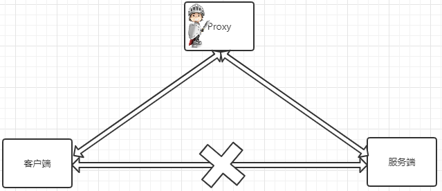
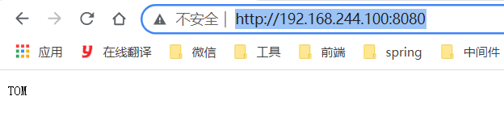

# 六、正/反向代理

## 6.1：简介

### 1. 什么是代理

代理其实就是一个中介，A和B本来可以直连，中间插入一个C，C就是中介。刚开始的时候，代理多数是帮助内网client访问外网server用的后来出现了
**反向代理**，"反向"这个词在这儿的意思其实是指方向相反，**即代理将来自外网客户端的请求转发到内网服务器，从外到内**

### 2.反向代理(图)

正向代理类似一个跳板机，代理访问外部资源

比如我们国内访问谷歌，直接访问访问不到，我们可以通过一个正向代理服务器，请求发到代理服，代理服务器能够访问谷歌，这样由代理去谷歌取到返回数据，再返回给我们，这样我们就能访问谷歌了

**正向代理的用途：**

+ 访问原来无法访问的资源，如google
+ 可以做缓存，加速访问资源
+ 对客户端访问授权，上网进行认证
+ 代理可以记录用户访问记录（上网行为管理），对外隐藏用户信息



### 3.反向代理

反向代理（Reverse
Proxy）实际运行方式是指以代理服务器来接受internet上的连接请求，然后将请求转发给内部网络上的服务器，并将从服务器上得到的结果返回给internet上请求连接的客户端，此时代理服务器对外就表现为一个服务器

#### 反向代理的作用：

+ 保证内网的安全，阻止web攻击，大型网站，通常将反向代理作为公网访问地址，Web服务器是内网

+ 负载均衡，通过反向代理服务器来优化网站的负载


### 4.总结

+ **正向代理即是客户端代理, 代理客户端, 服务端不知道实际发起请求的客户端.**

+ **反向代理即是服务端代理, 代理服务端, 客户端不知道实际提供服务的服务端**

## 6.2：正向代理案例

### 1.需求

我们本机电脑做客户端

虚拟机：192.168.244.100作为服务器

虚拟机：192.168.244.101作为代理服务器


### 2.服务端的设置

```java
http {
  log_format main 'client send request=>clientIp=$remote_addr serverIp=>$host';
	server{
		listen 80;
		server_name	localhost;
		access_log logs/access.log main;
		location {
			root html;
			index index.html index.htm;
		}
	}
}
```

### 3.测试服务端

游览器访问：

看日志输出


### 4.代理服务器设置

```java
server {

        listen  82;
        resolver 8.8.8.8;
        location /{
                proxy_pass http://$host$request_uri;
        }
    }

```

查看代理服务器的IP(192.168.244.101）和Nginx配置监听的端口(82)

### 5.客户端配置

(5)在客户端配置代理服务器


### 6.测试

(6)设置完成后，再次通过浏览器访问服务端


通过对比，上下两次的日志记录，会发现虽然我们是客户端访问服务端，但是如何使用了代理，那么服务端能看到的只是代理发送过去的请求，这样的化，就使用Nginx实现了正向代理的设置。

但是Nginx正向代理，在实际的应用中不是特别多，所以我们简单了解下，接下来我们继续学习Nginx的反向代理，这是Nginx比较重要的一个功能。

## 6.3：Nginx反向代理的配置语法

### 1.简介

Nginx反向代理模块的指令是由`ngx_http_proxy_module`模块进行解析，该模块在安装Nginx的时候已经自己加装到Nginx中了，接下来我们把反向代理中的常用指令一一介绍下：

```java
proxy_pass
proxy_set_header
proxy_redirect
```

### 2.proxy_pass

#### 简介

该指令用来设置被代理服务器地址，可以是主机名称、IP地址加端口号形式。

|     | 语法              |
|-----|-----------------|
| 语法  | proxy_pass URL; |
| 默认值 | —               |
| 位置  | location        |

URL:为要设置的被代理服务器地址，包含传输协议(`http`,`https://`)、主机名称或IP地址加端口号、URI等要素。

举例：

#### 案例1

+ 我们192.188.244.100上配置：

```java
   server{
		listen 80;
		server_name	localhost;
		location /{
			proxy_pass http://192.168.244.101;
		}
	}
```

+ 192.168.244.101

```java
    server {
        listen       80;
        server_name  localhost;
        location / {
            root   html;
            index  index.html index.htm;
        }
    }
```

+ 192.168.244.101上修改页面加上

```html
<h1>192.168.244.101</h1>
```

+ 测试


#### 问题

修改192.168.244.100的配置文件

```java
   server{
		listen 80;
		server_name	localhost;
		location /serve{
			proxy_pass http://192.168.244.101;
		}
	}
```

页面404


#### 问题解决

修改192.168.244.100的配置文件，主要在地址最后加上`/`

```java
   server{
		listen 80;
		server_name	localhost;
		location /serve{
			proxy_pass http://192.168.244.101/;
		}
	}
```

#### 大家在编写proxy_pass的时候，后面的值要不要加"/"?

接下来通过例子来说明刚才我们提到的问题：

```java
server {
	listen 80;
	server_name localhost;
	location /{
		#proxy_pass http://192.168.200.146;
		proxy_pass http://192.168.200.146/;
	}
}
当客户端访问 http://localhost/index.html,效果是一样的
server{
	listen 80;
	server_name localhost;
	location /server{
		#proxy_pass http://192.168.200.146;
		proxy_pass http://192.168.200.146/;
	}
}
当客户端访问 http://localhost/server/index.html
这个时候，第一个proxy_pass就变成了http://localhost/server/index.html
第二个proxy_pass就变成了http://localhost/index.html效果就不一样了。
```

### 3.proxy_set_header

#### 简介

该指令可以更改Nginx服务器接收到的客户端请求的请求头信息，然后将新的请求头发送给代理的服务器

需要注意的是，如果想要看到结果，必须在被代理的服务器上来获取添加的头信息。

|     | 描述                                                                        |
|-----|---------------------------------------------------------------------------|
| 语法  | proxy_set_header field value;                                             |
| 默认值 | proxy_set_header Host $proxy_host;<br/>proxy_set_header Connection close; |
| 位置  | http、server、location                                                      |

#### 被代理服务器： [192.168.244.101]

```java
server {
        listen  8080;
        server_name localhost;
        default_type text/plain;
        return 200 $http_username;
}
```

#### 代理服务器: [192.168.244.100]

```java
server {
        listen  8080;
        server_name localhost;
        location / {
            proxy_pass http://192.168.244.101:8080/;
            proxy_set_header username TOM;
        }
    }
```

#### 访问测试

http://192.168.244.100:8080/




## 6.4：proxy_redirect

#### 简介

该指令是用来重置头信息中的"Location"和"Refresh"的值。

|     | 描述                                                                                       |
|-----|------------------------------------------------------------------------------------------|
| 语法  | proxy_redirect redirect replacement;<br/>proxy_redirect default;<br/>proxy_redirect off; |
| 默认值 | proxy_redirect default;                                                                  |
| 位置  | http、server、location                                                                     |

#### 该指令的几组选项

+ proxy_redirect redirect replacement;

```java
redirect:目标,Location的值
replacement:要替换的值
```

+ proxy_redirect default;

```java
default;
将location块的uri变量作为replacement,
将proxy_pass变量作为redirect进行替换
```

+ proxy_redirect off;

```java
关闭proxy_redirect的功能
```

#### 服务端[192.168.244.101]

```java
server {
    listen  8081;
    server_name localhost;
    if (!-f $request_filename){
    	return 302 http://192.168.244.101;
    }
}
```

#### 代理服务端[192.168.200.100]

```java
server {
		listen  8081;
		server_name localhost;
		location / {
			proxy_pass http://192.168.244.101:8081/;
			proxy_redirect  http://192.168.244.101 http://192.168.244.100;
		}
	}
```

#### 测试

访问：http://192.168.244.101/abc.html

去掉100机子上的proxy_redirect属性

然后再次访问：http://192.168.244.101/abc.html

## 6.5：实战

### 1.需求


服务器1,2,3存在两种情况

```java
第一种情况: 三台服务器的内容不一样。
第二种情况: 三台服务器的内容是一样。
```

### 2.代理服务器[192.168.244.100]

```java
server {
        listen          80;
        server_name     localhost;
        location /server1 {
                proxy_pass http://192.168.244.101:9001/;
        }
        location /server2 {
                proxy_pass http://192.168.244.101:9002/;
        }
        location /server3 {
                proxy_pass http://192.168.244.101:9003/;
        }
}
```

### 3.服务端server1192.168.244.101

```java
server {
        listen          9001;
        server_name     localhost;
        default_type text/html;
        return 200 '<h1>192.168.244.101:9001</h1>'
}
```

### 4.服务端server2192.168.244.101

```java
server {
        listen          9002;
        server_name     localhost;
        default_type text/html;
        return 200 '<h1>192.168.244.101:9002</h1>'
}
```

### 5.服务端server3192.168.244.101

```java
server {
        listen          9003;
        server_name     localhost;
        default_type text/html;
        return 200 '<h1>192.168.244.102:9003</h1>'
}
```

## 6.6：反向代理系统调优

### 1.简介

反向代理值Buffer和Cache

Buffer翻译过来是"缓冲"，Cache翻译过来是"缓存"。


总结下：

| 区别  | 描述                                                                                                                                                         |
|-----|------------------------------------------------------------------------------------------------------------------------------------------------------------|
| 相同点 | 两种方式都是用来提供IO吞吐效率，都是用来提升Nginx代理的性能。                                                                                                                         |
| 不同点 | 缓冲主要用来解决不同设备之间数据传递速度不一致导致的性能低的问题，缓冲中的数据一旦此次操作完成后，就可以删除。<br/>缓存主要是备份，将被代理服务器的数据缓存一份到代理服务器，这样的话，客户端再次获取相同数据的时候，就只需要从代理服务器上获取，效率较高，缓存中的数据可以重复使用，只有满足特定条件才会删除. |

### 2.Proxy Buffer相关指令

> proxy_buffering :该指令用来开启或者关闭代理服务器的缓冲区；

| 语法  | proxy_buffering on\|off; |
|-----|--------------------------|
| 默认值 | proxy_buffering on;      |
| 位置  | http、server、location     |

> proxy_buffers:该指令用来指定单个连接从代理服务器读取响应的缓存区的个数和大小。

| 语法  | proxy_buffers number size;         |
|-----|------------------------------------|
| 默认值 | proxy_buffers 8 4k \| 8K;(与系统平台有关) |
| 位置  | http、server、location               |

number:缓冲区的个数

size:每个缓冲区的大小，缓冲区的总大小就是number*size


> proxy_buffer_size:该指令用来设置从被代理服务器获取的第一部分响应数据的大小。保持与proxy_buffers中的size一致即可，当然也可以更小。

| 语法  | proxy_buffer_size size;              |
|-----|--------------------------------------|
| 默认值 | proxy_buffer_size 4k \| 8k;(与系统平台有关) |
| 位置  | http、server、location                 |

> proxy_busy_buffers_size：该指令用来限制同时处于BUSY状态的缓冲总大小。

| 语法  | proxy_busy_buffers_size size;    |
|-----|----------------------------------|
| 默认值 | proxy_busy_buffers_size 8k\|16K; |
| 位置  | http、server、location             |

> proxy_temp_path:当缓冲区存满后，仍未被Nginx服务器完全接受，响应数据就会被临时存放在磁盘文件上，该指令设置文件路径

| 语法  | proxy_temp_path  path;      |
|-----|-----------------------------|
| 默认值 | proxy_temp_path proxy_temp; |
| 位置  | http、server、location        |

注意path最多设置三层。


> proxy_temp_file_write_size：该指令用来设置磁盘上缓冲文件的大小。

| 语法  | proxy_temp_file_write_size size;    |
|-----|-------------------------------------|
| 默认值 | proxy_temp_file_write_size 8K\|16K; |
| 位置  | http、server、location                |

通用网站的配置

```java
proxy_buffering on;
proxy_buffer_size 4 32k;
proxy_busy_buffers_size 64k;
proxy_temp_file_write_size 64k;
```

根据项目的具体内容进行相应的调节。


