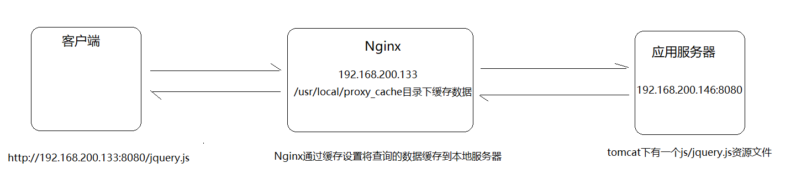

# 九、Nginx缓存集成

## 9.1：缓存的概念

### 1.简介

缓存就是数据交换的缓冲区(称作:Cache)
,当用户要获取数据的时候，会先从缓存中去查询获取数据，如果缓存中有就会直接返回给用户，如果缓存中没有，则会发请求从服务器重新查询数据，将数据返回给用户的同时将数据放入缓存，下次用户就会直接从缓存中获取数据。


### 2.缓存场景

缓存其实在很多场景中都有用到，比如：

| 场景       | 作用           |
|----------|--------------|
| 操作系统磁盘缓存 | 减少磁盘机械操作     |
| 数据库缓存    | 减少文件系统的IO操作  |
| 应用程序缓存   | 减少对数据库的查询    |
| Web服务器缓存 | 减少对应用服务器请求次数 |
| 浏览器缓存    | 减少与后台的交互次数   |

### 3.缓存优缺点

缓存的优点

​ 1.减少数据传输，节省网络流量，加快响应速度，提升用户体验；

​ 2.减轻服务器压力；

​ 3.提供服务端的高可用性；

缓存的缺点

​ 1.数据的不一致

​ 2.增加成本


## 9.2：Nginx的web缓存服务

Nginx是从0.7.48版开始提供缓存功能。Nginx是基于Proxy
Store来实现的，其原理是把URL及相关组合当做Key,在使用MD5算法对Key进行哈希，得到硬盘上对应的哈希目录路径，从而将缓存内容保存在该目录中。它可以支持任意URL连接，同时也支持404/301/302这样的非200状态码。Nginx即可以支持对指定URL或者状态码设置过期时间，也可以使用purge命令来手动清除指定URL的缓存。


## 9.3：Nginx缓存设置的相关指令

> Nginx的web缓存服务主要是使用`ngx_http_proxy_module`模块相关指令集来完成，接下来我们把常用的指令来进行介绍下。

### 1.proxy_cache_path

该指定用于设置缓存文件的存放路径

|     | 描述                                                                                                        |
|-----|-----------------------------------------------------------------------------------------------------------|
| 语法  | proxy_cache_path path [levels=number] <br/>keys_zone=zone_name:zone_size [inactive=time]\[max_size=size]; |
| 默认值 | —                                                                                                         |
| 位置  | http                                                                                                      |

path:缓存路径地址,如：

```java
/usr/local/proxy_cache
```

levels: 指定该缓存空间对应的目录，最多可以设置3层，每层取值为1|2如 :

```java
levels=1:2   缓存空间有两层目录，第一次是1个字母，第二次是2个字母
举例说明:
itheima[key]通过MD5加密以后的值为 43c8233266edce38c2c9af0694e2107d
levels=1:2   最终的存储路径为/usr/local/proxy_cache/d/07
levels=2:1:2 最终的存储路径为/usr/local/proxy_cache/7d/0/21
levels=2:2:2 最终的存储路径为??/usr/local/proxy_cache/7d/10/e2
```

keys_zone:用来为这个缓存区设置名称和指定大小，如：

```java
keys_zone=itcast:200m  缓存区的名称是itcast,大小为200M,1M大概能存储8000个keys
```

inactive:指定缓存的数据多次时间未被访问就将被删除，如：

```java
inactive=1d   缓存数据在1天内没有被访问就会被删除
```

max_size:设置最大缓存空间，如果缓存空间存满，默认会覆盖缓存时间最长的资源，如:

```java
max_size=20g
```

配置实例:

```java
http{
	proxy_cache_path /usr/local/proxy_cache keys_zone=itcast:200m  levels=1:2:1 inactive=1d max_size=20g;
}
```

### 2.proxy_cache

该指令用来开启或关闭代理缓存，如果是开启则自定使用哪个缓存区来进行缓存。

|     | 描述                          |
|-----|-----------------------------|
| 语法  | proxy_cache zone_name\|off; |
| 默认值 | proxy_cache off;            |
| 位置  | http、server、location        |

zone_name：指定使用缓存区的名称

### 3.proxy_cache_key

该指令用来设置web缓存的key值，Nginx会根据key值MD5哈希存缓存。

|     | 描述                                                |
|-----|---------------------------------------------------|
| 语法  | proxy_cache_key key;                              |
| 默认值 | proxy_cache_key \$scheme\$proxy_host$request_uri; |
| 位置  | http、server、location                              |

### 4.proxy_cache_valid

该指令用来对不同返回状态码的URL设置不同的缓存时间

|     | 描述                                 |
|-----|------------------------------------|
| 语法  | proxy_cache_valid [code ...] time; |
| 默认值 | —                                  |
| 位置  | http、server、location               |

如：

```java
proxy_cache_valid 200 302 10m;
proxy_cache_valid 404 1m;
为200和302的响应URL设置10分钟缓存，为404的响应URL设置1分钟缓存
proxy_cache_valid any 1m;
对所有响应状态码的URL都设置1分钟缓存
```

### 5.proxy_cache_min_uses

该指令用来设置资源被访问多少次后被缓存

|     | 描述                           |
|-----|------------------------------|
| 语法  | proxy_cache_min_uses number; |
| 默认值 | proxy_cache_min_uses 1;      |
| 位置  | http、server、location         |

### 6.proxy_cache_methods

该指令用户设置缓存哪些HTTP方法

|     | 描述                                   |
|-----|--------------------------------------|
| 语法  | proxy_cache_methods GET\|HEAD\|POST; |
| 默认值 | proxy_cache_methods GET HEAD;        |
| 位置  | http、server、location                 |

默认缓存HTTP的GET和HEAD方法，不缓存POST方法。

## 9.4：Nginx缓存设置案例

### 1.需求分析



### 2.步骤实现

#### 1.环境准备

应用服务器的环境准备

（1）在192.168.200.146服务器上的tomcat的webapps下面添加一个js目录，并在js目录中添加一个jquery.js文件

（2）启动tomcat

（3）访问测试

```java
http://192.168.200.146:8080/js/jquery.js
```

#### Nginx的环境准备

（1）完成Nginx反向代理配置

```java
http{
	upstream backend{
		server 192.168.200.146:8080;
	}
	server {
		listen       8080;
        server_name  localhost;
        location / {
        	proxy_pass http://backend/js/;
        }
	}
}
```

（2）完成Nginx缓存配置

#### 添加缓存配置

```java
http{
	proxy_cache_path /usr/local/proxy_cache levels=2:1 keys_zone=itcast:200m inactive=1d max_size=20g;
	upstream backend{
		server 192.168.200.146:8080;
	}
	server {
		listen       8080;
        server_name  localhost;
        location / {
        	proxy_cache itcast;
            proxy_cache_key itheima;
            proxy_cache_min_uses 5;
            proxy_cache_valid 200 5d;
            proxy_cache_valid 404 30s;
            proxy_cache_valid any 1m;
            add_header nginx-cache "$upstream_cache_status";
        	proxy_pass http://backend/js/;
        }
	}
}
```

## 9.5：Nginx缓存的清除

### 1.方式一:删除对应的缓存目录

```java
rm -rf /usr/local/proxy_cache/......
```

### 2.方式二:使用第三方扩展模块

#### ngx_cache_purge

+ 下载ngx_cache_purge模块对应的资源包，并上传到服务器上。

```java
ngx_cache_purge-2.3.tar.gz
```

+ 对资源文件进行解压缩

```java
tar -zxf ngx_cache_purge-2.3.tar.gz
```

+ 修改文件夹名称，方便后期配置

```java
mv ngx_cache_purge-2.3 purge
```

+ 查询Nginx的配置参数

```java
nginx -V
```

+ 进入Nginx的安装目录，使用./configure进行参数配置

```java
./configure --add-module=/root/nginx/module/purge
```

+ 使用make进行编译

```java
make
```

+ 将nginx安装目录的nginx二级制可执行文件备份

```java
mv /usr/local/nginx/sbin/nginx /usr/local/nginx/sbin/nginxold
```

+ 将编译后的objs中的nginx拷贝到nginx的sbin目录下

```java
cp objs/nginx /usr/local/nginx/sbin
```

+ 使用make进行升级

```java
make upgrade
```

+ 在nginx配置文件中进行如下配置

```java
server{
	location ~/purge(/.*) {
		proxy_cache_purge itcast itheima;
	}
}
```

## 9.6：Nginx设置资源不缓存

### 1.简介

前面咱们已经完成了Nginx作为web缓存服务器的使用。但是我们得思考一个问题就是不是所有的数据都适合进行缓存。比如说对于一些经常发生变化的数据。如果进行缓存的话，就很容易出现用户访问到的数据不是服务器真实的数据。所以对于这些资源我们在缓存的过程中就需要进行过滤，不进行缓存。

Nginx也提供了这块的功能设置，需要使用到如下两个指令

### 2.proxy_no_cache

该指令是用来定义不将数据进行缓存的条件。

|     | 描述                         |
|-----|----------------------------|
| 语法  | proxy_no_cache string ...; |
| 默认值 | —                          |
| 位置  | http、server、location       |

配置实例

```java
proxy_no_cache $cookie_nocache $arg_nocache $arg_comment;
```

### 3.proxy_cache_bypass

该指令是用来设置不从缓存中获取数据的条件。

|     | 描述                             |
|-----|--------------------------------|
| 语法  | proxy_cache_bypass string ...; |
| 默认值 | —                              |
| 位置  | http、server、location           |

配置实例

```java
proxy_cache_bypass $cookie_nocache $arg_nocache $arg_comment;
```

上述两个指令都有一个指定的条件，这个条件可以是多个，并且多个条件中至少有一个不为空且不等于"0"
,则条件满足成立。上面给的配置实例是从官方网站获取的，里面使用到了三个变量，分别是\$cookie_nocache、\$arg_nocache、\$arg_comment

### 4.$cookie_nocache、\$arg_nocache、\$arg_comment

这三个参数分别代表的含义是:

```java
$cookie_nocache
指的是当前请求的cookie中键的名称为nocache对应的值
$arg_nocache和$arg_comment
指的是当前请求的参数中属性名为nocache和comment对应的属性值
```

案例演示下:

```java
log_format params $cookie_nocache | $arg_nocache | $arg_comment；
server{
	listen	8081;
	server_name localhost;
	location /{
		access_log logs/access_params.log params;
		add_header Set-Cookie 'nocache=999';
		root html;
		index index.html;
	}
}
```

### 5.案例实现

设置不缓存资源的配置方案

```java
server{
	listen	8080;
	server_name localhost;
	location / {
		if ($request_uri ~ /.*\.js$){
           set $nocache 1;
        }
		proxy_no_cache $nocache $cookie_nocache $arg_nocache $arg_comment;
        proxy_cache_bypass $nocache $cookie_nocache $arg_nocache $arg_comment;
	}
}
```


