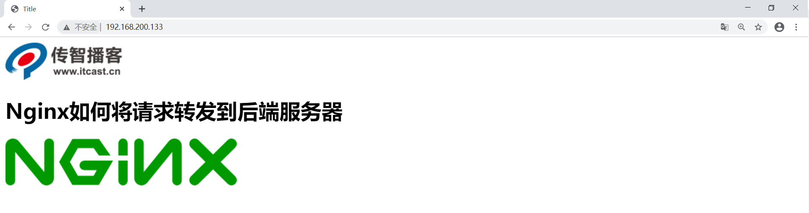
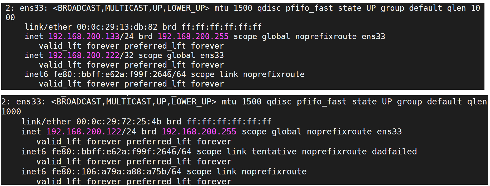
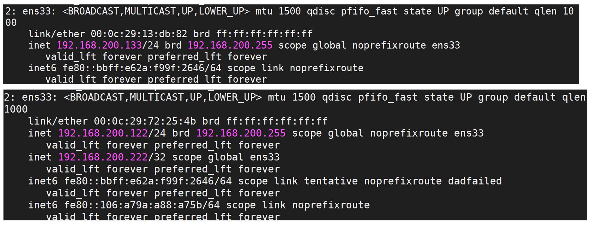

# 十、Nginx实现服务器端集群搭建

## 10.1：Nginx与Tomcat部署

### 1.简介

前面课程已经将Nginx的大部分内容进行了讲解，我们都知道了Nginx在高并发场景和处理静态资源是非常高性能的，但是在实际项目中除了静态资源还有就是后台业务代码模块，一般后台业务都会被部署在Tomcat，weblogic或者是websphere等web服务器上。那么如何使用Nginx接收用户的请求并把请求转发到后台web服务器？


步骤分析:

```java
1.准备Tomcat环境，并在Tomcat上部署一个web项目
2.准备Nginx环境，使用Nginx接收请求，并把请求分发到Tomat上
```

### 2.环境准备

（1）在Centos上准备一个Tomcat

```java
1.Tomcat官网地址:https://tomcat.apache.org/
2.下载tomcat,本次课程使用的是apache-tomcat-8.5.59.tar.gz
3.将tomcat进行解压缩
mkdir web_tomcat
tar -zxf apache-tomcat-8.5.59.tar.gz -C /web_tomcat
```

（2）准备一个web项目，将其打包为war

```java
1.将资料中的demo.war上传到tomcat8目录下的webapps包下
2.将tomcat进行启动，进入tomcat8的bin目录下
./startup.sh
```

（3）启动tomcat进行访问测试。

```java
静态资源: http://192.168.200.146:8080/demo/index.html
动态资源: http://192.168.200.146:8080/demo/getAddress
```

### 3.环境准备(Nginx)

（1）使用Nginx的反向代理，将请求转给Tomcat进行处理。

```java
upstream webservice {
	server 192.168.200.146:8080;
}
server{
    listen		80;
    server_name localhost;
    location /demo {
    	proxy_pass http://webservice;
    }
}
```

（2）启动访问测试


学习到这，可能大家会有一个困惑，明明直接通过tomcat就能访问，为什么还需要多加一个nginx，这样不是反而是系统的复杂度变高了么?
那接下来我们从两个方便给大家分析下这个问题，

第一个使用Nginx实现动静分离

第二个使用Nginx搭建Tomcat的集群

## 10.2：Nginx实现动静分离

### 1.什么是动静分离?

+ 动:后台应用程序的业务处理

+ 静:网站的静态资源(html,javaScript,css,images等文件)

+ 分离:将两者进行分开部署访问，提供用户进行访问。举例说明就是以后所有和静态资源相关的内容都交给Nginx来部署访问，非静态内容则交个类似于Tomcat的服务器来部署访问。

### 2.为什么要动静分离?

​ 前面我们介绍过Nginx在处理静态资源的时候，效率是非常高的，而且Nginx的并发访问量也是名列前茅，而Tomcat则相对比较弱一些，所以把静态资源交个Nginx后，可以减轻Tomcat服务器的访问压力并提高静态资源的访问速度。

​ 动静分离以后，降低了动态资源和静态资源的耦合度。如动态资源宕机了也不影响静态资源的展示。

如何实现动静分离?

实现动静分离的方式很多，比如静态资源可以部署到CDN、Nginx等服务器上，动态资源可以部署到Tomcat,weblogic或者websphere上。本次课程只要使用Nginx+Tomcat来实现动静分离。

### 3.需求分析


### 4.动静分离实现步骤

#### 1.将demo.war项目中的静态资源都删除掉，重新打包生成一个war包，在资料中有提供。

#### 2.将war包部署到tomcat中，把之前部署的内容删除掉

```java
进入到tomcat的webapps目录下，将之前的内容删除掉
将新的war包复制到webapps下
将tomcat启动
```

#### 3.在Nginx所在服务器创建如下目录，并将对应的静态资源放入指定的位置


其中index.html页面的内容如下:

```html
<!DOCTYPE html>
<html lang="en">
<head>
    <meta charset="UTF-8">
    <title>Title</title>
    <script src="js/jquery.min.js"></script>
    <script>
        $(function(){
           $.get('http://192.168.200.133/demo/getAddress',function(data){
               $("#msg").html(data);
           });
        });
    </script>
</head>
<body>
    
    <h1>Nginx如何将请求转发到后端服务器</h1>
    <h3 id="msg"></h3>
    
</body>
</html>

```

#### 4.配置Nginx的静态资源与动态资源的访问

```java
upstream webservice{
   server 192.168.200.146:8080;
}
server {
        listen       80;
        server_name  localhost;

        #动态资源
        location /demo {
                proxy_pass http://webservice;
        }
        #静态资源
        location ~/.*\.(png|jpg|gif|js){
                root html/web;
                gzip on;
        }

        location / {
            root   html/web;
            index  index.html index.htm;
        }
}
```

#### 5.启动测试，访问http://192.168.200.133/index.html


假如某个时间点，由于某个原因导致Tomcat后的服务器宕机了，我们再次访问Nginx,会得到如下效果，用户还是能看到页面，只是缺失了访问次数的统计，这就是前后端耦合度降低的效果，并且整个请求只和后的服务器交互了一次，js和images都直接从Nginx返回，提供了效率，降低了后的服务器的压力。



## 10.3：Nginx实现Tomcat集群搭建

### 1.需求

在使用Nginx和Tomcat部署项目的时候，我们使用的是一台Nginx服务器和一台Tomcat服务器，效果图如下:


那么问题来了，如果Tomcat的真的宕机了，整个系统就会不完整，所以如何解决上述问题，一台服务器容易宕机，那就多搭建几台Tomcat服务器，这样的话就提升了后的服务器的可用性。这也就是我们常说的集群，搭建Tomcat的集群需要用到了Nginx的反向代理和赋值均衡的知识，具体如何来实现?我们先来分析下原理


### 2.环境准备

(1)准备3台tomcat,使用端口进行区分[实际环境应该是三台服务器]，修改server.ml，将端口修改分别修改为8080,8180,8280

(2)启动tomcat并访问测试，

```java
http://192.168.200.146:8080/demo/getAddress
```


```java
http://192.168.200.146:8180/demo/getAddress
```


```java
http://192.168.200.146:8280/demo/getAddress
```


(3)在Nginx对应的配置文件中添加如下内容:

```java
upstream webservice{
        server 192.168.200.146:8080;
        server 192.168.200.146:8180;
        server 192.168.200.146:8280;
    }

```

## 10.4：Nginx高可用解决方案

### 1.问题

*
*好了，完成了上述环境的部署，我们已经解决了Tomcat的高可用性，一台服务器宕机，还有其他两条对外提供服务，同时也可以实现后台服务器的不间断更新。但是新问题出现了，上述环境中，如果是Nginx宕机了呢，那么整套系统都将服务对外提供服务了，这个如何解决？
**

### 2.简介

针对于上面提到的问题，我们来分析下要想解决上述问题，需要面临哪些问题?


```java
需要两台以上的Nginx服务器对外提供服务，这样的话就可以解决其中一台宕机了，另外一台还能对外提供服务，但是如果是两台Nginx服务器的话，会有两个IP地址，用户该访问哪台服务器，用户怎么知道哪台是好的，哪台是宕机了的?
```

### 3.Keepalived简介

使用Keepalived来解决，Keepalived 软件由 C 编写的，最初是专为 LVS 负载均衡软件设计的，Keepalived 软件主要是通过 **VRRP 协议
**实现高可用功能。

### 4.VRRP介绍


**VRRP（Virtual Route Redundancy
Protocol）协议，翻译过来为虚拟路由冗余协议。VRRP协议将两台或多台路由器设备虚拟成一个设备，对外提供虚拟路由器IP,而在路由器组内部，如果实际拥有这个对外IP的路由器如果工作正常的话就是MASTER,MASTER实现针对虚拟路由器IP的各种网络功能。其他设备不拥有该虚拟IP，状态为BACKUP,处了接收MASTER的VRRP状态通告信息以外，不执行对外的网络功能。当主机失效时，BACKUP将接管原先MASTER的网络功能。
**

从上面的介绍信息获取到的内容就是VRRP是一种协议，那这个协议是用来干什么的？

#### 1.选择协议

```c
VRRP可以把一个虚拟路由器的责任动态分配到局域网上的 VRRP 路由器中的一台。其中的虚拟路由即Virtual路由是由VRRP路由群组创建的一个不真实存在的路由，这个虚拟路由也是有对应的IP地址。而且VRRP路由1和VRRP路由2之间会有竞争选择，通过选择会产生一个Master路由和一个Backup路由。
```

#### 2.路由容错协议

```c
Master路由和Backup路由之间会有一个心跳检测，Master会定时告知Backup自己的状态，如果在指定的时间内，Backup没有接收到这个通知内容，Backup就会替代Master成为新的Master。Master路由有一个特权就是虚拟路由和后端服务器都是通过Master进行数据传递交互的，而备份节点则会直接丢弃这些请求和数据，不做处理，只是去监听Master的状态
```

#### 用了Keepalived后，解决方案如下:


### 5.环境搭建

环境准备

| VIP             | IP              | 主机名         | 主/从    |
|-----------------|-----------------|-------------|--------|
|                 | 192.168.200.133 | keepalived1 | Master |
| 192.168.200.222 |                 |             |        |
|                 | 192.168.200.122 | keepalived2 | Backup |

keepalived的安装

```java
步骤1:从官方网站下载keepalived,官网地址https://keepalived.org/
步骤2:将下载的资源上传到服务器
	keepalived-2.0.20.tar.gz
步骤3:创建keepalived目录，方便管理资源
	mkdir keepalived
步骤4:将压缩文件进行解压缩，解压缩到指定的目录
	tar -zxf keepalived-2.0.20.tar.gz -C keepalived/
步骤5:对keepalived进行配置，编译和安装
	cd keepalived/keepalived-2.0.20
	./configure --sysconf=/etc --prefix=/usr/local
	make && make install
```

安装完成后，有两个文件需要我们认识下，一个是 `/etc/keepalived/keepalived.conf`(
keepalived的系统配置文件，我们主要操作的就是该文件)，一个是/usr/local/sbin目录下的`keepalived`,是系统配置脚本，用来启动和关闭keepalived

### 6.Keepalived配置文件介绍

打开keepalived.conf配置文件

这里面会分三部，第一部分是global全局配置、第二部分是vrrp相关配置、第三部分是LVS相关配置。
本次课程主要是使用keepalived实现高可用部署，没有用到LVS，所以我们重点关注的是前两部分

```java
global全局部分：
global_defs {
   #通知邮件，当keepalived发送切换时需要发email给具体的邮箱地址
   notification_email {
     tom@itcast.cn
     jerry@itcast.cn
   }
   #设置发件人的邮箱信息
   notification_email_from zhaomin@itcast.cn
   #指定smpt服务地址
   smtp_server 192.168.200.1
   #指定smpt服务连接超时时间
   smtp_connect_timeout 30
   #运行keepalived服务器的一个标识，可以用作发送邮件的主题信息
   router_id LVS_DEVEL
   
   #默认是不跳过检查。检查收到的VRRP通告中的所有地址可能会比较耗时，设置此命令的意思是，如果通告与接收的上一个通告来自相同的master路由器，则不执行检查(跳过检查)
   vrrp_skip_check_adv_addr
   #严格遵守VRRP协议。
   vrrp_strict
   #在一个接口发送的两个免费ARP之间的延迟。可以精确到毫秒级。默认是0
   vrrp_garp_interval 0
   #在一个网卡上每组na消息之间的延迟时间，默认为0
   vrrp_gna_interval 0
}
```

```c
VRRP部分，该部分可以包含以下四个子模块
1. vrrp_script
2. vrrp_sync_group
3. garp_group
4. vrrp_instance
我们会用到第一个和第四个，
#设置keepalived实例的相关信息，VI_1为VRRP实例名称
vrrp_instance VI_1 {
    state MASTER  		#有两个值可选MASTER主 BACKUP备
    interface ens33		#vrrp实例绑定的接口，用于发送VRRP包[当前服务器使用的网卡名称]
    virtual_router_id 51#指定VRRP实例ID，范围是0-255
    priority 100		#指定优先级，优先级高的将成为MASTER
    advert_int 1		#指定发送VRRP通告的间隔，单位是秒
    authentication {	#vrrp之间通信的认证信息
        auth_type PASS	#指定认证方式。PASS简单密码认证(推荐)
        auth_pass 1111	#指定认证使用的密码，最多8位
    }
    virtual_ipaddress { #虚拟IP地址设置虚拟IP地址，供用户访问使用，可设置多个，一行一个
        192.168.200.222
    }
}
```

配置内容如下:

服务器1

```c
global_defs {
   notification_email {
        tom@itcast.cn
        jerry@itcast.cn
   }
   notification_email_from zhaomin@itcast.cn
   smtp_server 192.168.200.1
   smtp_connect_timeout 30
   router_id keepalived1
   vrrp_skip_check_adv_addr
   vrrp_strict
   vrrp_garp_interval 0
   vrrp_gna_interval 0
}

vrrp_instance VI_1 {
    state MASTER
    interface ens33
    virtual_router_id 51
    priority 100
    advert_int 1
    authentication {
        auth_type PASS
        auth_pass 1111
    }
    virtual_ipaddress {
        192.168.200.222
    }
}
```

服务器2

```c
! Configuration File for keepalived

global_defs {
   notification_email {
        tom@itcast.cn
        jerry@itcast.cn
   }
   notification_email_from zhaomin@itcast.cn
   smtp_server 192.168.200.1
   smtp_connect_timeout 30
   router_id keepalived2
   vrrp_skip_check_adv_addr
   vrrp_strict
   vrrp_garp_interval 0
   vrrp_gna_interval 0
}

vrrp_instance VI_1 {
    state BACKUP
    interface ens33
    virtual_router_id 51
    priority 90
    advert_int 1
    authentication {
        auth_type PASS
        auth_pass 1111
    }
    virtual_ipaddress {
        192.168.200.222
    }
}
```

### 7.访问测试

1. 启动keepalived之前，咱们先使用命令 `ip a`,查看192.168.200.133和192.168.200.122这两台服务器的IP情况。


2. 分别启动两台服务器的keepalived

```
cd /usr/local/sbin
./keepalived
```

再次通过 `ip a`查看ip



3. 当把192.168.200.133服务器上的keepalived关闭后，再次查看ip



通过上述的测试，我们会发现，虚拟IP(VIP)
会在MASTER节点上，当MASTER节点上的keepalived出问题以后，因为BACKUP无法收到MASTER发出的VRRP状态通过信息，就会直接升为MASTER。VIP也会"
漂移"到新的MASTER。

上面测试和Nginx有什么关系?

我们把192.168.200.133服务器的keepalived再次启动下，由于它的优先级高于服务器192.168.200.122的，所有它会再次成为MASTER，VIP也会"
漂移"过去，然后我们再次通过浏览器访问:

```
http://192.168.200.222/
```


如果把192.168.200.133服务器的keepalived关闭掉，再次访问相同的地址


效果实现了以后，
我们会发现要想让vip进行切换，就必须要把服务器上的keepalived进行关闭，而什么时候关闭keepalived呢?应该是在keepalived所在服务器的nginx出现问题后，把keepalived关闭掉，就可以让VIP执行另外一台服务器，但是现在这所有的操作都是通过手动来完成的，我们如何能让系统自动判断当前服务器的nginx是否正确启动，如果没有，要能让VIP自动进行"
漂移"，这个问题该如何解决?

### 8.keepalived之vrrp_script

keepalived只能做到对网络故障和keepalived本身的监控，即当出现网络故障或者keepalived本身出现问题时，进行切换。但是这些还不够，我们还需要监控keepalived所在服务器上的其他业务，比如Nginx,如果Nginx出现异常了，仅仅keepalived保持正常，是无法完成系统的正常工作的，因此需要根据业务进程的运行状态决定是否需要进行主备切换，这个时候，我们可以通过编写脚本对业务进程进行检测监控。

实现步骤:

1. #### 在keepalived配置文件中添加对应的配置像

```c
vrrp_script 脚本名称
{
    script "脚本位置"
    interval 3 #执行时间间隔
    weight -20 #动态调整vrrp_instance的优先级
}
```

2. #### 编写脚本

ck_nginx.sh

```c
#!/bin/bash
num=`ps -C nginx --no-header | wc -l`
if [ $num -eq 0 ];then
 /usr/local/nginx/sbin/nginx
 sleep 2
 if [ `ps -C nginx --no-header | wc -l` -eq 0 ]; then
  killall keepalived
 fi
fi
```

Linux ps命令用于显示当前进程 (process) 的状态。

-C(command) :指定命令的所有进程

--no-header 排除标题

3. #### 为脚本文件设置权限

```c
chmod 755 ck_nginx.sh
```

4. #### 将脚本添加到

```c
vrrp_script ck_nginx {
   script "/etc/keepalived/ck_nginx.sh" #执行脚本的位置
   interval 2		#执行脚本的周期，秒为单位
   weight -20		#权重的计算方式
}
vrrp_instance VI_1 {
    state MASTER
    interface ens33
    virtual_router_id 10
    priority 100
    advert_int 1
    authentication {
        auth_type PASS
        auth_pass 1111
    }
    virtual_ipaddress {
        192.168.200.111
    }
    track_script {
      ck_nginx
    }
}
```

5. #### 如果效果没有出来，可以使用 `tail -f /var/log/messages`查看日志信息，找对应的错误信息。

6. #### 测试

问题思考:

通常如果master服务死掉后backup会变成master，但是当master服务又好了的时候
master此时会抢占VIP，这样就会发生两次切换对业务繁忙的网站来说是不好的。所以我们要在配置文件加入 nopreempt
非抢占，但是这个参数只能用于state 为backup，故我们在用HA的时候最好master 和backup的state都设置成backup 让其通过priority来竞争。


