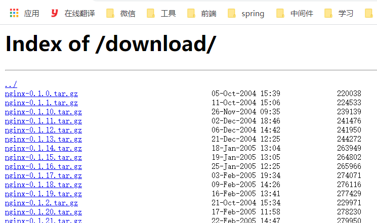

# 十一、下载站点

## 11.1：是什么

首先我们先要清楚什么是下载站点?

我们先来看一个网站`http://nginx.org/download/`这个我们刚开始学习Nginx的时候给大家看过这样的网站，该网站主要就是用来提供用户来下载相关资源的网站，就叫做下载网站。



## 11.2：如何制作一个下载站点

nginx使用的是模块ngx_http_autoindex_module来实现的，该模块处理以斜杠("/")结尾的请求，并生成目录列表。

nginx编译的时候会自动加载该模块，但是该模块默认是关闭的，我们需要使用下来指令来完成对应的配置

## 11.3：命令

### 1.autoindex:启用或禁用目录列表输出

|     | 描述                   |
|-----|----------------------|
| 语法  | autoindex on\|off;   |
| 默认值 | autoindex off;       |
| 位置  | http、server、location |

### 2.autoindex_exact_size:对应HTLM格式，指定是否在目录列表展示文件的详细大小

+ 默认为on，显示出文件的确切大小，单位是bytes。
+ 改为off后，显示出文件的大概大小，单位是kB或者MB或者GB

|     | 描述                             |
|-----|--------------------------------|
| 语法  | autoindex_exact_size  on\|off; |
| 默认值 | autoindex_exact_size  on;      |
| 位置  | http、server、location           |

### 3.autoindex_format：设置目录列表的格式

| 语法  | autoindex_format html\|xml\|json\|jsonp; |
|-----|------------------------------------------|
| 默认值 | autoindex_format html;                   |
| 位置  | http、server、location                     |

注意:该指令在1.7.9及以后版本中出现

### 4.autoindex_localtime:对应HTML格式，是否在目录列表上显示时间。

+ 默认为off，显示的文件时间为GMT时间。
+ 改为on后，显示的文件时间为文件的服务器时间

| 语法  | autoindex_localtime on \| off; |
|-----|--------------------------------|
| 默认值 | autoindex_localtime off;       |
| 位置  | http、server、location           |

配置方式如下:

```java
location /download{
    root /usr/local;
    autoindex on;
    autoindex_exact_size on;
    autoindex_format html;
    autoindex_localtime on;
}

```

### 5.XML/JSON格式[一般不用这两种方式]


