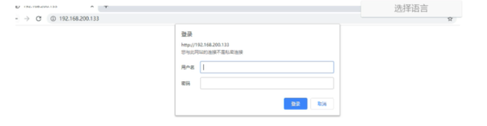

# 十二、Nginx的用户认证模块

对应系统资源的访问，我们往往需要限制谁能访问，谁不能访问。这块就是我们通常所说的认证部分，认证需要做的就是根据用户输入的用户名和密码来判定用户是否为合法用户，如果是则放行访问，如果不是则拒绝访问。

Nginx对应用户认证这块是通过ngx_http_auth_basic_module模块来实现的，它允许通过使用"HTTP基本身份验证"
协议验证用户名和密码来限制对资源的访问。默认情况下nginx是已经安装了该模块，如果不需要则使用--without-http_auth_basic_module。

该模块的指令比较简单，

（1）auth_basic:使用“ HTTP基本认证”协议启用用户名和密码的验证

| 语法  | auth_basic string\|off;           |
|-----|-----------------------------------|
| 默认值 | auth_basic off;                   |
| 位置  | http,server,location,limit_except |

开启后，服务端会返回401，指定的字符串会返回到客户端，给用户以提示信息，但是不同的浏览器对内容的展示不一致。

（2）auth_basic_user_file:指定用户名和密码所在文件

| 语法  | auth_basic_user_file file;        |
|-----|-----------------------------------|
| 默认值 | —                                 |
| 位置  | http,server,location,limit_except |

指定文件路径，该文件中的用户名和密码的设置，密码需要进行加密。可以采用工具自动生成

实现步骤:

1.nginx.conf添加如下内容

```
location /download{
    root /usr/local;
    autoindex on;
    autoindex_exact_size on;
    autoindex_format html;
    autoindex_localtime on;
    auth_basic 'please input your auth';
    auth_basic_user_file htpasswd;
}
```

2.我们需要使用`htpasswd`工具生成

```
yum install -y httpd-tools
```

```
htpasswd -c /usr/local/nginx/conf/htpasswd username //创建一个新文件记录用户名和密码
htpasswd -b /usr/local/nginx/conf/htpasswd username password //在指定文件新增一个用户名和密码
htpasswd -D /usr/local/nginx/conf/htpasswd username //从指定文件删除一个用户信息
htpasswd -v /usr/local/nginx/conf/htpasswd username //验证用户名和密码是否正确
```




上述方式虽然能实现用户名和密码的验证，但是大家也看到了，所有的用户名和密码信息都记录在文件里面，如果用户量过大的话，这种方式就显得有点麻烦了，这时候我们就得通过后台业务代码来进行用户权限的校验了。


