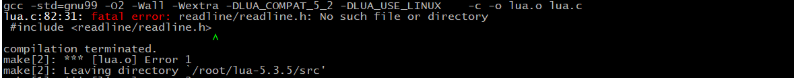
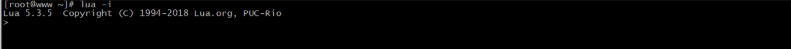
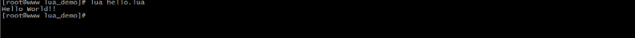
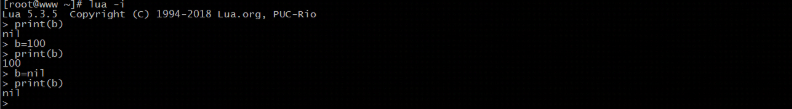
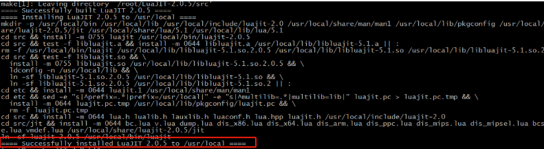
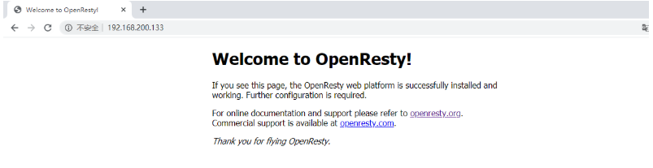
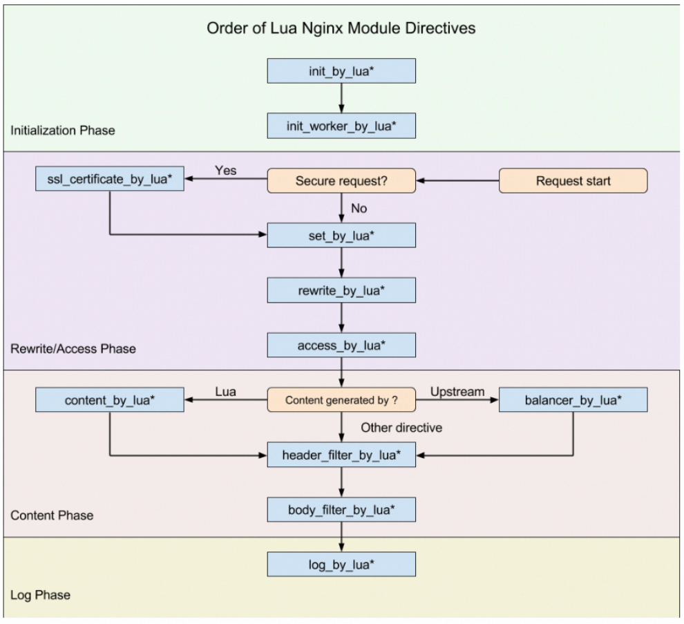

# 十三、Nginx的扩展模块-LUA

## 13.1：简介

### 1.概念

Lua是一种轻量、小巧的脚本语言，用标准C语言编写并以源代码形式开发。设计的目的是为了嵌入到其他应用程序中，从而为应用程序提供灵活的扩展和定制功能。

### 2.特性

跟其他语言进行比较，Lua有其自身的特点：

（1）轻量级

```java
Lua用标准C语言编写并以源代码形式开发，编译后仅仅一百余千字节，可以很方便的嵌入到其他程序中。
```

（2）可扩展

```java
Lua提供非常丰富易于使用的扩展接口和机制，由宿主语言(通常是C或C++)提供功能，Lua可以使用它们，就像内置的功能一样。
```

（3）支持面向过程编程和函数式编程

### 3.应用场景

Lua在不同的系统中得到大量应用，场景的应用场景如下:

游戏开发、独立应用脚本、web应用脚本、扩展和数据库插件、系统安全上。

### 4.Lua的安装

在linux上安装Lua非常简单，只需要下载源码包并在终端解压、编译即可使用。

Lua的官网地址为:`https://www.lua.org`


1.
点击download可以找到对应版本的下载地址，我们本次课程采用的是lua-5.3.5,其对应的资源链接地址为https://www.lua.org/ftp/lua-5.4.1.tar.gz,也可以使用wget命令直接下载:

```java
wget https://www.lua.org/ftp/lua-5.4.1.tar.gz
```

2. 编译安装

```java
cd lua-5.4.1
make linux test
make install
```

如果在执行make linux test失败，报如下错误:



说明当前系统缺少libreadline-dev依赖包，需要通过命令来进行安装

```java
yum install -y readline-devel
```

验证是否安装成功

```java
lua -v
```

## 13.2：helloworld

Lua和C/C++语法非常相似，整体上比较清晰，简洁。条件语句、循环语句、函数调用都与C/C++基本一致。如果对C/C++不太熟悉的同学来说，也没关系，因为天下语言是一家，基本上理解起来都不会太困难。我们一点点来讲。

交互式之HELLOWORLD

```c
交互式是指可以在命令行输入程序，然后回车就可以看到运行的效果。
```

Lua交互式编程模式可以通过命令lua -i 或lua来启用:



在命令行中key输入如下命令，并按回车,会有输出在控制台：


脚本式之HELLOWORLD

脚本式是将代码保存到一个以lua为扩展名的文件中并执行的方式。

方式一:

我们需要一个文件名为 hello.lua,在文件中添加要执行的代码，然后通过命令 `lua hello.lua`来执行，会在控制台输出对应的结果。

hello.lua

```c
print("Hello World!!")
```



方式二:

将hello.lua做如下修改

```c
#!/usr/local/bin/lua
print("Hello World!!!")
```

第一行用来指定Lua解释器所在位置为 /usr/local/bin/lua，加上#号标记解释器会忽略它。一般情况下#!
就是用来指定用哪个程序来运行本文件。但是hello.lua并不是一个可执行文件，需要通过chmod来设置可执行权限，最简单的方式为:

```c
chmod 755 hello.lua
```

然后执行该文件

```c
./hello.lua
```


补充一点，如果想在交互式中运行脚本式的hello.lua中的内容，我们可以使用一个dofile函数，如：

```c
dofile("lua_demo/hello.lua")
```

注意:在Lua语言中，连续语句之间的分隔符并不是必须的，也就是说后面不需要加分号，当然加上也不会报错，

在Lua语言中，表达式之间的换行也起不到任何作用。如以下四个写法，其实都是等效的

```c
写法一
a=1
b=a+2
写法二
a=1;
b=a+2;
写法三
a=1; b=a+2;
写法四
a=1 b=a+2
```

不建议使用第四种方式，可读性太差。

## 13.3：语法

### Lua的注释

关于Lua的注释要分两种，第一种是单行注释，第二种是多行注释。

单行注释的语法为：

```
--注释内容
```

多行注释的语法为:

```
--[[
	注释内容
	注释内容
--]]
```

如果想取消多行注释，只需要在第一个--之前在加一个-即可，如：

```
---[[
	注释内容
	注释内容
--]]
```

### 标识符

换句话说标识符就是我们的变量名，Lua定义变量名以一个字母 A 到 Z 或 a 到 z 或下划线 _
开头后加上0个或多个字母，下划线，数字（0到9）。这块建议大家最好不要使用下划线加大写字母的标识符，因为Lua的保留字也是这样定义的，容易发生冲突。注意Lua是区分大小写字母的。

<u>A</u>0

### 关键字

下列是Lua的关键字，大家在定义常量、变量或其他用户自定义标识符都要避免使用以下这些关键字：

| and      | break | do    | else   |
|----------|-------|-------|--------|
| elseif   | end   | false | for    |
| function | if    | in    | local  |
| nil      | not   | or    | repeat |
| return   | then  | true  | until  |
| while    | goto  |       |        |

一般约定，以下划线开头连接一串大写字母的名字（比如 _VERSION）被保留用于 Lua 内部全局变量。这个也是上面我们不建议这么定义标识符的原因。

### 运算符

Lua中支持的运算符有算术运算符、关系运算符、逻辑运算符、其他运算符。

算术运算符:

```
+   加法
-	减法
*	乘法
/	除法
%	取余
^	乘幂
-	负号
```

例如:

```
10+20	-->30
20-10	-->10
10*20	-->200
20/10	-->2
3%2		-->1
10^2	-->100
-10		-->-10
```

关系运算符

```
==	等于
~=	不等于
>	大于
<	小于
>=	大于等于
<=	小于等于
```

例如:

```
10==10		-->true
10~=10		-->false
20>10		-->true
20<10		-->false
20>=10		-->true
20<=10		-->false
```

逻辑运算符

```
and	逻辑与	 A and B     &&   
or	逻辑或	 A or B     ||
not	逻辑非  取反，如果为true,则返回false  !
```

逻辑运算符可以作为if的判断条件，返回的结果如下:

```
A = true
B = true

A and B	-->true
A or  B -->true
not A 	-->false

A = true
B = false

A and B	-->false
A or  B -->true
not A 	-->false

A = false
B = true

A and B	-->false
A or  B -->true
not A 	-->true

```

其他运算符

```
..	连接两个字符串
#	一元预算法，返回字符串或表的长度
```

例如:

```
> "HELLO ".."WORLD"		-->HELLO WORLD
> #"HELLO"			-->5
```

### 全局变量&局部变量

在Lua语言中，全局变量无须声明即可使用。在默认情况下，变量总是认为是全局的，如果未提前赋值，默认为nil:



要想声明一个局部变量，需要使用local来声明


#### Lua数据类型

Lua有8个数据类型

```
nil(空，无效值)
boolean(布尔，true/false)
number(数值)
string(字符串)
function(函数)
table（表）
thread(线程)
userdata（用户数据）
```

可以使用type函数测试给定变量或者的类型：

```
print(type(nil))				-->nil
print(type(true))               --> boolean
print(type(1.1*1.1))             --> number
print(type("Hello world"))      --> string
print(type(io.stdin))			-->userdata
print(type(print))              --> function
print(type(type))               -->function
print(type{})					-->table
print(type(type(X)))            --> string
```

##### nil

nil是一种只有一个nil值的类型，它的作用可以用来与其他所有值进行区分，也可以当想要移除一个变量时，只需要将该变量名赋值为nil,垃圾回收就会会释放该变量所占用的内存。

##### boolean

boolean类型具有两个值，true和false。boolean类型一般被用来做条件判断的真与假。在Lua语言中，只会将false和nil视为假，其他的都视为真，特别是在条件检测中0和空字符串都会认为是真，这个和我们熟悉的大多数语言不太一样。

##### number

在Lua5.3版本开始，Lua语言为数值格式提供了两种选择:integer(整型)和float(
双精度浮点型)[和其他语言不太一样，float不代表单精度类型]。

数值常量的表示方式:

```
>4			-->4
>0.4		-->0.4
>4.75e-3	-->0.00475
>4.75e3		-->4750
```

不管是整型还是双精度浮点型，使用type()函数来取其类型，都会返回的是number

```
>type(3)	-->number
>type(3.3)	-->number
```

所以它们之间是可以相互转换的，同时，具有相同算术值的整型值和浮点型值在Lua语言中是相等的

##### string

Lua语言中的字符串即可以表示单个字符，也可以表示一整本书籍。在Lua语言中，操作100K或者1M个字母组成的字符串的程序很常见。

可以使用单引号或双引号来声明字符串

```
>a = "hello"
>b = 'world'
>print(a)	-->hello
>print(b) 	-->world
```

如果声明的字符串比较长或者有多行，则可以使用如下方式进行声明

```
html = [[
<html>
<head>
<title>Lua-string</title>
</head>
<body>
<a href="http://www.lua.org">Lua</a>
</body>
</html>
]]
```

##### table

​ table是Lua语言中最主要和强大的数据结构。使用表， Lua 语言可以以一种简单、统一且高效的方式表示数组、集合、记录和其他很多数据结构。
Lua语言中的表本质上是一种辅助数组。这种数组比Java中的数组更加灵活，可以使用数值做索引，也可以使用字符串或其他任意类型的值作索引(
除nil外)。

创建表的最简单方式:

```
> a = {}
```

创建数组:

​ 我们都知道数组就是相同数据类型的元素按照一定顺序排列的集合，那么使用table如何创建一个数组呢?

```
>arr = {"TOM","JERRY","ROSE"}
```

​ 要想获取数组中的值，我们可以通过如下内容来获取:

```
print(arr[0])		nil
print(arr[1])		TOM
print(arr[2])		JERRY
print(arr[3])		ROSE
```

​ 从上面的结果可以看出来，数组的下标默认是从1开始的。所以上述创建数组，也可以通过如下方式来创建

```
>arr = {}
>arr[1] = "TOM"
>arr[2] = "JERRY"
>arr[3] = "ROSE"
```

上面我们说过了，表的索引即可以是数字，也可以是字符串等其他的内容，所以我们也可以将索引更改为字符串来创建

```
>arr = {}
>arr["X"] = 10
>arr["Y"] = 20
>arr["Z"] = 30
```

当然，如果想要获取这些数组中的值，可以使用下面的方式

```
方式一
>print(arr["X"])
>print(arr["Y"])
>print(arr["Z"])
方式二
>print(arr.X)
>print(arr.Y)
>print(arr.Z)
```

当前table的灵活不进于此，还有更灵活的声明方式

```
>arr = {"TOM",X=10,"JERRY",Y=20,"ROSE",Z=30}
```

如何获取上面的值?

```
TOM :  arr[1]
10  :  arr["X"] | arr.X
JERRY: arr[2]
20  :  arr["Y"] | arr.Y
ROESE?
```

##### function

在 Lua语言中，函数（ Function ）是对语句和表达式进行抽象的主要方式。

定义函数的语法为:

```
function functionName(params)

end
```

函数被调用的时候，传入的参数个数与定义函数时使用的参数个数不一致的时候，Lua 语言会通过 抛弃多余参数和将不足的参数设为 nil
的方式来调整参数的个数。

```
function  f(a,b)
print(a,b)
end

f()		--> nil  nil
f(2)	--> 2 nil
f(2,6)	--> 2 6
f(2.6.8)	--> 2 6 (8被丢弃)
```

可变长参数函数

```
function add(...)
a,b,c=...
print(a)
print(b)
print(c)
end

add(1,2,3)  --> 1 2 3
```

函数返回值可以有多个，这点和Java不太一样

```
function f(a,b)
return a,b
end

x,y=f(11,22)	--> x=11,y=22	
```

##### thread

thread翻译过来是线程的意思，在Lua中，thread用来表示执行的独立线路，用来执行协同程序。

##### userdata

userdata是一种用户自定义数据，用于表示一种由应用程序或C/C++语言库所创建的类型。

#### Lua控制结构

Lua 语言提供了一组精简且常用的控制结构，包括用于条件执行的证 以及用于循环的 while、 repeat 和 for。 所有的控制结构语法上都有一个显式的终结符：
end 用于终结 if、 for 及 while 结构， until 用于终结 repeat 结构。

##### if then elseif else

if语句先测试其条件，并根据条件是否满足执行相应的 then 部分或 else 部分。 else 部分 是可选的。

```
function testif(a)
 if a>0 then
 	print("a是正数")
 end
end

function testif(a)
 if a>0 then
 	print("a是正数")
 else
 	print("a是负数")
 end
end
```

如果要编写嵌套的 if 语句，可以使用 elseif。 它类似于在 else 后面紧跟一个if。根据传入的年龄返回不同的结果，如

```
age<=18 青少年，
age>18 , age <=45 青年
age>45 , age<=60 中年人
age>60 老年人

function show(age)
if age<=18 then
 return "青少年"
elseif age>18 and age<=45 then
 return "青年"
elseif age>45 and age<=60 then
 return "中年人"
elseif age>60 then
 return "老年人"
end
end
```

##### while循环

顾名思义，当条件为真时 while 循环会重复执行其循环体。 Lua 语言先测试 while 语句 的条件，若条件为假则循环结束；否则， Lua
会执行循环体并不断地重复这个过程。

语法：

```
while 条件 do
  循环体
end
```

例子:实现数组的循环

```
function testWhile()
 local i = 1
 while i<=10 do
  print(i)
  i=i+1
 end
end
```

##### repeat循环

顾名思义， repeat-until语句会重复执行其循环体直到条件为真时结束。 由于条件测试在循环体之后执行，所以循环体至少会执行一次。

语法

```
repeat
 循环体
 until 条件
```

```
function testRepeat()
 local i = 10
 repeat
  print(i)
  i=i-1
 until i < 1
end
```

##### for循环

数值型for循环

语法

```
for param=exp1,exp2,exp3 do
 循环体
end
```

param的值从exp1变化到exp2之前的每次循环会执行 循环体，并在每次循环结束后将步长(step)exp3增加到param上。exp3可选，如果不设置默认为1

```
for i = 1,100,10 do
print(i)
end
```

泛型for循环

泛型for循环通过一个迭代器函数来遍历所有值，类似于java中的foreach语句。

语法

```
for i,v in ipairs(x) do
	循环体
end
```

i是数组索引值，v是对应索引的数组元素值，ipairs是Lua提供的一个迭代器函数，用来迭代数组，x是要遍历的数组。

例如:

```
arr = {"TOME","JERRY","ROWS","LUCY"}
for i,v in ipairs(arr) do
 print(i,v)
end
```

上述实例输出的结果为

```
1	TOM
2	JERRY
3	ROWS
4	LUCY
```

但是如果将arr的值进行修改为

```
arr = {"TOME","JERRY","ROWS",x="JACK","LUCY"}
```

同样的代码在执行的时候，就只能看到和之前一样的结果，而其中的x为JACK就无法遍历出来，缺失了数据，如果解决呢?

我们可以将迭代器函数变成pairs,如

```
for i,v in pairs(arr) do
 print(i,v)
end
```

上述实例就输出的结果为

```
1	TOM
2	JERRY
3	ROWS
4	LUCY
x	JACK
```

## 13.4：ngx_lua模块概念

淘宝开发的ngx_lua模块通过将lua解释器集成进Nginx，可以采用lua脚本实现业务逻辑，由于lua的紧凑、快速以及内建协程，所以在保证高并发服务能力的同时极大地降低了业务逻辑实现成本。

## 13.5：ngx_lua模块环境准备

### 方式一:lua-nginx-module

1. LuaJIT是采用C语言编写的Lua代表的解释器。

官网地址为:<http://luajit.org/>

在官网上找到对应的下载地址:http://luajit.org/download/LuaJIT-2.0.5.tar.gz

在centos上使用wget来下载: wget http://luajit.org/download/LuaJIT-2.0.5.tar.gz

将下载的资源进行解压: tar -zxf LuaJIT-2.0.5.tar.gz

进入解压的目录: cd LuaJIT-2.0.5

执行编译和安装: make && make install



2. 下载lua-nginx-module

下载地址:<https://github.com/openresty/lua-nginx-module/archive/v0.10.16rc4.tar.gz>

在centos上使用wget来下载: wget https://github.com/openresty/lua-nginx-module/archive/v0.10.16rc4.tar.gz

将下载的资源进行解压: tar -zxf lua-nginx-module-0.10.16rc4.tar.gz

更改目录名:mv lua-nginx-module-0.10.16rc4 lua-nginx-module

导入环境变量，告诉Nginx去哪里找luajit

```
export LUAJIT_LIB=/usr/local/lib
export LUAJIT_INC=/usr/local/include/luajit-2.0
```

进入Nginx的目录执行如下命令:

```
./configure --prefix=/usr/local/nginx --add-module=../lua-nginx-module
make && make install
```

注意事项:

（1）如果启动Nginx出现如下错误:


解决方案:

设置软链接，使用如下命令

```
 ln -s /usr/local/lib/libluajit-5.1.so.2 /lib64/libluajit-5.1.so.2
```

（2）如果启动Nginx出现以下错误信息


分析原因:
因为lua-nginx-module是来自openrestry,错误中提示的resty.core是openrestry的核心模块，对其下的很多函数进行了优化等工作。以前的版本默认不会把该模块编译进去，所以需要使用的话，我们得手动安装，或者禁用就可以。但是最新的lua-nginx-module模块已经强制性安装了该模块，所以此处因为缺少resty模块导致的报错信息。

解决方案有两个:一种是下载对应的模块，另一种则是禁用掉restry模块，禁用的方式为:

```
http{
	lua_load_resty_core off;
}
```

3. 测试

在nginx.conf下配置如下内容:

```
location /lua{
    default_type 'text/html';
    content_by_lua 'ngx.say("<h1>HELLO,LUA</h1>")';
}
```

配置成功后，启动nginx,通过浏览器进行访问，如果获取到如下结果，则证明安装成功。


### 方式二:OpenRestry

#### 概述

​ 前面我们提到过，OpenResty是由淘宝工程师开发的，所以其官方网站(<http://openresty.org/>)我们读起来是非常的方便。OpenResty是一个基于Nginx与
Lua 的高性能 Web 平台，其内部集成了大量精良的 Lua 库、第三方模块以及大多数的依赖项。用于方便地搭建能够处理超高并发、扩展性极高的动态
Web 应用、Web 服务和动态网关。所以本身OpenResty内部就已经集成了Nginx和Lua，所以我们使用起来会更加方便。

#### 安装

```
(1) 下载OpenResty：https://openresty.org/download/openresty-1.15.8.2.tar.gz
(2)使用wget下载: wget https://openresty.org/download/openresty-1.15.8.2.tar.gz
(3)解压缩: tar -zxf openresty-1.15.8.2.tar.gz
(4)进入OpenResty目录: cd openresty-1.15.8.2
(5) 执行命令:./configure
(6) 执行命令:make && make install
(7)进入OpenResty的目录，找到nginx：cd /usr/local/openresty/nginx/
(8)在conf目录下的nginx.conf添加如下内容
location /lua{
    default_type 'text/html';
    content_by_lua 'ngx.say("<h1>HELLO,OpenRestry</h1>")';
}
(9)在sbin目录下启动nginx
(10)通过浏览器访问测试
```




## 13.6：ngx_lua的使用

使用Lua编写Nginx脚本的基本构建块是指令。指令用于指定何时运行用户Lua代码以及如何使用结果。下图显示了执行指令的顺序。



先来解释下*的作用

```
*：无 ， 即 xxx_by_lua ,指令后面跟的是 lua指令
*:_file，即 xxx_by_lua_file 指令后面跟的是 lua文件
*:_block,即 xxx_by_lua_block 在0.9.17版后替换init_by_lua_file
```

### init_by_lua*

```
该指令在每次Nginx重新加载配置时执行，可以用来完成一些耗时模块的加载，或者初始化一些全局配置。
```

### init_worker_by_lua*

```
该指令用于启动一些定时任务，如心跳检查、定时拉取服务器配置等。
```

### set_by_lua*

```
该指令只要用来做变量赋值，这个指令一次只能返回一个值，并将结果赋值给Nginx中指定的变量。
```

### rewrite_by_lua*

```
该指令用于执行内部URL重写或者外部重定向，典型的如伪静态化URL重写，本阶段在rewrite处理阶段的最后默认执行。
```

### access_by_lua*

```
该指令用于访问控制。例如，如果只允许内网IP访问。
```

### content_by_lua*

```
该指令是应用最多的指令，大部分任务是在这个阶段完成的，其他的过程往往为这个阶段准备数据，正式处理基本都在本阶段。
```

### header_filter_by_lua*

```
该指令用于设置应答消息的头部信息。
```

### body_filter_by_lua*

```
该指令是对响应数据进行过滤，如截断、替换。
```

### log_by_lua*

```
该指令用于在log请求处理阶段，用Lua代码处理日志，但并不替换原有log处理。
```

### balancer_by_lua*

```
该指令主要的作用是用来实现上游服务器的负载均衡器算法
```

### ssl_certificate_by_*

```
该指令作用在Nginx和下游服务开始一个SSL握手操作时将允许本配置项的Lua代码。
```

### 需求:

```
http://192.168.200.133?name=张三&gender=1
Nginx接收到请求后，根据gender传入的值，如果gender传入的是1，则在页面上展示
张三先生,如果gender传入的是0，则在页面上展示张三女士,如果未传或者传入的不是1和2则在页面上展示张三。
```

实现代码

```
location /getByGender {
	default_type 'text/html';
	set_by_lua $name "
		local uri_args = ngx.req.get_uri_args()
		gender = uri_args['gender']
		name = uri_args['name']
		if gender=='1' then
			return name..'先生'
		elseif gender=='0' then
			return name..'女士'
		else
			return name
		end
	";
	header_filter_by_lua "
		ngx.header.aaa='bbb'
	";
	return 200 $name;
}
```

## ngx_lua操作Redis

Redis在系统中经常作为数据缓存、内存数据库使用，在大型系统中扮演着非常重要的作用。在Nginx核心系统中，Redis是常备组件。Nginx支持3种方法访问Redis,分别是HttpRedis模块、HttpRedis2Module、lua-resty-redis库。这三种方式中HttpRedis模块提供的指令少，功能单一，适合做简单缓存，HttpRedis2Module模块比HttpRedis模块操作更灵活，功能更强大。而Lua-resty-redis库是OpenResty提供的一个操作Redis的接口库，可根据自己的业务情况做一些逻辑处理，适合做复杂的业务逻辑。所以本次课程将主要以Lua-resty-redis来进行讲解。

### lua-resty-redis环境准备

步骤一:准备一个Redis环境

```
连接地址
host= 192.168.200.111
port=6379
```


步骤二:准备对应的API

```
lua-resty-redis提供了访问Redis的详细API，包括创建对接、连接、操作、数据处理等。这些API基本上与Redis的操作一一对应。
（1）redis = require "resty.redis"
（2）new
	语法: redis,err = redis:new(),创建一个Redis对象。
（3）connect
	语法:ok,err=redis:connect(host,port[,options_table]),设置连接Redis的连接信息。
	ok:连接成功返回 1，连接失败返回nil
	err:返回对应的错误信息
（4）set_timeout
	语法: redis:set_timeout(time) ，设置请求操作Redis的超时时间。
（5）close
	语法: ok,err = redis:close(),关闭当前连接，成功返回1，失败返回nil和错误信息
（6）redis命令对应的方法
	在lua-resty-redis中，所有的Redis命令都有自己的方法，方法名字和命令名字相同，只是全部为小写。

```

步骤三:效果实现

```
location / {
    default_type "text/html";
    content_by_lua_block{
        local redis = require "resty.redis" -- 引入Redis
        local redisObj = redis:new()  --创建Redis对象
        redisObj:set_timeout(1000) --设置超时数据为1s
        local ok,err = redisObj:connect("192.168.200.1",6379) --设置redis连接信息
        if not ok then --判断是否连接成功
         ngx.say("failed to connection redis",err)
         return
        end
        ok,err = redisObj:set("username","TOM")--存入数据
        if not ok then --判断是否存入成功
         ngx.say("failed to set username",err)
         return
        end
        local res,err = redisObj:get("username") --从redis中获取数据
        ngx.say(res)	--将数据写会消息体中
        redisObj:close()
    }
}
```

步骤四:运行测试效果


## ngx_lua操作Mysql

MySQL是一个使用广泛的关系型数据库。在ngx_lua中，MySQL有两种访问模式,分别是使

（1）用ngx_lua模块和lua-resty-mysql模块：这两个模块是安装OpenResty时默认安装的。

（2）使用drizzle_nginx_module(HttpDrizzleModule)模块：需要单独安装，这个库现不在OpenResty中。

### lua-resty-mysql

lua-resty-mysql是OpenResty开发的模块，使用灵活、功能强大，适合复杂的业务场景，同时支持存储过程的访问。

#### 使用lua-resty-mysql实现数据库的查询

步骤一:

准备MYSQL

```
host: 192.168.200.111
port: 3306
username:root
password:123456
```

创建一个数据库表及表中的数据。

```
create database nginx_db;

use nginx_db;

create table users(
   id int primary key auto_increment,
   username varchar(30),
   birthday date,
   salary double
);

insert into users(id,username,birthday,salary) values(null,"TOM","1988-11-11",10000.0);
insert into users(id,username,birthday,salary) values(null,"JERRY","1989-11-11",20000.0);
insert into users(id,username,birthday,salary) values(null,"ROWS","1990-11-11",30000.0);
insert into users(id,username,birthday,salary) values(null,"LUCY","1991-11-11",40000.0);
insert into users(id,username,birthday,salary) values(null,"JACK","1992-11-11",50000.0);
```

数据库连接四要素:

```
driverClass=com.mysql.jdbc.Driver
url=jdbc:mysql://192.168.200.111:3306/nginx_db
username=root
password=123456
```

步骤二:API学习

```
（1）引入"resty.mysql"模块
	local mysql = require "resty.mysql"
（2）new
	创建一个MySQL连接对象，遇到错误时，db为nil，err为错误描述信息
	语法: db,err = mysql:new()
（3）connect
	尝试连接到一个MySQL服务器
	语法:ok,err=db:connect(options),options是一个参数的Lua表结构，里面包含数据库连接的相关信息
    host:服务器主机名或IP地址
    port:服务器监听端口，默认为3306
    user:登录的用户名
    password:登录密码
    database:使用的数据库名
（4）set_timeout
	设置子请求的超时时间(ms)，包括connect方法
	语法:db:set_timeout(time)
（5）close
	关闭当前MySQL连接并返回状态。如果成功，则返回1；如果出现任何错误，则将返回nil和错误描述。
	语法:db:close()
（6）send_query
	异步向远程MySQL发送一个查询。如果成功则返回成功发送的字节数；如果错误，则返回nil和错误描述
	语法:bytes,err=db:send_query(sql)
（7）read_result
	从MySQL服务器返回结果中读取一行数据。res返回一个描述OK包或结果集包的Lua表,语法:
	res, err, errcode, sqlstate = db:read_result() 
	res, err, errcode, sqlstate = db:read_result(rows) :rows指定返回结果集的最大值，默认为4
	如果是查询，则返回一个容纳多行的数组。每行是一个数据列的key-value对，如

    {
      {id=1,username="TOM",birthday="1988-11-11",salary=10000.0},
      {id=2,username="JERRY",birthday="1989-11-11",salary=20000.0}
    }
	如果是增删改，则返回类上如下数据
    {
    	insert_id = 0,
    	server_status=2,
    	warning_count=1,
    	affected_rows=2,
    	message=nil
    }
	返回值:
		res:操作的结果集
		err:错误信息
		errcode:MySQL的错误码，比如1064
		sqlstate:返回由5个字符组成的标准SQL错误码，比如42000

```

步骤三:效果实现

```
location /{
    content_by_lua_block{
        local mysql = require "resty.mysql"
        local db = mysql:new()
        local ok,err = db:connect{
            host="192.168.200.111",
            port=3306,
            user="root",
            password="123456",
            database="nginx_db"
        }
        db:set_timeout(1000)

        db:send_query("select * from users where id =1")
        local res,err,errcode,sqlstate = db:read_result()
        	ngx.say(res[1].id..","..res[1].username..","..res[1].birthday..","..res[1].salary)
    	db:close()
    }

}
```

问题:

```
1.如何获取返回数据的内容
2.如何实现查询多条数据
3.如何实现数据库的增删改操作
```

#### 使用lua-cjson处理查询结果

通过上述的案例学习，read_result()
得到的结果res都是table类型，要想在页面上展示，就必须知道table的具体数据结构才能进行遍历获取。处理起来比较麻烦，接下来我们介绍一种简单方式cjson，使用它就可以将table类型的数据转换成json字符串，把json字符串展示在页面上即可。具体如何使用?

步骤一：引入cjson

```
local cjson = require "cjson"
```

步骤二：调用cjson的encode方法进行类型转换

```
cjson.encode(res) 
```

步骤三:使用

```
location /{
    content_by_lua_block{

        local mysql = require "resty.mysql"
        local cjson = require "cjson"

        local db = mysql:new()

        local ok,err = db:connect{
            host="192.168.200.111",
            port=3306,
            user="root",
            password="123456",
            database="nginx_db"
        }
        db:set_timeout(1000)

        --db:send_query("select * from users where id = 2")
        db:send_query("select * from users")
        local res,err,errcode,sqlstate = db:read_result()
        ngx.say(cjson.encode(res))
         for i,v in ipairs(res) do
       ngx.say(v.id..","..v.username..","..v.birthday..","..v.salary)
        end
    	db:close()
    }

}
```

#### lua-resty-mysql实现数据库的增删改

优化send_query和read_result

本方法是send_query和read_result组合的快捷方法。

语法:

```
res, err, errcode, sqlstate = db:query(sql[,rows])
```

有了该API，上面的代码我们就可以进行对应的优化，如下:

```
location /{
    content_by_lua_block{

        local mysql = require "resty.mysql"

        local db = mysql:new()

        local ok,err = db:connect{
        host="192.168.200.1",
        port=3306,
        user="root",
        password="123456",
        database="nginx_db",
        max_packet_size=1024,
        compact_arrays=false
        }
        db:set_timeout(1000)
        local res,err,errcode,sqlstate = db:query("select * from users")
        --local res,err,errcode,sqlstate = db:query("insert into users(id,username,birthday,salary) values(null,'zhangsan','2020-11-11',32222.0)")
        --local res,err,errcode,sqlstate = db:query("update users set username='lisi' where id = 6")
        --local res,err,errcode,sqlstate = db:query("delete from users where id = 6")
        db:close()
    }

}
```

### 综合小案例

使用ngx_lua模块完成Redis缓存预热。

分析:

（1）先得有一张表(users)

（2）浏览器输入如下地址

```
http://191.168.200.133?username=TOM
```

（3）从表中查询出符合条件的记录，此时获取的结果为table类型

（4）使用cjson将table数据转换成json字符串

（5）将查询的结果数据存入Redis中

```
init_by_lua_block{

	redis = require "resty.redis"
    mysql = require "resty.mysql"
    cjson = require "cjson"
}
location /{
			default_type "text/html";
			content_by_lua_block{
				
				--获取请求的参数username
				local param = ngx.req.get_uri_args()["username"]
				--建立mysql数据库的连接
				local db = mysql:new()
				local ok,err = db:connect{
					host="192.168.200.111",
					port=3306,
					user="root",
					password="123456",
					database="nginx_db"
				}
				if not ok then
				 ngx.say("failed connect to mysql:",err)
				 return
				end
				--设置连接超时时间
				db:set_timeout(1000)
				--查询数据
				local sql = "";
				if not param then
					sql="select * from users"
				else
					sql="select * from users where username=".."'"..param.."'"
				end
				local res,err,errcode,sqlstate=db:query(sql)
				if not res then
				 ngx.say("failed to query from mysql:",err)
				 return
				end
				--连接redis
				local rd = redis:new()
				ok,err = rd:connect("192.168.200.111",6379)
				if not ok then
				 ngx.say("failed to connect to redis:",err)
				 return
				end
				rd:set_timeout(1000)
				--循环遍历数据
				for i,v in ipairs(res) do
				 rd:set("user_"..v.username,cjson.encode(v))
				end
				ngx.say("success")
				rd:close()
				db:close()
			}
			
		}
```
