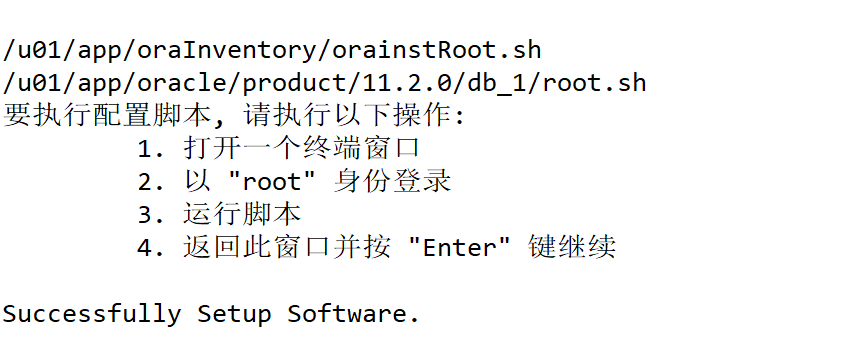

# Oracle11G安装

## preinstalloracle.sh

```java
 #!/bin/bash 
#以root用户运行
#注意修改第三行的ip为自己的ip地址

echo "192.168.100.100 orcl orcl" >> /etc/hosts
cat >> /etc/sysconfig/network <<EOF
network=yes
hostname=orcl
EOF
```

## secinstalloracle.sh

```java
 #!/bin/bash
yum install -y binutils compat-libstdc++-33 elfutils-libelf elfutils-libelf-devel glibc glibc-common glibc-devel gcc gcc-c++ libaio-devel libaio libgcc libstdc++ libstdc++-devel make sysstat unixODBC unixODBC-devel ksh numactl-devel zip unzip
cat >> /etc/sysctl.conf <<EOF
fs.file-max = 6815744
fs.aio-max-nr = 1048576
kernel.shmall = 2097152    
kernel.shmmax = 4294967296  
kernel.shmmni = 4096
kernel.sem = 250 32000 100 128
net.ipv4.ip_local_port_range = 9000 65500
net.core.rmem_default = 4194304
net.core.rmem_max = 4194304
net.core.wmem_default = 262144
net.core.wmem_max = 1048576
EOF
sysctl -p #使配置文件生效
cat >> /etc/security/limits.conf <<EOF
oracle      soft  nproc      2047
oracle      hard  nproc      16384
oracle      soft  nofile     1024
oracle      hard  nofile     65536
EOF
cat >> /etc/pam.d/login <<EOF
session  required   /lib/security/pam_limits.so
session  required   pam_limits.so
EOF
cat >> /etc/profile <<EOF
if [ $USER = "oracle" ]; then
  if [ $SHELL = "/bin/ksh" ]; then
   ulimit -p 16384
   ulimit -n 65536
  else
   ulimit -u 16384 -n 65536
  fi
fi
EOF
groupadd oinstall
groupadd dba
useradd -g oinstall -G dba oracle 
mkdir -p /u01/app/oracle/product/11.2.0/db_1
mkdir -p /u01/app/oracle/oradata
mkdir -p /u01/app/oraInventory
mkdir -p /u01/app/oracle/fast_recovery_area
chown -R oracle:oinstall /u01/app/oracle
chown -R oracle:oinstall /u01/app/oraInventory
chmod -R 755 /u01/app/oracle
chmod -R 755 /u01/app/oraInventory
systemctl disable firewalld
systemctl stop firewalld
setenforce 0
sed -i 's/=enforcing/=disabled/g' /etc/selinux/config
mv   linux.x64_11gR2_database_1of2.zip /home/oracle/p13390677_112040_Linux-x86-64_1of7.zip  
mv   linux.x64_11gR2_database_2of2.zip /home/oracle/p13390677_112040_Linux-x86-64_2of7.zip 
cp thiinstalloracle.sh /home/oracle/
cp fouinstalloracle.sh /home/oracle/
```

## thiinstalloracle.sh

```java
 #!/bin/bash
#以oracle用户运行，su - oracle
cd ~     
cat >> .bash_profile <<EOF
ORACLE_BASE=/u01/app/oracle
ORACLE_HOME=\$ORACLE_BASE/product/11.2.0/db_1
ORACLE_SID=orcl 
export NLS_LANG=AMERICAN_AMERICA.UTF8
PATH=\$PATH:\$ORACLE_HOME/bin
export ORACLE_BASE ORACLE_HOME ORACLE_SID PATH
umask 022
EOF
source .bash_profile
unzip p13390677_112040_Linux-x86-64_1of7.zip 
unzip p13390677_112040_Linux-x86-64_2of7.zip
chown -R oracle:oinstall database
cd database/response
cp db_install.rsp db_install.rsp.bak
sed -i "s/^oracle.install.option=/oracle.install.option=INSTALL_DB_SWONLY/g" db_install.rsp
sed -i "s/^ORACLE_HOSTNAME=/ORACLE_HOSTNAME= orcl/g" db_install.rsp
sed -i "s/^UNIX_GROUP_NAME=/UNIX_GROUP_NAME=oinstall/g" db_install.rsp
sed -i "s/^INVENTORY_LOCATION=/INVENTORY_LOCATION=\/u01\/app\/oraInventory/g" db_install.rsp
sed -i "s/^SELECTED_LANGUAGES=en/SELECTED_LANGUAGES=en,zh_CN/g" db_install.rsp
sed -i "s/^ORACLE_HOME=/ORACLE_HOME=\/u01\/app\/oracle\/product\/11.2.0\/db_1/g" db_install.rsp
sed -i "s/^ORACLE_BASE=/ORACLE_BASE=\/u01\/app\/oracle/g" db_install.rsp
sed -i "s/^oracle.install.db.InstallEdition=/oracle.install.db.InstallEdition=EE/g" db_install.rsp
sed -i "s/^oracle.install.db.DBA_GROUP=/oracle.install.db.DBA_GROUP=dba/g" db_install.rsp
sed -i "s/^oracle.install.db.OPER_GROUP=/oracle.install.db.OPER_GROUP=dba/g" db_install.rsp
sed -i "s/^DECLINE_SECURITY_UPDATES=/DECLINE_SECURITY_UPDATES=true/g" db_install.rsp
cd ..
```

## fouinstalloracle.sh

```java
#/bin/bash
#以oracle用户运行
netca /silent /responseFile /home/oracle/database/response/netca.rsp #静默方式配置监听
ls $ORACLE_HOME/network/admin/  #正常情况下会自动生成listener.ora sqlnet.ora
cd /home/oracle/database/response
cp dbca.rsp db
sed -i '78s/.*/GDBNAME= "orcl"/' dbca.rsp
sed -i '170s/.*/SID = "orcl"/' dbca.rsp
sed -i '211s/.*/SYSPASSWORD = "123456"/' dbca.rsp
sed -i '221s/.*/SYSTEMPASSWORD = "123456"/' dbca.rsp
sed -i '252s/.*/SYSMANPASSWORD = "123456"/' dbca.rsp
sed -i '262s/.*/DBSNMPPASSWORD = "123456"/' dbca.rsp
sed -i '360s/.*/DATAFILEDESTINATION=\/u01\/app\/oracle\/oradata/' dbca.rsp
sed -i '370s/.*/RECOVERYAREADESTINATION=\/u01\/app\/oracle\/fast_recovery_area/' dbca.rsp
sed -i '418s/.*/CHARACTERSET= "ZHS16GBK"/' dbca.rsp
sed -i '553s/.*/TOTALMEMORY= "3276"/' dbca.rsp  #值设置为物理内存的60%
dbca -silent -responseFile /home/oracle/database/response/dbca.rsp #开始静默安装，安装结束后会提示100%，数据库也跟着起来了
ps -ef | grep ora_ | grep -v grep #检测oracle进程
lsnrctl status 
```

## 安装方式

+ 以root用户执行脚本preinstalloracle.sh，以root用户运行。执行完后需要重启电脑，需要注意看一下hostname是否修改好了

+ 以root用户执行脚本secinstalloracle.sh

+ 以orcal用户执行脚本thiinstalloracle.sh

    + oracle用户进入`~/database/`下，执行

```shell
./runInstaller -silent -responseFile /home/oracle/database/response/db_install.rsp 

# 如果上面命令执行失败，使用
./runInstaller -silent -responseFile /home/oracle/database/response/db_install.rsp  -ignorePrereq
#出现以下错误  先运行 unset DISPLAY
EXception in thread "main" java.lang.NoClassDefFoundError
```

  > ./runInstaller -silent -responseFile /home/oracle/database/response/db_install.rsp
  #可能会包INS-13014目标不满足一些可选要求，查看日志，如果是pdksh缺少的话，可以忽略直接进行下一步。没有异常，不报错的话会在三两分钟后出现使用root用户执行orainstRoot.sh和root.sh的提示

  执行结果截图，需要等到最后那行提示success才可以回车，大概需要三四分钟



出现结果后我们另外打开一个窗口执行：

```shell
sh /u01/app/oraInventory/orainstRoot.sh
sh /u01/app/oracle/product/11.2.0/db_1/root.sh
```

+
第四个脚本fouinstalloracle.sh，以oracle用户运行，执行以下脚本之前需要先检测以下oracle用户环境变量是否设置正确，测试方法输入netc然后tab补全，如果不能自动补全为netca，则需要再次执行一下代码，直到可以自动补全netca和dbca等命令为止

```shell
source .bash_profile
```

## 测试

```java
sqlplus / as sysdba #进入数据库
select status from v$instance;　　#查看数据库运行状态
create user test identified by test; #创建数据库用户，连接时数据库实例名为orcl，用户名test密码test
grant connect to test;
grant resource to test;
```

## 解决root用户无法使用sqlplus

+ oracle用户执行

```shell
cat ~/.bash_profile
```

+ 复制

```shell
ORACLE_BASE=/u01/app/oracle
ORACLE_HOME=$ORACLE_BASE/product/11.2.0/db_1
ORACLE_SID=orcl 
export NLS_LANG=AMERICAN_AMERICA.UTF8
PATH=$PATH:$ORACLE_HOME/bin
export ORACLE_BASE ORACLE_HOME ORACLE_SID PATH
```

+ root用户执行

```shell
vim  ~/.bash_profile
```

+ 在文件最下面，然后粘贴上上面的内容
