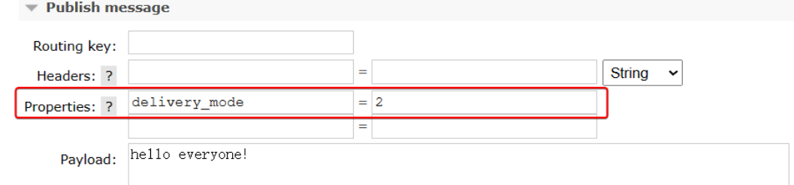

# 消息可靠性投递


## 简介


我们看上面的图，我们发现生产者获取连接通过`Channel`到`交换机`然后到`队列`然后被消费者获取到`Channel`消费信息，那么可能出现以下的问题

+ 生产者、消费者获取不到MQ服务连接
+ 生产者投递信息到`交换机`失败
+ 生产者投递信息到`队列`失败
+ MQ服务宕机
+ 消费者消费消息失败
+ 消费者消费消息能力不足


## 生产者重试机制


### 问题描述


首先第一种情况，就是生产者发送消息时，出现了网络故障，导致与MQ的连接中断。为了解决这个问题，SpringAMQP提供的消息发送时的重试机制。即：当`RabbitTemplate`与MQ连接超时后，多次重试。


### 解决方案


修改`application.yaml`文件，添加下面的内容：


```yaml
spring:
  rabbitmq:
    host: 127.0.0.1
    port: 56720 # 写一个错误的端口
    username: guest
    password: 123456
    virtual-host: /
    connection-timeout: 1s  # 设置MQ的连接超时时间
    template:
      retry:
        enabled: true # 开启超时重试机制
        initial-interval: 1000ms # 失败后的初始等待时间
        multiplier: 1 # 失败后下次的等待时长倍数，下次等待时长 = initial-interval * multiplier
        max-attempts: 5 # 最大重试次数
```


### 测试


访问`http://127.0.0.1:8081/rabbitmq/test/send`

发送一条消息，会发现会每隔1秒重试1次，总共重试了5次。消息发送的超时重试机制配置成功了！


### 注意


当网络不稳定的时候，利用重试机制可以有效提高消息发送的成功率。不过SpringAMQP提供的重试机制是**阻塞式**的重试，也就是说多次重试等待的过程中，当前线程是被阻塞的。如果对于业务性能有要求，建议禁用重试机制。如果一定要使用，请合理配置等待时长和重试次数，当然也可以考虑使用异步线程来执行发送消息的代码。


## 生产者消息确认


### 问题描述


一般情况下，只要生产者与MQ之间的网路连接顺畅，基本不会出现发送消息丢失的情况，因此大多数情况下我们无需考虑这种问题。
不过，在少数情况下，也会出现消息发送到MQ之后丢失的现象，比如：

- **MQ内部处理消息的进程发生了异常**
- **生产者发送消息到达MQ后未找到`Exchange`**
- **生产者发送消息到达MQ的`Exchange`后，未找到合适的`Queue`，因此无法路由**

针对上述情况，RabbitMQ提供了生产者消息确认机制，包括`Publisher Confirm`和`Publisher Return`两种。在开启确认机制的情况下，当生产者发送消息给MQ后，MQ会根据消息处理的情况返回不同的**回执**。


### 解决方案


- 当消息投递到MQ，但是路由失败时，通过**Publisher Return**返回异常信息，同时返回ack的确认信息，代表投递成功
- 临时消息投递到了MQ，并且入队成功，返回ACK，告知投递成功
- 持久消息投递到了MQ，并且入队完成持久化，返回ACK ，告知投递成功
- 其它情况都会返回NACK，告知投递失败

其中`ack`和`nack`属于**Publisher Confirm**机制，`ack`是投递成功；`nack`是投递失败。而`return`则属于**Publisher Return**机制。
默认两种机制都是关闭状态，需要通过配置文件来开启。


### 具体实现


#### application.yml


```yaml
spring:
  rabbitmq:
    publisher-confirm-type: correlated #确认消息已发送到交换机(Exchange)
    publisher-returns: true #确认消息已发送到队列(Queue)
    template:
      mandatory: true # 定义消息路由失败时的策略。true，则调用ReturnCallback；false：则直接丢弃消息
```


说明：

- `publish-confirm-type`：开启publisher-confirm，这里支持三种类型：
  - `none`：关闭confirm机制
  - `simple`：同步阻塞等待MQ的回执
  - `correlated`：MQ异步回调返回回执
- `publish-returns`：开启publish-return功能，同样是基于callback机制，不过是定义ReturnCallback
- `template.mandatory`：定义消息路由失败时的策略。true，则调用ReturnCallback；false：则直接丢弃消息


#### 配置类


```java
@Slf4j
@Configuration
public class RabbitTemplateConfig implements RabbitTemplate.ConfirmCallback, RabbitTemplate.ReturnsCallback {

    @Resource
    private RabbitTemplate rabbitTemplate;

    @PostConstruct
    public void init() {
        rabbitTemplate.setConfirmCallback(this);
        rabbitTemplate.setReturnsCallback(this);
    }


    /**
     * 确认回调
     *
     * @param correlationData 回调的相关数据。
     * @param ack             ack为True, nack为false
     * @param cause           一个可选的原因，对于nack，当可用时，否则为空。
     */
    @Override
    public void confirm(CorrelationData correlationData, boolean ack, String cause) {
        log.info("confirm() 回调函数打印 CorrelationData：{}", correlationData);
        log.info("confirm() 回调函数打印 ack：{}", ack);
        log.info("confirm() 回调函数打印 cause：{}" , cause);
    }

    /**
     * 发送到队列失败时才调用这个方法。
     *
     * @param returned 返回的消息和元数据。
     */
    @Override
    public void returnedMessage(ReturnedMessage returned) {
        log.info("returnedMessage() 回调函数 消息主体: {}" , new String(returned.getMessage().getBody()));
        log.info("returnedMessage() 回调函数 应答码: {}" , returned.getReplyCode());
        log.info("returnedMessage() 回调函数 描述：{}" , returned.getReplyText());
        log.info("returnedMessage() 回调函数 消息使用的交换器 exchange : {}" , returned.getExchange());
        log.info("returnedMessage() 回调函数 消息使用的路由键 routing : {}" , returned.getRoutingKey());
    }
}
```


#### 发送消息


```java
    /**
     * {@link RabbitTemplateAckConfig}
     */
    @GetMapping("/message_reliability")
    public R<Void> message_reliability(
            @RequestParam(value = "exchange", required = false, defaultValue = "boot.exchange.direct.order") String exchange,
            @RequestParam(value = "routingKey", required = false, defaultValue = "test_routingKey") String routingKey
    ) {
        // 全局唯一的消息ID，需要封装到CorrelationData中
        CorrelationData correlationData = new CorrelationData(IdUtil.nanoId());
        correlationData.getFuture().thenAccept(confirm -> {
            if (confirm.isAck()) {
                // 3.1.ack，消息成功
                log.debug("getFuture() 消息发送成功, ID:{}", correlationData.getId());
            } else {
                // 3.2.nack，消息失败
                log.error("getFuture() 消息发送失败, ID:{}, 原因{}", correlationData.getId(), confirm.getReason());
            }
        });
        rabbitTemplate.convertAndSend(
                exchange,
                routingKey,
                "测试信息", correlationData);
        return R.ok();
    }
```


### 测试


访问：

+ `http://127.0.0.1:8081/rabbitmq/test/message_reliability?exchange=boot.exchange.direct.order&routingKey=order`

正常


+ `http://127.0.0.1:8081/rabbitmq/test/message_reliability?routingKey=test`


失败找不到路由KEY对应的队列


+ 访问`http://127.0.0.1:8081/rabbitmq/test/message_reliability?exchange=test&routingKey=test`

失败找不到交换机


## 交换机持久化


### MQ管理界面


在控制台的`Exchanges`页面，添加交换机时可以配置交换机的`Durability`参数：

设置为`Durable`就是持久化模式，`Transient`就是临时模式。


### 代码配置


`org.springframework.amqp.core.AbstractExchange` 交换机的基类

+ `durable`         true代表持久化
+ `autoDelete`    false不自动删除


现在的新版本基本都不需要指定，都是持久化的，特殊的业余需求可以自定义设定

```java
@Configuration
public class CommonConfig {
    @Bean
    public DirectExchange simpleDirect(){
        return new DirectExchange("simple.direct", true, false);
    }
    @Bean
    public Queue simpleQueue(){
        return QueueBuilder.durable("simple.queue").build();
    }
    @Bean
    public Binding simpleMessageBinding(){
        return BindingBuilder.bind(simpleQueue()).to(simpleDirect()).with("simple");
    }
}
```


## 队列持久化


### MQ管理页面


在控制台的Queues页面，添加队列时，同样可以配置队列的`Durability`参数：


### 代码配置


基类:`org.springframework.amqp.core.Queue`

事实上，默认情况下，由SpringAMQP声明的队列都是持久化的。


## 消息持久化


### MQ管理界面


在控制台发送消息的时候，可以添加很多参数，而消息的持久化是要配置一个`properties`：





### 代码配置


SpringAMQP发出的任何消息都是持久化的，不用特意指定。


## 消费者确认机制


### 简介


为了确认消费者是否成功处理消息，RabbitMQ提供了消费者确认机制（`Consumer Acknowledgement`）。即：当消费者处理消息结束后，应该**向RabbitMQ发送一个回执，告知RabbitMQ自己消息处理状态**。回执有三种可选值：


| 回执类型 | 描述                                                 |
| -------- | ---------------------------------------------------- |
| `ack`    | 成功处理消息，RabbitMQ从队列中删除该消息             |
| `nack`   | 消息处理失败，RabbitMQ需要再次投递消息               |
| `reject` | 消息处理失败并拒绝该消息，RabbitMQ从队列中删除该消息 |


一般`reject`方式用的较少，除非是消息格式有问题，那就是开发问题了。因此大多数情况下我们需要将消息处理的代码通过`try catch`机制捕获，消息处理成功时返回`ack`，处理失败时返回`nack`.


### SpringBoot中


由于消息回执的处理代码比较统一，因此SpringAMQP帮我们实现了消息确认。并允许我们通过配置文件设置ACK处理方式，有三种模式：

|  模式  | 描述                                                         |
| :----: | ------------------------------------------------------------ |
|  none  | 不处理。即消息投递给消费者后立刻ack，消息会立刻从MQ删除。非常不安全，不建议使用 |
| manual | 手动模式。需要自己在业务代码中调用api，发送`ack`或`reject`，存在业务入侵，但更灵活 |
|  auto  | 自动模式。SpringAMQP利用AOP对我们的消息处理逻辑做了环绕增强，当业务正常执行时则自动返回`ack`.  当业务出现异常时，根据异常判断返回不同结果：如果是**业务异常**，会自动返回`nack`；如果是**消息处理或校验异常**，自动返回`reject`; |


### ACK修改处理方式


```yaml
spring:
  rabbitmq:
    listener:
      simple:
        acknowledge-mode: none # 不做处理
```


### 测试所需消费者Code


```java
@Slf4j
@Component
public class ConsumerMessageListener3 {
    public static final String EXCHANGE_NAME = "boot.exchange.act.direct";
    public static final String QUEUE_NAME = "boot.queue.act";
    @RabbitListener(bindings =
    @QueueBinding(
            value = @Queue(value = QUEUE_NAME, durable = "true"),
            exchange = @Exchange(value = EXCHANGE_NAME),
            key = {"order"}
    )
    )
    public void processMessage(String dateString, Message message, Channel channel) {
        log.info("dateString：{}", dateString);
        log.info("message:{}", message);
        log.info("channel:{}", channel);
        System.out.println(10 /0);//模拟一个消息处理的异常：
    }
}
```


### 测试所需生产者Code


```java
    /**
     * {@link com.xht.cloud.demo.rabbitmq.springboot.listener.ConsumerMessageListener3}
     */
    @GetMapping("/act")
    public R<String> testAct() {
        String message = String.format("订单号:%s", IdUtil.simpleUUID());
        rabbitTemplate.convertAndSend(
                ConsumerMessageListener3.EXCHANGE_NAME,
                "order",
                message);
        return R.ok(message);
    }
```


### 测试none


```yaml
spring:
  rabbitmq:
    listener:
      simple:
        acknowledge-mode: none
```


访问：`http://127.0.0.1:8081/rabbitmq/test/act`

测试可以发现：当消息处理发生异常时，消息依然被RabbitMQ删除了。


### 测试auto


```yaml
spring:
  rabbitmq:
    listener:
      simple:
        acknowledge-mode: auto
```


访问：`http://127.0.0.1:8081/rabbitmq/test/act`

在异常位置打断点，再次发送消息，程序卡在断点时，可以发现此时消息状态为unack（未确定状态）：

抛出异常后，因为Spring会自动返回nack，所以消息恢复至Ready状态，并且没有被RabbitMQ删除：


> 记得查看mq页面


## 消费者失败重试机制


在进行上方测试的时候，我们发现消息消费失败后，生产者会一直重试

当消费者出现异常后，消息会不断requeue（重入队）到队列，再重新发送给消费者。如果消费者再次执行依然出错，消息会再次requeue到队列，再次投递，直到消息处理成功为止。极端情况就是消费者一直无法执行成功，那么消息requeue就会无限循环，导致mq的消息处理飙升，带来不必要的压力：


```yaml
spring:
  rabbitmq:
    listener:
      simple:
        retry:
          enabled: true # 开启消费者失败重试
          initial-interval: 1000ms # 初识的失败等待时长为1秒
          multiplier: 1 # 失败的等待时长倍数，下次等待时长 = multiplier * last-interval
          max-attempts: 3 # 最大重试次数
          stateless: true # true无状态；false有状态。如果业务中包含事务，这里改为false
```


重启consumer服务，重复之前的测试。可以发现：

- 消费者在失败后消息没有重新回到MQ无限重新投递，而是在本地重试了3次
- 本地重试3次以后，抛出了`AmqpRejectAndDontRequeueException`异常。查看RabbitMQ控制台，发现消息被删除了，说明最后SpringAMQP返回的是`reject`

结论：

- 开启本地重试时，消息处理过程中抛出异常，不会requeue到队列，而是在消费者本地重试
- 重试达到最大次数后，Spring会返回reject，消息会被丢弃


## 消费者失败处理策略


### 简介


在之前的测试中，本地测试达到最大重试次数后，消息会被丢弃。这在某些对于消息可靠性要求较高的业务场景下，显然不太合适了。因此Spring允许我们自定义重试次数耗尽后的消息处理策略，这个策略是由`org.springframework.amqp.rabbit.retry.MessageRecoverer`接口来定义的,他有以下的实现


+ `org.springframework.amqp.rabbit.retry.ImmediateRequeueMessageRecoverer`
+ `org.springframework.amqp.rabbit.retry.RejectAndDontRequeueRecoverer`
+ `org.springframework.amqp.rabbit.retry.RepublishMessageRecoverer`


### 配置


> 实际开发中根据不通业务，自己选一种


```java
@Configuration
public class ErrorConfig {

    /**
     * 重试耗尽后，返回`nack`，消息重新入队
     */
    @Bean
    public MessageRecoverer immediateRequeueMessageRecoverer() {
        return new ImmediateRequeueMessageRecoverer();
    }

    /**
     * 重试耗尽后，直接`reject`，丢弃消息。默认就是这种方式
     */
    @Bean
    public MessageRecoverer rejectAndDontRequeueRecoverer() {
        return new RejectAndDontRequeueRecoverer();
    }

    /**
     * 重试耗尽后，将失败消息投递到指定的交换机
     */
    @Bean
    public MessageRecoverer republishMessageRecoverer(RabbitTemplate rabbitTemplate) {
        return new RepublishMessageRecoverer(rabbitTemplate, "error.exchange", "error.router.key");
    }

    @Bean
    public DirectExchange errorMessageExchange() {
        return new DirectExchange("error.exchange");
    }

    @Bean
    public Queue errorQueue() {
        return new Queue("error.queue", true);
    }

    @Bean
    public Binding errorBinding(Queue errorQueue, DirectExchange errorMessageExchange) {
        return BindingBuilder.bind(errorQueue).to(errorMessageExchange).with("error.router.key");
    }

    /**
     * 批量处理
     */
    @Bean
    public MessageRecoverer messageBatchRecoverer() {
        return new MessageBatchRecoverer() {
            @Override
            public void recover(List<Message> messages, Throwable cause) {
                //自定进行其他的业务操作
                System.out.println("-------------------------");
            }
        };
    }
}
```


## 消费者限流


### 配置


```yaml
spring:
  rabbitmq:
    listener:
      simple:
        prefetch: 1 # 设置每次最多从消息队列服务器取回多少消息
```


### 效果


- 生产者发送100个消息
- 对照两种情况：
  - 消费端没有设置prefetch参数：100个消息被全部取回
  - 消费端设置prefetch参数为1：100个消息慢慢取回


# 消息超时


## 过期时间


这里过一个知识点——过期时间，即对消息或队列设置过期时间（TTL）。一旦消息过期，消费就无法接收到这条消息，这种情况是绝不允许存在的，所以官方就出了一个对策——死信队列，死信队列最初出现的意义就是为了应对消息过期丢失情况的手段之一。

那么过期时间具体怎么设置呢？运维人员只需了解外部层面的，因为对消息设置过期时间有两个维度，一个是定义消息本身属性时开发人员在代码里加进去的一个参数（初中级运维看不到），另外一个是定义队列属性的，可以从web监控页面查看。


## 队列设置


### 生产者


```java
@Slf4j
@RestController
@RequestMapping("/rabbitmq/expired")
public class ExpiredTestController {

    @Autowired
    private RabbitTemplate rabbitTemplate;

    @GetMapping("/queue")
    public R<Void> test() {
        for (int i = 0; i < 100; i++) {
            rabbitTemplate.convertAndSend("time.out.exchange", "time.out.queue", "测试过期信息队列");
        }
        return R.ok();
    }
}

```


### 界面配置方式


记得增加交换机`time.out.exchange`并且与队列`time.out.queue`绑定，绑定的路由key是`time.out.queue`


### 代码配置方式


```java
@Slf4j
@Configuration
public class ExpiredConfig {

    @Bean
    public DirectExchange getTimeExchange(){
        return new DirectExchange("time.out.exchange");
    }

    @Bean
    public Queue getTimeQueue(){
        return QueueBuilder.durable("time.out.queue").ttl(5000).build();
    }

    @Bean
    public Binding getTimeBinding(){
        return BindingBuilder.bind(getTimeQueue()).to(getTimeExchange()).with("time.out.queue");
    }
}
```


### 测试


访问：`http://127.0.0.1:8081/rabbitmq/expired/queue`后访问rabbmitmq页面


五秒后


## 消息设置


### 代码


```java
@Slf4j
@RestController
@RequestMapping("/rabbitmq/expired")
public class ExpiredTestController {

    @Autowired
    private RabbitTemplate rabbitTemplate;

    @GetMapping("/message")
    public void testSendMessageTTL() {
        // 1、创建消息后置处理器对象
        MessagePostProcessor messagePostProcessor = (Message message) -> {
            // 设定 TTL 时间，以毫秒为单位
            message.getMessageProperties().setExpiration("5000");
            return message;
        };
        // 2、发送消息
        rabbitTemplate.convertAndSend(
                "time.out.exchange",
                "time.out.queue",
                "测试过期信息队列", messagePostProcessor);
    }
}
```


### 测试


访问：`http://127.0.0.1:8081/rabbitmq/expired/queue`后访问rabbmitmq页面

效果如队列一样


## 队列和消息同时设置


**如果两个层面都做了设置，那么哪个时间短，哪个生效**


## 注意


RabbitMQ的消息过期是基于追溯方式来实现的，也就是说当一个消息的TTL到期以后不一定会被移除或投递到死信交换机，而是在消息恰好处于**队首时才会被处理**。
当队列中消息堆积很多的时候，过期消息可能不会被按时处理，因此你设置的**TTL时间不一定准确**。


# 死信


## 死信产生原因


当一个队列中的消息满足下列情况之一时，可以成为死信**（`dead letter`）**

+ **拒绝**：消费者拒接消息，`basicNack()/basicReject()`，并且不把消息`重新放入原目标队列`，`requeue=false`
+ **溢出**：队列中消息数量到达限制。比如队列最大只能存储10条消息，且现在已经存储 了10条，此时如果再发送一条消息进来，根据先进先出原则，队列中最早的消息会变 成死信
+ **超时**：消息到达超时时间未被消费


## 死信处理方式


死信的处理方式大致有下面三种：

+ **丢弃**：对不重要的消息直接丢弃，不做处理

+ **入库**：把死信写入数据库，日后处理

+ **监听**：消息变成死信后进入死信队列，我们专门设置消费端监听死信队列（通常采用）


## 准备代码


### 配置类


```java
@Slf4j
@Configuration
public class DeadRabbitMQTestConfig {

    //-----------------------------死信配置-----------------------------------
    public static final String EXCHANGE_DEAD_LETTER = "dead.exchange";
    public static final String QUEUE_DEAD_LETTER = "dead.queue";
    public static final String ROUTING_KEY_DEAD_LETTER = "dead.exchange.queue";

    //-----------------------------常规配置-----------------------------------
    public static final String EXCHANGE_NORMAL = "normal.exchange";
    public static final String QUEUE_NORMAL = "normal.queue";
    public static final String ROUTING_KEY_NORMAL = "normal.exchange.queue";

    /**
     * 设置死信交换机
     */
    @Bean
    public DirectExchange getDeadExchange() {
        return new DirectExchange(EXCHANGE_DEAD_LETTER);
    }

    /**
     * 设置死信队列
     */
    @Bean
    public Queue getDeadQueue() {
        return QueueBuilder.durable(QUEUE_DEAD_LETTER).build();
    }

    /**
     * 死信交换机和死信队列绑定
     */
    @Bean
    public Binding getDeadBinding() {
        return BindingBuilder.bind(getDeadQueue()).to(getDeadExchange()).with(ROUTING_KEY_DEAD_LETTER);
    }

    /**
     * 设置常规的交换机
     */
    @Bean
    public DirectExchange getNormalExchange() {
        return new DirectExchange(EXCHANGE_NORMAL);
    }

    /**
     * 设置常规的队列
     */
    @Bean
    public Queue getNormalQueue() {
        return QueueBuilder.durable(QUEUE_NORMAL)
                .deadLetterExchange(EXCHANGE_DEAD_LETTER) // 对应的死信交换机
                .deadLetterRoutingKey(ROUTING_KEY_DEAD_LETTER) // 对应的死信路由键
                .maxLength(10L) //设置队列最大容量
                .ttl(10000) //设置消息超时时间 10 秒
                .build();
    }

    /**
     * 设置常规的交换机和常规的队列绑定
     */
    @Bean
    public Binding getNormalBinding() {
        return BindingBuilder.bind(getNormalQueue()).to(getNormalExchange()).with(ROUTING_KEY_NORMAL);
    }
}
```


### 消费者


```java
@Slf4j
@Component
public class DeadListener {

    /**
     * 死信队列监听
     */
    @RabbitListener(queues = {DeadConfig.QUEUE_DEAD_LETTER})
    public void processMessageDead(String dataString, Message message, Channel channel) throws IOException {
        // 监听死信队列
        log.info("★[dead letter]我是死信监听方法，我接收到了死信消息 :{}", dataString);
        channel.basicAck(message.getMessageProperties().getDeliveryTag(), false);
    }
}

```


## 测试死信产生(拒绝)


### 简介


消费者拒接消息，`basicNack()/basicReject()`，并且不把消息`重新放入原目标队列`，`requeue=false`


### 配置


```yaml
spring:
  rabbitmq:
    listener:
      simple:
        acknowledge-mode: auto
```


### 消费者


```java
@Slf4j
@Component
public class DeadListener {

    /**
     * 死信常规监听
     */
    @RabbitListener(queues = {DeadConfig.QUEUE_NORMAL})
    public void processMessageNormal(Message message, Channel channel) throws IOException {
        // 监听正常队列，但是拒绝消息
        log.info("★[normal]消息接收到，但我拒绝。");
        channel.basicReject(message.getMessageProperties().getDeliveryTag(), false);
    }

}

```


### 生产者


```java
@Slf4j
@RestController
@RequestMapping("/rabbitmq/dead")
@RequiredArgsConstructor
public class DeadController {

    private final RabbitTemplate rabbitTemplate;

    @GetMapping("/push1")
    public R<Void> send() {
        rabbitTemplate
                .convertAndSend(
                        DeadConfig.EXCHANGE_NORMAL,
                        DeadConfig.ROUTING_KEY_NORMAL,
                        "测试死信情况1：消息被拒绝");
        return R.ok();
    }
}

```


### 测试


访问：`http://localhost:8081/rabbitmq/dead/push1`


## 测试死信产生(溢出)


### 简介


队列中消息数量到达限制。比如队列最大只能存储10条消息，且现在已经存储 了10条，此时如果再发送一条消息进来，根据先进先出原则，队列中最早的消息会变 成死信


### 消费者


```java
@Slf4j
@Component
public class DeadListener {

    /**
     * 死信队列监听
     */
    @RabbitListener(queues = {DeadConfig.QUEUE_DEAD_LETTER})
    public void processMessageDead(String dataString, Message message, Channel channel) throws IOException {
        // 监听死信队列
        log.info("★[dead letter]我是死信监听方法，我接收到了死信消息 :{}", dataString);
        channel.basicAck(message.getMessageProperties().getDeliveryTag(), false);
    }

    /**
     * 死信常规监听
     */
    @RabbitListener(queues = {DeadConfig.QUEUE_NORMAL})
    public void processMessageNormal(Message message, Channel channel) throws IOException {
        // 监听正常队列，但是拒绝消息
        log.info("★[normal]消息接收到 {}", new String(message.getBody(), StandardCharsets.UTF_8));
        // log.info("★[normal]消息接收到，但我拒绝。");
        //  channel.basicReject(message.getMessageProperties().getDeliveryTag(), false);
    }

}
```


### 生产者


```java
@Slf4j
@RestController
@RequestMapping("/rabbitmq/dead")
@RequiredArgsConstructor
public class DeadController {

    private final RabbitTemplate rabbitTemplate;
    @GetMapping("/push2")
    public R<Void> send2() {
        for (int i = 0; i < 20; i++) {
            rabbitTemplate
                    .convertAndSend(
                            DeadConfig.EXCHANGE_NORMAL,
                            DeadConfig.ROUTING_KEY_NORMAL,
                            "测试死信情况:" + i);
        }
        return R.ok();
    }
}
```


### 测试


访问: `http://localhost:8081/rabbitmq/dead/push2`


## 测试死信产生


### 简介


消息到达超时时间未被消费


### 消费者


```java
@Slf4j
@Component
public class DeadListener {

    /**
     * 死信队列监听
     */
    @RabbitListener(queues = {DeadConfig.QUEUE_DEAD_LETTER})
    public void processMessageDead(String dataString, Message message, Channel channel) throws IOException {
        // 监听死信队列
    log.info("★[dead letter] 当前时间：{} 我是死信监听方法，我接收到了死信消息 :{}", DateUtil.now(), dataString);
        channel.basicAck(message.getMessageProperties().getDeliveryTag(), false);
    }

    /**
     * 死信常规监听
     */
   // @RabbitListener(queues = {DeadConfig.QUEUE_NORMAL})
    public void processMessageNormal(Message message, Channel channel) throws IOException {
        // 监听正常队列，但是拒绝消息
        log.info("★[normal]消息接收到 {}", new String(message.getBody(), StandardCharsets.UTF_8));
        // log.info("★[normal]消息接收到，但我拒绝。");
        //  channel.basicReject(message.getMessageProperties().getDeliveryTag(), false);
    }

}
```


### 生产者


```java
@Slf4j
@RestController
@RequestMapping("/rabbitmq/dead")
@RequiredArgsConstructor
public class DeadController {

    private final RabbitTemplate rabbitTemplate;

    @GetMapping("/push3")
    public R<Void> push3() {
        rabbitTemplate
                .convertAndSend(
                        DeadConfig.EXCHANGE_NORMAL,
                        DeadConfig.ROUTING_KEY_NORMAL,
                        "测试死信情况3：" + DateUtil.now());
        return R.ok();
    }
}

```


### 测试


访问:`http://localhost:8081/rabbitmq/dead/push3` 等待`10秒`后观察，为什么是10秒我们前面配置了队列过期时间是10秒


# 延迟插件


## 简介


基于死信队列虽然可以实现延迟消息，但是太麻烦了。因此RabbitMQ社区提供了一个延迟消息插件来实现相同的效果。


+ 官方文档说明： https://www.rabbitmq.com/blog/2015/04/16/scheduling-messages-with-rabbitmq

- 官网地址：https://github.com/rabbitmq/rabbitmq-delayed-message-exchange
- 延迟极限：最多两天


## 下载地址


https://github.com/rabbitmq/rabbitmq-delayed-message-exchange


## 确定卷映射目录


```shell
docker inspect rabbitmq
```


运行结果：

```json
        "Mounts": [
            {
                "Type": "volume",
                "Name": "rabbitmq-plugin",
                "Source": "/var/lib/docker/volumes/rabbitmq-plugin/_data",
                "Destination": "/plugins",
                "Driver": "local",
                "Mode": "z",
                "RW": true,
                "Propagation": ""
            },
            {
                "Type": "volume",
                "Name": "cca7bc3012f5b76bd6c47a49ca6911184f9076f5f6263b41f4b9434a7f269b11",
                "Source": "/var/lib/docker/volumes/cca7bc3012f5b76bd6c47a49ca6911184f9076f5f6263b41f4b9434a7f269b11/_data",
                "Destination": "/var/lib/rabbitmq",
                "Driver": "local",
                "Mode": "",
                "RW": true,
                "Propagation": ""
            }
        ]
```

和容器内/plugins目录对应的宿主机目录是：/var/lib/docker/volumes/rabbitmq-plugin/_data


## 启用插件


```shell
# 登录进入容器内部
docker exec -it rabbitmq /bin/bash

# rabbitmq-plugins命令所在目录已经配置到$PATH环境变量中了，可以直接调用
rabbitmq-plugins enable rabbitmq_delayed_message_exchange

# 退出Docker容器
exit
```


或者


```
docker exec -it rabbitmq rabbitmq-plugins enable rabbitmq_delayed_message_exchange
```


最后


```shell
# 重启Docker容器
docker restart rabbitmq
```


## 创建交换机（界面）


rabbitmq_delayed_message_exchange插件在工作时要求交换机是<span style="color:blue;font-weight:bolder;">x-delayed-message</span>类型才可以，创建方式如下：


关于<span style="color:blue;font-weight:bolder;">x-delayed-type</span>参数的理解：

> 原本指定交换机类型的地方使用了x-delayed-message这个值，那么这个交换机除了支持延迟消息之外，到底是direct、fanout、topic这些类型中的哪一个呢？
>
> 这里就额外使用`x-delayed-type`来指定交换机本身的类型


## 代码使用(声明方式1)


````java
@RabbitListener(bindings = @QueueBinding(
        value = @Queue(name = "delay.queue1", durable = "true"),
        exchange = @Exchange(name = "delay.direct1", delayed = "true"),
        key = "delay1"
))
public void listenDelayMessage(String msg) {
    log.info("接收到delay.queue1 时间： {} 的延迟消息：{} ", DateUtil.now(),msg);
}
````


## 代码使用(声明方式2)


```java
@Bean
public DirectExchange delayExchange() {
    return ExchangeBuilder
            .directExchange("delay.direct2") // 指定交换机类型和名称
            .delayed() // 设置delay的属性为true
            .durable(true) // 持久化
            .build();
}

@Bean
public org.springframework.amqp.core.Queue delayedQueue() {
    return new org.springframework.amqp.core.Queue("delay.queue2");
}

@Bean
public Binding delayQueueBinding() {
    return BindingBuilder.bind(delayedQueue()).to(delayExchange()).with("delay2");
}
```


## 代码使用(发送延迟信息)


```java
@Slf4j
@RestController
@RequestMapping("/rabbitmq/delay_plugin")
@RequiredArgsConstructor
public class TestDelayPluginController {

    private final RabbitTemplate rabbitTemplate;


    @GetMapping("/push1")
    public R<Void> send() {
        rabbitTemplate
                .convertAndSend(
                        "delay.direct1",
                        DeadConfig.ROUTING_KEY_NORMAL,
                        "delay1" + DateUtil.now()
                        , new MessagePostProcessor() {
                            @Override
                            public Message postProcessMessage(Message message) throws AmqpException {
                                // 添加延迟消息属性
                                message.getMessageProperties().setDelayLong(5000L);
//                                message.getMessageProperties().setHeader("x-delay", 5000L);;
                                return message;
                            }
                        });
        return R.ok();
    }
}
```


## 测试


访问： `http://localhost:8081/rabbitmq/delay_plugin/push1`


## 注意


如果使用这个插件那么`org.springframework.amqp.rabbit.core.RabbitTemplate.ReturnsCallback`的`returnedMessage`方法也会执行，[也就是我们生产者消息确认](##生产者消息确认)这个章节的内容不适合这个插件


# 事务消息


## 简介


+ 在生产者端使用事务消息和消费端没有关系

+ 在生产者端使用事务消息仅仅是控制事务内的消息是否发送

+ 提交事务就把事务内所有消息都发送到交换机

+ 回滚事务则事务内任何消息都不会被发送


## 配置


```java
@Configuration
public class RabbitConfig {

    @Bean
    public RabbitTransactionManager transactionManager(CachingConnectionFactory connectionFactory) {
        return new RabbitTransactionManager(connectionFactory);
    }

    @Bean
    public RabbitTemplate rabbitTemplate(CachingConnectionFactory connectionFactory) {
        RabbitTemplate rabbitTemplate = new RabbitTemplate(connectionFactory);
        rabbitTemplate.setChannelTransacted(true);
        return rabbitTemplate;
    }
}
```


## mq配置


```java
@Bean
public Exchange getTxExchange() {
    return new DirectExchange("tx_exchange");
}


@Bean
public Queue getTxQueue() {
    return new Queue("tx_queue");
}

@Bean
public Binding getTxBinding() {
    return BindingBuilder.bind(getTxQueue()).to(getTxExchange()).with("tx_routing_key").noargs();
}
```


## 消费者


```java
@Slf4j
@Component
@RequiredArgsConstructor
public class TxRabbitMqListener {


    @RabbitListener(queues = "tx_queue")
    public void listener(Message message) {
        log.info("收到信息 {}", new String(message.getBody()));
    }
}
```


## 生产者


```java
@Slf4j
@RestController
@RequestMapping("/rabbitmq/tx")
@RequiredArgsConstructor
public class TxRabbitMqController {

    private final RabbitTemplate rabbitTemplate;

    @GetMapping("/success")
    public R<Void> test1() {
        // 1、发送第一条消息
        rabbitTemplate.convertAndSend("tx_exchange", "tx_routing_key", "测试 tx ~~~01)");

        // 2、发送第二条消息
        rabbitTemplate.convertAndSend("tx_exchange", "tx_routing_key", "测试 tx ~~~02)");
        return R.ok();
    }

    @Transactional
    @GetMapping("/error")
    public R<Void> test2() {
        // 1、发送第一条消息
        rabbitTemplate.convertAndSend("tx_exchange", "tx_routing_key", "测试 tx ~~~01)");
        System.out.println(1 / 0);
        // 2、发送第二条消息
        rabbitTemplate.convertAndSend("tx_exchange", "tx_routing_key", "测试 tx ~~~02)");
        return R.ok();
    }
}
```


## 测试


```http
GET http://localhost:8081/rabbitmq/tx/error
```


消费者没有收到一条信息


```http
GET http://localhost:8081/rabbitmq/tx/success
```


消费者收到了两条信息


