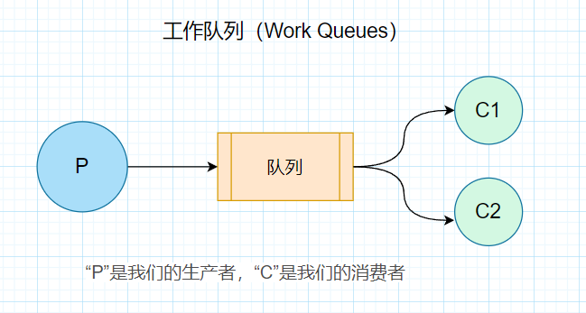

# 简介


## 消费模式


| 队列模式                          | 描述                                                         |
| --------------------------------- | ------------------------------------------------------------ |
| `Simple Work Queue(简单工作队列)` | 也就是常说的点对点模式，一条消息由一个消费者进行消费。（当有多个消费者时，默认使用轮训机制把消息分配给消费者） |
| `Work Queues(工作队列)`           | 也叫公平队列，能者多劳的消息队列模型。队列必须接收到来自消费者的 手动ack 才可以继续往消费者发送消息 |
| `Publish/Subscribe(发布订阅模式)` | 一条消息被多个消费者消费                                     |
| `Routing(路由模式)`               | 有选择的接收消息                                             |
| `Topics(主题模式)`                | 通过一定的规则来选择性的接收消息                             |
| `RPC 模式`                        | 发布者发布消息，并且通过 RPC 方式等待结果。目前这个应该场景少 |


## Exchange(交换机)


+ direct(直连交换机)：将队列绑定到交换机，消息的 routeKey 需要与队列绑定的 routeKey 相同。
+ fanout(扇形交换机)：不处理 routeKey ，直接把消息转发到与其绑定的所有队列中。
+ topic(主题交换机)：根据一定的规则，根据 routeKey 把消息转发到符合规则的队列中，其中 # 用于匹配符合一个或者多个词（范围更广）， * 用于匹配一个词。
+ headers(头部交换机)：根据消息的 headers 转发消息而不是根据 routeKey 来转发消息, 其中 header 是一个 Map，也就意味着不仅可以匹配字符串类型，也可以匹配其他类型数据。 规则可以分为所有键值对匹配或者单一键值对匹配。


其实在这里我们差不多可以得出消息模型与 Exchange 的关系比较：

| 消息模式                                                     | 交换机                |
| ------------------------------------------------------------ | --------------------- |
| Simple Work Queue （简单工作队列），Work Queues （工作队列） | 空交换机              |
| Publish/Subscribe （发布订阅模式）                           | fanout （扇形交换机） |
| Routing（路由模式）                                          | direct （直连交换机） |
| Topics（主题模式）                                           | topic（主题交换机）   |


# 安装


## Docker安装


### 命令


```shell
# 查询镜像
docker search rabbitmq
# 拉取镜像
docker pull rabbitmq
```


### 执行


```shell
# -d 参数：后台运行 Docker 容器
# --name 参数：设置容器名称
# -p 参数：映射端口号，格式是“宿主机端口号:容器内端口号”。5672供客户端程序访问，15672供后台管理界面访问
# -v 参数：卷映射目录
# -e 参数：设置容器内的环境变量，这里我们设置了登录RabbitMQ管理后台的默认用户和密码
docker run -d --name rabbitmq -p 5672:5672 -p 15672:15672 -v rabbitmq-plugin:/rabbitmq/plugins -e RABBITMQ_DEFAULT_USER=guest -e RABBITMQ_DEFAULT_PASS=123456 rabbitmq
```


### 测试


游览器访问`http://127.0.0.1:15672/`


### 问题页面访问不到


如果访问`http://127.0.0.1:15672/`失败，执行以下命令


```shell
# 进入到容器内部
docker exec -it 容器ID /bin/bash
# 执行
rabbitmq-plugins enable rabbitmq_management
```


### RabbitMQ可视化界面Overview不显示折线图和队列不显示Messages


进入容器内部


```
docker exec -it 容器id /bin/bash
```


进入conf.d配置中


````shell
cd /etc/rabbitmq/conf.d/
````


修改 `management_agent.disable_metrics_collector = false`


```shell
echo management_agent.disable_metrics_collector = false > management_agent.disable_metrics_collector.conf
```


退出容器 


```shell
exit 
```


重启容器


```sh
 docker restart 容器名字或者Id
```


# HelloWorld


## 依赖


```xml
<dependency>
    <groupId>com.rabbitmq</groupId>
    <artifactId>amqp-client</artifactId>
    <version>5.20.0</version>
</dependency>
```


## 配置类


```java
@Data
public final class RabbitmqConfig {
    /**
     * 主机地址
     */
    private String host = "127.0.0.1";

    /**
     * 连接端口号
     */
    private Integer port = 5672;

    /**
     * 虚拟主机名称
     */
    private String virtualHost = "/";

    /**
     * 连接用户名
     */
    private String username = "guest";

    /**
     * 连接密码
     */
    private String password = "123456";
}
```


## 工具类


```java
/**
 * 描述 ： RabbitMQ工具类
 *
 * @author : 小糊涂
 **/
public final class RabbitMQConnectionUtils {
    private final static RabbitmqConfig rabbitmqConfig = new RabbitmqConfig();

    /**
     * 获取 rabbitmq 连接对象
     *
     * @return {@link Connection} 连接
     */
    public static Connection getConnection() throws Exception {
        ConnectionFactory connectionFactory = new ConnectionFactory();  // 创建连接工厂
        connectionFactory.setHost(rabbitmqConfig.getHost());    // 设置主机地址
        connectionFactory.setPort(rabbitmqConfig.getPort());   // 设置连接端口号：默认为 5672
        connectionFactory.setVirtualHost(rabbitmqConfig.getVirtualHost());    // 虚拟主机名称：默认为 /
        connectionFactory.setUsername(rabbitmqConfig.getUsername());// 设置连接用户名；默认为guest
        connectionFactory.setPassword(rabbitmqConfig.getPassword()); // 设置连接密码；默认为guest
        return connectionFactory.newConnection();   // 创建连接
    }

    /**
     * 关闭
     *
     * @param channel    {@link Channel}通道
     * @param connection {@link Connection}连接
     */
    public static void close(Channel channel, Connection connection) {
        if (Objects.nonNull(channel)) {
            try {
                channel.close();
            } catch (Exception ignored) {
            }
        }
        if (Objects.nonNull(connection)) {
            try {
                connection.close();
            } catch (Exception ignored) {
            }
        }
    }
}
```


## 生产者


```java
/**
 * 描述 ：消息发送端（生产者）
 *
 * @author : 小糊涂
 **/
public class HelloWorldProducer {
    public static void main(String[] args) throws Exception {
        Connection connection = RabbitMQConnectionUtils.getConnection();
        Channel channel = connection.createChannel();     // 创建频道
        // 声明（创建）队列
        // queue      参数1：队列名称
        // durable    参数2：是否定义持久化队列，当 MQ 重启之后还在
        // exclusive  参数3：是否独占本次连接。若独占，只能有一个消费者监听这个队列且 Connection 关闭时删除这个队列
        // autoDelete 参数4：是否在不使用的时候自动删除队列，也就是在没有Consumer时自动删除
        // arguments  参数5：队列其它参数
        channel.queueDeclare("simple_queue", true, false, false, null);
        System.out.print("请输入你的信息：");
        Scanner scanner = new Scanner(System.in);
        while (scanner.hasNext()) {
            String message = scanner.next();
            // 参数1：交换机名称,如果没有指定则使用默认Default Exchange
            // 参数2：路由key,简单模式可以传递队列名称
            // 参数3：配置信息
            // 参数4：消息内容
            channel.basicPublish("", "simple_queue", null, message.getBytes());
            System.err.println("消息发送成功");
            ThreadUtil.sleep(500);
            System.out.print("请输入你的信息:");
        }
        RabbitMQConnectionUtils.close(channel, connection);
    }
}
```


## 消费者


```java
/**
 * 描述 ：消息接收端（消费者）
 *
 * @author : 小糊涂
 **/
public class HelloWorldConsumer {


    public static void main(String[] args) throws Exception {
        // 3. 创建连接 Connection
        Connection connection = RabbitMQConnectionUtils.getConnection();
        // 4. 创建Channel
        Channel channel = connection.createChannel();
        // 5. 创建队列
        // 如果没有一个名字叫simple_queue的队列，则会创建该队列，如果有则不会创建
        // 参数1. queue：队列名称
        // 参数2. durable：是否持久化。如果持久化，则当MQ重启之后还在
        // 参数3. exclusive：是否独占。
        // 参数4. autoDelete：是否自动删除。当没有Consumer时，自动删除掉
        // 参数5. arguments：其它参数。
        channel.queueDeclare("simple_queue", true, false, false, null);
        // 接收消息
        DefaultConsumer consumer = new DefaultConsumer(channel) {
            // 回调方法,当收到消息后，会自动执行该方法
            // 参数1. consumerTag：标识
            // 参数2. envelope：获取一些信息，交换机，路由key...
            // 参数3. properties：配置信息
            // 参数4. body：数据
            @Override
            public void handleDelivery(String consumerTag, Envelope envelope, AMQP.BasicProperties properties, byte[] body) {
                System.err.println("\n=========================接收到了信息=========================\n");
                System.out.println("consumerTag：" + consumerTag);
                System.out.println("Exchange：" + envelope.getExchange());
                System.out.println("RoutingKey：" + envelope.getRoutingKey());
                System.out.println("properties：" + properties);
                System.out.println("body：" + new String(body));
            }
        };
        // 参数1. queue：队列名称
        // 参数2. autoAck：是否自动确认，类似咱们发短信，发送成功会收到一个确认消息
        // 参数3. callback：回调对象
        // 消费者类似一个监听程序，主要是用来监听消息
        channel.basicConsume("simple_queue", true, consumer);
    }
}
```


## 测试1


## 测试2


我们生产者发送完消息如果不被消费者消费的话可以在以下页面查看到信息


# 简单队列模式(Simple Queue）


## 图示


## 简介


> 只包含一个生产者以及一个消费者，生产者Producer将消息发送到队列中，消费者Consumer从该队列接收消息。（单生产单消费）


## 代码实现


就是我们上面写的 [HelloWorld](#HelloWorld)


# 工作队列模式(Work Queues)


## 图示





## 简介


## 代码实现


### 生产者


```java
public class WorkProducer {
    static final String QUEUE_NAME = "work_queue";

    public static void main(String[] args) throws Exception {
        Connection connection = RabbitMQConnectionUtils.getConnection();
        Channel channel = connection.createChannel();
        channel.queueDeclare(QUEUE_NAME, true, false, false, null);
        System.out.print("请输入你的信息：");
        Scanner scanner = new Scanner(System.in);
        while (scanner.hasNext()) {
            String message = scanner.next();
            channel.basicPublish("", QUEUE_NAME, null, message.getBytes());
            System.err.println("消息发送成功");
            ThreadUtil.sleep(500);
            System.out.print("请输入你的信息:");
        }
        RabbitMQConnectionUtils.close(channel, connection);
    }
}
```


### 消费者1


```java
public class WorkConsumer1 {
    static final String QUEUE_NAME = "work_queue";
    public static void main(String[] args) throws Exception {
        // 创建连接 Connection
        Connection connection = RabbitMQConnectionUtils.getConnection();
        // 创建Channel
        Channel channel = connection.createChannel();
        // 创建队列
        channel.queueDeclare(QUEUE_NAME, true, false, false, null);
        // 接收消息
        DefaultConsumer consumer = new DefaultConsumer(channel) {
            @Override
            public void handleDelivery(String consumerTag, Envelope envelope, AMQP.BasicProperties properties, byte[] body) {
                System.out.println("WorkConsumer1：" + new String(body));
            }
        };
        channel.basicConsume(QUEUE_NAME, true, consumer);
    }
}
```


### 消费者2


```java
public class WorkConsumer2 {
    static final String QUEUE_NAME = "work_queue";
    public static void main(String[] args) throws Exception {
        // 创建连接 Connection
        Connection connection = RabbitMQConnectionUtils.getConnection();
        // 创建Channel
        Channel channel = connection.createChannel();
        // 创建队列
        channel.queueDeclare(QUEUE_NAME, true, false, false, null);
        // 接收消息
        DefaultConsumer consumer = new DefaultConsumer(channel) {
            @Override
            public void handleDelivery(String consumerTag, Envelope envelope, AMQP.BasicProperties properties, byte[] body) {
                System.out.println("WorkConsumer2：" + new String(body));
            }
        };
        channel.basicConsume(QUEUE_NAME, true, consumer);
    }
}
```


## 测试1


我们发现消费者1和消费者2处理的消息是均分的(消费的消息条数一样)，而且消息是轮询分发的，也就是说同一个消息只能被一个消费者消费。上面的消费者1和消费者2处理消息的效率不同，但是最后接收到的消息还是一样多，如果需要让工作效率高的消费者消费更多的消息，那么可以使用公平分发，下面介绍一下工作队列的公平分发模式(能者多劳)。


## 代码实现2


### 生产者


```java
public class WorkProducer {
    static final String QUEUE_NAME = "work_queue2";

    public static void main(String[] args) throws Exception {
        Connection connection = RabbitMQConnectionUtils.getConnection();
        Channel channel = connection.createChannel();
        channel.queueDeclare(QUEUE_NAME, true, false, false, null);
        System.out.print("请输入你的信息：");
        Scanner scanner = new Scanner(System.in);
        //每个消费者发送确认消息之前，消息队列不发送下一个消息到消费者(同一时刻服务器只会发送一条消息给消费者),消费者端发送了ack后才会接收下一个消息。
        channel.basicQos(1);
        while (scanner.hasNext()) {
            String message = scanner.next();
            channel.basicPublish("", QUEUE_NAME, null, message.getBytes());
            System.out.print("请输入你的信息:");
        }
        RabbitMQConnectionUtils.close(channel, connection);
    }
}
```


### 消费者1


```java
public class WorkConsumer1 {
    static final String QUEUE_NAME = "work_queue2";

    public static void main(String[] args) throws Exception {
        // 创建连接 Connection
        Connection connection = RabbitMQConnectionUtils.getConnection();
        // 创建Channel
        Channel channel = connection.createChannel();
        channel.basicQos(1);
        // 创建队列
        channel.queueDeclare(QUEUE_NAME, true, false, false, null);
        // 接收消息
        DefaultConsumer consumer = new DefaultConsumer(channel) {
            @Override
            public void handleDelivery(String consumerTag, Envelope envelope, AMQP.BasicProperties properties, byte[] body) throws IOException {
                System.out.println("WorkConsumer1：" + new String(body));
                ThreadUtil.sleep(1000);
                //消费完一条消息需要自动发送确认消息给MQ
                channel.basicAck(envelope.getDeliveryTag(), false);
            }
        };
        channel.basicConsume(QUEUE_NAME, false, consumer);
    }
}
```


### 消费者2


```java
public class WorkConsumer2 {
    static final String QUEUE_NAME = "work_queue2";

    public static void main(String[] args) throws Exception {
        // 创建连接 Connection
        Connection connection = RabbitMQConnectionUtils.getConnection();
        // 创建Channel
        Channel channel = connection.createChannel();
        channel.basicQos(1);
        // 创建队列
        channel.queueDeclare(QUEUE_NAME, true, false, false, null);
        // 接收消息
        DefaultConsumer consumer = new DefaultConsumer(channel) {
            @Override
            public void handleDelivery(String consumerTag, Envelope envelope, AMQP.BasicProperties properties, byte[] body) throws IOException {
                System.out.println("WorkConsumer2：" + new String(body));
                ThreadUtil.sleep(5000);
                //消费完一条消息需要自动发送确认消息给MQ
                channel.basicAck(envelope.getDeliveryTag(), false);
            }
        };
        channel.basicConsume(QUEUE_NAME, false, consumer);
    }
}
```


## 测试2


由此可见，消费者2的效率相对较高，所以消费者1消费消息比消费者2多一些，这样就可以充分发挥消费者处理消息的能力。


> 注意点：
> 1. 生产者、消费者指定：``channel.basicQos(1);``
> 2. 消费者消费完消息自动发送确认消息：`channel.basicAck(envelope.getDeliveryTag(), false);`
> 3. 消费者必须关闭自动应答：`autoAck = false;`
> 4. 一般消费者如果处理消息的时间较短(效率较高)，那么它处理的消息会比较多一些;


# 发布-订阅模式(Publish/Subscribe)


## 图示


## 简介


+  一个生产者，多个消费者；
+ 每一个消费者都有自己的消息队列，分别绑定到不同的队列上；
+ 生产者没有把消息发送到队列，而是发送到交换器exchange上；
+ 每个队列都需要绑定到交换机上；
+ 生产者生产的消息先经过交换机然后到达队列，一个消息可以被多个消费者消费；
+ 如果消息发送到没有队列绑定的交换器时，消息将会丢失，因为交换器没有存储消息的能力，只有队列才有存储消息的能力；

交换机需要与队列进行绑定，绑定之后；一个消息可以被多个消费者都收到。

**发布订阅模式与工作队列模式的区别：**

- 工作队列模式本质上是绑定默认交换机
- 发布订阅模式绑定指定交换机
- 监听同一个队列的消费端程序彼此之间是竞争关系
- 绑定同一个交换机的多个队列在发布订阅模式下，消息是广播的，每个队列都能接收到消息

## 代码实现


### 生产者


```java
public class PublishSubscribeProducer {
   
    static final String QUEUE_NAME1 = "publish_subscribe_queue1";
    static final String QUEUE_NAME2 = "publish_subscribe_queue2";
    static final String EXCHANGE_NAME = "publish_subscribe_exchange_fanout";

    public static void main(String[] args) throws Exception {
        Connection connection = RabbitMQConnectionUtils.getConnection();
        Channel channel = connection.createChannel();
        // 创建交换机
        channel.exchangeDeclare(EXCHANGE_NAME, BuiltinExchangeType.FANOUT, true, false, false, null);
        channel.queueDeclare(QUEUE_NAME1, true, false, false, null);
        channel.queueDeclare(QUEUE_NAME2, true, false, false, null);
        // 5、绑定队列和交换机
        // 参数1. queue：队列名称
        // 参数2. exchange：交换机名称
        // 参数3. routingKey：路由键，绑定规则
        //     如果交换机的类型为fanout，routingKey设置为""
        channel.queueBind(QUEUE_NAME1, EXCHANGE_NAME, "");
        channel.queueBind(QUEUE_NAME2, EXCHANGE_NAME, "");
        System.out.print("请输入你的信息：");
        Scanner scanner = new Scanner(System.in);
        while (scanner.hasNext()) {
            String message = scanner.next();
            // 发送消息
            channel.basicPublish(EXCHANGE_NAME, "", null, message.getBytes());
            System.err.println("消息发送成功");
            ThreadUtil.sleep(500);
            System.out.print("请输入你的信息:");
        }
        RabbitMQConnectionUtils.close(channel, connection);
    }
}
```


### 消费者1


```java
public class PublishSubscribeConsumer1 {
    static final String QUEUE_NAME1 = "publish_subscribe_queue1";
    public static void main(String[] args) throws Exception {
        // 创建连接 Connection
        Connection connection = RabbitMQConnectionUtils.getConnection();
        // 创建Channel
        Channel channel = connection.createChannel();
        // 创建队列
        channel.queueDeclare(QUEUE_NAME1, true, false, false, null);
        // 接收消息
        DefaultConsumer consumer = new DefaultConsumer(channel) {
            @Override
            public void handleDelivery(String consumerTag, Envelope envelope, AMQP.BasicProperties properties, byte[] body) {
                System.out.println("WorkConsumer1：" + new String(body));
            }
        };
        channel.basicConsume(QUEUE_NAME1, true, consumer);
    }
}
```


### 消费者2


```java
public class PublishSubscribeConsumer2 {
    static final String QUEUE_NAME2 = "publish_subscribe_queue2";
    public static void main(String[] args) throws Exception {
        // 创建连接 Connection
        Connection connection = RabbitMQConnectionUtils.getConnection();
        // 创建Channel
        Channel channel = connection.createChannel();
        // 创建队列
        channel.queueDeclare(QUEUE_NAME2, true, false, false, null);
        // 接收消息
        DefaultConsumer consumer = new DefaultConsumer(channel) {
            @Override
            public void handleDelivery(String consumerTag, Envelope envelope, AMQP.BasicProperties properties, byte[] body) {
                System.out.println("WorkConsumer2：" + new String(body));
            }
        };
        channel.basicConsume(QUEUE_NAME2, true, consumer);
    }
}
```


## 测试


由此可见，一条消息同时被两个消费者同时消费。


# 路由模式(Routing)


## 图示


## 简介


生产者将消息发送到direct交换器，它会把消息路由到那些binding key与routing key完全匹配的Queue中，这样就能实现消费者有选择性地去消费消息。


## 代码实现


### 生产者


```java
public class RoutingProducer {
    static final String QUEUE_NAME1 = "routing_queue1";
    static final String QUEUE_NAME2 = "routing_queue2";
    static final String EXCHANGE_NAME = "routing_exchange_direct";

    public static void main(String[] args) throws Exception {
        Connection connection = RabbitMQConnectionUtils.getConnection();
        Channel channel = connection.createChannel();
        // 创建交换机
        channel.exchangeDeclare(EXCHANGE_NAME, BuiltinExchangeType.DIRECT, true, false, false, null);
        channel.queueDeclare(QUEUE_NAME1, true, false, false, null);
        channel.queueDeclare(QUEUE_NAME2, true, false, false, null);
        // 5、绑定队列和交换机
        // 参数1. queue：队列名称
        // 参数2. exchange：交换机名称
        // 参数3. routingKey：路由键，绑定规则
        //     如果交换机的类型为fanout，routingKey设置为""
        channel.queueBind(QUEUE_NAME1, EXCHANGE_NAME, "error");
        channel.queueBind(QUEUE_NAME2, EXCHANGE_NAME, "info");
        channel.queueBind(QUEUE_NAME2, EXCHANGE_NAME, "warning");
        channel.queueBind(QUEUE_NAME2, EXCHANGE_NAME, "error");
        System.out.print("请输入你的信息：");
        Scanner scanner = new Scanner(System.in);
        while (scanner.hasNext()) {
            String message = scanner.next();
            // 发送消息
            channel.basicPublish(EXCHANGE_NAME, "info", null, String.format("info:%s",message).getBytes());
            channel.basicPublish(EXCHANGE_NAME, "error", null, String.format("error:%s",message).getBytes());
            channel.basicPublish(EXCHANGE_NAME, "warning", null, String.format("warning:%s",message).getBytes());
            System.err.println("消息发送成功");
            ThreadUtil.sleep(500);
            System.out.print("请输入你的信息:");
        }
        RabbitMQConnectionUtils.close(channel, connection);
    }
}
```


### 消费者1


```java
public class RoutingConsumer1 {
    static final String QUEUE_NAME1 = "routing_queue1";
    public static void main(String[] args) throws Exception {
        // 创建连接 Connection
        Connection connection = RabbitMQConnectionUtils.getConnection();
        // 创建Channel
        Channel channel = connection.createChannel();
        // 创建队列
        channel.queueDeclare(QUEUE_NAME1, true, false, false, null);
        // 接收消息
        DefaultConsumer consumer = new DefaultConsumer(channel) {
            @Override
            public void handleDelivery(String consumerTag, Envelope envelope, AMQP.BasicProperties properties, byte[] body) {
                System.out.println("WorkConsumer1：" + new String(body));
            }
        };
        channel.basicConsume(QUEUE_NAME1, true, consumer);
    }
}
```


### 消费者2


```java
public class RoutingConsumer2 {
    static final String QUEUE_NAME2 = "routing_queue2";

    public static void main(String[] args) throws Exception {
        // 创建连接 Connection
        Connection connection = RabbitMQConnectionUtils.getConnection();
        // 创建Channel
        Channel channel = connection.createChannel();
        // 创建队列
        channel.queueDeclare(QUEUE_NAME2, true, false, false, null);
        // 接收消息
        DefaultConsumer consumer = new DefaultConsumer(channel) {
            @Override
            public void handleDelivery(String consumerTag, Envelope envelope, AMQP.BasicProperties properties, byte[] body) {
                System.out.println("WorkConsumer2：" + new String(body));
            }
        };
        channel.basicConsume(QUEUE_NAME2, true, consumer);
    }
}
```


## 测试


因为生产者发布消息的时候指定了routing key为info, 消费者绑定队列的时候指定的binding key 为error,显然消费者1接收不到此消息，因为消费者2绑定队列的时候指定了binding key为error、info、warning，所以消费者2能够成功接收该消息进行消费。


# 主题模式(Topic)


## 图示


## 简介


类似于正则表达式匹配的一种模式。主要使用#、*进行匹配。

简单说和路由模式差不多但是呢，路由KEY可以使用`#`、`*`配置

- `*`可以只替换一个单词。
- `#`可以替换零个或多个单词。


## 代码实现


### 生产者


```java
public class RoutingProducer {
    static final String QUEUE_NAME1 = "routing_queue1";
    static final String QUEUE_NAME2 = "routing_queue2";
    static final String EXCHANGE_NAME = "routing_exchange_topic";

    public static void main(String[] args) throws Exception {
        Connection connection = RabbitMQConnectionUtils.getConnection();
        Channel channel = connection.createChannel();
        // 创建交换机
        channel.exchangeDeclare(EXCHANGE_NAME, BuiltinExchangeType.TOPIC, true, false, false, null);
        channel.queueDeclare(QUEUE_NAME1, true, false, false, null);
        channel.queueDeclare(QUEUE_NAME2, true, false, false, null);
        // 5、绑定队列和交换机
        // 参数1. queue：队列名称
        // 参数2. exchange：交换机名称
        // 参数3. routingKey：路由键，绑定规则
        //     如果交换机的类型为fanout，routingKey设置为""
        channel.queueBind(QUEUE_NAME1, EXCHANGE_NAME, "#.error");
        channel.queueBind(QUEUE_NAME1, EXCHANGE_NAME, "order.*");
        channel.queueBind(QUEUE_NAME2, EXCHANGE_NAME, "*.*");
        System.out.print("请输入你的信息：");
        Scanner scanner = new Scanner(System.in);
        while (scanner.hasNext()) {
            String message = scanner.next();
            // 发送消息
            channel.basicPublish(EXCHANGE_NAME, "order.info", null, String.format("order.info:%s",message).getBytes());
            channel.basicPublish(EXCHANGE_NAME, "order.error", null, String.format("order.error:%s",message).getBytes());
            channel.basicPublish(EXCHANGE_NAME, "goods.info", null, String.format("goods.info:%s",message).getBytes());
            channel.basicPublish(EXCHANGE_NAME, "goods.error", null, String.format("goods.error:%s",message).getBytes());
            System.err.println("消息发送成功");
            ThreadUtil.sleep(500);
            System.out.print("请输入你的信息:");
        }
        RabbitMQConnectionUtils.close(channel, connection);
    }
}
```


### 消费者1


```java
public class RoutingConsumer1 {
    static final String QUEUE_NAME1 = "routing_queue1";
    public static void main(String[] args) throws Exception {
        // 创建连接 Connection
        Connection connection = RabbitMQConnectionUtils.getConnection();
        // 创建Channel
        Channel channel = connection.createChannel();
        // 创建队列
        channel.queueDeclare(QUEUE_NAME1, true, false, false, null);
        // 接收消息
        DefaultConsumer consumer = new DefaultConsumer(channel) {
            @Override
            public void handleDelivery(String consumerTag, Envelope envelope, AMQP.BasicProperties properties, byte[] body) {
                System.out.println("WorkConsumer1：" + new String(body));
            }
        };
        channel.basicConsume(QUEUE_NAME1, true, consumer);
    }
}
```


### 消费者2


```java
public class RoutingConsumer2 {
    static final String QUEUE_NAME2 = "routing_queue2";

    public static void main(String[] args) throws Exception {
        // 创建连接 Connection
        Connection connection = RabbitMQConnectionUtils.getConnection();
        // 创建Channel
        Channel channel = connection.createChannel();
        // 创建队列
        channel.queueDeclare(QUEUE_NAME2, true, false, false, null);
        // 接收消息
        DefaultConsumer consumer = new DefaultConsumer(channel) {
            @Override
            public void handleDelivery(String consumerTag, Envelope envelope, AMQP.BasicProperties properties, byte[] body) {
                System.out.println("WorkConsumer2：" + new String(body));
            }
        };
        channel.basicConsume(QUEUE_NAME2, true, consumer);
    }
}
```


## 测试


# 整合SpringBoot


## pom


```java
<dependency>
    <groupId>org.springframework.boot</groupId>
    <artifactId>spring-boot-starter-amqp</artifactId>
</dependency>
```


## 配置文件


```yaml
spring:
  rabbitmq:
    host: 127.0.0.1
    port: 5672
    username: guest
    password: 123456
    virtual-host: /
```


## 消费者


```java
@Slf4j
@Component
public class ConsumerMessageListener {

    @RabbitListener(bindings =
    @QueueBinding(
            value = @Queue(value = "queue.order", durable = "true"),
            exchange = @Exchange(value = "boot.exchange.direct.order"),
            key = {"order"}
    )
    )
    public void processMessage(String dateString, Message message, Channel channel) {
        log.info("dateString：{}", dateString);
        log.info("message:{}", message);
        log.info("channel:{}", channel);
    }
}
```


## 生产者


```java
@RestController
@RequestMapping("/rabbitmq/test")
public class RabbitMQTestController {

    @Autowired
    private RabbitTemplate rabbitTemplate;

    @GetMapping("/send")
    public R<String> testSendMessage(@RequestParam(value = "message", required = false, defaultValue = "默认信息") String message) {
        rabbitTemplate.convertAndSend(
                "boot.exchange.direct.order",
                "order",
                message);
        return R.ok(message);
    }

}
```


## 测试


游览器访问：

```java
http://localhost:8081/rabbitmq/test/send
```

查看日志打印

```txt
INFO 21620 --- [ntContainer#0-1] c.x.c.d.r.s.l.ConsumerMessageListener    [traceId:] : dateString默认信息
INFO 21620 --- [ntContainer#0-1] c.x.c.d.r.s.l.ConsumerMessageListener    [traceId:] : message:(Body:'默认信息' MessageProperties [headers={}, contentType=text/plain, contentEncoding=UTF-8, contentLength=0, receivedDeliveryMode=PERSISTENT, priority=0, redelivered=false, receivedExchange=boot.exchange.direct.order, receivedRoutingKey=order, deliveryTag=1, consumerTag=amq.ctag-hRY7ELr26qyU2KZiMptnYA, consumerQueue=queue.order])
 INFO 21620 --- [ntContainer#0-1] c.x.c.d.r.s.l.ConsumerMessageListener    [traceId:] : channel:Cached Rabbit Channel: AMQChannel(amqp://guest@127.0.0.1:5672/,1), conn: Proxy@5016f1a Shared Rabbit Connection: SimpleConnection@3d8fd373 [delegate=amqp://guest@127.0.0.1:5672/, localPort=6456]
```

