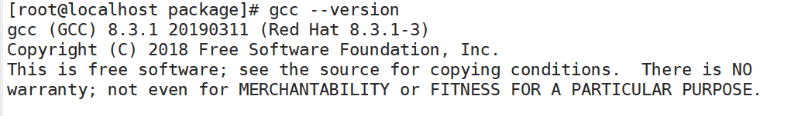
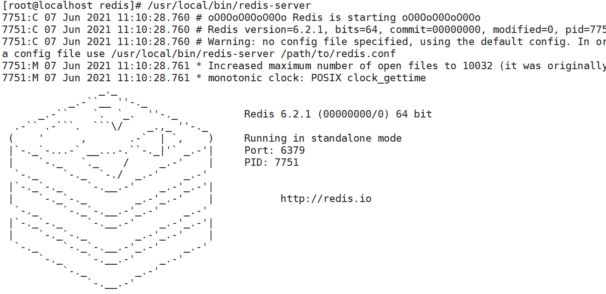
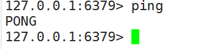

# 一、简介/安装


## 1.1：概述


REmote DIctionary Server(Redis) 是一个由 Salvatore Sanfilippo 写的 key-value 存储系统，是跨平台的非关系型数据库。

Redis 是一个开源的使用 ANSI C 语言编写、遵守 BSD 协议、支持网络、可基于内存、分布式、可选持久性的键值对(Key-Value)存储数据库，并提供多种语言的 API。

Redis 通常被称为数据结构服务器，因为值（value）可以是字符串(String)、哈希(Hash)、列表(list)、集合(sets)和有序集合(sorted sets)等类型。


+ Redis是一个`开源`的`key-value`存储系统。
+ 和Memcached类似，它支持存储的value类型相对更多，包括`string`(字符串)、`list`(链表)、`set`(集合)、`zset`(sorted set --有序集合)和`hash`（哈希类型）。
+ 这些数据类型都支持push/pop、add/remove及取交集并集和差集及更丰富的操作，而且这些操作都是`原子性`的。
+ 在此基础上，Redis支持各种不同方式的`排序`。
+ 与memcached一样，为了保证效率，数据都是`缓存在内存`中。
+ 区别的是Redis会`周期性`的把更新的`数据写入磁盘`或者把修改操作写入追加的记录文件。
+ 并且在此基础上实现了`master-slave(主从)`同步。


## 1.2：官网


| 简介           | 网址                           |
| -------------- | ------------------------------ |
| Redis 官网     | https://redis.io/              |
| 中文官网       | http://redis.cn/               |
| 源码地址       | https://github.com/redis/redis |
| Redis 在线测试 | http://try.redis.io/           |
| Redis 命令参考 | http://doc.redisfans.com/      |


## 1.3：redis的优势


- **性能极高** – Redis能读的速度是110000次/s,写的速度是81000次/s 。
- **丰富的数据类型** – Redis支持二进制案例的 Strings, Lists, Hashes, Sets 及 Ordered Sets 数据类型操作。
- 原子 – Redis的所有操作都是**原子性的**，意思就是要么成功执行要么失败完全不执行。单个操作是原子性的。多个操作也支持事务，即原子性，通过MULTI和EXEC指令包起来。
- **丰富的特性** – Redis还支持 publish/subscribe, 通知, key 过期等等特性。


## 1.4：Redis与其他key-value存储有什么不同


- Redis有着更为复杂的数据结构并且提供对他们的原子性操作，这是一个不同于其他数据库的进化路径。Redis的数据类型都是基于基本数据结构的同时对程序员透明，无需进行额外的抽象。
- Redis运行在内存中但是可以持久化到磁盘，所以在对不同数据集进行高速读写时需要权衡内存，因为数据量不能大于硬件内存。在内存数据库方面的另一个优点是，相比在磁盘上相同的复杂的数据结构，在内存中操作起来非常简单，这样Redis可以做很多内部复杂性很强的事情。同时，在磁盘格式方面他们是紧凑的以追加的方式产生的，因为他们并不需要进行随机访问。


## 1.5：安装


### 1.下载地址


https://redis.io/download


安装的版本是6.2.1


### 2.安装C语言编译环境


```java
yum install centos-release-scl scl-utils-build
yum install -y devtoolset-8-toolchain
scl enable devtoolset-8 bash
```


安装成功后： **gcc --version**





### 3.上传并解压安装


+ 上传包到liunx虚拟机上： `/app/package`
+ 解压并移动项目：`/app/`


```javascript
tar -zxvf redis-6.2.1.tar.gz 
mv redis-6.2.1 /app/
```


### 4.进入目录编译


进入到`/app/redis-6.2.1`

```javascript
cd /app/redis-6.2.1
make
make install
```


  **如果没有准备好C语言编译环境，make 会报错—Jemalloc/jemalloc.h：没有那个文件**

  **解决方案：运行make distclean,然后再次运行`make` 和`make install`**


### 5.安装目录：/usr/local/bin


查看默认安装目录：

redis-benchmark:性能测试工具，可以在自己本子运行，看看自己本子性能如何

redis-check-aof：修复有问题的AOF文件，rdb和aof后面讲

redis-check-dump：修复有问题的dump.rdb文件

redis-sentinel：Redis集群使用

redis-server：Redis服务器启动命令

redis-cli：客户端，操作入口


## 1.6：启动


### 1.前台启动


运行

```java
/usr/local/bin/redis-server
```





### 2.后台启动


复制一份`redis.conf`文件到任意目录下：

我放在了`/app/redis/rdis-6379`下面了

然后修改文件中的：**daemonize  no 改成 yes**

在`redis-6379`目录下运行命令：


```java
/usr/local/bin/redis-server redis.conf 
```


## 1.7：redis-cli访问


```java
 redis-cli -h host -p port -a password
```

**有时候会有中文乱码:**

要在` redis-cli` 后面加上 `--raw`

| 访问方式       | 命令                             |
| -------------- | -------------------------------- |
| 默认端口访问   | /usr/local/bin/redis-cli         |
| 自定义端口访问 | /usr/local/bin/redis-cli -p 6379 |


测试验证 ： ping




退出： quit

## 1.8：关闭


| 关闭方式       | 命令                       |
| -------------- | -------------------------- |
| 默认端口关闭   | redis-cli shutdown         |
| 自定义端口关闭 | redis-cli -p 6379 shutdown |


## 1.8：redis相关


Redis是单线程+多路IO复用技术

> 多路复用是指使用一个线程来检查多个文件描述符（Socket）的就绪状态，比如调用select和poll函数，传入多个文件描述符，如果有一个文件描述符就绪，则返回，否则阻塞直到超时。得到就绪状态后进行真正的操作可以在同一个线程里执行，也可以启动线程执行（比如使用线程池）


==串行  vs  多线程+锁（memcached） vs  单线程+多路IO复用(Redis)==

与Memcache三点不同: 支持多数据类型，支持持久化，单线程+多路IO复用） 


