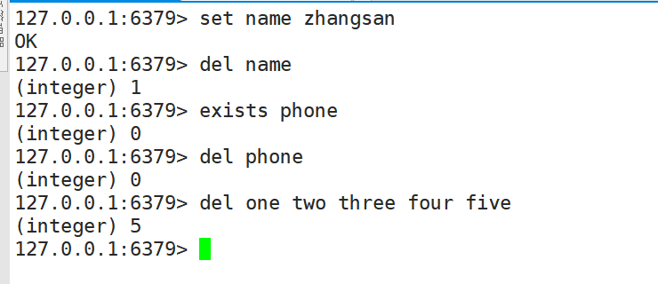

# 二、Key(键)


## 2.1：查找key-keys


### 1.用法及简介


+ 语法：
	+ **KEYS pattern**
	+ 查找所有符合给定模式 `pattern` 的 `key` 。

+ 案例：
	+ `KEYS *` 匹配数据库中所有 `key` 。
	+ `KEYS h?llo` 匹配 `hello` ， `hallo` 和 `hxllo` 等。

	+ `KEYS h*llo` 匹配 `hllo` 和 `heeeeello` 等。
	+ `KEYS h[ae]llo` 匹配 `hello` 和 `hallo` ，但不匹配 `hillo`
	+ 特殊符号用 `\` 隔开

	

### 2.时间复杂度


O(N)， `N` 为数据库中 `key` 的数量。


### 3.返回值


符合给定模式的 `key` 列表。


### 4.案例


### 5.注意


[KEYS]() 的速度非常快，但在一个大的数据库中使用它仍然可能造成性能问题，如果你需要从一个数据集中查找特定的 `key` ，你最好还是用 Redis 的集合结构(set)来代替。


## 2.2： 删除key-del


### 1.用法及简介


+ 语法

	+ **DEL key [key ...]**

	

**删除给定的一个或多个 `key` 。不存在的 `key` 会被忽略。**

	

### 2.时间复杂度


+ O(N)， `N` 为被删除的 `key` 的数量。
+ 删除单个字符串类型的 `key` ，时间复杂度为O(1)。
+ 删除单个列表、集合、有序集合或哈希表类型的 `key` ，时间复杂度为O(M)， `M` 为以上数据结构内的元素数量。

### 3.返回值

被删除 `key` 的数量。

### 4.案例

```shell
#  删除单个 key
127.0.0.1:6379> set name zhangsan
OK
127.0.0.1:6379> del name
(integer) 1
# 删除一个不存在的 key
127.0.0.1:6379> exists phone 
(integer) 0
127.0.0.1:6379> del phone # 失败，没有 key 被删除
(integer) 0
# 同时删除多个 key
127.0.0.1:6379> del one two three four five
(integer) 5
127.0.0.1:6379> 
```



## 2.3：判断key是否存在-exists

### 1.用法及简介

+ 语法
	+ **EXISTS key**

检查给定 `key` 是否存在。

### 2.时间复杂度

```shell
O(1)
```

### 3.返回值


若 `key` 存在，返回 `1` ，否则返回 `0` 。

### 4.案例

```java
127.0.0.1:6379> EXISTS name
(integer) 1
127.0.0.1:6379> EXISTS name2
(integer) 0
127.0.0.1:6379> 
```

## 2.4：设置过期key-expire

### 1.用法及简介

+ 语法
	+ **EXPIRE key seconds**

为给定 `key` 设置生存时间，当 `key` 过期时(生存时间为 `0` )，它会被自动删除。
在 Redis 中，带有生存时间的 `key` 被称为『易失的』(volatile)。


### 2.生存时间

**生存时间也就是我们设置的过期时间**

+ 生存时间可以通过使用 [*DEL*](http://doc.redisfans.com/key/del.html#del) 命令来删除整个 `key` 来移除，或者被 [*SET*](http://doc.redisfans.com/string/set.html#set) 和 [*GETSET*](http://doc.redisfans.com/string/getset.html#getset) 命令覆写(overwrite)，这意味着，如果一个命令只是修改(alter)一个带生存时间的 `key` 的值而不是用一个新的 `key` 值来代替(replace)它的话，那么生存时间不会被改变。**（用新的key来替代掉它删除它，才可以改变生存时间）**
+ 比如说，对一个 `key` 执行 [*INCR*](http://doc.redisfans.com/string/incr.html#incr) 命令，对一个列表进行 [*LPUSH*](http://doc.redisfans.com/list/lpush.html#lpush) 命令，或者对一个哈希表执行 [*HSET*](http://doc.redisfans.com/hash/hset.html#hset) 命令，这类操作都不会修改 `key` 本身的生存时间。
+ 另一方面，如果使用 [*RENAME*](http://doc.redisfans.com/key/rename.html) 对一个 `key` 进行改名，那么改名后的 `key` 的生存时间和改名前一样。
+ [*RENAME*](http://doc.redisfans.com/key/rename.html) 命令的另一种可能是，尝试将一个带生存时间的 `key` 改名成另一个带生存时间的 `another_key` ，这时旧的 `another_key` (以及它的生存时间)会被删除，然后旧的 `key` 会改名为 `another_key` ，因此，新的 `another_key` 的生存时间也和原本的 `key` 一样。
+ 使用 [*PERSIST*](http://doc.redisfans.com/key/persist.html) 命令可以在不删除 `key` 的情况下，移除 `key` 的生存时间，让 `key` 重新成为一个『持久的』(persistent) `key` 。

### 3.更新生存时间


可以对一个已经带有生存时间的 `key` 执行 [*EXPIRE*](http://doc.redisfans.com/key/expire.html#expire) 命令，新指定的生存时间会取代旧的生存时间。


### 4.过期时间的精确度


在 Redis 2.4 版本中，过期时间的延迟在 1 秒钟之内 —— 也即是，就算 `key` 已经过期，但它还是可能在过期之后一秒钟之内被访问到，而在新的 Redis 2.6 版本中，延迟被降低到 1 毫秒之内。

> 但是注意：
>
> 在 Redis 2.1.3 之前的版本中，修改一个带有生存时间的 `key` 会导致整个 `key` 被删除，这一行为是受当时复制(replication)层的限制而作出的，现在这一限制已经被修复。

### 5.时间复杂度

```shell
O(1)
```

### 6.返回值

设置成功返回 `1` 。
当 `key` 不存在或者不能为 `key` 设置生存时间时(比如在低于 2.1.3 版本的 Redis 中你尝试更新 `key` 的生存时间)，返回 `0` 。


### 7.案例


```shell
127.0.0.1:6379> set name admin
OK
127.0.0.1:6379> EXPIRE name 30
(integer) 1
127.0.0.1:6379> TTL name
(integer) 25
127.0.0.1:6379> EXPIRE name 5000
(integer) 1
127.0.0.1:6379> ttl name
(integer) 4997
```


## 2.5：设置过期key-expireat


### 1.用法及简介


+ 语法

	+ **EXPIREAT key timestamp**

	

[EXPIREAT](http://doc.redisfans.com/key/expireat.html#expireat) 的作用和 [*EXPIRE*](http://doc.redisfans.com/key/expire.html) 类似，都用于为 `key` 设置生存时间。

不同在于 [EXPIREAT](http://doc.redisfans.com/key/expireat.html#expireat) 命令接受的时间参数是 UNIX 时间戳(unix timestamp)。


### 2.时间复杂度


O(1)


### 3.返回值


如果生存时间设置成功，返回 `1` 。当 `key` 不存在或没办法设置生存时间，返回 `0` 。


### 4.案例


```shell
redis> SET cache www.google.com
OK

redis> EXPIREAT cache 1355292000     # 这个 key 将在 2012.12.12 过期
(integer) 1

redis> TTL cache
(integer) 45081860
```


## 2.6：设置过期key-PEXPIRE

### 1.用法及简介

+ 语法
	+ **PEXPIRE key milliseconds**

这个命令和 [*EXPIRE*](http://doc.redisfans.com/key/expire.html) 命令的作用类似，但是**它以毫秒为单位**设置 `key` 的生存时间，而不像 [*EXPIRE*](http://doc.redisfans.com/key/expire.html) 命令那样，**以秒为单位。**

### 2.时间复杂度


O(1)

### 3.返回值


设置成功，返回 `1`
key不存在或设置失败，返回 `0` 

### 4.案例

```shell
127.0.0.1:6379> PEXPIRE mykey 10000
(integer) 1
127.0.0.1:6379> ttl mykey # TTL 的返回值以秒为单位
(integer) 6
127.0.0.1:6379> pttl mykey # PTTL 可以给出准确的毫秒数
(integer) 375
```


## 2.7：设置过期key-pexpireat


### 1.语法及简介


+ 语法
	+ **PEXPIREAT key milliseconds-timestamp**

这个命令和 [*EXPIREAT*](http://doc.redisfans.com/key/expireat.html) 命令类似，但它以毫秒为单位设置 `key` 的过期 unix 时间戳，而不是像 [*EXPIREAT*](http://doc.redisfans.com/key/expireat.html) 那样，以秒为单位。


### 2.时间复杂度


O(1)


### 3.返回值

如果生存时间设置成功，返回 `1` 。
当 `key` 不存在或没办法设置生存时间时，返回 `0` 。(查看 [*EXPIRE*](http://doc.redisfans.com/key/expire.html) 命令获取更多信息)


### 4.案例


```shell
127.0.0.1:6379> set mykey2 121213
OK
127.0.0.1:6379> pexpireat mykey2 1555555555005
(integer) 1
127.0.0.1:6379> ttl mykey2  # TTL 返回秒
(integer) 223157079
127.0.0.1:6379> pttl mykey2  # PTTL 返回毫秒
(integer) 223157079318
127.0.0.1:6379> 
```


## 2.8：查看过期时间–ttl/pttl


### 1.语法及简介


+ **PTTL key**
	+ 以毫秒为单位，返回给定 `key` 的剩余生存时间(TTL, time to live)。
+ **TTL key**
	+ 以秒为单位，返回给定 `key` 的剩余生存时间(TTL, time to live)。


### 2.时间复杂度


O(1)


### 3.返回值


当 `key` 不存在时，返回 `-2` 。
当 `key` 存在但没有设置剩余生存时间时，返回 `-1` 。
否则，以秒为单位，返回 `key` 的剩余生存时间。

### 4.案例

```shell
127.0.0.1:6379> set name 111
OK
127.0.0.1:6379> expire name 1000000
(integer) 1
127.0.0.1:6379> ttl name
(integer) 999996
127.0.0.1:6379> pttl name
(integer) 999992141
127.0.0.1:6379> 
```

## 2.9：改过期key为持久key-PERSIST

### 1.用法及简介

+ 语法
	+ **PERSIST key**
	移除给定 `key` 的生存时间，将这个 `key` 从『易失的』(带生存时间 `key` )转换成『持久的』(一个不带生存时间、永不过期的 `key` )。

### 2.时间复杂度

O(1)

### 3.返回值

当生存时间移除成功时，返回 `1` .
如果 `key` 不存在或 `key` 没有设置生存时间，返回 `0` 。


### 4.案例

```java
127.0.0.1:6379> EXPIRE hello 1000
(integer) 1
127.0.0.1:6379> PERSIST hello
(integer) 1
127.0.0.1:6379> ttl hello
(integer) -1
127.0.0.1:6379> 
```

## 2.10：重命名key-RENAME

### 1.语法及简介

+ 语法
	+ **RENAME key newkey**
	
将 `key` 改名为 `newkey` 。
当 `key` 和 `newkey` 相同，或者 `key` 不存在时，返回一个错误。
当 `newkey` 已经存在时， [RENAME](http://doc.redisfans.com/key/rename.html#rename) 命令将覆盖旧值。

### 2.时间复杂度

O(1)

### 3.返回值

改名成功时提示 `OK` ，失败时候返回一个错误。

### 4.案例

####  key 存在且 newkey 不存在

```shell
127.0.0.1:6379> set old old
OK
127.0.0.1:6379> EXISTS old
(integer) 1
127.0.0.1:6379> exists new
(integer) 0
127.0.0.1:6379> rename old new
OK
127.0.0.1:6379> exists old
(integer) 0
127.0.0.1:6379> exists new
(integer) 1
```

#### 当 key 不存在时，返回错误

```shell
127.0.0.1:6379> exists old 
(integer) 0
127.0.0.1:6379> exists new
(integer) 0
127.0.0.1:6379> rename old new
(error) ERR no such key
```

#### newkey 已存在时， RENAME 会覆盖旧 newkey

```shell
127.0.0.1:6379> mset old old new new
OK
127.0.0.1:6379> rename old new
OK
127.0.0.1:6379> get old
(nil)
127.0.0.1:6379> get new
"old"
```


## 2.11：重命名key-RENAMENX


### 1.语法及简介


+ 语法
	+ **RENAMENX key newkey**

当且仅当 `newkey` 不存在时，将 `key` 改名为 `newkey` 。

当 `key` 不存在时，返回一个错误。


### 2.时间复杂度


O(1)


### 3.返回值


修改成功时，返回 `1` 。

如果 `newkey` 已经存在，返回 `0` 。


### 4.案例


#### newkey不存在

```shell
127.0.0.1:6379> mset old old
OK
127.0.0.1:6379> renamenx old new
(integer) 1
127.0.0.1:6379> get new
"old"
127.0.0.1:6379> 
```

#### newkey存在

```shell
127.0.0.1:6379> mset old old new new
OK
127.0.0.1:6379> RENAMENX old new
(integer) 0
```


## 2.12：查看类型-type


### 1.语法及简介


+ 语法
	+ **TYPE key**

返回 `key` 所储存的值的类型。


### 2.时间复杂度


O(1)


### 3.返回值

+ `none` (key不存在)
+ `string` (字符串)
+ `list` (列表)
+ `set` (集合)
+ `zset` (有序集)
+ `hash` (哈希表)


### 4.案例


```shell
# 字符串

redis> SET weather "sunny"
OK

redis> TYPE weather
string


# 列表

redis> LPUSH book_list "programming in scala"
(integer) 1

redis> TYPE book_list
list


# 集合

redis> SADD pat "dog"
(integer) 1

redis> TYPE pat
set
```


## 2.13：序列化key-dump


### 1.用法及简介


+ 语法
	+ **DUMP key**

序列化给定 `key` ，并返回被序列化的值，使用 [*RESTORE*](http://doc.redisfans.com/key/restore.html) 命令可以将这个值反序列化为 Redis 键。

+ 序列化生成的值有以下几个特点：
	+ 它带有 64 位的校验和，用于检测错误， [*RESTORE*](http://doc.redisfans.com/key/restore.html) 在进行反序列化之前会先检查校验和。
	+ 值的编码格式和 RDB 文件保持一致。
	+ RDB 版本会被编码在序列化值当中，如果因为 Redis 的版本不同造成 RDB 格式不兼容，那么 Redis 会拒绝对这个值进行反序列化操作。


序列化的值不包括任何生存时间信息。


### 2.时间复杂度


查找给定键的复杂度为 O(1) ，对键进行序列化的复杂度为 O(N*M) ，其中 N 是构成 `key` 的 Redis 对象的数量，而 M 则是这些对象的平均大小。
如果序列化的对象是比较小的字符串，那么复杂度为 O(1) 。


### 3.返回值：


如果 `key` 不存在，那么返回 `nil` 。
否则，返回序列化之后的值。


### 4.案例


```shell
127.0.0.1:6379> set name "hello world ! liming"
OK
127.0.0.1:6379> DUMP name
"\x00\x14hello world ! liming\t\x00<gx\x80\xa5\xc1^\xce"
127.0.0.1:6379> DUMP name2
(nil)
```


## 2.14：反序列化-RESTORE


### 1.语法及简介

+ 语法
	+ **RESTORE key ttl serialized-value**

反序列化给定的序列化值，并将它和给定的 `key` 关联。

参数 `ttl` 以毫秒为单位为 `key` 设置生存时间；如果 `ttl` 为 `0` ，那么不设置生存时间。

[RESTORE](http://doc.redisfans.com/key/restore.html#restore) 在执行反序列化之前会先对序列化值的 RDB 版本和数据校验和进行检查，如果 RDB 版本不相同或者数据不完整的话，那么 [RESTORE](http://doc.redisfans.com/key/restore.html#restore) 会拒绝进行反序列化，并返回一个错误。


### 2.时间复杂度：


查找给定键的复杂度为 O(1) ，对键进行反序列化的复杂度为 O(N*M) ，其中 N 是构成 `key` 的 Redis 对象的数量，而 M 则是这些对象的平均大小。

有序集合(sorted set)的反序列化复杂度为 O(N*M*log(N)) ，因为有序集合每次插入的复杂度为 O(log(N)) 。

如果反序列化的对象是比较小的字符串，那么复杂度为 O(1) 。


### 3.返回值：


如果反序列化成功那么返回 `OK` ，否则返回一个错误。


### 4.案例


```shell
redis> SET greeting "hello, dumping world!"
OK

redis> DUMP greeting
"\x00\x15hello, dumping world!\x06\x00E\xa0Z\x82\xd8r\xc1\xde"

redis> RESTORE greeting-again 0 "\x00\x15hello, dumping world!\x06\x00E\xa0Z\x82\xd8r\xc1\xde"
OK

redis> GET greeting-again
"hello, dumping world!"

redis> RESTORE fake-message 0 "hello moto moto blah blah"   ; 使用错误的值进行反序列化
(error) ERR DUMP payload version or checksum are wrong
```


## 2.15：移动key到指定数据库-move


### 1.用法及简介


+ 语法
	+ **MOVE key db**
将当前数据库的 `key` 移动到给定的数据库 `db` 当中。
如果当前数据库(源数据库)和给定数据库(目标数据库)有相同名字的给定 `key` ，或者 `key` 不存在于当前数据库，那么 `MOVE` 没有任何效果。
因此，也可以利用这一特性，将 [MOVE](http://doc.redisfans.com/key/move.html#move) 当作锁(locking)原语(primitive)。


### 2.时间复杂度

O(1)

### 3.返回值

移动成功返回 `1` ，失败则返回 `0` 。

### 4.案例

#### 0数据库key存在—1数据库key不存在

```shell
127.0.0.1:6379> select 0
OK
127.0.0.1:6379> EXISTS admin
(integer) 0
127.0.0.1:6379> set admin 1
OK
127.0.0.1:6379> select 1
OK
127.0.0.1:6379[1]> exists admin
(integer) 0
127.0.0.1:6379[1]> select 0
OK
127.0.0.1:6379> move admin 1
(integer) 1
127.0.0.1:6379> EXISTS admin
(integer) 0
127.0.0.1:6379> select 1
OK
127.0.0.1:6379[1]> exists admin
(integer) 1
127.0.0.1:6379[1]> 
```


#### 0数据库key存在—1数据库key存在


```shell
127.0.0.1:6379[1]> select 0
OK
127.0.0.1:6379> set lisi 1
OK
127.0.0.1:6379> select 1
OK
127.0.0.1:6379[1]> set lisi 2
OK
127.0.0.1:6379[1]> select 0
OK
127.0.0.1:6379> move lisi 1
(integer) 0
```


#### 0数据库key不存在—1数据库key存在

```shell
127.0.0.1:6379> select  0
OK
127.0.0.1:6379> exists one
(integer) 0
127.0.0.1:6379> select 1
OK
127.0.0.1:6379[1]> set one 1
OK
127.0.0.1:6379[1]> select 0
OK
127.0.0.1:6379> move one 1
(integer) 0
```


