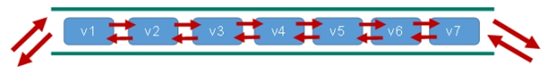

# 三、数据类型


## 3.1：string


### 1.简介


string 是 redis 最基本的类型，你可以理解成与 Memcached 一模一样的类型，一个 key 对应一个 value。

string 类型是二进制安全的。意思是 redis 的 string 可以包含任何数据。比如jpg图片或者序列化的对象。

string 类型是 Redis 最基本的数据类型，string 类型的值最大能存储 512MB。

**<font color='red'>注意：一个键最大能存储512MB。</font>**


### 2.常用命令


| 命令        | 简介                                                         | 语法                             |
| ----------- | ------------------------------------------------------------ | -------------------------------- |
| APPEND      | 如果 key 已经存在并且是一个字符串， APPEND 命令将指定的 value 追加到该 key 原来值（value）的末尾 | APPEND key value                 |
| DECR        | 将 key 中储存的数字值减一                                    | DECR key                         |
| DECRBY      | key 所储存的值减去给定的减量值（decrement）                  | DECRBY key decrement             |
| GET         | 获取指定 key 的值                                            | GET key                          |
| GETRANGE    | 截取字符串从0开始                                            | GETRANGE key start end           |
| GETSET      | 将给定 key 的值设为 value ，并返回 key 的旧值(old value)     | GETSET key value                 |
| INCR        | 将 key 中储存的数字值增一                                    | INCR key                         |
| INCRBY      | 将 key 所储存的值加上给定的增量值（increment）               | INCRBY key increment             |
| INCRBYFLOAT | 将 key 所储存的值加上给定的浮点增量值（increment）           | INCRBYFLOAT key increment        |
| MGET        | 获取所有(一个或多个)给定 key 的值。                          | MGET key1 [key2..]               |
| MSET        | 同时设置一个或多个 key-value 对。                            | MSET key value [key value ...]   |
| MSETNX      | 同时设置一个或多个 key-value 对，当且仅当所有给定 key 都不存在。 | MSETNX key value [key value ...] |
| PSETEX      | 这个命令和 SETEX 命令相似，但它以毫秒为单位设置 key 的生存时间，而不是像 SETEX 命令那样，以秒为单位。 | PSETEX key milliseconds value    |
| SET         | 设置指定 key 的值                                            | SET key value                    |
| SETEX       | 将值 value 关联到 key ，并将 key 的过期时间设为 seconds (以秒为单位)。 | SETEX key seconds value          |
| SETNX       | 只有在 key 不存在时设置 key 的值。                           | SETNX key value                  |
| STRLEN      | 返回 key 所储存的字符串值的长度。                            | STRLEN key                       |


### 3.string只代表字符串类型吗？


- 字符串类型
- int类型
- bitmap类型（下个篇幅重点）


### 4.正反向索引


#### 简介：


+ string类型再存储的时候会创建两套索引：正向索引、反向索引。
+ 比如我们执行命令 `set key hello`

#### 正向索引：


| h    | e    | l    | l    | o    |
| ---- | ---- | ---- | ---- | ---- |
| 0    | 1    | 2    | 3    | 4    |


#### 反向索引


| h    | e    | l    | l    | o    |
| ---- | ---- | ---- | ---- | ---- |
| -5   | -4   | -3   | -2   | -1   |


#### 验证正反向索引


> 下图对照上图一起看，我不会骗你的。实战出真理。


```shell
127.0.0.1:6379> set key hello
OK
127.0.0.1:6379> get  key
"hello"
127.0.0.1:6379> getrange key 0 1
"he"
127.0.0.1:6379> getrange key -5 -4
"he"
```


### 5.查看数据类型


object encoding key


## 3.2：list


### 1.简介


Redis 列表是简单的字符串列表，按照插入顺序排序。你可以添加一个元素到列表的头部（左边）或者尾部（右边）。

list类型经常会被用于消息队列的服务，以完成多程序之间的消息交换


它的底层实际是个双向链表，对两端的操作性能很高，通过索引下标的操作中间的节点性能会较差。




List数据结构是链表结构，这意味这无论数据量多大，头尾操作数据还是很快的，list的容量是2的32次方减1个元素，即4294967295个元素数量。

### 2.命令


| 命令      | 简介                                                         | 语法                      |
| --------- | ------------------------------------------------------------ | ------------------------- |
| lpush     | 列表左边添加**一个或多个值**,`key`不存在则创建               | LPUSH key value1 [value2] |
| rpush     | 列表右边添加**一个或多个值**,`key`不存在则创建               | RPUSH key value1 [value2] |
| lpushx    | 列表左边添加**一个值**,当` key `不存在时，` lpushx `命令什么也不做 | LPUSHX key value          |
| rpushx    | 列表右边添加**一个值**当 `key `不存在时， `rpushx`命令什么也不做 | RPUSHX key value          |
| lpop      | 移除左边并返回列表 `key` 的头元素。                          | LPOP key                  |
| rpop      | 移除右边并返回列表 `key` 的头元素。                          | RPOP key                  |
| rpoplpush | 从key1列表右边吐出一个值，插到key2列表左边。                 | rpoplpush key1  key2      |
| lrange    | 获取列表指定范围内的元素，但不删除元素，0左边第一个，-1右边第一个，（`0` `-1`表示获取所有） | LRANGE key start stop     |
| lindex    | 通过索引获取列表中的元素,左边开始是1，右边开始是-1           | LINDEX key index          |
| llen      | 获取列表长度                                                 | LLEN key                  |
| lrem      | **移除列表元素**<br>1.count > 0 : 从左到右，移除与 VALUE 相等的元素，数量为 COUNT 。<br/>2.count < 0 : 从右到左，移除与 VALUE 相等的元素，数量为 COUNT 的绝对值。<br/>3.count = 0 : 移除表中所有与 VALUE 相等的值。 | LREM key count value      |
| lset      | 将列表 `key` 下标为 `index` 的元素的值设置为 `value` 。0开始 | LSET key index value      |


### 4.数据结构


List的数据结构为快速链表quickList。

+ 首先在列表元素较少的情况下会使用一块连续的内存存储，这个结构是ziplist，也即是压缩列表。

+ 它将所有的元素紧挨着一起存储，分配的是一块连续的内存。

+ 当数据量比较多的时候才会改成quicklist。

**因为普通的链表需要的附加指针空间太大，会比较浪费空间。比如这个列表里存的只是int类型的数据，结构上还需要两个额外的指针prev和next**


Redis将链表和ziplist结合起来组成了quicklist。也就是将多个ziplist使用双向指针串起来使用。这样既满足了快速的插入删除性能，又不会出现太大的空间冗余。


## 3.3：set


### 1.简介


Redis set对外提供的功能与list类似是一个列表的功能，特殊之处在于set是可以**自动排重**的，当你需要存储一个列表数据，又不希望出现重复数据时，set是一个很好的选择，并且set提供了判断某个成员是否在一个set集合内的重要接口，这个也是list所不能提供的。

Redis的Set是string类型的无序集合。它底层其实是一个value为null的hash表，所以添加，删除，查找的**复杂度都是O(1)**。

一个算法，随着数据的增加，执行时间的长短，如果是O(1)，数据增加，查找数据的时间不变


### 2.命令


| 命令      | 简介                                                         | 语法                         |
| --------- | ------------------------------------------------------------ | ---------------------------- |
| sadd      | 添加将一个或多个到集合 key 中，已经存在的元素将被忽略        | SADD key member [member ...] |
| smembers  | 取出该集合的所有值。                                         | SMEMBERS key                 |
| sismember | 判断 `member` 元素是否集合 `key` 的成员。                    | SISMEMBER key member         |
| scard     | 返回集合中的个数                                             | SCARD key                    |
| srem      | 移除集合 `key` 中的一个或多个 `member` 元素，不存在的 `member` 元<br>素会被忽略。当 `key` 不是集合类型，返回一个错误 | SREM key member [member ...] |
| spop      | 移除并返回集合中的一个随机元素。                             | SPOP key                     |
| srem      | 返回集合中一个或多个随机数，不移除元素                       | SREM key member1 [member2]   |
| sinter    | 返回两个集合的交集元素。                                     | SINTER key1 key2             |
| sunion    | 返回两个集合的并集元素。                                     | SUNION key1 key2             |
| sdiff     | 返回两个集合的**差集**元素(key1中的，不包含key2中的)         | SDIFF key1 key2              |


### 3.数据结构


Set数据结构是dict字典，字典是用哈希表实现的。

Java中HashSet的内部实现使用的是HashMap，只不过所有的value都指向同一个对象。Redis的set结构也是一样，它的内部也使用hash结构，所有的value都指向同一个内部值。


## 3.4：zset


### 1.简介


+ Redis有序集合zset与普通集合set非常相似，是一个没有重复元素的字符串集合。

+ 不同之处是有序集合的每个成员都关联了一个**评分（score）**,这个评分（score）被用来按照从最低分到最高分的方式排序集合中的成员。集合的成员是唯一的，但是评分可以是重复了 。

+ 因为元素是有序的, 所以你也可以很快的根据评分（score）或者次序（position）来获取一个范围的元素。

+ 访问有序集合的中间元素也是非常快的,因此你能够使用有序集合作为一个没有重复成员的智能列表。


> 简单的说：
>
> zset是一个有序集合，每一个成员有一个分数与之对应，成员不可以重复，但是数是可以重复的，zset会自动用分数对成员进行排序。


### 2.命令


| 命令             | 简介                                                         | 语法                                                        |
| ---------------- | ------------------------------------------------------------ | ----------------------------------------------------------- |
| zadd             | 将一个或多个 member 元素及其 score 值加入到有序集 key 当中。（`score` 值可以是整数值或双精度浮点数。） | ZADD key score member [[score member] [score member] ...]   |
| zrange           | 返回有序集 `key` 中，指定区间内的成员。带WITHSCORES，可以让分数一起和值返回到结果集。`0 `  `-`是返回全部的 | ZRANGE key start stop [WITHSCORES]                          |
| zrangebyscore    | 通过分数返回有序集合指定区间内的成员                         | ZRANGEBYSCORE key min max [WITHSCORES] [LIMIT offset count] |
| zrevrangebyscore | 返回有序集中指定分数区间内的成员，分数从高到低排序           | ZREVRANGEBYSCORE key max min [WITHSCORES]                   |
| zincrby          | 有序集合中对指定成员的分数加上增量 increment                 | ZINCRBY key increment member                                |
| zrem             | 移除有序集合中的一个或多个成员                               | ZREM key member [member ...]                                |
| zcount           | 计算在有序集合中指定区间分数的成员数                         | ZCOUNT key min max                                          |
| zrank            | 返回该值在集合中的排名，从0开始。                            | ZRANK key member                                            |


### 3.数据结构


SortedSet(zset)是Redis提供的一个非常特别的数据结构，一方面它等价于Java的数据结构Map<String, Double>，可以给每一个元素value赋予一个权重score，另一方面它又类似于TreeSet，内部的元素会按照权重score进行排序，可以得到每个元素的名次，还可以通过score的范围来获取元素的列表。

zset底层使用了两个数据结构

（1）hash，hash的作用就是关联元素value和权重score，保障元素value的唯一性，可以通过元素value找到相应的score值。

（2）跳跃表，跳跃表的目的在于给元素value排序，根据score的范围获取元素列表。


## 3.5：hash


### 1.简介


Redis hash 是一个 string 类型的 field（字段） 和 value（值） 的映射表，hash 特别适合用于存储对象。

Redis 中每个 hash 可以存储 232 - 1 键值对（40多亿）。

类似Java里面的Map<String,Object>


### 2.命令


| 命令    | 简介                                                         | 语法                                    |
| ------- | ------------------------------------------------------------ | --------------------------------------- |
| hset    | 将哈希表 key 中的字段 field 的值设为 value 。                | HSET key field value                    |
| hget    | 返回哈希表 `key` 中给定域 `field` 的值。                     | HGET key field                          |
| hmset   | 同时将多个 field-value (域-值)对设置到哈希表 key 中。        | HMSET key field value [field value ...] |
| hexists | 查看哈希表 `key` 中，给定域 `field` 是否存在。               | HEXISTS key field                       |
| hkeys   | 返回哈希表 `key` 中的所有域。                                | HKEYS key                               |
| hvals   | 返回哈希表 `key` 中所有域的值。                              | HVALS key                               |
| hsetnx  | 将哈希表 `key` 中的域 `field` 的值设置为 `value` ，当且仅当域 `field` 不存在。 | HSETNX key field value                  |
| hlen    | 返回哈希表 `key` 中域的数量。                                | HLEN key                                |
| hincrby | 为哈希表 `key` 中的域 `field` 的值加上增量 `increment` 。    | HINCRBY key field increment             |


### 3.数据结构


Hash类型对应的数据结构是两种：ziplist（压缩列表），hashtable（哈希表）。当field-value长度较短且个数较少时，使用ziplist，否则使用hashtable。


## 3.6：BitMaps


### 1.简介


现代计算机用二进制（位） 作为信息的基础单位， 1个字节等于8位， 例如`abc`字符串是由3个字节组成， 但实际在计算机存储时将其用二进制表示， `abc`分别对应的ASCII码分别是`97`、 `98`、 `99`， 对应的二进制分别是`01100001`、 `01100010`和`01100011`，


B**itmaps并不属于Redis中数据结构的一种，它实际上是使用了字符串类型,是set、get等一系列字符串操做的一种扩展，与其不一样的是，它提供的是位级别的操做，从这个角度看，咱们也能够把它当成是一种位数组、位向量结构。当咱们须要存取一些boolean类型的信息时，Bitmap是一个很是不错的选择，在节省内存的同时也拥有很好的存取速度(getbit/setbit操做时间复杂度为O(1))。**


### 2.命令


#### setbit


+ 语法

```java
SETBIT key offset value
```

+ 对 `key` 所储存的字符串值，设置或清除指定偏移量上的位(bit)。

+ 位的设置或清除取决于 `value` 参数，可以是 `0` 也可以是 `1` 。

+ 当 `key` 不存在时，自动生成一个新的字符串值。

+ 字符串会进行伸展(grown)以确保它可以将 `value` 保存在指定的偏移量上。当字符串值进行伸展时，空白位置以 `0` 填充。

+ `offset` 参数必须大于或等于 `0` ，小于 2^32 (bit 映射被限制在 512 MB 之内)。（int类型）

> 对使用大的 `offset` 的 [SETBIT](http://doc.redisfans.com/string/setbit.html#setbit) 操作来说，内存分配可能造成 Redis 服务器被阻塞。


#### getbit


语法：


```java
GETBIT key offset
```


获取键的第offset位的值（从0开始算）


#### bitcount


语法：


```java
BITCOUNT key [start] [end]
```

统计**字符串**被设置为1的bit数。一般情况下，给定的整个字符串都会被进行计数，通过指定额外的 start 或 end 参数，可以让计数只在特定的位上进行。start 和 end 参数的设置，都可以使用负数值：比如 -1 表示最后一个位，而 -2 表示倒数第二个位，start、end 是指bit组的字节的下标数，二者皆包含。

#### bitop


```java
BITOP operation destkey key [key ...]
```


对一个或多个保存二进制位的字符串 `key` 进行位元操作，并将结果保存到 `destkey` 上。

`operation` 可以是 `AND` 、 `OR` 、 `NOT` 、 `XOR` 这四种操作中的任意一种：

- `BITOP AND destkey key [key ...]` ，对一个或多个 `key` 求逻辑并，并将结果保存到 `destkey` 。
- `BITOP OR destkey key [key ...]` ，对一个或多个 `key` 求逻辑或，并将结果保存到 `destkey` 。
- `BITOP XOR destkey key [key ...]` ，对一个或多个 `key` 求逻辑异或，并将结果保存到 `destkey` 。
- `BITOP NOT destkey key` ，对给定 `key` 求逻辑非，并将结果保存到 `destkey` 。

除了 `NOT` 操作之外，其他操作都可以接受一个或多个 `key` 作为输入。


## 3.7：HyperLogLog


### 1.简介


Redis HyperLogLog 是用来做基数统计的算法，HyperLogLog 的优点是，在输入元素的数量或者体积非常非常大时，计算基数所需的空间总是固定 的、并且是很小的。

在 Redis 里面，每个 HyperLogLog 键只需要花费 12 KB 内存，就可以计算接近 2^64 个不同元素的基 数。这和计算基数时，元素越多耗费内存就越多的集合形成鲜明对比。

但是，因为 HyperLogLog 只会根据输入元素来计算基数，而不会储存输入元素本身，所以 HyperLogLog 不能像集合那样，返回输入的各个元素。


### 2.什么是基数


比如数据集 {1, 3, 5, 7, 5, 7, 8}， 那么这个数据集的基数集为 {1, 3, 5 ,7, 8}, **基数(不重复的元素)为5**。 基数估计就是在误差可接受的范围内，快速计算基数。


### 3.命令


| 命令     | 简介                                      | 语法                                      |
| -------- | ----------------------------------------- | ----------------------------------------- |
| pfadd    | 添加指定元素到 HyperLogLog 中。           | PFADD key element [element ...]           |
| pfcount  | 返回给定 HyperLogLog 的基数估算值。       | PFCOUNT key [key ...]                     |
| pofmerge | 将多个 HyperLogLog 合并为一个 HyperLogLog | PFMERGE destkey sourcekey [sourcekey ...] |


## 3.8：GEO


Redis 3.2 中增加了对GEO类型的支持。GEO，Geographic，地理信息的缩写。该类型，就是元素的2维坐标，在地图上就是经纬度。redis基于该类型，提供了经纬度设置，查询，范围查询，距离查询，经纬度Hash等常见操作。

Redis GEO 主要用于存储地理位置信息，并对存储的信息进行操作，该功能在 Redis 3.2 版本新增。

Redis GEO 操作方法有：

- geoadd：添加地理位置的坐标。
- geopos：获取地理位置的坐标。
- geodist：计算两个位置之间的距离。
- georadius：根据用户给定的经纬度坐标来获取指定范围内的地理位置集合。
- georadiusbymember：根据储存在位置集合里面的某个地点获取指定范围内的地理位置集合。
- geohash：返回一个或多个位置对象的 geohash 值。


