# 四、配置文件redis.conf

## 4.1：Unit

+ 配置大小单位,开头定义了一些基本的度量单位，只支持bytes，不支持bit

+ 大小写不敏感

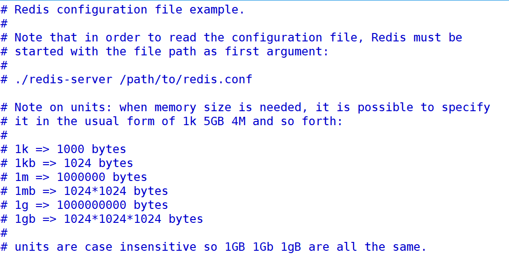

## 4.2：INCLUDES

类似jsp中的include，多实例的情况可以把公用的配置文件提取出来

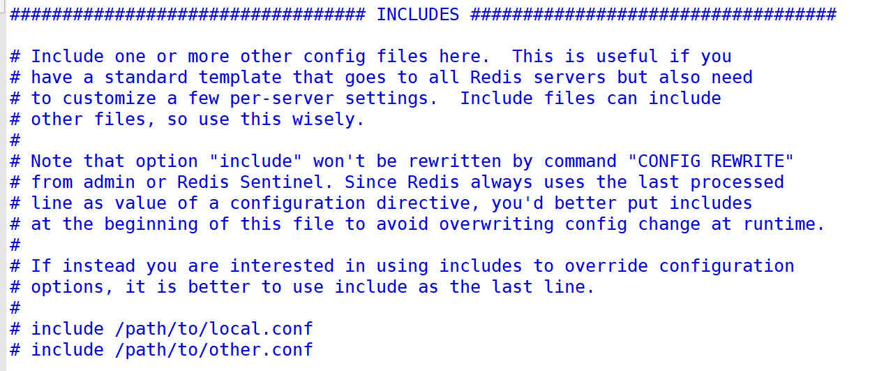

## 4.3：NETWORK

### 1.简介

网络配置

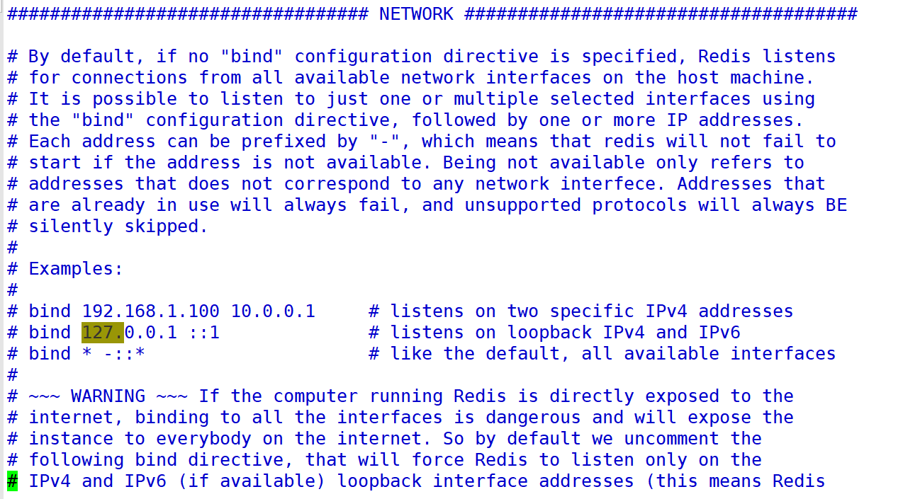

### 2.bind

默认情况bind=127.0.0.1只能接受本机的访问请求

不写的情况下，无限制接受任何ip地址的访问

生产环境肯定要写你应用服务器的地址；服务器是需要远程访问的，所以需要将其注释掉

如果开启了protected-mode，那么在没有设定bind ip且没有设密码的情况下，Redis只允许接受本机的响应

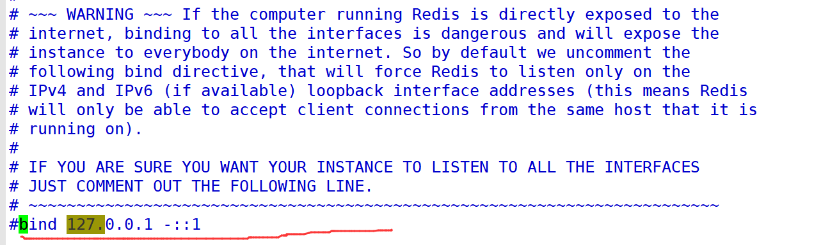

### 3.protected-mode

将本机访问保护模式设置no

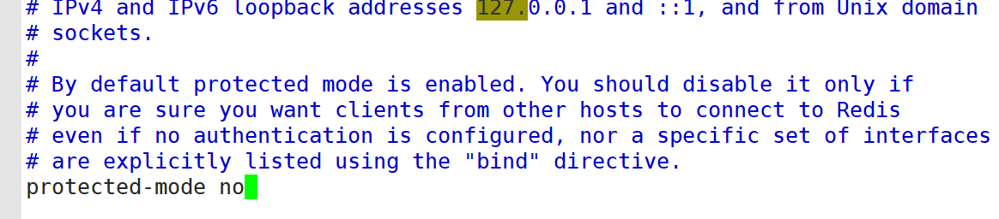

### 4.port

端口：默认6379

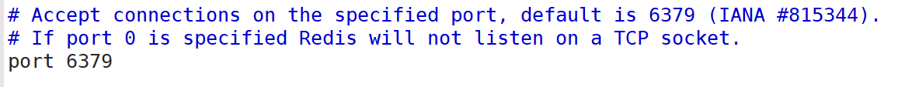

### 5.tcp-backlog

设置tcp的backlog，backlog其实是一个连接队列，backlog队列总和=未完成三次握手队列 + 已经完成三次握手队列。

在高并发环境下你需要一个高backlog值来避免慢客户端连接问题。

注意Linux内核会将这个值减小到/proc/sys/net/core/somaxconn的值（128），所以需要确认增大/proc/sys/net/core/somaxconn和/proc/sys/net/ipv4/tcp_max_syn_backlog（128）两个值来达到想要的效果

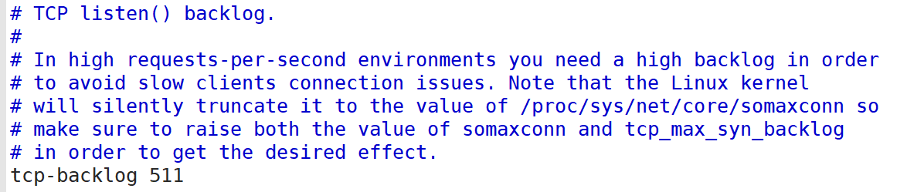

### 6.timeout

一个空闲的客户端维持多少秒会关闭，0表示关闭该功能。即永不关闭。

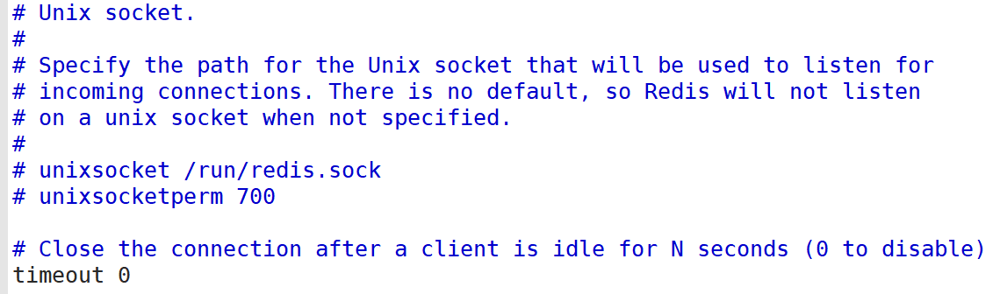

### 7.tcp-keepalive

对访问客户端的一种心跳检测，每个n秒检测一次。

单位为秒，如果设置为0，则不会进行Keepalive检测，建议设置成60 

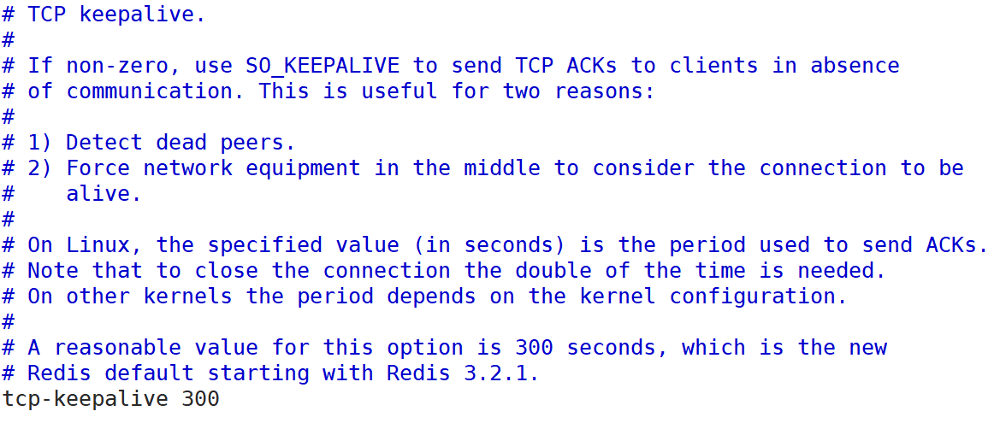

## 4.4：GENERAL通用

### 1.daemonize

是否为后台进程，设置为yes

守护进程，后台启动

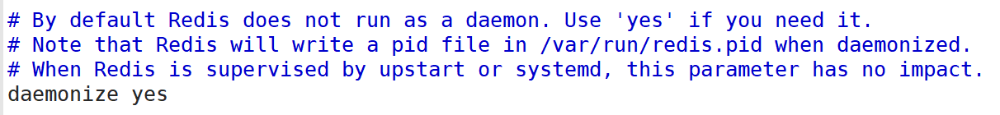

### 2.pidfile

存放pid文件的位置，每个实例会产生一个不同的pid文件

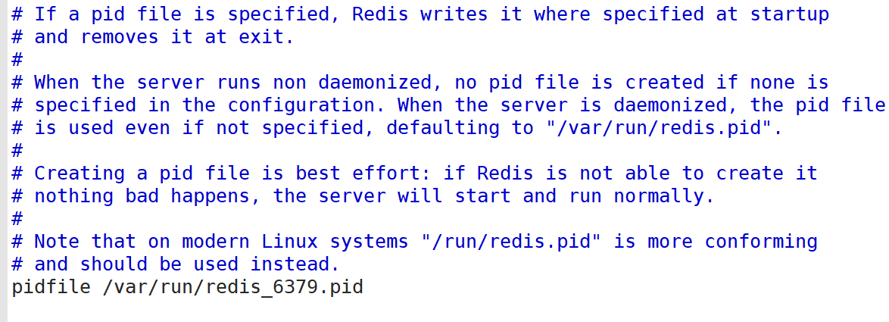

### 3.loglevel

指定日志记录级别，Redis总共支持四个级别：debug、verbose、notice、warning，默认为**notice**

+ 四个级别根据使用阶段来选择，生产环境选择notice 或者warning

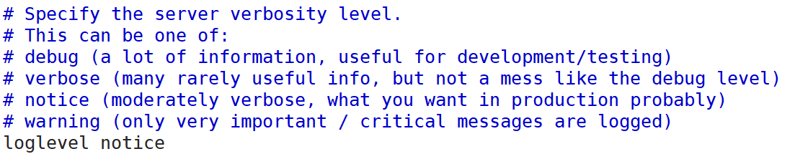

### 4.logfile

日志文件名称

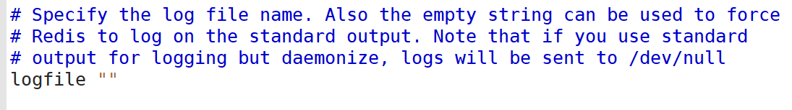

### 5.databases

设定库的数量 默认16，默认数据库为0，可以使用`SELECT <dbid>`命令在连接上指定数据库id

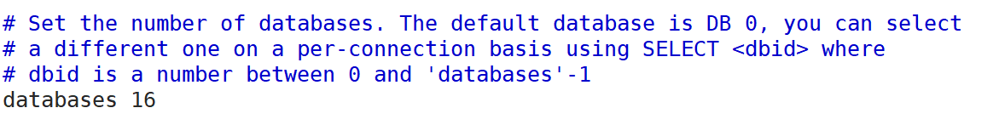

## 4.5：SECURITY安全

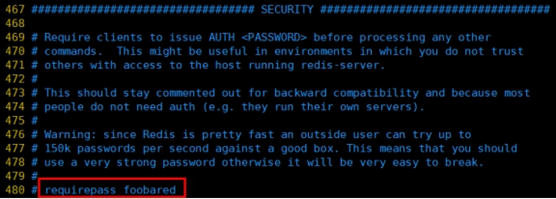

访问密码的查看、设置和取消

在命令中设置密码，只是临时的。重启redis服务器，密码就还原了。

永久设置，需要再配置文件中进行设置。

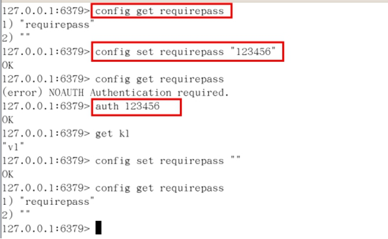

