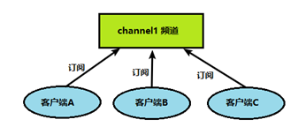
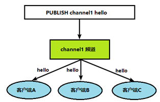

# 五、发布订阅

## 5.1：简介

Redis 发布订阅 (pub/sub) 是一种消息通信模式：发送者 (pub) 发送消息，订阅者 (sub) 接收消息。

Redis 客户端可以订阅任意数量的频道。

## 5.2：图文展示

### 1.客户端可以订阅频道如下图

### 2.当给这个频道发布消息后，消息就会发送给订阅的客户端

## 5.3：命令

| 命令         | 简介                                        | 语法                                 |
| ------------ | ------------------------------------------- | ------------------------------------ |
| subscribe    | 订阅给定的一个或多个频道的信息。            | SUBSCRIBE channel [channel ...]      |
| publish      | 将信息 `message` 发送到指定的频道 `channel` | PUBLISH channel message              |
| unsubscribe  | 指示客户端退订给定的频道。                  | UNSUBSCRIBE [channel [channel ...]   |
| punsubscribe | 退订所有给定模式的频道。                    | PUNSUBSCRIBE [pattern [pattern ...]] |

## 5.4：注意

发布的消息没有持久化，如果在订阅的客户端收不到hello，只能收到订阅后发布的消息

