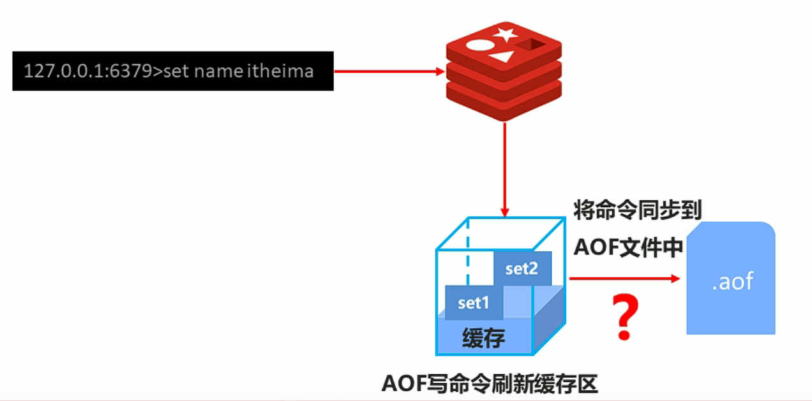

# 六、持久化

## 6.1：简介


### 1.什么是持久化


利用永久性存储介质将数据进行保存，在特定的时间将保存的数据进行恢复的工作机制称为持久化。


### 2.为什么要持久化


防止数据的意外丢失，确保数据安全性


### 3.redis的持久化


Redis 提供了多种不同级别的持久化方式：

- RDB 持久化可以在指定的时间间隔内生成数据集的时间点快照（point-in-time snapshot）。
- AOF 持久化记录服务器执行的所有写操作命令，并在服务器启动时，通过重新执行这些命令来还原数据集。 AOF 文件中的命令全部以 Redis 协议的格式来保存，新命令会被追加到文件的末尾。 Redis 还可以在后台对 AOF 文件进行重写（rewrite），使得 AOF 文件的体积不会超出保存数据集状态所需的实际大小。
- Redis 还可以同时使用 AOF 持久化和 RDB 持久化。 在这种情况下， 当 Redis 重启时， 它会优先使用 AOF 文件来还原数据集， 因为 AOF 文件保存的数据集通常比 RDB 文件所保存的数据集更完整。
- 你甚至可以关闭持久化功能，让数据只在服务器运行时存在。


## 6.3：持久化-命令


### 1.save命令


手动执行一次保存操作，立即执行

```java
save 
```


### 2.bgsave命令


手动启动后台保存操作，但不是立即执行

```java
bgsave
```


## 6.3：RDB


### 1.是什么


在指定的时间间隔内将内存中的数据集快照写入磁盘， 也就是行话讲的Snapshot**快照**，它恢复时是将快照文件直接读到内存里


### 2.备份如何执行


Redis会单独创建（fork）一个子进程来进行持久化，会先将数据写入到 一个临时文件中，待持久化过程都结束了，再用这个临时文件替换上次持久化好的文件。 整个过程中，主进程是不进行任何IO操作的，这就确保了极高的性能 如果需要进行大规模数据的恢复，且对于数据恢复的完整性不是非常敏感，那RDB方式要比AOF方式更加的高效。**RDB的缺点是最后一次持久化后的数据可能丢失**


### 3.5.save指令配置


+  dbfilename dump.rdb
	+ 说明：设置本地数据库文件名，默认值为 dump.rdb
	+ 经验：通常设置为dump-端口号.rdb

+ dir
	+ 说明：设置存储.rdb文件的路径
	+ 经验：通常设置成存储空间较大的目录中，目录名称**data**

+ rdbcompression yes
	+ 说明：设置存储至本地数据库时是否压缩数据，默认为 yes，采用 LZF 压缩
	+ 经验：通常默认为开启状态，如果设置为no，可以节省 CPU 运行时间，但会使存储的文件变大（巨大）

+ rdbchecksum yes
	+ 说明：设置是否进行RDB文件格式校验，该校验过程在写文件和读文件过程均进行
	+ 经验：通常默认为开启状态，如果设置为no，可以节约读写性过程约10%时间消耗，但是存储一定的数据损坏风险


### 4.save指令原理


我们知道redis是单线程，其他的客户端发过来的命令。redis服务端会依次的将他们排序好，然后依次执行，但是如果`save`命令，执行的时间太长的话，那么其他的命令就会进入等待的时间。

**所以生产环境不建议这样使用**


### 5.bgsave指令原理


 bgsave命令是针对save阻塞问题做的优化。Redis内部所有涉及到RDB操作都采用bgsave的方式，save命令可以放弃使用**。**


### 6.bgsave指令配置


### 7.save高级用法


+ 配置

```java
save second changes
```

+ 作用
	+ 满足限定时间范围内key的变化数量达到指定数量即进行持久化

+ 参数
	+ second：监控时间范围
	+ changes：监控key的变化量

+ 位置

	+ 在conf文件中进行配置
	
+ 范例

>   **save** *900 1*
>
> **save** *300 10*
>
> **save** *60 10000*


### 8.save高级用法原理


+ save配置要根据实际业务情况进行设置，频度过高或过低都会出现性能问题，结果可能是灾难性的

+ save配置中对于second与changes设置通常具有互补对应关系，尽量不要设置成包含性关系

+ save配置启动后执行的是bgsave操作


### 9.rdb三种启动方式


save配置的底层就是bgsave，详情看上一节

| **方式**       | **save指令** | **bgsave指令** | **save配置** |
| -------------- | ------------ | -------------- | ------------ |
| 读写           | 同步         | 异步           | 异步         |
| 阻塞客户端指令 | 是           | 否             | 否           |
| 额外内存消耗   | 否           | 是             | 是           |
| 启动新进程     | 否           | 是             | 是           |


### 10.优缺点


#### **RDB优点**

+ RDB是一个紧凑压缩的二进制文件，存储效率较高

+ RDB内部存储的是redis在某个时间点的数据快照，非常适合用于数据备份，全量复制等场景

+ RDB恢复数据的速度要比AOF快很多

+ 应用：服务器中每X小时执行bgsave备份，并将RDB文件拷贝到远程机器中，用于灾难恢复。

#### **Rdb缺点**

+ RDB方式无论是执行指令还是利用配置，无法做到实时持久化，具有较大的可能性丢失数据

+ bgsave指令每次运行要执行fork操作创建子进程，要牺牲掉一些性能

+ Redis的众多版本中未进行RDB文件格式的版本统一，有可能出现各版本服务之间数据格式无法兼容现象


## 6.4：AOF


### 1.rdb持久化问题


+ 存储数据量较大，效率较低
	+ 基于快照思想，每次读写都是全部数据，当数据量巨大时，效率非常低

+ 大数据量下的IO性能较低
+ 基于fork创建子进程，内存产生额外消耗
+ 宕机带来的数据丢失风险


### 2.解决方式


+ 不写全数据，仅记录部分数据
+ 降低区分数据是否改变的难度，改记录数据为记录操作过程
+ 对所有操作均进行记录，排除丢失数据的风险


### 3.AOF概念


+ AOF(append only file)持久化：以独立日志的方式记录每次写命令，重启时再重新执行AOF文件中命令达到恢复数据的目的。与RDB相比可以简单描述为**改记录数据为记录数据产生的过程**

+ AOF的主要作用是解决了数据持久化的实时性，目前已经是Redis持久化的主流方式


### 4.AOF写数据过程





### 5.AOF写数据策略


+ always(每次）
	+ 每次写入操作均同步到AOF文件中，`数据零误差`，`性能较低`，**不建议使用。** 

+ everysec（每秒）
	+ 每秒将缓冲区中的指令同步到AOF文件中，`数据准确性较高`，`性能较高`，**建议使用，也是默认配置**
	+ 在系统突然宕机的情况下丢失1秒内的数据

+ no（系统控制）
	+ 由操作系统控制每次同步到AOF文件的周期，`整体过程不可控`


### 6.AOF开启


配置

+ 在redis.conf配置

```javascript
appendonly yes|no
```


+ 作用
	+ 是否开启AOF持久化功能，默认为不开启状态

+  配置

```java
appendfsync always|everysec|no
```

+ 作用
	+ AOF写数据策略


### 7.AOF相关配置


```java
appendfilename filename
```


AOF持久化文件名，默认文件名未appendonly.aof，建议配置为appendonly-端口号.aof


```java
dir
```


AOF持久化文件保存路径，与RDB持久化文件保持一致即可


### 8.AOF重写


随着命令不断写入AOF，文件会越来越大，为了解决这个问题，Redis引入了AOF重写机制压缩文件体积。AOF文件重

写是将Redis进程内的数据转化为写命令同步到新AOF文件的过程。

**简单说就是将对同一个数据的若干个条命令执行结果转化成最终结果数据对应的指令进行记录。**


+ 重写的作用
	+ 降低磁盘占用量，提高磁盘利用率
	+ 提高持久化效率，降低持久化写时间，提高IO性能
	+ 降低数据恢复用时，提高数据恢复效率


### 9.AOF重写规则


+ 进程内已超时的数据不再写入文件

+ 忽略无效指令，重写时使用进程内数据直接生成，这样新的AOF文件只保留最终数据的写入命令
	+ 如`del key1`、 `hdel key2`、`srem key3`、`set key4 111`、`set key4 222`等 

+ 对同一数据的多条写命令合并为一条命令
	+ 如`lpush list1 a`、`lpush list1 b`、 `lpush list1 c `可以转化为：`lpush list1 a b c`。
	+ 为防止数据量过大造成客户端缓冲区溢出，**对list、set、hash、zset等类型，每条指令最多写入64个元素**


### 10.AOF重写方式


+ 手动重写

```java
bgrewriteaof
```

+ 自动重写条件配置

```java
auto-aof-rewrite-min-size size

auto-aof-rewrite-percentage percentage
```

+ 自动重写触发比对参数（ 运行指令info Persistence获取具体信息 ）

```java
aof_current_size

aof_base_size
```

+ 自动重写触发条件


## 6.5：RDB与AOF区别


| **持久化方式**   | **RDB**            | AOF                |
| ---------------- | ------------------ | ------------------ |
| **占用存储空间** | 小（数据级：压缩） | 大（指令级：重写） |
| **存储速度**     | 慢                 | 快                 |
| **恢复速度**     | 快                 | 慢                 |
| **数据安全性**   | 会丢失数据         | 依据策略决定       |
| **资源消耗**     | 高/重量级          | 低/轻量级          |
| **启动优先级**   | 低                 | 高                 |

官方推荐两个都启用。

如果对数据不敏感，可以选单独用RDB。

不建议单独用 AOF，因为可能会出现Bug。

如果只是做纯内存缓存，可以都不用。


