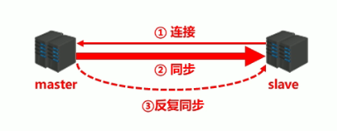
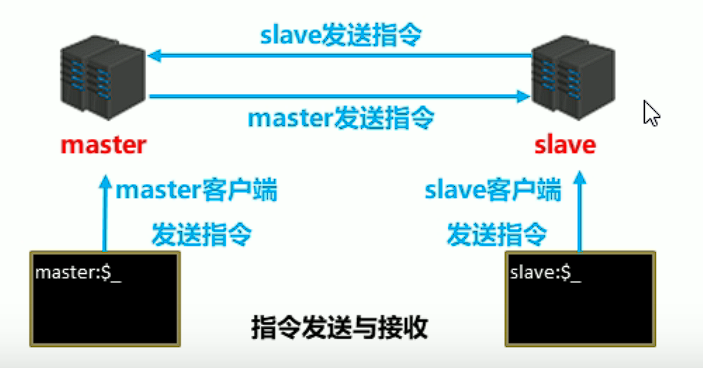
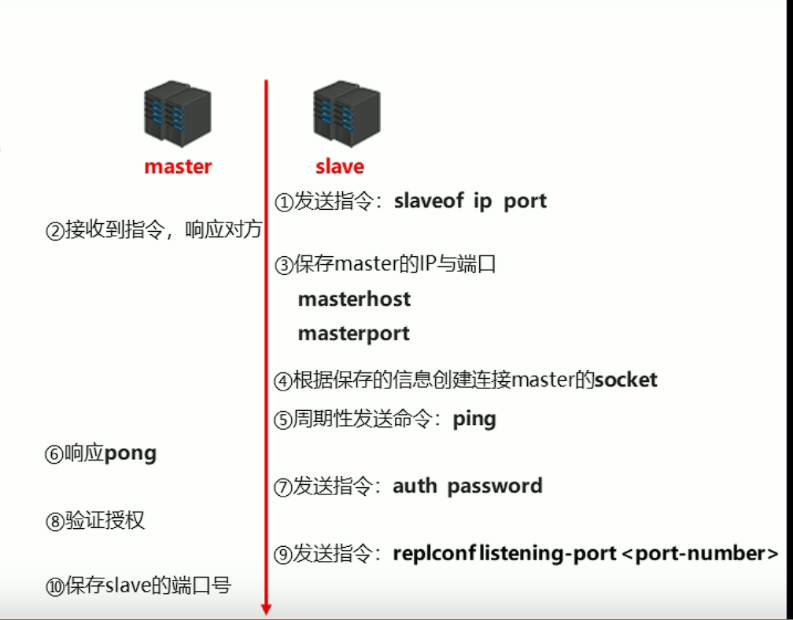
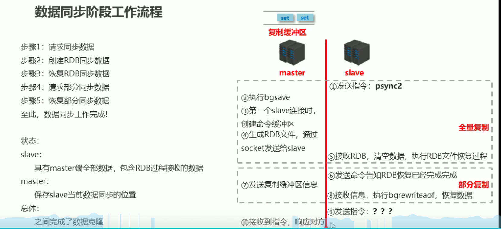
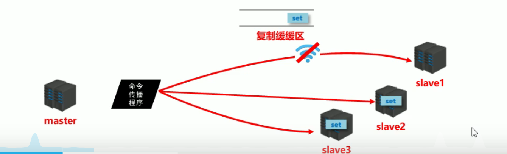
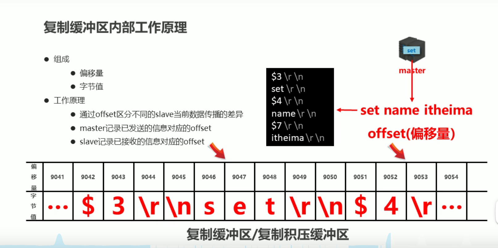
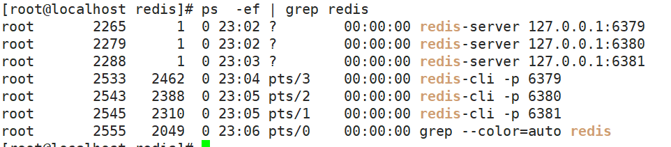

# 九、主从复制


## 9.1：简介


### 1.简介


主机数据更新后根据配置和策略， 自动同步到备机的master/slaver机制，Master以写为主，Slave以读为主


+ 读写分离，性能扩展

+ 容灾快速恢复


 

+ 提供数据方：master
	+ 主服务器，主节点，主库
	+ 主客户端

+ 接收数据方：slave
	+ 从服务器，从节点，从库
	+ 从客户端

+ 需要解决的问题：

	+ 数据同步

+ 核心工作：
	+ master的数据复制到slave中


> 主从复制即将master中的数据即时、有效的复制到slave中
>
> 特征：一个master可以拥有多个slave，一个slave只对应一个master
>
> + master:
> 	+ 写数据
> 	+ 执行写操作时，将出现变化的数据自动同步到slave
> 	+ 读数据（可忽略）
>
> + slave:
> 	+ 读数据
> 	+ 写数据（禁止）


### 2.读写作用


+ 读写分离：master写、slave读，提高服务器的读写负载能力

+ 负载均衡：基于主从结构，配合读写分离，由slave分担master负载，并根据需求的变化，改变slave的数量，通过多个从节点分担数据读取负载，大大提高Redis服务器并发量与数据吞吐量

+ 故障恢复：当master出现问题时，由slave提供服务，实现快速的故障恢复

+ 数据冗余：实现数据热备份，是持久化之外的一种数据冗余方式

+ 高可用基石：基于主从复制，构建哨兵模式与集群，实现Redis的高可用方案


## 9.2：主从复制三个阶段


主从复制过程大体可以分为3个阶段

+ 建立连接阶段（即准备阶段）

+ 数据同步阶段

+ 命令传播阶段







## 9.3：阶段一：建立链接


+ 建立slave到master的连接，使master能够识别slave，并保存slave端口号


步骤1：设置master的地址和端口，保存master信息

步骤2：建立socket连接

步骤3：发送ping命令（定时器任务）

步骤4：身份验证

步骤5：发送slave端口信息

> 至此，主从连接成功！
>
> + 状态：
> 	+ slave：
> 		+ 保存master的地址与端口
> 	+ master：
> 		+ 保存slave的端口
>
> 总体： 之间创建了连接的socket




## 9.4：阶段二：数据同步


### 1.流程





### 2.master说明


1. 如果master数据量巨大，数据同步阶段应避开流量高峰期，避免造成master阻塞，影响业务正常执行

2. 复制缓冲区大小设定不合理，会导致数据溢出。如进行全量复制周期太长，进行部分复制时发现数据已

经存在丢失的情况，必须进行第二次全量复制，致使slave陷入死循环状态。

```java
repl-backlog-size 1mb
```

3. master单机内存占用主机内存的比例不应过大，建议使用50%-70%的内存，留下30%-50%的内存用于执

行bgsave命令和创建复制缓冲区


### 3.slave说明


1. 为避免slave进行全量复制、部分复制时服务器响应阻塞或数据不同步，建议关闭此期间的对外服务

```java
slave-serve-stale-data yes|no
```

2. 数据同步阶段，master发送给slave信息可以理解master是slave的一个客户端，主动向slave发送命令

3. 多个slave同时对master请求数据同步，master发送的RDB文件增多，会对带宽造成巨大冲击，如果master带宽不足，因此数据同步需要根据业务需求，适量错峰

4. slave过多时，建议调整拓扑结构，由一主多从结构变为树状结构，中间的节点既是master，也是slave。注意使用树状结构时，由于层级深度，导致深度越高的slave与最顶层master间数据同步延迟较大，数据一致性变差，应谨慎选择


## 9.5：阶段三：命令传播阶段


### 1.简介


+ 当master数据库状态被修改后，导致主从服务器数据库状态不一致，此时需要让主从数据同步到一致的状态，同步的动作称为命令传播

+ master将接收到的数据变更命令发送给slave，slave接收命令后执行命令


### 2.命令传播阶段-出现问题


令传播阶段出现了断网现象

+ 网络闪断闪连 忽略

+ 短时间网络中断 部分恢复

+ 长时间网络中断 全量恢复


### 3.服务器运行id


+ 概念：服务器运行ID是每一台服务器每次运行的身份识别码，一台服务器多次运行可以生成多个运行id
	+ 组成：运行id由40位字符组成，是一个随机的十六进制字符
	+ 例如：fdc9ff13b9bbaab28db42b3d50f852bb5e3fcdce

+ 作用：运行id被用于在服务器间进行传输，识别身份
	+ 如果想两次操作均对同一台服务器进行，必须每次操作携带对应的运行id，用于对方识别

+ 实现方式：运行id在每台服务器启动时自动生成的，master在首次连接slave时，会将自己的运行ID发送给slave，slave保存此ID，通过info Server命令，可以查看节点的runid


**简单的说，就是来识别身份的**


## 9.6：复制缓冲区


### 1.简介


概念：复制缓冲区，又名复制积压缓冲区，是一个先进先出`（FIFO）`的队列，用于存储服务器执行过的命令，每次传播命令，master都会将传播的命令记录下来，并存储在复制缓冲区




### 2.工作原理





### 3.总结


+ 概念：复制缓冲区，又名复制积压缓冲区，是一个先进先出（FIFO）的队列，用于存储服务器执行过的命令，每次传播命令，master都会将传播的命令记录下来，并存储在复制缓冲区
	+ 复制缓冲区默认数据存储空间大小是1M，由于存储空间大小是固定的，当入队元素的数量大于队列长度时，最先入队的元素会被弹出，而新元素会被放入队列

+ 由来：每台服务器启动时，如果开启有AOF或被连接成为master节点，即创建复制缓冲区

+ 作用：用于保存master收到的所有指令（仅影响数据变更的指令，例如set，select） 

+ 数据来源：当master接收到主客户端的指令时，除了将指令执行，会将该指令存储到缓冲区中


### 4.偏移量


+ 概念：一个数字，描述复制缓冲区中的指令字节位置

+ 分类：
	+ master复制偏移量：记录发送给所有slave的指令字节对应的位置（多个）
	+ slave复制偏移量：记录slave接收master发送过来的指令字节对应的位置（一个）

+ 数据来源：
	+ master端：发送一次记录一次
	+ slave端：接收一次记录一次

+ 作用：同步信息，比对master与slave的差异，当slave断线后，恢复数据使用


## 9.7：全量复制|部分复制


### 1.简介


**全量复制**：用于初次复制或其它无法进行部分复制的情况，==将主节点中的所有数据都发送给从节点==，是一个非常重型的操作，当数据量较大时，会对主从节点和网络造成很大的开销

**部分复制**：用于处理在主从复制中因==网络闪断等原因造成的数据丢失场景，当从节点再次连上主节点后，如果条件允许，主节点会补发丢失数据给从节点==。因为补发的数据远远小于全量数据，可以有效避免全量复制的过高开销，需要注意的是，如果网络中断时间过长，造成主节点没有能够完整地保存中断期间执行的写命令，则无法进行部分复制，仍使用全量复制


### 2.正常情况下redis是如何决定是全量复制还是部分复制?

　　

从节点将offset发送给主节点后，主节点根据offset和缓冲区大小决定能否执行部分复制：
　　1.如果offset偏移量之后的数据，仍然都在复制积压缓冲区里，则执行部分复制；
　　2.如果offset偏移量之后的数据已不在复制积压缓冲区中（数据已被挤出），则执行全量复制。


### 3.全量复制的开销


　　1.bgsave的开销，每次bgsave需要fork子进程，对内存和CPU的开销很大

　　2.RDB文件网络传输的时间（网络带宽）

　　3.从节点清空数据的时间

　　4.从节点加载RDB的时间

　　5.可能的AOF重写时间（如果我们的从节点开启了AOF，则加载完RDB后会对AOF进行一个重写，保证AOF是最新的）


## 9.8：原理


## 9.9：搭建一主多从


### 1.创建redis.conf


```java
port 6379
#logfile '6379.log'
dir /app/redis/data
dbfilename dump.rdb
rdbcompression yes
rdbchecksum yes
save 10 2
appendonly yes
appendfsync always
appendfilename appendonly.aof
bind 127.0.0.1
daemonize yes
databases 16
```


### 2.创建redis-6379.conf


```java
include /app/redis/redis.conf
pidfile /app/redis/pid/redis_6379.pid
logfile /app/redis/log/6379.log
port 6379
dbfilename dump6379.rdb
appendfilename appendonly6379.aof
```


### 3.创建redis-6380.conf


```java
include /app/redis/redis.conf
pidfile /app/redis/pid/redis_6380.pid
logfile /app/redis/log/6380.log
port 6380
dbfilename dump6380.rdb
appendfilename appendonly6380.aof
```


### 4.创建redis-6381.conf


```java
include /app/redis/redis.conf
pidfile /app/redis/pid/redis_6381.pid
logfile /app/redis/log/6381.log
port 6381
dbfilename dump6381.rdb
appendfilename appendonly6381.aof
```


### 5.进入到redis-cli客户端


```java
redis-cli -p port
```


### 6.查看进程


```java
ps -ef | grep redis
```





### 7.配置主从关系第一种


在reids-cli客户端输入，**切记：是在从服务器上输入**

```java
slaveof ip地址 端口号 
```


### 8.配置主从关系第二种


在启动redis-server命令后面加上 `slaveof ip地址 端口号 `

```java
redis-server redis.conf slaveof ip地址 端口号 
```


### 9.配置主从关系第三种(推荐)


在slave的配置文件中加上

```java
slaveof ip地址 端口号 
```


### 10.主从断开


```java
slaveof no one
```


slave断开连接后，不会删除已有数据，只是不再接受master发送的数据


## 9.10：主从复制优缺点


**优点：**

- 支持主从复制，主机会自动将数据同步到从机，可以进行读写分离
- 为了分载Master的读操作压力，Slave服务器可以为客户端提供只读操作的服务，写服务仍然必须由Master来完成
- Slave同样可以接受其它Slaves的连接和同步请求，这样可以有效的分载Master的同步压力。
- Master Server是以非阻塞的方式为Slaves提供服务。所以在Master-Slave同步期间，客户端仍然可以提交查询或修改请求。
- Slave Server同样是以非阻塞的方式完成数据同步。在同步期间，如果有客户端提交查询请求，Redis则返回同步之前的数据

**缺点：**

- Redis不具备自动容错和恢复功能，主机从机的宕机都会导致前端部分读写请求失败，需要等待机器重启或者手动切换前端的IP才能恢复。
- 主机宕机，宕机前有部分数据未能及时同步到从机，切换IP后还会引入数据不一致的问题，降低了系统的可用性。
- Redis较难支持在线扩容，在集群容量达到上限时在线扩容会变得很复杂。


