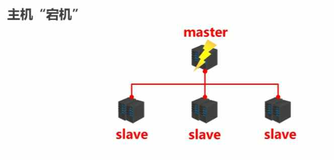
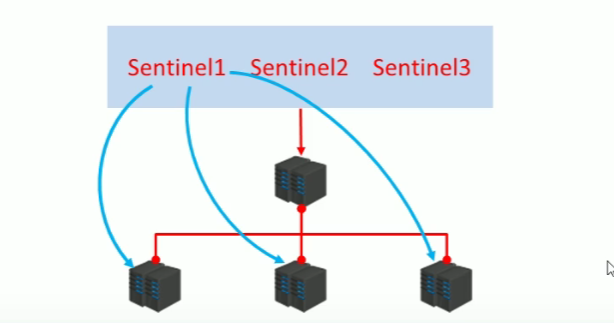
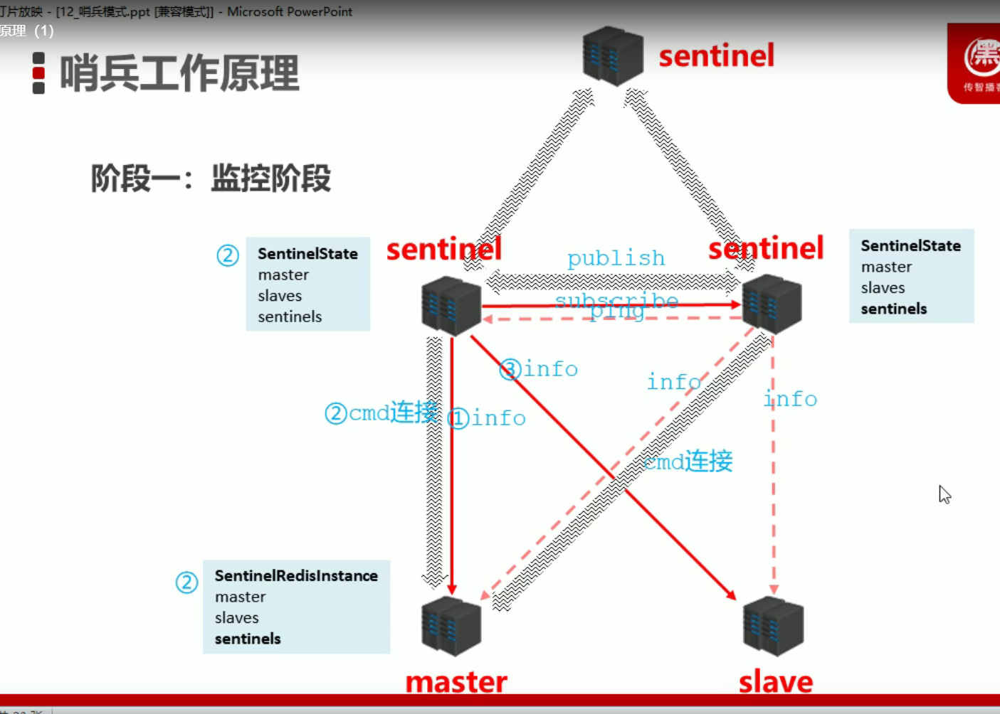
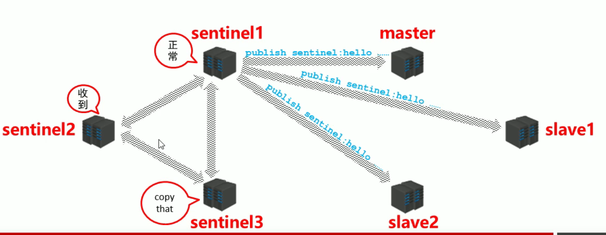
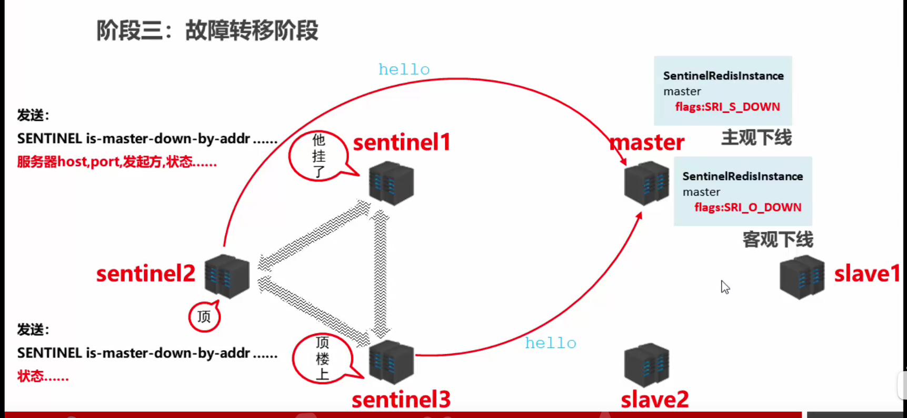
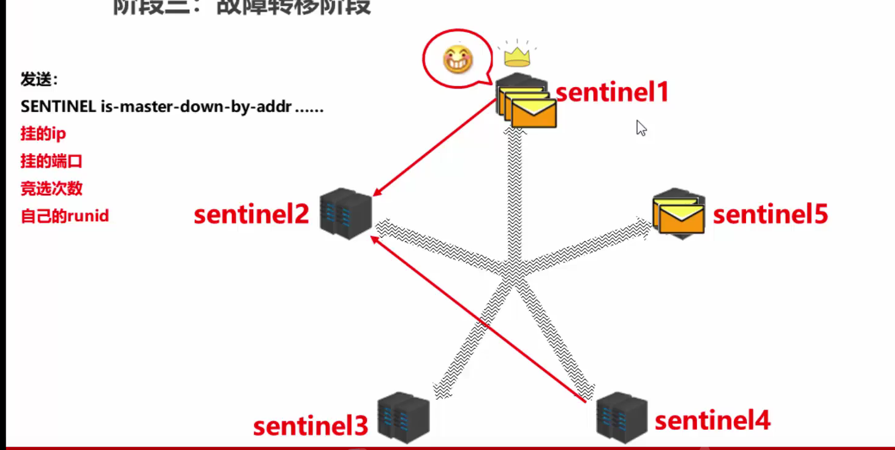

# 十、哨兵模式


## 10.1：简介


### 1.主机宕机怎么办




+ 关闭master和所有slave
+  找一个slave作为master
+ 修改其他slave的配置，连接新的主
+ 启动新的master与slave
+ 全量复制*N+部分复制*N 
+ 关闭期间的数据服务谁来承接？
+ 找一个主？怎么找法？
+ 修改配置后，原始的主恢复了怎么办？


### 2.哨兵是什么？


**哨兵**

哨兵(sentinel) 是一个分布式系统，用于对主从结构中的每台服务器进行监控，当出现故障时通过投票机制选择新的master并将所有slave连接到新的master。





### 3.哨兵作用


+ 监控
	+ 不断的检查master和slave是否正常运行。
	+ master存活检测、master与slave运行情况检测

+ 通知（提醒）
	
+ 当被监控的服务器出现问题时，向其他（哨兵间，客户端）发送通知。
	
+ 自动故障转移

	+ 断开master与slave连接，选取一个slave作为master，将其他slave连接到新的master，并告知客户端新的服务器地址

	

**注意：哨兵也是一台redis服务器，只是不提供数据服务通常哨兵配置数量为单数**


## 10.2搭建哨兵


### 1.配置哨兵


+  配置一拖二的主从结构

+ 配置三个哨兵（配置相同，端口不同）

参看sentinel.conf

+ 启动哨兵

```shell
redis-sentinel sentinel-端口号.conf
```


### 2.创建sentinel-26379.conf


```shell
port 26379
dir "/app/redis/sentinel"
sentinel monitor mymaster 127.0.0.1 6379 2
protected-mode yes
```


### 3.创建sentinel-26380.conf


```shell
port 26380
dir "/app/redis/sentinel"
sentinel monitor mymaster 127.0.0.1 6379 2
protected-mode yes
```


### 4.创建sentinel-26381conf


```shell
port 26381
dir "/app/redis/sentinel"
sentinel monitor mymaster 127.0.0.1 6379 2
protected-mode yes
```


### 5.启动哨兵


```shell
redis-sentinel sentine-端口号.conf
```


启动过后观察我们刚才的配置文件

### 6.测试


我们`kill`掉redis-6379服务器，观察日志和sentinel配置文件


## 10.3：配置哨兵


| **配置项**                                                 | **范例**                                          | **说明**                                                     |
| ---------------------------------------------------------- | ------------------------------------------------- | ------------------------------------------------------------ |
| sentinel auth-pass `<服务器名称> <password>`                 | sentinel auth-pass mymaster itcast                | 连接服务器口令                                               |
| sentinel down-after-milliseconds `<自定义服务器总量>`        | sentinel monitor mymaster  192.168.194.131 6381 1 | 设置哨兵监听的主服务器信息，最后的参数决定了最终参与选举的服务器数量（-1） |
| sentinel down-after-milliseconds `<服务名称><毫秒数（整数）>` | sentinel down-after-milliseconds mymaster 3000    | 指定哨兵在监控Redis服务时，判定服务器挂掉的时间周期，默认30秒（30000），也是主从切换的启动条件之一 |
| sentinel parallel-syncs `<服务名称><服务器数（整数）>`       | sentinel parallel-syncs                           | 指定同时进行主从的slave数量，数值越大，要求网络资源越高，要求约小，同步时间约长 |
| sentinel failover-timeout `<服务名称><毫秒数（整数）>`        | sentinel failover-timeout mymaster 9000           | 指定出现故障后，故障切换的最大超时时间，超过该值，认定切换失败，默认3分钟 |
| sentinel notification-script `<服务名称><脚本路径>`          |                                                   | 服务器无法正常联通时，设定的执行脚本，通常调试使用           |


## 10.4：主从切换三个阶段


### 1.简介


哨兵在进行主从切换过程中经历三个阶段

+ 监控：即时刻监控着redis的master和slave进程是否是在正常工作。

+ 通知：就是说当它发现有redis实例有故障的话，就会发送消息给管理员

+ 故障转移：如果redis master 节点宕机了的话，它就会将请求转到slave 节点上，slave升为master。充当配置中心，如果发生了故障转移，它会通知将master的新地址写在配置中心告诉客户端
	

### 2.阶段一：监控阶段

> 先启动主从服务器在启动哨兵
>
> 1.启动哨兵，连接上master之后发送info指令，获取master的信息
>
> 2.哨兵和master之间建立cmd连接方便发送指令，同时在哨兵端保存了所有信息包括master/slaves/sentinels,在master端也保存了所有信息包括master/slaves/sentinels
>
> 3.哨兵根据获得的slave信息去连接每一个slave,发送info指令获取slave详细信息
>
> 4.启动第二个哨兵也会自动去连接master,发送info指令，会发现master已经和其他哨兵连接过同时建立cmd连接，此时哨兵端保存信息包括master/slave/sentinels(包括之前连接的哨兵)，两个哨兵之间也会建立连接。
>
> 5.当第三个哨兵启动的时候，也会进行之前的操作

+ 用于同步各个节点的状态信息
	+ 获取各个sentinel的状态（是否在线）
	+ 获取master的状态 （拿到如下信息）
		+ master属性
			+ runid
			+ role：master
	+ 各个slave的详细信息

+ 获取所有slave的状态（根据master中的slave信息）
	+ slave属性
		+ runid
		+ role：slave
		+ master_host、master_port
		+ offset
		+ ……



### 3.阶段二：通知阶段

第二阶段是一个信息的长期维护阶段，三个sentinel组成一个小的群体，他们之间进行信息的互通。服务器（master、slave）正常工作。sentinel会时时刻刻通过他们建立的链接去获取他们的信息（hello）【不管是谁获取到都会同步到其他sentinel上】，拿到信息以后他们会在三个sentinel组中进行信息互通，在下一个阶段可能就会是另外一个sentinel拿到信息，然后进行互通



### 4.阶段三：故障转移阶段

1. 其中一个sentinel向master发送信息，一段时间内master没有回应，标记状态SRI_S_DOWN(主观下线)
2. sentinel在自己内网中告诉其他哨兵，master挂了。其他哨兵也去连接master,半数以上的哨兵发现master挂了，那就是真的挂了，状态改成SRI_O_DOWN（客观下线）
3. 所有的哨兵推选出一个哨兵领导，哨兵根据自己的原则从所有的slave中挑选出新的master,其他slave切换新的master,故障恢复后原master作为slave



准备清理master,就来到了sentinel他们开始准备参选和投票，当sentinel1有了半票，那么sentinel1就有权力在剩下的slave当中去选一个slave

+ 服务器列表中挑选备选master

	+ 在线的
	+ 响应慢的 （感觉应该是响应快的，因为slave的速度越快越好）
	+ 与原master断开时间久的 （应该是断开不久的，如果断开久了宕机了不知道，就尴尬了）

+ 优先原则
	+ 优先级
	+ offset
	+ runid

+ 发送指令（ sentinel ）

	+ 向新的master发送slaveof no one

	- 向其他slave发送slaveof 新masterIP端口

向其他slave发送slaveof 新masterIP端口
------------------------------------------------



