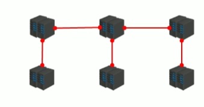
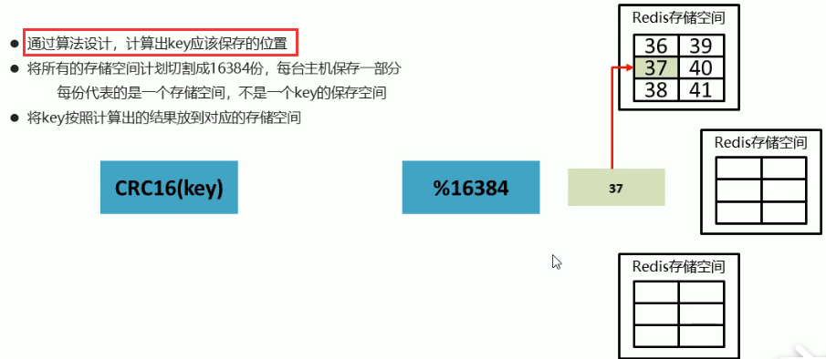
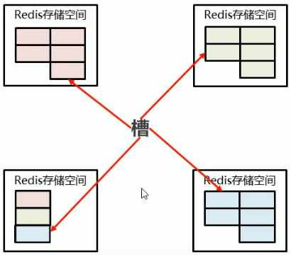
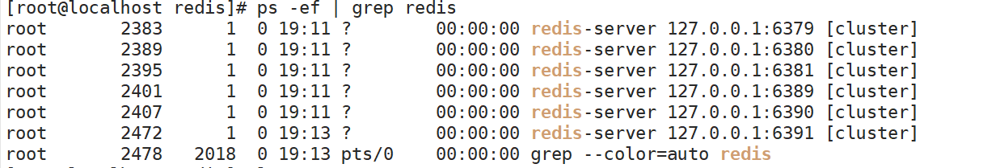
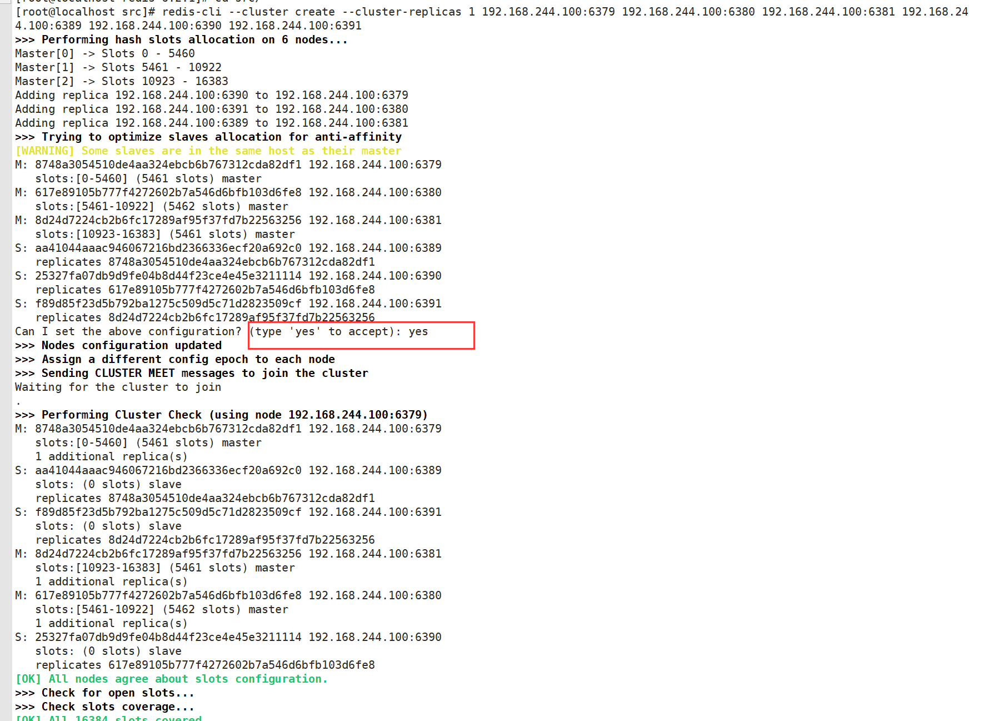
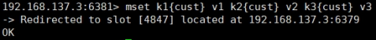
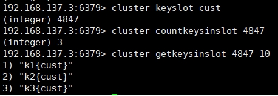
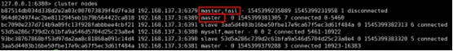
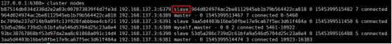
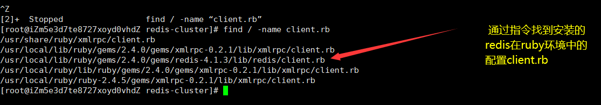

# 十一、集群

## 11.1：现状问题

### 1.业务发展过程中遇到的峰值瓶颈

+ redis提供的服务OPS可以达到10万/秒，当前业务OPS已经达到10万/秒
+ 内存单机容量达到256G，当前业务需求内存容量1T
+ 使用集群的方式可以快速解决上述问题


### 2.集群架构

集群就是使用网络将若干台计算机联通起来，并提供统一的管理方式，使其对外呈现单机的服务效果




### 3.集群作用

+ 分散单台服务器的访问压力，实现负载均衡
+ 分散单台服务器的存储压力，实现可扩展性
+ 降低单台服务器宕机带来的业务灾难


## 11.2：redis集群结构设计


### 1.数据存储


通过两个算法（CRC16(key)和%16384），计算出key对应的位置
简单的就是说，一共是16384份每一个节点负责一部分，然后呢？算一下key的值应该保存在那个地方




### 2.增强可扩展性

所谓的增节点或者减节点就是改变槽的位置。



## 11.3：搭建集群


### 1.redis-c6379.conf

```shell
include /app/redis/redis.conf
pidfile /app/redis/pid/redis_c6379.pid
logfile /app/redis/log/6379c.log
port 6379
dbfilename dump6379c.rdb
appendfilename appendonly6379c.aof
cluster-enabled yes
cluster-config-file nodes-6379.conf
cluster-node-timeout 15000
```

### 2.其他端口配置文件

更改上面文件中的端口即可：

### 3.启动查看

```shell
redis-server reids-c端口.conf
    ps -ef | grep redis
```



### 4.设置集群

```shell
redis-cli --cluster create --cluster-replicas 1 192.168.244.100:6379 192.168.244.100:6380 192.168.244.100:6381 192.168.244.100:6389 192.168.244.100:6390 192.168.244.100:6391
```



### 5.redis-cli连接测试

```shell
redis-cli -h 端口 -c -p 端口 cluster nodes
```

## 11.4：redis集群如何分配的节点


一个集群至少要有三个主节点。
选项 --cluster-replicas 1 表示我们希望为集群中的每个主节点创建一个从节点。
分配原则尽量保证每个主数据库运行在不同的IP地址，每个从库和主库不在一个IP地址上。

## 11.5：什么是插槽slot

一个 Redis 集群包含 16384 个插槽（hash slot）， 数据库中的每个键都属于这 16384 个插槽的其中一个，
集群使用公式 CRC16(key) % 16384 来计算键 key 属于哪个槽， 其中 CRC16(key) 语句用于计算键 key 的 CRC16 校验和 。
集群中的每个节点负责处理一部分插槽。 举个例子， 如果一个集群可以有主节点， 其中：
+ 节点 A 负责处理 0 号至 5460 号插槽。
+ 节点 B 负责处理 5461 号至 10922 号插槽。
+ 节点 C 负责处理 10923 号至 16383 号插槽。

详情看redis集群结构设计

## 11.6： 在集群中录入值


在redis-cli每次录入、查询键值，redis都会计算出该key应该送往的插槽，如果不是该客户端对应服务器的插槽，redis会报错，并告知应前往的redis实例地址和端口。
redis-cli客户端提供了 –c 参数实现自动重定向。
如 redis-cli -c –p 6379 登入后，再录入、查询键值对可以自动重定向。
不在一个slot下的键值，**是不能使用mget,mset等多键操作**

                   
可以通过{}来定义组的概念，从而使key中{}内相同内容的键值对放到一个slot中去。


## 11.7：查询集群中的值

`CLUSTER GETKEYSINSLOT <slot><count>` 返回 count 个 slot 槽中的键。


## 11.8：故障恢复

如果主节点下线？从节点能否自动升为主节点？注意：15秒超时

主节点恢复后，主从关系会如何？主节点回来变成从机。

如果所有某一段插槽的主从节点都宕掉，redis服务是否还能继续?
如果某一段插槽的主从都挂掉，而cluster-require-full-coverage 为yes ，那么 ，整个集群都挂掉
如果某一段插槽的主从都挂掉，而cluster-require-full-coverage 为no ，那么，该插槽数据全都不能使用，也无法存储。
redis.conf中的参数 cluster-require-full-coverage

##  11.9：Redis集群的不足


多键操作是不被支持的
多键的Redis事务是不被支持的。lua脚本不被支持
由于集群方案出现较晚，很多公司已经采用了其他的集群方案，而代理或者客户端分片的方案想要迁移至redis cluster，需要整体迁移而不是逐步过渡，复杂度较大。
## 11.10：Redis集群设置密码

### 1.方式一


修改所有Redis集群中的redis.conf文件加入：

```shell
masterauth passwd123 
requirepass passwd123 
```

> 说明：这种方式需要重新启动各节点

### 2.方式二

进入各个实例进行设置：

```shell
./redis-cli -c -p 7000 
config set masterauth passwd123 
config set requirepass passwd123 
config rewrite 
```

> 之后分别使用./redis-cli -c -p 7001，./redis-cli -c -p 7002…..命令给各节点设置上密码。
>
> <font color='red'>注意：</font>各个节点密码都必须一致，否则Redirected就会失败， 推荐这种方式，这种方式会把密码写入到redis.conf里面去，且不用重启。
>
> 用方式二修改密码，./redis-trib.rb check 10.104.111.174:6379执行时可能会报[ERR] Sorry, can't connect to node 10.104.111.174:6379，因为6379的redis.conf没找到密码配置。

### 3.注意

设置密码之后如果需要使用redis-trib.rb的各种命令
如：./redis-trib.rb check 127.0.0.1:7000，则会报错ERR] Sorry, can’t connect to node 127.0.0.1:7000
解决办法：vim /usr/local/rvm/gems/ruby-2.3.3/gems/redis-4.0.0/lib/redis/client.rb，然后修改passord



```shell
class Client
    DEFAULTS = {
      :url => lambda { ENV["REDIS_URL"] },
      :scheme => "redis",
      :host => "127.0.0.1",
      :port => 6379,
      :path => nil,
      :timeout => 5.0,
      :password => "passwd123",
      :db => 0,
      :driver => nil,
      :id => nil,
      :tcp_keepalive => 0,
      :reconnect_attempts => 1,
      :inherit_socket => false
    }  
```

**注意：client.rb路径可以通过find命令查找：find / -name 'client.rb'**

### 4.带密码访问集群


```shell
./redis-cli -c -p 7000 -a  passwd123
在springboot项目中还需要设置application.properties中需要设置redisde的密码
spring.redis.password=xxxxx
```
