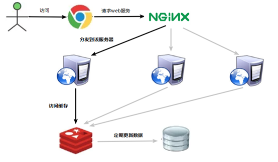
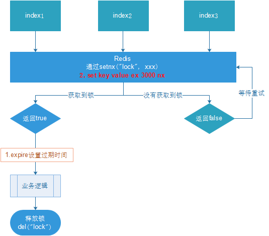

# 附：应用问题


## 1.缓存穿透


### 1.1：问题描述


**key对应的数据在数据源并不存在，**每次针对此key的请求从缓存获取不到，请求都会压到数据源，从而可能压垮数据源。比如用一个不存在的用户id获取用户信息，不论缓存还是数据库都没有，若黑客利用此漏洞进行攻击可能压垮数据库。


### 1.2：问题分析


+ 获取的数据在数据库中也不存在，数据库查询未得到对应数据
+ Redis获取到null数据未进行持久化，直接返回
+ 下次此类数据到达重复上述过程
+ 出现黑客攻击服务器


### 1.3：解决方案


一个一定不存在缓存及查询不到的数据，由于缓存是不命中时被动写的，并且出于容错考虑，如果从存储层查不到数据则不写入缓存，这将导致这个不存在的数据每次请求都要到存储层去查询，失去了缓存的意义。


| 方式                       | 描述                                                         |
| -------------------------- | ------------------------------------------------------------ |
| null值缓存                 | 如果一个查询返回的数据为空（不管是数据是否不存在），我们仍然把这个空结果（null）进行缓存，设置空结果的过期时间会很短，最长不超过五分钟 |
| 设置可访问的名单（白名单） | 使用bitmaps类型定义一个可以访问的名单，名单id作为bitmaps的偏移量，每次访问和bitmap里面的id进行比较，如果访问id不在bitmaps里面，进行拦截，不允许访问。 |
| 采用布隆过滤器             | (布隆过滤器（Bloom Filter）是1970年由布隆提出的。它实际上是一个很长的二进制向量(位图)和一系列随机映射函数（哈希函数）。<br>布隆过滤器可以用于检索一个元素是否在一个集合中。它的优点是空间效率和查询时间都远远超过一般的算法，缺点是有一定的误识别率和删除困难。)<br>将所有可能存在的数据哈希到一个足够大的bitmaps中，一个一定不存在的数据会被 这个bitmaps拦截掉，从而避免了对底层存储系统的查询压力。 |
| 进行实时监控               | 当发现Redis的命中率开始急速降低，需要排查访问对象和访问的数据，和运维人员配合，可以设置黑名单限制服务 |


## 2.缓存击穿


### 2.1：问题描述


key对应的数据存在，但在redis中过期，此时若有大量并发请求过来，这些请求发现缓存过期一般都会从后端DB加载数据并回设到缓存，这个时候大并发的请求可能会瞬间把后端DB压垮。


### 2.2：问题分析


1. Redis中某个key过期，该key访问量巨大

2. 多个数据请求从服务器直接压到Redis后，均未命中

3. Redis在短时间内发起了大量对数据库中同一数据的访问


缓存击穿就是单个高热数据过期的瞬间，数据访问量较大，未命中redis后，发起了大量对同一数据的数据库访问，导致对数据库服务器造成压力。应对策略应该在业务数据分析与预防方面进行，配合运行监控测试与即时调整策略，毕竟单个key的过期监控难度较高，配合雪崩处理策略即可。


### 2.3：解决方案


key可能会在某些时间点被超高并发地访问，是一种非常“热点”的数据。这个时候，需要考虑一个问题：缓存被“击穿”的问题。

解决问题：

+ **（1）预先设置热门数据：**在redis高峰访问之前，把一些热门数据提前存入到redis里面，加大这些热门数据key的时长

+ **（2）实时调整：**现场监控哪些数据热门，实时调整key的过期时长

+ **（3）使用锁：**
	+  就是在缓存失效的时候（判断拿出来的值为空），不是立即去load db。
	+  先使用缓存工具的某些带成功操作返回值的操作（比如Redis的SETNX）去set一个mutex key
	+ 当操作返回成功时，再进行load db的操作，并回设缓存,最后删除mutex key；
	+ 当操作返回失败，证明有线程在load db，当前线程睡眠一段时间再重试整个get缓存的方法。


## 3.缓存雪崩


### 3.1：问题描述


key对应的数据存在，但在redis中过期，此时若有大量并发请求过来，这些请求发现缓存过期一般都会从后端DB加载数据并回设到缓存，这个时候大并发的请求可能会瞬间把后端DB压垮。

缓存雪崩与缓存击穿的区别在于这里针对很多key缓存，前者则是某一个key 

+ 正常访问



+ 缓存失效瞬间


### 3.2：问题分析


1. 在一个较短的时间内，缓存中较多的key集中过期

2. 此周期内请求访问过期的数据，redis未命中，redis向数据库获取数据

3. 数据库同时接收到大量的请求无法及时处理

4. Redis大量请求被积压，开始出现超时现象

5. 数据库流量激增，数据库崩溃

6. 重启后仍然面对缓存中无数据可用

7. Redis服务器资源被严重占用，Redis服务器崩溃

8. Redis集群呈现崩塌，集群瓦解

9. 应用服务器无法及时得到数据响应请求，来自客户端的请求数量越来越多，应用服务器崩溃

10. 应用服务器，redis，数据库全部重启，效果不理想

> + **短时间范围内**
>
> + **大量key集中过期**


缓存雪崩就是瞬间过期数据量太大，导致对数据库服务器造成压力。如能够有效避免过期时间集中，可以有效解决雪崩现象的出现（约40%），配合其他策略一起使用，并监控服务器的运行数据，根据运行记录做快速调整。


### 3.3：解决方案


缓存失效时的雪崩效应对底层系统的冲击非常可怕！

解决方案：

**（1）**  **构建多级缓存架构：**nginx缓存 + redis缓存 +其他缓存（ehcache等）

**（2）**  **使用锁或队列：**用加锁或者队列的方式保证来保证不会有大量的线程对数据库一次性进行读写，从而避免失效时大量的并发请求落到底层存储系统上。不适用高并发情况

**（3）**  **设置过期标志更新缓存：**记录缓存数据是否过期（设置提前量），如果过期会触发通知另外的线程在后台去更新实际key的缓存。

**（4）**  **将缓存失效时间分散开：**比如我们可以在原有的失效时间基础上增加一个随机值，比如1-5分钟随机，这样每一个缓存的过期时间的重复率就会降低，就很难引发集体失效的事件。


## 4.分布式锁


### 4.1：问题描述


随着业务发展的需要，原单体单机部署的系统被演化成分布式集群系统后，由于分布式系统多线程、多进程并且分布在不同机器上，这将使原单机部署情况下的并发控制锁策略失效，单纯的Java API并不能提供分布式锁的能力。为了解决这个问题就需要一种跨JVM的互斥机制来控制共享资源的访问，这就是分布式锁要解决的问题！


### 4.2：分布式锁主流的实现方案：


1. 基于数据库实现分布式锁

2. 基于缓存（Redis等）

3. 基于Zookeeper


### 4.3：每一种分布式锁解决方案都有各自的优缺点：


1. 性能：redis最高

2. 可靠性：zookeeper最高

这里，我们就基于redis实现分布式锁。


### 4.4：解决方式：设置锁和过期时间


### 4.5：优化之设置锁的过期时间


设置过期时间有两种方式：

 

1. 首先想到通过expire设置过期时间（缺乏原子性：如果在setnx和expire之间出现异常，锁也无法释放）

2. 在set时指定过期时间（推荐）




设置过期时间：

```java
  @GetMapping("testLock")
    public void testLock(){
 
        //1获取锁，setne
        Boolean lock = redisTemplate.opsForValue().setIfAbsent("lock", '123',3, TimeUnit.SECONDS);
        //2获取锁成功、查询num的值
        if(lock){
            Object value = redisTemplate.opsForValue().get("num");
            //2.1判断num为空return
            if(StringUtils.isEmpty(value)){
                return;
            }
            //2.2有值就转成成int
            int num = Integer.parseInt(value+"");
            //2.3把redis的num加1
            redisTemplate.opsForValue().set("num", ++num);
            //2.4释放锁，del
                redisTemplate.delete("lock");
        }else{
            //3获取锁失败、每隔0.1秒再获取
            try {
                Thread.sleep(100);
                testLock();
            } catch (InterruptedException e) {
                e.printStackTrace();
            }
        }
    }
```


> 压力测试肯定也没有问题。自行测试
>
> 问题：可能会释放其他服务器的锁。
>
>  
>
> 场景：如果业务逻辑的执行时间是7s。执行流程如下
>
> 1. index1业务逻辑没执行完，3秒后锁被自动释放。
>
> 2. index2获取到锁，执行业务逻辑，3秒后锁被自动释放。
>
> 3. index3获取到锁，执行业务逻辑
>
> 4. index1业务逻辑执行完成，开始调用del释放锁，这时释放的是index3的锁，导致index3的业务只执行1s就被别人释放。
>
> 最终等于没锁的情况。
>
>  
>
> **解决：setnx获取锁时，设置一个指定的唯一值（例如：uuid）；释放前获取这个值，判断是否自己的锁**


### 4.6：优化优化之UUID防误删


我们可以上锁，和设置过期时间，加入现在三个线程同时执行：

锁的过期时间一共十秒

+ a线程获取锁在执行业务，但是执行业务过程中卡住了，锁的过期时间到了，自动释放了锁
+ 这时a的服务还在卡顿中，b拿到了锁，开始执行业务，但是a结束了，去释放锁了，但是b的业务还没执行完
+ 刚好又来个c，他也拿到了锁…………….
+ 问题就是自己的锁应该自己释放


```java
   @GetMapping("testLock")
    public void testLock(){
        String uuid = UUID.randomUUID().toString();
        //1获取锁，setne
        Boolean lock = redisTemplate.opsForValue().setIfAbsent("lock", uuid,3, TimeUnit.SECONDS);
        //2获取锁成功、查询num的值
        if(lock){
            Object value = redisTemplate.opsForValue().get("num");
            //2.1判断num为空return
            if(StringUtils.isEmpty(value)){
                return;
            }
            //2.2有值就转成成int
            int num = Integer.parseInt(value+"");
            //2.3把redis的num加1
            redisTemplate.opsForValue().set("num", ++num);
            //2.4释放锁，del
            //判断比较uuid值是否一样
            String lockUuid = (String)redisTemplate.opsForValue().get("lock");
            if(lockUuid.equals(uuid)) {
                redisTemplate.delete("lock");
            }
        }else{
            //3获取锁失败、每隔0.1秒再获取
            try {
                Thread.sleep(100);
                testLock();
            } catch (InterruptedException e) {
                e.printStackTrace();
            }
        }
    }
```


### 4.7：优化之LUA脚本保证删除的原子性


两个线程

+ a上锁，执行业务逻辑，在释放的时候，比较uuid是否相同，但是这个时候还没释放锁，但是a的锁已经到过期时间他还去删
+ 但是在删除锁之前，b已经拿到锁了，a删除的还是b的锁


```java
GetMapping("testLockLua")
public void testLockLua() {
    //1 声明一个uuid ,将做为一个value 放入我们的key所对应的值中
    String uuid = UUID.randomUUID().toString();
    //2 定义一个锁：lua 脚本可以使用同一把锁，来实现删除！
    String skuId = "25"; // 访问skuId 为25号的商品 100008348542
    String locKey = "lock:" + skuId; // 锁住的是每个商品的数据

    // 3 获取锁
    Boolean lock = redisTemplate.opsForValue().setIfAbsent(locKey, uuid, 3, TimeUnit.SECONDS);

    // 第一种： lock 与过期时间中间不写任何的代码。
    // redisTemplate.expire("lock",10, TimeUnit.SECONDS);//设置过期时间
    // 如果true
    if (lock) {
        // 执行的业务逻辑开始
        // 获取缓存中的num 数据
        Object value = redisTemplate.opsForValue().get("num");
        // 如果是空直接返回
        if (StringUtils.isEmpty(value)) {
            return;
        }
        // 不是空 如果说在这出现了异常！ 那么delete 就删除失败！ 也就是说锁永远存在！
        int num = Integer.parseInt(value + "");
        // 使num 每次+1 放入缓存
        redisTemplate.opsForValue().set("num", String.valueOf(++num));
        /*使用lua脚本来锁*/
        // 定义lua 脚本
        String script = "if redis.call('get', KEYS[1]) == ARGV[1] then return redis.call('del', KEYS[1]) else return 0 end";
        // 使用redis执行lua执行
        DefaultRedisScript<Long> redisScript = new DefaultRedisScript<>();
        redisScript.setScriptText(script);
        // 设置一下返回值类型 为Long
        // 因为删除判断的时候，返回的0,给其封装为数据类型。如果不封装那么默认返回String 类型，
        // 那么返回字符串与0 会有发生错误。
        redisScript.setResultType(Long.class);
        // 第一个要是script 脚本 ，第二个需要判断的key，第三个就是key所对应的值。
        redisTemplate.execute(redisScript, Arrays.asList(locKey), uuid);
    } else {
        // 其他线程等待
        try {
            // 睡眠
            Thread.sleep(1000);
            // 睡醒了之后，调用方法。
            testLockLua();
        } catch (InterruptedException e) {
            e.printStackTrace();
        }
    }
}
```


### 4.8：lua脚本详解


