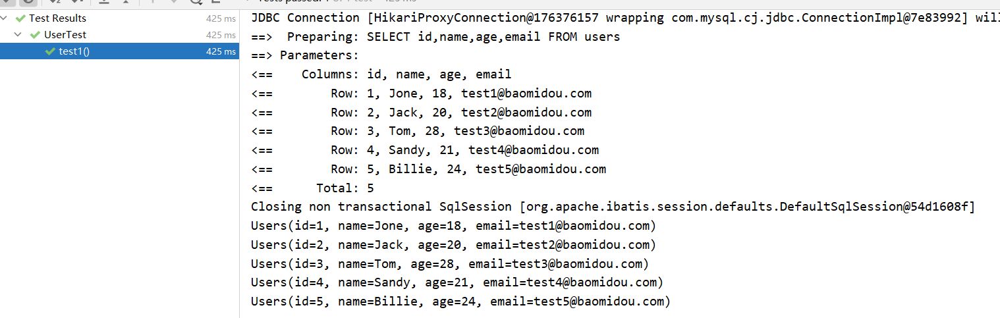

# 二、Helloworld


## 2.1：表


```sql
DROP TABLE
IF
	EXISTS USER;
CREATE TABLE USERS (
	id BIGINT ( 20 ) NOT NULL COMMENT '主键ID',
	NAME VARCHAR ( 30 ) NULL DEFAULT NULL COMMENT '姓名',
	age INT ( 11 ) NULL DEFAULT NULL COMMENT '年龄',
	email VARCHAR ( 50 ) NULL DEFAULT NULL COMMENT '邮箱',
	PRIMARY KEY ( id ) 
);
INSERT INTO USERS ( id, NAME, age, email )
VALUES
	( 1, 'Jone', 18, 'test1@baomidou.com' ),
	( 2, 'Jack', 20, 'test2@baomidou.com' ),
	( 3, 'Tom', 28, 'test3@baomidou.com' ),
	( 4, 'Sandy', 21, 'test4@baomidou.com' ),
	( 5, 'Billie', 24, 'test5@baomidou.com' );-- 真实开发中，version（乐观锁）、deleted（逻辑删除）、gmt_create、gmt_modified
```


## 2.2：pom文件


建立springboot工程引入一下文件


```xml
<?xml version="1.0" encoding="UTF-8"?>
<project xmlns="http://maven.apache.org/POM/4.0.0"
         xmlns:xsi="http://www.w3.org/2001/XMLSchema-instance"
         xsi:schemaLocation="http://maven.apache.org/POM/4.0.0 http://maven.apache.org/xsd/maven-4.0.0.xsd">
    <parent>
        <groupId>org.springframework.boot</groupId>
        <artifactId>spring-boot-starter-parent</artifactId>
        <version>2.4.10</version>
        <relativePath/>
    </parent>

    <modelVersion>4.0.0</modelVersion>
    <groupId>org.example</groupId>
    <artifactId>mybatis-plus</artifactId>
    <version>1.0-SNAPSHOT</version>
    <modules>
        <module>mybatis-plus-01</module>
    </modules>
    <packaging>pom</packaging>
    <properties>
        <project.reporting.outputEncoding>UTF-8</project.reporting.outputEncoding>
        <java.version>1.8</java.version>
        <druid.version>1.2.8</druid.version>
        <mybatisplus.version>3.4.3.4</mybatisplus.version>
        <mysql-connector.version>8.0.20</mysql-connector.version>
    </properties>
    <dependencies>

        <dependency>
            <groupId>org.projectlombok</groupId>
            <artifactId>lombok</artifactId>
            <version>1.18.22</version>
        </dependency>
        <dependency>
            <groupId>org.springframework.boot</groupId>
            <artifactId>spring-boot-starter-web</artifactId>
        </dependency>
        <dependency>
            <groupId>org.springframework.boot</groupId>
            <artifactId>spring-boot-starter-test</artifactId>
        </dependency>
        <dependency>
            <groupId>mysql</groupId>
            <artifactId>mysql-connector-java</artifactId>
            <version>${mysql-connector.version}</version>
        </dependency>
        <dependency>
            <groupId>com.alibaba</groupId>
            <artifactId>druid</artifactId>
            <version>${druid.version}</version>
        </dependency>
        <dependency>
            <groupId>com.baomidou</groupId>
            <artifactId>mybatis-plus-boot-starter</artifactId>
            <version>${mybatisplus.version}</version>
            <exclusions>
                <exclusion>
                    <groupId>com.baomidou</groupId>
                    <artifactId>mybatis-plus-generator</artifactId>
                </exclusion>
            </exclusions>
        </dependency>
    </dependencies>
</project>
```


## 2.3：启动器


```java
@MapperScans(value = {
        @MapperScan(value = "com.it.mapper"),
})
@SpringBootApplication
public class APP8080 {

    public static void main(String[] args) {
        SpringApplication.run(APP8080.class);
    }
}
```


## 2.4：pojo


```java
@Data
@AllArgsConstructor
@NoArgsConstructor
public class Users {
    private Long id; private String name; private Integer age; private String email;
}

```


## 2.5：mapper


```java
@Repository
public interface UserMapper  extends BaseMapper<Users> {
}

```


## 2.6：test用例


```java
@SpringBootTest
public class UserTest {

    @Autowired
   private  UserMapper userMapper;

    @Test
     void test1() {
        List<Users> userMappers = userMapper.selectList(null);
        userMappers.forEach(System.out::println);=
    }
}
```


## 2.7：运行结果


## 2.8：日志配置


application.yml文件配置

```yml
mybatis-plus:
  configuration:
    log-impl: org.apache.ibatis.logging.stdout.StdOutImpl
```





