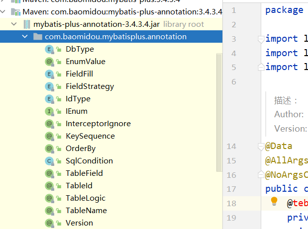

# 五、常用注解

## 5.1：简介

> 介绍 `MybatisPlus` 注解包相关类详解(更多详细描述可点击查看源码注释)

注解类包：

## @TableName

### 描述：表名注解

|       属性       |   类型   | 必须指定 | 默认值 | 描述                                                         |
| :--------------: | :------: | :------: | :----: | ------------------------------------------------------------ |
|      value       |  String  |    否    |   ""   | 表名                                                         |
|      schema      |  String  |    否    |   ""   | schema                                                       |
| keepGlobalPrefix | boolean  |    否    | false  | 是否保持使用全局的 tablePrefix 的值(如果设置了全局 tablePrefix 且自行设置了 value 的值) |
|    resultMap     |  String  |    否    |   ""   | xml 中 resultMap 的 id                                       |
|  autoResultMap   | boolean  |    否    | false  | 是否自动构建 resultMap 并使用(如果设置 resultMap 则不会进行 resultMap 的自动构建并注入) |
| excludeProperty  | String[] |    否    |   {}   | 需要排除的属性名(@since 3.3.1)                               |

> 关于`autoResultMap`的说明:
>
> mp会自动构建一个`ResultMap`并注入到mybatis里(一般用不上).下面讲两句: 因为mp底层是mybatis,所以一些mybatis的常识你要知道,mp只是帮你注入了常用crud到mybatis里 注入之前可以说是动态的(根据你entity的字段以及注解变化而变化),但是注入之后是静态的(等于你写在xml的东西) 而对于直接指定`typeHandler`,mybatis只支持你写在2个地方:
>
> 1. 定义在resultMap里,只作用于select查询的返回结果封装
> 2. 定义在`insert`和`update`sql的`#{property}`里的`property`后面(例:`#{property,typehandler=xxx.xxx.xxx}`),只作用于`设置值` 而除了这两种直接指定`typeHandler`,mybatis有一个全局的扫描你自己的`typeHandler`包的配置,这是根据你的`property`的类型去找`typeHandler`并使用.

## @TableId

### 描述：主键注解

| 属性  |  类型  | 必须指定 |   默认值    |    描述    |
| :---: | :----: | :------: | :---------: | :--------: |
| value | String |    否    |     ""      | 主键字段名 |
| type  |  Enum  |    否    | IdType.NONE |  主键类型  |

### @IdType

|     值      |                             描述                             |
| :---------: | :----------------------------------------------------------: |
|    AUTO     |                         数据库ID自增                         |
|    NONE     | 无状态,该类型为未设置主键类型(注解里等于跟随全局,全局里约等于 INPUT) |
|    INPUT    |                    insert前自行set主键值                     |
|  ASSIGN_ID  | 分配ID(主键类型为Number(Long和Integer)或String)(since 3.3.0),使用接口`IdentifierGenerator`的方法`nextId`(默认实现类为`DefaultIdentifierGenerator`雪花算法) |
| ASSIGN_UUID | 分配UUID,主键类型为String(since 3.3.0),使用接口`IdentifierGenerator`的方法`nextUUID`(默认default方法) |

## @TableField

### 描述：字段注解(非主键)

|       属性       |             类型             | 必须指定 |          默认值          |                             描述                             |
| :--------------: | :--------------------------: | :------: | :----------------------: | :----------------------------------------------------------: |
|      value       |            String            |    否    |            ""            |                         数据库字段名                         |
|        el        |            String            |    否    |            ""            | 映射为原生 `#{ ... }` 逻辑,相当> 于写在 xml 里的 `#{ ... }` 部分 |
|      exist       |           boolean            |    否    |           true           |                      是否为数据库表字段                      |
|    condition     |            String            |    否    |            ""            | 字段 `where` 实体查询比较条件,有值 设置则按设置的值为准,没有则为默认全局的 `%s=#{%s}`,[参考(opens new window)](https://github.com/baomidou/mybatis-plus/blob/3.0/mybatis-plus-annotation/src/main/java/com/baomidou/mybatisplus/annotation/SqlCondition.java) |
|      update      |            String            |    否    |            ""            | 字段 `update set` 部分注入, 例如：update="%s+1"：表示更新时会set version=version+1(该属性优先级高于 `el` 属性) |
|  insertStrategy  |             Enum             |    N     |         DEFAULT          | 举例：NOT_NULL: `insert into table_a(<if test="columnProperty != null">` `column</if>) values (<if test="columnProperty != null">#{columnProperty}</if>)` |
|  updateStrategy  |             Enum             |    N     |         DEFAULT          | 举例：IGNORED: `update table_a set column=#{columnProperty}` |
|  whereStrategy   |             Enum             |    N     |         DEFAULT          | 举例：NOT_EMPTY: `where <if test="columnProperty != null and columnProperty!=''">column=#{columnProperty}</if>` |
|       fill       |             Enum             |    否    |    FieldFill.DEFAULT     |                       字段自动填充策略                       |
|      select      |           boolean            |    否    |           true           |                     是否进行 select 查询                     |
| keepGlobalFormat |           boolean            |    否    |          false           |              是否保持使用全局的 format 进行处理              |
|     jdbcType     |           JdbcType           |    否    |    JdbcTypeUNDEFINED     |           JDBC类型 (该默认值不代表会按照该值生效)            |
|   typeHandler    | Class<? extends TypeHandler> |    否    | UnknownTypeHandler.class |          类型处理器 (该默认值不代表会按照该值生效)           |
|   numericScale   |            String            |    否    |            ""            |                    指定小数点后保留的位数                    |

### 注意

关于`jdbcType`和`typeHandler`以及`numericScale`的说明:

`numericScale`只生效于 update 的sql. `jdbcType`和`typeHandler`如果不配合`@TableName#autoResultMap = true`一起使用,也只生效于 update 的sql. 对于`typeHandler`如果你的字段类型和set进去的类型为`equals`关系,则只需要让你的`typeHandler`让Mybatis加载到即可,不需要使用注解

### FieldStrategy

|    值     |                           描述                            |
| :-------: | :-------------------------------------------------------: |
|  IGNORED  |                         忽略判断                          |
| NOT_NULL  |                        非NULL判断                         |
| NOT_EMPTY | 非空判断(只对字符串类型字段,其他类型字段依然为非NULL判断) |
|  DEFAULT  |                       追随全局配置                        |

### FieldFill

|      值       |         描述         |
| :-----------: | :------------------: |
|    DEFAULT    |      默认不处理      |
|    INSERT     |    插入时填充字段    |
|    UPDATE     |    更新时填充字段    |
| INSERT_UPDATE | 插入和更新时填充字段 |

## @Version

- 描述：乐观锁注解、标记 `@Verison` 在字段上

## @EnumValue

- 描述：通枚举类注解(注解在枚举字段上)

## @TableLogic

- 描述：表字段逻辑处理注解（逻辑删除）

|  属性  |  类型  | 必须指定 | 默认值 |     描述     |
| :----: | :----: | :------: | :----: | :----------: |
| value  | String |    否    |   ""   | 逻辑未删除值 |
| delval | String |    否    |   ""   |  逻辑删除值  |

## @SqlParser

> see @InterceptorIgnore

## @KeySequence

- 描述：序列主键策略 `oracle`
- 属性：value、resultMap

| 属性  |  类型  | 必须指定 |   默认值   |                             描述                             |
| :---: | :----: | :------: | :--------: | :----------------------------------------------------------: |
| value | String |    否    |     ""     |                            序列名                            |
| clazz | Class  |    否    | Long.class | id的类型, 可以指定String.class，这样返回的Sequence值是字符串"1" |

## @InterceptorIgnore

> see [插件主体](https://mp.baomidou.com/guide/interceptor.html)

## @OrderBy

- 描述：内置 SQL 默认指定排序，**优先级低于 wrapper 条件查询**

|  属性  |  类型   | 必须指定 |     默认值      |      描述      |
| :----: | :-----: | :------: | :-------------: | :------------: |
| isDesc | boolean |    否    |       是        |  是否倒序查询  |
|  sort  |  short  |    否    | Short.MAX_VALUE | 数字越小越靠前 |

